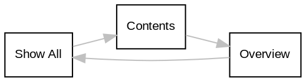

## 4.1 서론 {#4-dot-1-서론}

이전 장에서는 바닐라 Emacs를 사용하고 설정하여 원하는 대로 동작하게 만드는 방법을 설명했습니다. _Emacs Writing Studio_ (EWS) 설정은 바닐라 Emacs를 저자 맞춤형 도구로 변환합니다. 이 장에서는 EWS 설정이 제공하는 추가 기능을 사용하는 방법을 설명하고 아이디어에서 출판까지의 워크플로우를 소개합니다.

EWS는 일반적인 그래픽 소프트웨어 요소 없이 미니멀리스트 인터페이스를 사용합니다. 이 간소화된 외관은 화면에서 산만함을 최소화하여 중요한 것에 집중할 수 있게 해줍니다 -- 버퍼에 단어를 쓰는 것. 바닐라 Emacs에 대한 두 번째 주요 변경 사항은 텍스트 자동 완성 시스템입니다. EWS는 Vertico / Orderless와 Marginalia 패키지를 사용하여 미니버퍼에서 향상된 완성을 제공하여 함수, 파일 및 기타 필요한 것들을 찾기 쉽게 만듭니다.

EWS 설정은 모든 사람에게 맞는 것이 아닌 의견이 반영된 선택의 집합입니다. Emacs 세계에서는 때때로 어떤 것이 합리적인 기본 설정인지에 대한 논의가 있습니다. 이러한 논의가 얼마나 흥미로울지라도, 그런 기본 설정은 존재하지 않습니다. 한 사람의 합리적인 기본 설정은 다른 사람의 컴퓨팅 악몽일 수 있으므로, EWS에서 원하는 이상적인 워크플로우에 맞게 무엇이든 변경할 수 있습니다. 부록에는 완전한 주석이 달린 설정과 변경 제안이 포함되어 있습니다.


## 4.2 Emacs Writing Studio 설치 {#4-dot-2-emacs-writing-studio-설치}

Emacs를 사용하기 위해 Elisp로 프로그래밍을 배울 필요는 없습니다. EWS 설정을 사용하여 시작할 수 있습니다. 하지만 먼저 EWS와 몇 가지 추가 소프트웨어를 설치해야 합니다.

EWS 설정을 설치하려면 GitHub 저장소(`github.com/pprevos/emacs-writing-studio`)에서 `init.el` 과 `ews.el` 파일을 다운로드하여 설정 폴더에 저장하세요. `init.el` 파일에는 EWS 설정이 포함되어 있고, `ews.el` 파일에는 맞춤형 함수 모음이 포함되어 있습니다.

설정 폴더의 위치는 운영 체제에 따라 다릅니다. `C-h v user-emacs-directory` 를 입력하여 팝업 도움말 버퍼에서 위치를 확인할 수 있습니다. 이 버퍼는 `q`를 눌러 닫을 수 있습니다. EWS 저장소에서 파일을 이 디렉토리로 복사하세요. `restart-emacs` 함수를 평가하거나 프로그램을 다음에 시작할 때 EWS가 활성화됩니다. 이미 설정이 있는 경우, `emacs --init-directory <ews-path>`로 EWS를 시도할 수 있습니다.

Emacs는 기능을 확장하기 위해 다른 무료 소프트웨어 패키지와 통합됩니다. EWS에서 제공하는 일부 기능은 이러한 추가 소프트웨어를 설치해야 합니다. 이러한 프로그램을 사용하는 방법을 알 필요는 없으며, Emacs가 이를 대신 제어합니다. 이 책의 각 장에서는 어떤 소프트웨어가 어떤 목적에 필요한지 설명합니다.

`ews-missing-executables` 함수는 외부 소프트웨어가 시스템에 있는지 확인합니다. 권장 도구 중 하나라도 누락된 경우 Emacs는 미니버퍼에 메시지를 표시합니다. `C-h e`로 `/Messages/` 버퍼로 이동하여 출력을 검토할 수 있습니다. 나열된 소프트웨어가 누락되더라도 Emacs는 정상적으로 작동하지만 일부 기능은 사용할 수 없습니다.

Linux 또는 Chromebook 사용자의 경우, 이러한 패키지는 시스템의 패키지 관리자를 통해 사용할 수 있습니다. Windows 사용자는 Chocolatey 패키지 관리자(`chocolatey.org`) 또는 MSYS2(`msys2.org`)를 사용하여 이 소프트웨어를 얻을 수 있습니다. Apple 사용자는 Homebrew 패키지 관리자(`brew.sh`)를 사용하여 Linux 도구를 설치할 수 있습니다.


## 4.3 미니멀리스트 인터페이스 {#4-dot-3-미니멀리스트-인터페이스}

Emacs는 버튼과 필요 없는 기능으로 가득 찬 현대 소프트웨어의 소음에서 벗어나 휴식과 성찰의 장소입니다. EWS 설정은 툴바, 메뉴 바 및 스크롤 바를 제거합니다. 드롭다운 메뉴는 기능을 발견하는 데 유용한 도구이지만, 화면에 계속 표시할 필요는 없습니다. `F10` (`menu-bar-open`)으로 메뉴에 접근하고 화살표 키와 `RET`으로 메뉴 항목을 선택할 수 있습니다. 메뉴는 `C-g` (`keyboard-quit`)로 종료할 수 있습니다. 하지만 Emacs를 사용하다 보면 금방 근육 기억을 쌓아 키보드 단축키로 돌아가게 됩니다. 그래픽 메뉴, 아이콘 및 스크롤 바를 항상 보이게 하고 싶다면 다음 변수를 커스터마이즈하세요:

-   `tool-bar-mode`
-   `menu-bar-mode`
-   `scroll-bar-mode`

EWS는 `C-c w`를 기본 접두사 키로 사용하여 특정 기능을 제공하며, 여기서 `w`는 쓰기(writing)를 나타내고 `t`는 테마(theme)를 나타냅니다. EWS에서는 `customize-variable` 함수가 `C-c w v`에 바인딩됩니다.


### 4.3.1 테마 {#4-dot-3-dot-1-테마}

테마는 정의된 텍스트 부분의 색상을 설명하는 지침 세트입니다. 텍스트 프로세서에서 색상은 워드 프로세서에서의 색상과 다른 역할을 합니다. Emacs의 색상은 의미적이므로, 텍스트의 기능을 나타내며 출판될 때의 외관을 나타내지 않습니다. 제목은 텍스트나 메타데이터와 다른 색상을 가질 수 있으며, 이는 문서를 탐색하는 데 도움이 됩니다.

텍스트 프로세서를 위한 두 가지 기본 테마 클래스가 있습니다: 밝은 테마와 어두운 테마. 대부분의 현대 워드 프로세싱 소프트웨어에서 일반적인 밝은 배경은 화면을 오랫동안 바라보면 안구 피로(eye strain)를 유발할 수 있습니다. 어두운 색상 체계는 특히 복잡한 배경이 있는 저조도 물리적 환경에서 시각적 명확성과 시각적 피로를 줄입니다 (Kim et al. 2019). 많은 텍스트 프로세서 사용자가 어두운 테마를 선호합니다. 밝은 테마가 본질적으로 나쁜 것은 아니며, 밝은 방에서 작업할 때 효과적입니다.

EWS 설정은 Prot의 Modus 테마의 최신 버전을 설치하고 활성화합니다. Modus 테마에는 두 가지 주요 버전이 있습니다: `modus-operandi` 테마는 주요 밝은 테마이며, `modus-vivendi` 테마는 그 어두운 카운터파트입니다. 주요 Modus 테마는 배경과 전경 간의 최대 대비를 따르며 _웹 콘텐츠 접근성 지침_ (WCAG)을 따릅니다. Modus 테마는 WCAG의 트리플-A 표준을 준수하며, 이는 배경과 전경 간의 최소 대비 비율이 7:1이어야 합니다. 이 높은 대비 비율은 중간 정도의 저시력인 사람들에게도 가독성이 좋습니다. 각 주요 테마에는 세 가지 수정 버전이 있습니다: 적록색맹(deuteranopia)과 청황색맹(tritanopia)을 위한 버전과 더 많은 색상을 사용하는 버전(tinted).

EWS는 기본적으로 틴트 버전을 사용합니다. 이 버전은 약간 낮은 대비 비율을 가지며, 정상 시력의 사람들에게 적합합니다. Modus 테마는 키보드 단축키를 지정하지 않으므로, EWS는 몇 가지를 정의합니다. `C-c w t t` 단축키는 밝은 테마와 어두운 테마 사이를 전환합니다(여기서 스타워즈 농담을 삽입하세요).

Modus Themes 패키지에는 테마의 외관과 느낌을 커스터마이징하는 방법을 자세히 설명하는 광범위한 매뉴얼이 포함되어 있습니다. 이 매뉴얼은 Info Mode를 통해 `C-h R modus` 로 접근할 수 있습니다. 부록에는 개인 설정을 위해 테마를 커스터마이징하는 방법에 대한 추가 정보가 제공됩니다.

Emacs 사용자들은 다양한 테마를 개발했습니다. 좋아하는 테마를 선택하려면 Emacs Themes Gallery(`emacsthemes.com`)를 찾아볼 수 있습니다. 테마가 ELPA 또는 MELPA 패키지 저장소에 있다면, `package-install` 명령을 실행하여 설치할 수 있습니다. 'theme'를 입력하여 목록을 필터링하고 좋아하는 테마를 선택하세요. 새 테마를 설치한 후에는 `C-c w t s` (`consult-theme`)를 사용할 수 있습니다. 이 명령은 설치된 모든 테마의 선택 메뉴를 제공합니다. 기본값을 변경하려면 부록에서 설명한 대로 init 파일을 수정해야 합니다.


### 4.3.2 폰트 설정 {#4-dot-3-dot-2-폰트-설정}

Emacs의 기본 폰트는 코드 작성에 적합한 고정 폭(mono-spaced) 폰트입니다. 고정 폭 폰트에서는 모든 문자가 동일한 너비를 가집니다. 예를 들어, `i`와 `w`는 기계식 타자기처럼 동일한 공간을 차지합니다. 이 유형의 글자, 또한 모노스페이싱이라고도 불리며, 코드나 표를 작성할 때 텍스트를 정렬하는 데 이상적입니다. 변수 폭 폰트는 산문 작성 시 눈에 더 편안합니다. 변수 폭 폰트에서는 모든 문자가 동일한 너비를 가지지 않으며, 자연스러운 글쓰기에서 일반적입니다.

-   `Fixed pitch font`
-   Variable pitch font

이상적으로는 상황에 맞는 폰트를 사용하고자 합니다. Emacs는 텍스트의 특정 부분, 개별 버퍼 또는 주요 모드에 대해 다른 폰트를 정의할 수 있습니다. EWS 설정은 변수 폭 모드를 사용하여 폰트 유형 간의 이상적인 조합을 제공합니다.

EWS 설정은 특정 폰트를 지정하지 않으며, 시스템의 기본값을 사용합니다. 컴퓨터에 있는 좋아하는 폰트를 구성할 수 있습니다. 세 가지 폰트 변수를 커스터마이징해야 합니다:

-   `default`: 기본 설정(고정 폭 폰트).
-   `fixed-pitch`: 컴퓨터 코드에 사용되는 폰트.
-   `variable-pitch`: 산문에 대한 설정.

Emacs 용어에서 'face'는 텍스트를 표시하기 위한 속성 모음입니다. 폰트, 전경색, 배경색, 선택적 밑줄 등을 정의합니다. 다양한 face 속성이 구성 가능합니다. 주로 사용되는 속성은 다음과 같습니다:

-   `font`: 폰트 이름
-   `height`: 폰트 높이, 1/10 포인트 단위의 정수.

`customize-face`를 호출하여 커스터마이제이션 메뉴를 사용하고 `default`, `fixed-pitch` 또는 `variable-pitch`를 선택한 후 _Font Family_ 상자에 폰트 이름을 입력하세요. 각 폰트에 대해 `[ Apply and Save ]`를 클릭하세요. 이 작업은 `custom.el` 파일에 폰트 설정을 저장하며, Emacs가 시작 시퀀스의 시작 부분에서 이를 평가합니다. 테마 설정에 영향을 주지 않도록 폰트 패밀리와 크기만 커스터마이징하는 것이 이상적입니다.

사용 가능한 폰트를 확인하려면 `menu-set-font`를 실행하여 그래픽 창을 사용하세요. GUI를 사용하여 기본 폰트를 설정하면 변경 사항이 즉시 적용되지만 일시적입니다. 기본 폰트와 크기를 `custom.el` 파일에 저장하려면 `menu-bar-options-save`를 사용하세요. 이 방법은 기본 폰트만 수정하며, 대부분의 폰트 이름에서 'mono'로 표시되는 고정 폭 폰트여야 합니다.

Emacs의 폰트는 최종 출판 버전에서 사용되는 폰트가 아닙니다. 최종 제품의 타이포그래피는 챕터 [#chap-publication]에서 설명한 관련 템플릿에 의해 정의됩니다.

공간 공포증(horror vacui)에서 벗어나기 위해, 이 설정은 Prot Stavrou의 Spacious Padding 패키지도 설치합니다. 이 패키지는 창과 프레임 내부의 간격을 늘려 심벌로 가득 찬 화면을 방지합니다.


## 4.4 Emacs 기능 탐색 {#4-dot-4-emacs-기능-탐색}

Emacs에서 작업하면 수천 개의 명령과 수백 개의 키보드 단축키에 접근할 수 있습니다. 시스템을 사용하다 보면 이러한 명령들이 자연스러워지고 키 입력은 근육 기억에 저장됩니다.

섹션 [#sec-commands]에서는 미니버퍼에서 명령, 파일 및 기타 정보를 찾는 데 도움이 되는 완성 시스템에 대해 논의했습니다. EWS는 이러한 기능을 더욱 쉽게 찾을 수 있도록 확장하는 일련의 패키지를 설치합니다.


### 4.4.1 미니버퍼 완성 {#4-dot-4-dot-1-미니버퍼-완성}

음성 인식 소프트웨어가 등장했음에도 불구하고, 키보드는 여전히 생각을 텍스트로 변환하는 가장 일반적인 방법입니다. 언젠가는 컴퓨터가 우리의 마음을 읽을 수도 있겠지만, 손가락으로 말하는 것에는 무언가가 있습니다. '음'이나 '아' 또는 검열되지 않은 의식의 흐름을 텍스트로 옮기고 싶은 사람은 없을 것입니다. 글쓰기는 생각하고 단어의 흐름을 만드는 것만큼이나 키 입력당 최대 단어를 최대화하는 것에 관한 것입니다.

완성 시스템은 모바일 폰의 예측 텍스트와 같습니다. 몇 글자를 입력하면 컴퓨터가 선택을 완성하도록 도와줍니다. Emacs는 확장 가능한 완성 시스템을 가지고 있어 긴 단어를 완성하고, 파일을 찾고, 함수 이름을 기억하고, 기타 단순한 작업을 도와줍니다. Emacs는 세 가지 유형의 완성 시스템을 가지고 있습니다:

1.  /미니버퍼 완성/은 미니버퍼에서 선택하는 데 도움을 주며, 함수 이름과 파일을 포함합니다.
2.  _키코드 완성_: 키보드 단축키를 도와주는 시스템.
3.  /텍스트 완성/은 버퍼에서 입력하는 단어를 완성하는 데 도움을 줍니다(챕터 [BROKEN LINK: chap-production]).

미니버퍼는 파일을 찾고, 함수를 평가하고, 기타 정보를 입력하는 곳입니다. 미니버퍼 완성 시스템의 목표는 검색 메커니즘을 제공하여 필요한 것을 찾기 쉽게 만드는 것입니다. 표준 Emacs 미니버퍼 완성 시스템은 미니버퍼에서 함수 이름, 파일 이름, 버퍼 이름 및 기타 선택 과정을 지원합니다.

미니버퍼 완성 시스템은 매우 구성 가능하며, 여러 패키지가 기본 기능을 확장합니다. EWS 설정은 Daniel Mender가 개발한 연결된 패키지 세트를 사용하여 원활한 경험을 제공합니다.

Vertico 패키지는 증분 검색을 사용하여, 문자를 하나 이상 입력하면 후보 목록이 입력에 맞춰 줄어듭니다. 예를 들어, `C-x C-f`로 파일을 열 때 파일 이름의 일부를 입력하기만 하면 찾고자 하는 파일을 찾을 수 있습니다.

Savehist 패키지는 선택을 기억하고 Emacs를 종료할 때 미니버퍼 기록을 저장합니다. 이 패키지는 가장 인기 있는 선택이 다음 편의를 위해 상단에 유지되도록 합니다. Emacs의 완성 후보를 찾는 능력을 더욱 세밀하게 조정하기 위해, Orderless 패키지는 입력한 순서에 관계없이 패턴을 일치시킵니다. 예를 들어, `emacs writing`을 입력하면 `writing emacs`와 동일한 결과를 제공합니다.

Emacs는 자체 문서화된 컴퓨팅 환경으로, 모든 함수와 변수에는 그 기능을 설명하는 텍스트가 포함되어 있습니다. Marginalia 패키지는 이러한 텍스트의 첫 줄을 완성 후보 옆에 표시합니다. 이 패키지는 관련 완성 후보에 대한 사용 가능한 키보드 단축키도 보여줍니다(그림 [Figure 1](#figure--fig-vertico)). `M-x`를 입력하면 함수 목록과 그들이 무엇을 하는지에 대한 간단한 설명 및 해당 키보드 단축키가 있는지 여부를 볼 수 있습니다.

<a id="figure--fig-vertico"></a>




### 4.4.2 키보드 단축키 {#4-dot-4-dot-2-키보드-단축키}

완성은 입력해야 할 텍스트의 양을 줄이고, 존재하지 않는 기능을 발견하는 데 이상적입니다. 그러나 이전 장에서 설명한 것처럼, 우리는 보통 함수 이름을 입력하지 않고 키보드 단축키를 사용합니다.

필요한 키보드 단축키를 기억하는 것은 약간의 노력이 필요합니다. Justin Burkett의 Which-Key 패키지는 완성 시스템이라기보다는 기억해야 할 키보드 단축키를 찾는 데 큰 도움이 됩니다. 이 패키지는 현재 입력된 접두사 키에 따른 키바인딩을 팝업으로 표시합니다(그림 [Figure 2](#figure--fig-which-key)).

많은 키보드 단축키는 여러 부분으로 구성되어 있습니다, 예를 들어 `C-x C-f` Which-Key 패키지는 팝업 메뉴를 보여주며, 현재 입력된 접두사 키에 따른 모든 옵션을 나열합니다. 예를 들어, `C-x`를 누르면 메뉴는 모든 후속 키와 그들이 바인딩된 함수 목록을 보여줍니다. 팝업에서 'prefix'라고 표시된 경우, 더 깊은 레벨이 있다는 의미입니다. 따라서, EWS 접두사인 `C-c w`를 누르면 사용 가능한 하위 메뉴와 함수 목록을 볼 수 있습니다.

단축키가 팝업 창에 맞지 않게 너무 크면, `C-h n`으로 다음 페이지로 이동하고 `C-h p`로 이전 페이지로 이동할 수 있습니다. Which-Key 팝업 내에서 `C-h`를 입력하면 화면 하단에 추가 옵션을 표시하여 키 바인딩 목록을 탐색할 수 있습니다.

<a id="figure--fig-which-key"></a>




### 4.4.3 도움말 찾기 {#4-dot-4-dot-3-도움말-찾기}

Emacs Writing Studio는 Wilfred Hughes의 Helpful 패키지를 사용합니다. 이 패키지는 도움말 화면에 추가 컨텍스트를 제공하여 정보를 강화합니다. EWS는 일반적인 도움말 시스템에 대한 키바인딩을 재정의합니다:

-   `C-h x`: 명령에 대한 도움말 (`helpful-command`)
-   `C-h k`: 키보드 단축키에 대한 도움말 (`helpful-key`)
-   `C-h v`: 변수에 대한 도움말 (`helpful-variable`)


## 4.5 최근 파일 및 북마크 {#4-dot-5-최근-파일-및-북마크}

새로운 Emacs 세션으로 돌아갈 때마다 최근에 작업하던 파일을 열고 싶을 수 있습니다. 최근 파일 마이너 모드(`recentf-mode`)는 최근에 열었던 파일 목록을 보여줍니다. 이 목록에 접근하려면 `C-c w r`를 사용하고 목록에서 대상을 검색하세요.

이 마이너 모드는 Emacs를 종료할 때 파일 목록과 관련된 열린 버퍼를 저장하여 구성 폴더로 이동합니다. `recentf-edit-list` 함수는 이 목록을 열어 필요에 따라 수동으로 수정할 수 있습니다. 최근 파일 모드는 마지막으로 열린 50개의 파일을 저장합니다. 최근 파일은 일시적이며 새 파일을 열 때 지속적으로 업데이트됩니다.

더 영구적인 파일 목록을 유지하려면 북마크를 사용하세요. `C-x r m` (`bookmark-set`)으로 파일을 북마크로 저장할 수 있습니다. 북마크는 커서의 위치도 저장하므로, 단일 디렉토리나 파일에 대해 여러 북마크를 유지할 수 있습니다. 기본 북마크 이름은 파일 이름입니다. 북마크를 저장하기 전에 미니버퍼에 맞춤형 이름을 입력할 수도 있습니다. 모든 북마크의 목록을 미니버퍼에서 보고 선택하여 열고자 하는 북마크를 선택하려면 `C-x r b` (`bookmark-jump`)를 사용하세요. 더 이상 필요하지 않은 북마크를 제거하려면 `bookmark-delete` 함수를 사용하세요. 이 함수는 기본 키바인딩이 없지만 EWS에서는 `C-x r d`에 바인딩되어 있습니다. 북마크는 생성하거나 제거할 때 구성 폴더의 `bookmarks` 파일에 저장됩니다.


## 4.6 Org 모드 소개 {#sec-org-mode}

이전 장에서는 일반 텍스트 파일을 작성하는 방법을 설명했습니다. 이제 Org 모드를 소개하여 기능을 추가합니다. Org 모드는 기본적으로 Emacs와 함께 제공되는 강력한 주요 모드입니다. 이 소프트웨어는 2003년 암스테르담 대학의 천문학 교수인 Carsten Dominik에 의해 처음 개발되었습니다. 그 이후로 수많은 다른 개발자들이 Org를 발전시켜 왔습니다. 많은 사람들이 Org 때문에 Emacs를 사용합니다. Org는 글쓰기에 완벽한 환경입니다.

Org 모드를 사용하여 웹사이트, 기사, 책을 출판하고, 일기를 작성하고, 연구 노트를 작성하고, 작업을 관리하는 등 다양한 작업을 수행할 수 있습니다. 그리고 그 모든 것이 직관적으로 사용할 수 있습니다. 이 섹션에서는 Org에서 산문을 작성하는 기본 사항을 보여줍니다. 이 책의 나머지 부분에서는 이 광범위한 패키지의 더 전문적인 기능을 설명합니다.

`.org` 확장자를 가진 파일을 만들고 작성하기 시작하세요, 예를 들어 `C-x C-f test.org`. Emacs는 자동으로 `.org` 확장자를 가진 파일에 대해 Org 모드를 활성화합니다. Org는 텍스트 모드에서 파생되었으므로, 섹션 [BROKEN LINK: sec-text-mode]에서 설명한 모든 것이 여기에도 적용됩니다.

각 Org 문서는 버퍼에 관련된 메타데이터와 설정을 포함하는 헤더로 시작합니다. Org 모드 메타데이터와 설정은 `#+`로 시작하고 키워드와 콜론이 뒤따르며, 메타데이터가 포함됩니다, 예를 들어 `#+title: Romeo and Juliet`. 문서 헤더에는 제목, 부제목, 날짜 등의 메타데이터도 포함될 수 있습니다. 제목이 여러 줄에 걸쳐 있을 수 있는 방법에 주목하세요. Emacs 패키지는 텍스트를 출판할 때 이 정보를 사용할 수 있습니다. 만약 셰익스피어가 Org를 사용했다면, /로미오와 줄리엣/의 프론트 매터는 다음과 같을 것입니다:

```text
  #+title:   The Most Excellent and Lamentable Tragedy of
  #+title:   Romeo and Juliet
  #+author:  William Shakespeare
  #+date:    [1597-05-08 Thu]
```


### 4.6.1 문서 구조 {#sec-org-structure}

글쓰기의 비공식적인 규칙 중 하나는 내용을 작성하기 전에 구조를 정의하는 것입니다. 책에는 장, 섹션, 단락이 있고, 기사에는 제목이 있고, 시에는 연이 있습니다. 거의 모든 형태의 글쓰기에는 계층 구조가 있습니다. Org 모드는 글쓰기 프로젝트의 구조를 빠르게 정의할 수 있는 유연한 명령 세트를 제공합니다. 제목을 정의하는 것은 별표로 시작하고 공백을 추가하는 것만큼 쉽습니다. 더 깊은 레벨의 제목을 만들려면 더 많은 별표를 추가하세요:

```text
  * Heading 1
  * Heading 2
  ** Heading 3
```

`M-<ret>`를 누르면 다음 줄이 새로운 제목이 됩니다. `C-<ret>`를 누르면 현재 섹션의 텍스트 다음에 새 줄이 추가됩니다. `C-c *` (`org-toggle-heading`)를 사용하여 일반 단락을 제목으로 승격시킬 수도 있습니다. Org는 또한 기존 제목과 관련된 하위 제목 및 텍스트(Org에서는 서브트리)를 이동하고 승격 또는 강등하는 것을 쉽게 만듭니다. 단순히 Alt 키와 화살표 키를 사용하여 문서 내에서 서브트리를 이동하세요. 단락도 이러한 키를 사용하여 이동할 수 있습니다.

서브트리는 상위 레벨을 지나서 이동할 수 없습니다. 문서의 다른 섹션으로 서브트리를 빠르게 이동하려면 `C-c C-w` (`org-refile`)를 사용하세요. 이 명령은 서브트리를 이동할 제목을 묻고, 그에 따라 이동합니다.

커서가 제목에 있을 때 Tab 키를 누르면 텍스트가 접힙니다. 반복적으로 `<tab>`를 누르면 하위 제목이 표시되고 다시 전체 텍스트가 표시됩니다. 전체 문서를 접으려면 Shift 키를 추가하세요. `S-<tab>`를 누르면 전체 버퍼가 접히고, 1단계 제목만 표시됩니다. `S-<tab>`를 한 번 더 누르면 제목이 표시되고, 두 번째로 누르면 모든 텍스트가 표시됩니다. `S-<tab>` 키로 이러한 모드를 계속해서 순환할 수 있습니다(그림 [Figure 3](#figure--fig-org-cycle) 및 표 [Table 1](#table--tab-org-structure)). 접힌 제목은 줄 끝에 있는 점들(&hellip;)로 인식할 수 있습니다. Org-Modern 패키지(섹션 [4.6.9 Org 모드 꾸미기](#sec-rice))는 별표를 삼각형으로 변경합니다. 삼각형이 오른쪽을 가리키면 제목이 접혀 있고, 아래를 가리키면 제목이 열려 있습니다.



<a id="figure--fig-org-cycle"></a>



Org 모드는 또한 제목 간 이동을 쉽게 하기 위한 명령 세트를 제공합니다. 이러한 명령을 사용하면 동일한 레벨의 제목 간 이동과 계층 구조에서 위로 이동할 수 있습니다. 표 [Table 1](#table--tab-org-structure)는 Org 문서의 구조 편집과 관련된 몇 가지 명령을 나열합니다.

<a id="table--tab-org-structure"></a>
<div class="table-caption">
  <span class="table-number"><a href="#table--tab-org-structure">Table 1</a>:</span>
  Org 모드 구조 편집.
</div>

| 단축키                   | 함수                              | 설명               |
|-----------------------|---------------------------------|------------------|
| `C-c *`                  | `org-toggle-heading`              | 단락을 제목으로 변환 |
| `<tab>` / `S-<tab>`      | `org-cycle`                       | (접기) 제목 (열기) |
| `M-<up>` / `M-<down>`    | `org-metaup` / `org-metadown`     | 제목 또는 단락 이동 |
| `M-<left>` / `M-<right>` | `org-metaleft` / `org-metaright`  | 제목 승격 또는 강등 |
| `M-<ret>`                | `org-meta-return`                 | 새로운 제목 삽입   |
| `C-c *`                  | `org-toggle-heading`              | 단락 또는 그 반대 변환 |
| `C-C C-n`                | `org-next-visible-heading`        | 다음 제목으로 이동 |
| `C-c C-p`                | `org-previous-visible-heading`    | 이전 제목으로 이동 |
| `C-c C-u`                | `outline-heading-up`              | 상위 레벨로 이동   |
| `C-c C-f`                | `org-forward-heading-same-level`  | 동일한 레벨의 다음 제목으로 이동 |
| `C-c C-b`                | `org-backward-heading-same-level` | 동일한 레벨의 이전 제목으로 이동 |


### 4.6.2 텍스트 서식 {#4-dot-6-dot-2-텍스트-서식}

모든 단어를 동일한 스타일로 작성하는 것은 지루할 수 있으며, 일부 텍스트에는 강조가 필요합니다. 텍스트의 표시를 변경하려면 특수 문자로 둘러싸세요: `/italic/`, `/bold/`, `_underline_`, `+strikethrough+` 및 `=verbatim=`. 바닐라 Emacs에서는 이러한 마커가 보이지만, 문서를 최종 출판 형식으로 내보낼 때 사라집니다.

EWS 설정은 이러한 마커를 숨깁니다. 강조 마커를 숨기는 문제는 리치 텍스트를 편집하기 어렵게 만든다는 점입니다. 커서가 마커에 있는지, 첫 번째 또는 마지막 문자에 있는지 명확하지 않기 때문입니다. 따라서 EWS는 Alice Hacker의 Org-Appear 패키지를 사용합니다. 이 도구는 커서가 단어 위에 있을 때 리치 텍스트 마커를 표시하지만, 그렇지 않으면 숨겨서 화면이 덜 어지럽게 만듭니다.


### 4.6.3 목록 {#4-dot-6-dot-3-목록}

긴 단락으로 많은 산문을 작성하면 내용을 이해하기 어려울 수 있으므로, 논픽션 저자는 글쓰기에서 명확성을 만들기 위해 목록을 사용합니다. Org에서 목록을 작성하는 것은 매우 쉽습니다.

줄을 대시로 시작하고 `M-<ret>`을 눌러 다음 항목을 생성하세요. Alt 키와 왼쪽 또는 오른쪽 화살표 키를 사용하여 항목의 깊이를 변경할 수 있습니다. Alt 키와 위/아래 화살표 키를 사용하여 줄을 계층 구조에서 위나 아래로 이동할 수 있습니다. 목록 접두사를 변경하려면 Shift 키와 왼쪽/오른쪽 화살표 키를 사용하세요. 단락을 목록으로 변환하려면 `C-c -` (`org-toggle-item`)을 사용하세요. 이 명령을 반복적으로 사용하면 목록 유형을 변경할 수 있습니다, 마치 Shift 키와 화살표 키를 사용하는 것처럼.

```text
  - Item
    + next item
      1. Numbered list
      2. And another
         1). Numbers
         2). With parenthesis
```

번호 매기기 목록은 기본적으로 1에서 시작하지만, 목록을 다른 번호에서 시작하려면 쿠키를 추가할 수 있습니다. 예를 들어, 목록을 3에서 시작하려면 `[@3]`을 추가하세요, 아래 예시와 같이.

```text
3. [@3] First line
4. Second line
```


### 4.6.4 링크 {#sec-links}

텍스트는 고독 속에서 존재할 수 없습니다. 사람은 가족과 친구가 있고, 텍스트도 마찬가지입니다. 관련 파일에 연결하거나 아이디어를 빌린 텍스트를 참조해야 할 수도 있습니다. 전자 텍스트 간의 관계는 하이퍼링크로 설정됩니다. Org 모드는 웹사이트, 문서 객체 식별자(DOI), 내부 파일 등 다양한 링크 유형을 인식합니다.

Org의 링크는 대괄호 `[[ ]]` 사이에 나타나며, 식별자로 시작하고 링크 자체가 뒤따릅니다. 예를 들어, 웹사이트는 일반적으로 `https:`로 시작하고, 파일은 `file:`로 시작하며, DOI 번호는 `doi:`로 시작합니다.

링크 위치에 공백이 포함된 경우, 활성화되기 위해 따옴표로 둘러싸야 합니다: `[[file:"file name"]]`. 링크는 설명을 포함할 수도 있으며, 다음과 같은 구문을 사용합니다: `[[type:link][description]]`. 링크에 설명이 있으면 Org는 구문을 숨기고 웹사이트의 하이퍼링크처럼 형식화합니다. 링크가 설명을 가지고 있으면, Org는 설명만 보여주며, 링크의 전체 구문을 숨깁니다. ~org-toggle-link-display~를 사용하여 이 동작을 켜고 끌 수 있습니다. 따라서, Wikipedia에 대한 링크의 구문은 다음과 같습니다: `[[https://wikipedia.org/][Wikipedia]]`.

마우스 클릭 또는 커서가 링크 텍스트 위에 있을 때 `C-c C-o` (`org-open-at-point`)를 눌러 링크를 따를 수 있습니다. 이 단축키를 링크가 아닌 텍스트 어디에서나 사용하면, Org는 현재 섹션의 링크 목록을 제시합니다.

대괄호를 입력할 필요 없이 `C-c C-l` (`org-insert-link`)로 링크를 생성하고 편집할 수 있습니다. 이 함수는 먼저 링크 유형을 선택하도록 요청한 다음 전체 링크 주소를 묻습니다. 마지막 단계에서는 선택적으로 설명을 입력하도록 요청합니다. 링크를 제거하고 설명만 일반 텍스트로 유지하려면 이 명령을 사용하고 링크 주소를 지우고 설명을 유지하거나 수정하세요.

EWS는 Adam Porter가 개발한 Org-Webtools 패키지를 포함하고 있어 웹사이트 링크 작업에 몇 가지 편리한 기능을 제공합니다. 브라우저에서 URL을 복사하고 `org-web-tools-insert-link-for-url` (`C-c w w`)를 사용하여 링크를 생성하세요. 이 명령은 킬 링에 있는 URL에서 완전히 형식화된 링크를 만들고 웹사이트에서 설명을 가져옵니다. 이 패키지가 제공하는 다른 기능을 알아보려면 `C-h P org-web-tools`를 사용하세요.


### 4.6.5 이미지 {#sec-images}

Emacs는 일반 텍스트 프로세서이지만 이미지도 표시할 수 있습니다. Org는 이미지를 파일에 포함시키지 않고 링크를 생성하므로, 텍스트와 이미지가 별도의 파일로 유지됩니다. 이미지 링크는 설명이 없는 다른 파일에 대한 링크입니다. 이미지를 추가하려면 `C-c C-l` (`org-insert-link`)을 누르고 `file:`을 입력하세요. Enter를 누르고 미니버퍼에서 이미지 파일 이름을 선택하되, 설명은 입력하지 마세요.

=파일:= 부분을 생략하려면 `C-u C-c C-l` 단축키를 사용하여 이미지 파일을 선택할 수 있습니다. 이제 버퍼에는 `file:`로 시작하고 디렉토리와 파일 이름이 포함된 링크가 포함됩니다. 파일에 대한 링크는 절대적이거나, 링크하는 문서의 디렉토리에 상대적일 수 있습니다.

```text
  [[file:path/to/image]]
```

링크를 추가한 후, `org-redisplay-inline-images` 함수 또는 `C-c C-x C-M-v`로 이미지를 미리 볼 수 있습니다. 전체 문서에서 이미지 미리보기를 전환하려면 `C-c C-x C-v` (`org-toggle-inline-images`)를 사용하세요. EWS 설정은 기본적으로 모든 Org 버퍼에서 이미지 미리보기를 활성화합니다. 새 이미지를 추가할 때는 미리보기를 활성화하기 위해 재표시 명령(`C-c C-x C-M-v`)을 사용해야 합니다.

Org 모드 버퍼의 이미지는 언어의 쓰기 방향에 따라 페이지의 왼쪽 또는 오른쪽 가장자리에 정렬됩니다. Org 버퍼에서는 이미지의 기본 너비가 300픽셀입니다. 미리보기 크기를 선호하는 크기로 구성하려면 이미지 위에 줄을 추가하세요, 예를 들어: `#+attr_org: :width 600` (Org 모드 속성). 이 줄은 Org 버퍼에서만 이미지 크기를 변경하며 최종 내보내기 형식에서는 변경되지 않습니다. 이미지에 캡션과 참조 이름도 추가할 수 있습니다. 챕터 [#chap-publication]에서는 최종 내보내기 버전에 대한 이미지 크기, 정렬, 캡션 및 교차 참조 설정 방법을 설명합니다. 아래 예시는 캡션, 참조 이름 및 속성을 가진 Org의 이미지가 어떻게 보이는지 보여줍니다.

```text
#+caption:  이건 이미지 캡션입니다.
#+name:     fig-example
#+attr_org: :width 600
[[file:path/to-image]]
```

내 글쓰기 프로젝트에는 텍스트와 별도로 이미지 파일을 보관하기 위해 별도의 폴더가 있습니다. 이미지 파일의 이름을 변경하거나 프로젝트에서 제거하면 링크가 끊어집니다. Emacs는 Image-Dired 패키지를 통해 이미지 라이브러리를 관리하는 몇 가지 기능도 제공합니다. 이에 대해서는 챕터 [BROKEN LINK: chap-admin]에서 논의됩니다.


### 4.6.6 표 {#sec-tables}

-   [X] <https://orgmode.org/worg/org-tutorials/tables.html>

표는 기술 출판물에서 산문 대신 정보를 구조화하는 일반적인 메커니즘입니다. Org에서 표를 만드는 것은 직관적인 방법으로 열과 행을 추가, 제거 및 이동할 수 있습니다. 표를 만들려면 줄을 파이프(`|`) 기호로 시작하고 내용을 입력한 다음 모든 열을 정의할 때까지 계속하고 마지막으로 파이프로 줄을 끝내면 됩니다. 텍스트를 정렬할 필요가 없습니다. `<tab>` 키가 자동으로 열 크기를 조정하고 다음 행을 추가하며 커서를 첫 번째 셀로 이동합니다.

줄을 `|-`로 시작하고 `<tab>`을 누르면 표를 가로지르는 수평선을 만듭니다. 셀에 정보를 채우기 시작하세요. 표가 정렬되지 않으면 `<tab>` 키나 `C-c C-c`가 간격을 다시 정렬합니다. 커서 아래에 수평선을 추가하고 다음 행으로 이동하려면 `C-c -`를 사용할 수도 있습니다.

```text
| Country  |   Area   |
|----------+----------|
|          |          |
```

Org는 표를 만드는 몇 가지 기능을 제공합니다. Org는 또한 빈 표를 만들거나 텍스트 영역을 표로 변환할 수 있습니다. `org-table-create-or-convert-from-region` 명령을 사용하면 됩니다. 영역이 선택되지 않은 경우, Org는 표의 크기를 묻습니다. `3x4`를 입력하면 3열 4행(헤더 포함)의 표가 생성됩니다. 영역을 선택한 상태에서 이 명령을 실행하면, 영역이 표로 변환되고 텍스트 내의 쉼표는 열로 변환됩니다. 이 기능은 웹사이트와 같은 비-Org 문서에서 표를 복사할 때 유용합니다. CSV(쉼표로 구분된 값) 파일에 저장된 표가 있다면, `org-import-table` 함수를 사용하여 가져올 수 있습니다.

셀을 탐색하려면 Tab 키나 화살표 키를 사용하세요. `S-<tab>`는 커서를 한 셀 뒤로 이동합니다. 표의 구조를 재배치하려면 Alt 키와 화살표 키를 결합하세요. 예를 들어, `M-<up>`은 행을 위로 이동시키고 `M-<left>`는 열을 왼쪽으로 이동시킵니다. Alt 키와 Shift 키를 화살표 키와 결합하면 열과 행을 추가하고 제거할 수 있습니다. 표를 수동으로 정렬할 필요가 없습니다. 표를 알파벳 순서나 숫자 순서로 정렬하려면 `org-sort` 함수를 사용하세요. 이 함수는 목록도 정렬할 수 있습니다. 이 함수는 미니버퍼에서 선택 메뉴를 제공하여 정렬 순서를 확인합니다. 마지막으로, 행과 열을 서로 바꾸고 싶다면 `org-table-transpose-table-at-point` 함수를 사용하세요.

열의 너비는 기본적으로 가장 넓은 셀의 길이에 두 공간을 추가한 값입니다. 숫자가 주로 포함된 열은 자동으로 오른쪽 정렬되고 다른 열은 왼쪽 정렬됩니다. 이 동작을 재정의하려면 특별한 행을 추가하여 정렬과 너비를 지정할 수 있습니다. 이 행은 꺾쇠 괄호(`<>`)로 둘러싸여 있습니다. 아래 예시는 면적(km^2)으로 상위 5개 국가를 보여줍니다. 첫 번째 열의 너비는 13자로 제한되고 중앙 정렬됩니다. `C-c <tab>` 단축키를 사용하여 축소된 열과 확장된 열 사이를 전환할 수 있습니다. 가능한 정렬 쿠키는 `<l>`, `<c>`, `<r>`이며, 열 너비와 함께 사용할 수 있습니다. 너비 쿠키가 없는 `C-c <tab>`은 열을 한 글자로 최소화합니다.

```text
#+caption: 면적별 상위 5개 국가.
|    Country   ...|     Area |
|-----------------+----------|
|     <c13>    ...| <l>      |
|    Russia    ...| 17098242 |
|    Canada    ...| 9984670  |
|     China    ...| 9640011  |
| United States...| 9629031  |
|    Brazil    ...| 8514877  |
```


### 4.6.7 특수 문자 삽입 {#sec-pretty}

텍스트는 종종 문자, 숫자 및 구두점의 집합보다 더 많은 것을 포함합니다. 텍스트에 비알파벳 문자를 삽입하는 두 가지 방법이 있습니다.

표준 Emacs 방법은 특수 문자를 직접 텍스트에 삽입하는 것입니다. `insert-char` 함수 (`C-x 8 <ret>`)는 수백 가지 옵션을 제공하는 메뉴를 제공합니다. 예를 들어, 원하는 화살표 유형을 찾고 선택할 수 있습니다. 선택한 글리프는 사용하는 폰트 내에서 사용 가능해야 합니다. 이 접근 방식은 또한 이모지, 21세기의 상형 문자를 문서에 삽입할 수 있습니다. `C-x 8 e` 접두사 키는 이모지를 선택하고 삽입하는 메뉴를 제공합니다.

Org 모드도 LaTeX에서 영감을 받은 코딩 시스템을 사용하여 특수 문자를 삽입하는 방법을 제공합니다. 예를 들어, `\pi`를 입력하면 예쁜 엔티티가 활성화된 경우 \pi로 표시됩니다. EWS는 기본적으로 이 기능을 활성화합니다. 이 동작을 전환하려면 `C-c C-x \` 키를 사용하세요 (`org-toggle-pretty-entities`).

상위 및 하위 첨자를 작성하려면 캐럿과 밑줄 표기법을 사용하세요, 예를 들어 `x^{2}` 또는 `x_{2}`는 x^2, x_2로 표시됩니다. 기본적으로 Org는 중괄호가 없는 상위 및 하위 첨자를 허용하지만, 이는 '`snake_case`'를 작성할 때 혼란을 초래할 수 있습니다. EWS 설정은 중괄호 사이의 문자에만 상위 및 하위 첨자를 적용합니다.

그리스 문자도 가능하며(`\alpha`에서 `\omega`까지) 많은 다른 기호도 있습니다. 이러한 엔티티와 그들이 LaTeX 또는 HTML로 어떻게 변환되는지 확인하려면 `org-entities-help` 명령을 실행하세요. 특수 문자를 삽입하려면 Org 엔티티를 사용하세요. 표 [Table 2](#table--tab-entities)는 Org에서 사용 가능한 특수 문자의 몇 가지 예를 보여줍니다. 대부분의 Org 엔티티는 LaTeX 동등물과 동일합니다. 섹션 [BROKEN LINK: sec-latex]에서는 Org에서 LaTeX를 사용하는 방법에 대해 더 자세히 설명합니다.

<a id="table--tab-entities"></a>
<div class="table-caption">
  <span class="table-number"><a href="#table--tab-entities">Table 2</a>:</span>
  Org 모드 엔티티의 예시.
</div>

| 기호     | Org 엔티티 |
|--------|---------|
| &Delta;  | `\Delta` |
| &aleph;  | `\aleph` |
| &hellip; | `\dots`  |
| &euro;   | `\EUR`   |


### 4.6.8 수학적 표기법 {#sec-formulas}

기술 저자는 종종 수학적 표기법에 의존하며, Org에서는 LaTeX 구문을 사용하여 작성됩니다. 수식은 하나 또는 두 개의 달러 기호로 둘러싸여 있습니다. 단일 달러 기호는 인라인 수식을 나타내고, 두 개의 달러 기호는 별도의 단락으로 수식을 표시합니다. 라마누잔의 &pi; 공식을 예로 들어, 그래픽과 LaTeX 표기법을 모두 보여드리겠습니다. LaTeX 수학 표기법의 전체 설명은 이 책의 범위를 벗어납니다. 이 예시를 역공학하여 LaTeX 수학 표기법의 원리를 배울 수 있습니다.

\\[\frac{1}{\pi} = \frac{\sqrt{8}}{9801} \sum\_{n=0}^{\infty}\frac{(4n)!}{(n!)^4}\times\frac{26390n + 1103}{396^{4n}}\\]

```text
$$\frac{1}{\pi} = \frac{\sqrt{8}}{9801}
\sum_{n=0}^{\infty} \frac{(4n)!}{(n!)^4} \times
\frac{26390n + 1103}{396^{4n}}$$
```

예쁜 엔티티가 활성화되면, 일부 LaTeX 기호가 수학적 표기법으로 변환되므로, 수학식을 작성할 때 이 기능을 비활성화하고 싶을 수 있습니다. `C-c C-x \`를 사용하여 이를 비활성화하세요.

Org 모드는 `dvipng` 프로그램이 설치되어 있으면(LaTeX와 함께 번들로 제공됨) LaTeX 조각을 이미지로 미리 볼 수 있습니다. 커서 아래의 조각을 미리 보려면 `C-c C-x C-l` (`org-latex-preview`)을 누르세요. 이 과정은 LaTeX 수식을 SVG 파일로 변환하여 `ltximg`라는 하위 디렉토리에 저장합니다.

Benjamin Levy의 Org-Fragtog 패키지는 일반 텍스트 LaTeX 조각과 이미지 미리보기 간의 전환을 편리하게 제공합니다. 커서가 수식 내부에 있으면 일반 텍스트를 보여주고, 수식 외부에 있으면 그래픽 버전을 보여주므로 수동으로 두 가지 간의 전환을 할 필요가 없습니다.


### 4.6.9 Org 모드 꾸미기 {#sec-rice}

Ricing은 소프트웨어 개발자들 사이에서 사용되는 슬랭 용어로, 자신만의 독특한 스타일을 만들기 위해 테마, 폰트 및 기타 시각적 조정을 의미합니다. 바닐라 Emacs는 못생긴 오리 새끼처럼 보이지만, 아름다운 백조로 변신할 수 있습니다. EWS 설정 파일에는 사용자 인터페이스에 대한 몇 가지 수정이 포함되어 있습니다.

일반 텍스트 프로세서와 WYSIWYG 워드 프로세서의 주요 차이점은 Emacs에서는 텍스트의 디자인(폰트, 색상 등)이 의미를 전달하기 위해 사용된다는 점입니다. 문서의 외관은 최종 제품으로 내보낼 때와 다릅니다.

활성 테마와 다양한 설정 및 패키지가 Org 모드 버퍼의 표시를 정의합니다. Emacs는 `font-lock-mode`를 통해 버퍼의 외관을 정의합니다. Font locking은 논리적 규칙을 사용하여 텍스트의 다양한 부분에 얼굴을 할당하거나(Emacs 용어로 'fontifies')합니다. `font-lock-mode`를 평가하면 완전히 구성된 Org 모드 파일과 일반 텍스트 버전 간을 전환할 수 있습니다. 기존 Org 모드 파일에서 이 함수를 실행하여 두 버전의 차이를 확인하세요. 더 나아가, Org 모드 파일을 열고 ~text-mode~를 실행하여 모든 Org 모드 기능을 비활성화하고 파일의 순수한 아름다움을 볼 수 있습니다. 안전하게 돌아가려면 ~org-mode~를 다시 실행하여 파일을 복원하세요.

EWS는 Daniel Mendler의 Org-Modern 패키지의 일부를 사용합니다. 이 패키지는 font locking과 텍스트 속성을 사용하여 Org 버퍼에 현대적인 스타일을 구현합니다. 그러나 일부 스타일링은 초보 사용자에게는 전체 구문을 보는 것이 더 나을 수 있으므로 구현되지 않았습니다. 부록에서는 이 패키지를 구성하는 방법을 설명합니다.


## 4.7 철자 검사 {#sec-spelling}

철자 검사기를 사용하여 글을 쓰는 것은 저자에게 최고의 안전망이 되었습니다. 빨간색 물결선이 없으면 내 글은 오타로 가득 찰 것입니다. Emacs의 Ispell과 Flyspell 패키지는 Hunspell 철자 검사 소프트웨어에 대한 인터페이스를 제공하므로, 이 소프트웨어가 컴퓨터에 설치되어 있고 최소한 하나의 사전이 포함되어 있어야 합니다. EWS 설정은 모든 텍스트 모드에 대해 Flyspell 마이너 모드(실시간 철자 검사)를 활성화합니다.

글을 수정하는 기본적으로 두 가지 방법이 있습니다. 세션을 완료할 때까지 계속해서 글을 쓰고 전체 텍스트를 검사하거나, 탐지된 오타를 즉시 수정하는 것입니다.

`ispell` 함수(`C-c w s s`)는 현재 버퍼 또는 선택된 영역의 모든 의심스러운 철자 오류를 검사합니다. 이 함수는 제안된 수정 사항을 창 상단에 표시합니다. 관련 번호를 입력하여 선호하는 수정을 선택할 수 있습니다. 미니버퍼는 오류를 관리하기 위한 메뉴를 제공합니다. 공백 키로 오타를 무시하고, `a`로 이 세션 동안 수락하고, `i`로 개인 사전에 삽입하고, `C-h`로 다른 옵션을 확인할 수 있습니다.

Flyspell은 의심스러운 철자 오류 사이를 이동하는 편리한 명령도 제공합니다. `flyspell-goto-next-error` 함수(`C-,`)는 화면에 보이는 다음 단어로 커서를 이동합니다. 보편적 인수(`C-u C-,`)를 추가하면 이전 가능한 오류로 이동합니다. 의심스러운 단어를 수정하려면 `ispell-word` (`M-$`)를 사용하고 앞서 설명한 메뉴 옵션을 사용하세요.

단일 단어를 확인하려면 커서를 해당 단어로 이동한 다음 다시 글쓰기 흐름으로 돌아가야 합니다. Flyspell은 `flyspell-auto-correct-previous-word` (`C-;`)를 통해 화면에 보이는 첫 번째 철자 오류를 가장 가능성이 높은 대안으로 대체하는 더 편리한 방법을 제공합니다. 가장 가능성이 높은 후보는 의심스러운 단어와 가장 짧은 거리를 가진 사전 단어입니다. 두 단어 간의 거리는 대략적으로 한 단어를 다른 단어로 변환하는 데 필요한 단계 수로 정의됩니다. `C-;`를 반복적으로 누르면 사용 가능한 옵션을 순환하며 원래 버전으로 돌아갑니다. 가능한 수정 사항 목록은 에코 영역에 표시됩니다. 다른 키를 입력하면 체인이 끊어집니다. 따라서 두 개의 철자 오류를 수정하려면 먼저 하나를 수정하고, `C-;` 이외의 키를 입력하여 다음 문제 단어를 수정합니다.

Hunspell 소프트웨어는 다양한 사전을 사용할 수 있으며, 영어 변형도 포함됩니다. EWS의 기본 사전은 호주 영어(`en_AU`)입니다. 호주인이 아닌 경우 `ews-hunspell-dictionaries` 변수를 사용하여 기본 언어를 변경해야 합니다. 예를 들어, 스위스 독일어는 `de_CH`, 네덜란드는 `nl_NL`입니다.

여러 언어로 글을 쓴다면 여러 사전을 추가할 수 있습니다. `ews-hunspell-dictionaries` 변수에 쉼표로 구분된 문자열로 추가하세요. 예를 들어, 호주 영어와 네덜란드어 단어를 모두 허용하려면 이 변수를 `"en_AU,nl_NL"`로 커스터마이징하고 Emacs를 재시작(`restart-emacs`)하세요. 사전 변경은 선택한 사전이 시스템에 설치되어 있을 때만 효과가 있습니다. 설치된 사전 목록은 `ispell-hunspell-dict-paths-alist` 변수에서 확인할 수 있습니다.


## 4.8 더 배우기 {#4-dot-8-더-배우기}

이것은 EWS가 바닐라 Emacs 시스템에 추가하는 기본 기능입니다. 이 책의 나머지 부분은 섹션 [BROKEN LINK: sec-workflow]에서 설명한 대로 영감에서 출판까지의 선형 글쓰기 프로세스를 따라 EWS 워크플로우를 설명합니다.

EWS GitHub 저장소에는 이 장에서 설명된 기능을 포함하는 `org-.org` 파일도 포함되어 있습니다. 배우는 가장 좋은 방법은 놀아보는 것이므로, 컴퓨터를 부팅하고 모험을 준비하세요.
