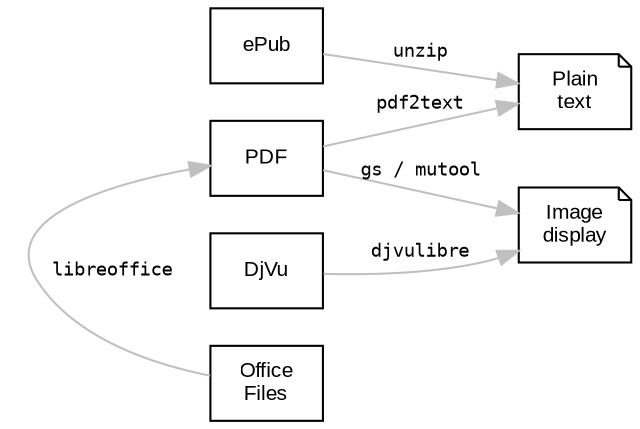

## 5.1 서론 {#5-dot-1-서론}

작가와 다른 창작자들이 아이디어를 어디서 얻는지에 대한 질문은 흔히 신비롭고 모호한 답변을 받곤 합니다. 하지만 답변의 큰 부분은 간단합니다. 작가들은 영감을 얻기 위해 세 가지 자원을 필요로 합니다: 상상력, 글쓰기 기술, 그리고 다른 작가들의 작품. 다른 사람들의 생각과 아이디어는 작가들이 자신의 작품을 구축하는 기초가 됩니다. 1675년, Sir Isaac Newton은 Robert Hooke에게 보내는 편지에서 "내가 더 멀리 볼 수 있었던 것은 거인들의 어깨 위에 서 있었기 때문입니다"라는 유명한 문구를 남겼습니다. 이 인용문은 이제는 진부할지 모르지만, 생성 AI 시대에도 여전히 진실입니다. 다른 창작자들의 작품을 기반으로 구축하는 것은 학술적 글쓰기에서 엄격한 참조 규칙을 따르는 것뿐만 아니라 모든 작가에게 필수적입니다. 모든 작가들은 글을 쓰기 위해 읽고, 듣고, 시청해야 합니다. 따라서 _Emacs Writing Studio_ (EWS) 워크플로우의 첫 번째 단계는 다른 사람들이 만든 정보를 소비하는 것입니다, 그것도 읽기, 듣기, 시청을 통해.

이 장에서는 Emacs를 사용하여 가장 일반적인 오픈 형식의 전자 문서를 읽고, 웹을 서핑하고, 멀티미디어 파일을 소비하는 방법을 설명합니다. 또한 전자책 컬렉션을 관리하기 위한 일반 텍스트 데이터베이스를 만드는 방법도 시연합니다.

Emacs는 텍스트 프로세서이지만, 전자책을 표시하고 미디어 파일을 재생하기 위해 다른 소프트웨어를 호출할 수 있습니다. Emacs는 또한 다른 소프트웨어에 대한 인터페이스이기도 하여, 글쓰기와 텍스트 편집 외에도 다양한 작업을 수행할 수 있습니다. 예를 들어, 음악이나 팟캐스트를 듣고, 비디오를 시청할 수도 있습니다. 학자로서 물리적 및 전자 문학 컬렉션을 추적하는 것도 중요한 작업입니다. Emacs는 BibTeX 파일을 사용하여 쉽게 접근할 수 있는 검색 가능한 서지 목록을 만드는 데 도움을 줄 수 있습니다. 이 서지 목록에서 전자 파일과 하이퍼링크에 접근하고 각 항목에 메모를 첨부할 수 있습니다.


## 5.2 전자책 읽기 {#5-dot-2-전자책-읽기}

디지털 시대 이전에는 점토판에서 종이책까지 물리적으로 정보를 공유했습니다. 인터넷이 있기 전에는 도서관을 방문하여 카탈로그와 책을 뒤져야만 정보를 얻을 수 있었습니다. 지난 20년 동안 디지털 문서가 표준이 되었고, 지역 도서관 방문은 인터넷 검색으로 대체되었습니다.

대부분의 전자책은 일반 텍스트가 아닌 PDF, ePub 또는 DjVu 형식으로 배포됩니다. 예외적으로 Project Gutenberg (`gutenberg.org`)은 저작권이 없는 70,000여 권의 전자책을 제공하는 방대한 전자 도서관입니다. 이 도서관은 1971년에 시작되어 일반 텍스트와 다른 오픈 형식으로 책을 배포합니다.

Emacs는 오픈 형식의 전자책만 렌더링할 수 있습니다. 오픈 형식은 반대로 소유 형식은 공개적으로 사용 가능한 사양을 가지고 있어 누구나 이러한 파일을 생성하고 읽을 수 있는 소프트웨어를 개발할 수 있습니다. 오픈 형식의 가장 큰 장점은 텍스트를 어떤 장치에서도 읽을 수 있다는 것입니다. Apple iBook과 Kindle 책과 같은 가장 일반적인 소유 형식은 Emacs로 읽을 수 없습니다. 소유 파일 형식은 문화적 연속성에 심각한 위협을 제기합니다. 따라서 일부 정부는 디지털 주권을 강화하고 대형 기업의 지배에서 벗어나기 위해 오픈 문서 형식을 요구합니다 (Pohle and Thiel 2020).

Emacs는 전자책과 워드 프로세서 문서를 표시하기 위해 다른 소프트웨어의 도움이 필요합니다. 그림 [Figure 1](#figure--fig-ebook)의 다이어그램은 지원되는 파일 형식에서 페이지를 렌더링하는 데 필요한 프로그램을 보여줍니다. 이 소프트웨어는 각 페이지를 일반 텍스트 버퍼나 PNG 이미지로 변환하여 Emacs가 표시할 수 있게 합니다. 다음 소프트웨어는 가장 일반적인 전자책 형식을 읽기 위해 필요합니다:

-   Ghostscript (`gs`) 및/또는 MuPDF (`mutool`): 이 두 패키지는 PDF 파일을 이미지로 변환할 수 있습니다.
-   Poppler (`pdftotext`): PDF 파일을 렌더링하고 일반 텍스트로 변환하는 또 다른 도구입니다.
-   LibreOffice (`soffice`): 오피스 문서를 보기 위한 생산성 소프트웨어 제품군입니다.
-   DjVuLibre (`ddjvu`): DjVu 전자책을 읽기 위한 도구입니다.
-   Unzip: ePub 책을 읽기 위해 ZIP 파일에서 파일을 추출합니다.

<!--listend-->



<a id="figure--fig-ebook"></a>



EWS 설정은 이러한 패키지 중 하나라도 사용할 수 없을 때 경고를 표시합니다. Emacs는 정상적으로 작동하지만 일부 기능이 사용할 수 없을 수 있습니다. 경고는 메시지 버퍼에 표시되며, `C-h e` (`view-echo-area-messages`)로 다른 창에서 열 수 있습니다.


### 5.2.1 PDF 파일 {#5-dot-2-dot-1-pdf-파일}

Portable Document Format (PDF)는 Adobe가 1990년대 초에 개발한 다목적 시스템입니다. PDF는 소프트웨어, 하드웨어 또는 운영 체제에 관계없이 일관되게 문서를 표시합니다. PDF는 국제 표준(ISO 32000)으로 공식화되었으며 전자 문학의 주요 오픈 형식이 되었습니다.

각 PDF 파일에는 고정된 레이아웃 문서에 대한 완전한 설명이 포함되어 있습니다. 파일에는 텍스트, 폰트, 레이아웃 및 타이포그래피, 이미지 및 콘텐츠를 표시하는 데 필요한 다른 정보가 포함되어 있습니다. PDF 문서는 실제 전자책이 아니며, 다른 전자 형식이 화면에 맞게 조정되는 것과는 대조적으로 레이아웃이 고정되어 있습니다. PDF 파일은 문서가 인쇄된다는 전통적인 물리적 레이아웃과 타이포그래피를 따릅니다.

Emacs는 GhostScript 또는 MuPDF의 도움을 받아 DocView 메이저 모드로 PDF 파일을 표시할 수 있습니다. 이들은 파일을 이미지로 변환합니다. PDF 파일을 다른 문서처럼 열기만 하면 됩니다. 파일을 탐색하려면 화살표 키와 페이지 업/다운 키를 사용하세요. 문서를 탐색하기 위한 여러 다른 키보드 단축키가 있습니다 (표 [Table 1](#table--tab-docview) 참조).

<a id="table--tab-docview"></a>
<div class="table-caption">
  <span class="table-number"><a href="#table--tab-docview">Table 1</a>:</span>
  Doc-View 키보드 단축키.
</div>

| Keystroke     | Function                                     | 설명                 |
|---------------|----------------------------------------------|--------------------|
| `P`           | `doc-view-fit-page-to-window`                | 전체 페이지 확대     |
| `W`           | `doc-view-fit-width-to-window`               | 너비를 창에 맞춤     |
| `H`           | `doc-view-fit-height-to-window`              | 높이를 창에 맞춤     |
| `+` / `-`     | `doc-view-enlarge` / `doc-view-shrink`       | 확대 및 축소         |
| `M-g g`       | `doc-view-goto-page`                         | 페이지로 이동        |
| `M-<` / `M->` | `doc-view-first-page` / `doc-view-last-page` | 첫 페이지 또는 마지막 페이지로 이동 |
| `k`           | `image-kill-buffer`                          | 파일 닫기            |
| `?`           | `describe-mode`                              | 도움말 파일          |

시스템에 `mutool`이 설치되어 있으면, PDF 파일에 북마크가 있는 경우 `imenu` (`M-g i`) 명령을 사용하여 목차를 보고 장으로 이동할 수도 있습니다.

PDF 파일을 검색하려면 시스템에 Poppler 소프트웨어의 `pdftotext` 도구가 필요합니다. 재미있는 사실: 이 유틸리티는 _Futurama_ 만화 시리즈의 한 에피소드에서 이름을 따왔습니다.

문서 내에서 검색하려면 `doc-view-search` (`C-s`)를 사용하여 일치하는 페이지를 나열하고 검색 쿼리가 포함된 페이지 수를 표시합니다. 검색 후 추가 `C-s`를 눌러 일치하는 다음 페이지를 이동할 수 있습니다. DocView는 검색된 용어를 강조 표시하지 않지만, `C-t` (`doc-view-show-tooltip`)를 눌러 이 페이지의 검색 결과를 툴팁으로 표시할 수 있습니다. Poppler를 사용하면 PDF 파일을 일반 텍스트 파일로 볼 수도 있으며, `C-c t` 단축키 (`doc-view-open-text`)를 사용하여 관련 텍스트를 메모에 복사하기 쉽게 만듭니다. 그래픽 보기로 돌아가려면 `C-c C-c`를 두 번 누릅니다.


### 5.2.2 오피스 문서 {#5-dot-2-dot-2-오피스-문서}

DocView 패키지는 Microsoft Office 및 LibreOffice Writer 문서도 읽을 수 있습니다. 이 기능을 사용하려면 LibreOffice 소프트웨어 패키지를 설치해야 합니다. 오피스 문서를 열 때 Emacs는 LibreOffice를 호출하여 파일을 PDF로 변환하고 DocView에서 표시합니다 (그림 [Figure 1](#figure--fig-ebook) 참조), 이전 섹션에서 설명한 기능을 활용합니다. 이 방법을 사용하여 워드 프로세서 파일뿐만 아니라 프레젠테이션 및 스프레드시트를 열 수 있습니다. 모든 파일은 보기 시 PDF로 변환됩니다.

오피스 문서는 압축된 XML 파일이므로, 아카이브 유틸리티로 열 때 일반 텍스트로 내용을 볼 수 있습니다. 불행히도 오피스 문서에 대한 두 가지 표준이 존재합니다. 하나는 오픈 소스 소프트웨어에서 사용되며, 다른 하나는 상업용 소프트웨어 공급업체가 채택한 버전입니다. 이러한 표준 간의 차이로 인해 상업용 소프트웨어로 작성된 파일을 읽을 때 약간의 서식 문제가 발생할 수 있습니다.


### 5.2.3 DjVu 책 {#5-dot-2-dot-3-djvu-책}

DJVU (발음은 _déjà vu_)는 스캔된 책을 위한 파일 형식입니다. DjVu 파일은 고품질의 컬러 이미지, 사진, 텍스트 및 도면을 포함할 수 있으므로, 종종 아카이브 문서에 사용됩니다. DjVu 파일은 `.djvu` 또는 `.djv` 파일 확장자를 사용합니다. 시스템에 DjVuLibre가 설치되어 있으면 DocView가 DjVu 파일을 읽을 수 있습니다.

DocView는 PDF, 오피스 문서 및 DjVu 문서를 표시하므로 PDF 파일을 볼 때 사용할 수 있는 기능이 다른 형식에도 적용됩니다. 이 패키지에 대한 자세한 내용은 Emacs 매뉴얼에서 읽을 수 있으며, `C-h r g docu`로 빠르게 찾을 수 있습니다.

DocView는 다른 문서 뷰어에 비해 몇 가지 제한이 있습니다. 텍스트는 PNG 파일로 표시되므로 검색 기능이 제한적이며 텍스트 복사가 불가능합니다. Vedang Manerikar의 `pdf-tools` 패키지는 DocView보다 더 다재다능하지만, EWS에 포함되지 않았습니다. 왜냐하면 비-리눅스 시스템에서 설치가 복잡하기 때문입니다.


### 5.2.4 ePub 파일 {#5-dot-2-dot-4-epub-파일}

ePub 파일 (Electronic Publication)은 디지털 책, 잡지 및 기타 서면 콘텐츠에 널리 사용되는 오픈 형식입니다. PDF 및 DjVu 형식과 달리 콘텐츠는 화면의 기하학에 맞게 조정됩니다. ePub 파일은 상자 안의 웹사이트입니다. 아카이브 유틸리티로 ePub 파일을 열어보면, 파일은 책의 콘텐츠와 디자인을 정의하는 HTML 파일 모음과 삽화용 이미지 파일로 구성되어 있습니다. 따라서 이 파일 형식은 콘텐츠를 보기 위해 `unzip` 패키지가 필요합니다.

Vasilij Schneidermann의 `nov` 패키지는 Emacs 내에서 ePub 책을 보기 위한 유용한 기능을 제공합니다. ePub 파일을 열고 스페이스 바, 화살표 키 또는 페이지 업/다운 키로 스크롤합니다. 책을 탐색하기 위한 여러 키보드 단축키가 있습니다 (표 [Table 2](#table--tab-nov) 참조).

<a id="table--tab-nov"></a>
<div class="table-caption">
  <span class="table-number"><a href="#table--tab-nov">Table 2</a>:</span>
  Nov 패키지의 키보드 단축키.
</div>

| Keystroke | Function                | 설명   |
|-----------|-------------------------|------|
| `t`       | `nov-goto-toc`          | 목차   |
| `n`       | `nov-next-document`     | 다음 장 |
| `p`       | `nov-previous-document` | 이전 장 |
| `q`       | `quit-window`           | 종료   |
| `?`       | `describe-mode`         | 도움말 버퍼 |

텍스트 크기를 키우거나 줄이려면 `C-x C-+` 및 `C-c C--` 단축키 (`text-scale-adjust`)를 사용하세요. 글꼴 크기를 키우면 텍스트의 일부가 창 밖으로 이동할 수 있습니다. 줄 길이를 재설정하려면 `g` 키를 눌러 문서를 다시 렌더링합니다 (`nov-render-document`).

ePub 파일에서 텍스트를 복사하여 붙여넣기하려면 `kill-ring-save` 명령 (`M-w`)을 사용할 수 있습니다. ePub 파일에서 이미지를 복사할 수도 있습니다. `a` 키 (`nov-reopen-as-archive`)를 사용하여 파일을 아카이브로 다시 열고, 문서의 내부 구조를 보여줍니다. 여기서 관련 이미지 파일로 이동하고, `C` 키 (~archive-copy-file)~로 복사하고, 새 위치와 이름을 선택할 수 있습니다. 아쉽게도 아카이브 파일 내에서 이미지를 미리 볼 수 있는 기능은 없습니다.


## 5.3 디지털 라이브러리 관리 {#5-dot-3-디지털-라이브러리-관리}

대규모 문학 컬렉션을 유지하는 것은 빠르게 혼란으로 이어질 수 있으므로 대부분의 학자들은 읽은 내용을 추적하기 위해 전자 서지 목록을 사용합니다. Emacs는 일반 텍스트 라이브러리 카탈로그를 구축하여 서지에 쉽게 접근할 수 있도록 도와줍니다. 이 서지 목록은 또한 메모 (장 [BROKEN LINK: chap-ideation])와 학술 인용 (장 [BROKEN LINK: chap-production] 및 [#chap-publication])에 대한 링크를 제공할 수 있습니다.

서지 목록을 생성하고 관리하려면 서로 원활하게 통합되는 세 가지 Emacs 패키지가 필요합니다. 내장된 BibTeX Mode는 일반 텍스트 서지 목록을 생성하고 유지 관리하는 데 도움을 줍니다. Clément Pit-Claudel의 Biblio 패키지는 온라인 학술 데이터베이스를 검색하고 관련 항목을 서지에 삽입합니다. Bruce D'Arcus의 Citar 패키지는 미니버퍼 완성 시스템을 사용하여 서지에 쉽게 접근할 수 있게 합니다. 이 세 가지 패키지는 Emacs를 완전한 기능의 문학 관리 시스템으로 변환합니다.


### 5.3.1 BibTeX 모드 시작하기 {#5-dot-3-dot-1-bibtex-모드-시작하기}

BibTeX Mode는 서지 목록을 생성하고 관리하기 위한 주요 모드입니다. 이름에서 알 수 있듯이, 이 모드는 기본적으로 BibTeX 파일 형식을 사용하여 서지 데이터베이스를 만듭니다. BibTeX는 문학과 인용을 정리하기 위한 일반 텍스트 형식입니다. 일반적으로 LaTeX (Lamport 1994)으로 학술 출판물을 조판하는 데 사용됩니다. 일반적인 책 항목은 다음과 같이 보일 것입니다:

```text
@article{stallman_1981_emacs,
  title      = {EMACS the Extensible, Customizable
                Self-Documenting Display Editor},
  author     = {Stallman, Richard M.},
  year       = 1981,
  journal    = {ACM SIGOA Newsletter},
  volume     = 2,
  number     = {1-2},
  pages      = {147--156},
  doi        = {10.1145/1159890.806466},
  keywords   = {Emacs}
  file       = {computing/stallman-1981-emacs.pdf}
}
```

각 항목은 `@`-기호와 출판 유형(책, 논문 또는 다른 유형)으로 시작하며, 중괄호와 고유한 인용 키가 이어집니다. 다음 줄에는 이 항목에 대한 관련 데이터가 포함됩니다. BibTeX는 다양한 유형의 문학을 처리할 수 있으며, 각 유형에는 고유한 필드 유형이 있습니다. BibTeX는 인식되지 않는 필드를 무시하므로, 파일과 키워드를 첨부하는 등 다른 목적을 위해 형식을 사용할 수 있는 기회를 제공합니다. BibTeX는 `.bib` 확장자를 가진 일반 텍스트 파일입니다.

Emacs 내에서 어디서든지 참조할 수 있도록 하나 이상의 서지 파일을 폴더에 저장할 수 있습니다. EWS에서는 `ews-bibtex-directory` 변수가 이 폴더를 정의합니다. 이 변수를 원하는 위치로 맞춤화해야 하며, 기본값은 `~/library`입니다. 틸드(`)는 홈 디렉토리를 나타냅니다. 이 변수를 맞춤화한 후 ~ews-bibtex-register` 함수를 실행하여 이 디렉토리의 서지 파일을 등록합니다.

BibTeX 첨부 파일은 시스템이 파일을 찾을 수 있도록 이 디렉토리에 있어야 합니다. 첨부 파일은 하위 디렉토리에 있을 수 있습니다. BibTeX 항목의 파일 경로는 이 위치에서 시작합니다. 예를 들어, BibTeX 항목이 `file={topology/article.pdf}`라고 하면, 첨부 파일은 `~/library/topology/article.pdf`에 저장됩니다. 항목당 여러 개의 첨부 파일을 가질 수 있으며, 세미콜론으로 구분합니다. BibTeX 첨부 파일에는 공식적인 파일 명명 규칙이 없으므로, 선호하는 방법을 사용할 수 있습니다. 섹션 [BROKEN LINK: sec-filenames]에서는 파일 명명 규칙을 구성하는 방법에 대한 몇 가지 지침을 제공합니다.

외부 소프트웨어를 설치할 필요 없이 시작할 수 있습니다. 서지 디렉토리에 `.bib` 확장자를 가진 빈 파일을 만들기만 하면, Emacs가 파일을 열 때 BibTeX 모드를 활성화합니다.


### 5.3.2 새 항목 추가 {#5-dot-3-dot-2-새-항목-추가}

Emacs BibTeX 모드는 템플릿을 사용하여 새 항목을 추가합니다. 새 참조를 추가하려면 `bibtex-entry` 함수 (`C-c C-b`)를 사용하고 관련 출판 유형을 선택하세요. Emacs는 또한 각 유형의 문학에 대한 단축키를 제공합니다. BibTeX 파일 내에서 `C-c C-e ?`를 사용하여 이러한 명령 목록을 읽을 수 있습니다.

대부분의 필드는 선택 사항이지만, 각 문학 유형에는 적어도 하나의 필수 필드가 있습니다. 선택적 필드는 '`OPT`'로 시작합니다. 저자 또는 편집자 필드 중 하나를 완료해야 하며, 둘 다 완료할 수도 있습니다. EWS 설정은 키워드로 문학을 분류하고 하나 이상의 파일을 첨부할 수 있는 필드를 추가합니다. 제목, 출판사 및 연도 필드는 필수이며, 저자 또는 편집자 필드, 또는 둘 다를 완료해야 합니다. 모든 다른 필드는 선택 사항입니다. 각 문학 유형에는 고유한 템플릿이 있으며, 아래는 책 템플릿의 예입니다.

```text
@Book{,
  ALTauthor    = {},
  ALTeditor    = {},
  title        = {},
  publisher    = {},
  year         = {},
  OPTkey       = {},
  OPTvolume    = {},
  OPTnumber    = {},
  OPTseries    = {},
  OPTaddress   = {},
  OPTedition   = {},
  OPTmonth     = {},
  OPTnote      = {},
  OPTkeywords  = {},
  OPTfile      = {}
}
```

키워드 매개변수는 동일한 카테고리의 문학을 찾고 테마별 서지 목록을 생성하는 데 유용합니다.

필드 간을 이동하려면 `C-j` (`bibtex-next-field`)를 사용하고, 모든 필수 필드와 하나의 `ALT` 필드를 완료합니다. 완료되면 `C-c C-c` (`bibtex-clean-entry`)를 눌러 구문을 확인하고 빈 필드를 제거합니다. 이 함수는 또한 일부 구성 가능한 규칙을 사용하여 항목에 고유한 인용 키를 할당합니다. 이 인용 키를 수동으로 설정하여 고유하게 만들 수 있습니다. BibTeX 모드는 중복 키를 발견하면 경고를 표시합니다. 버퍼를 정리하고 필드를 정렬하려면 `bibtex-fill-entry` 함수 (`C-c C-q`)를 사용하세요. 이 명령은 또한 깔끔한 외관을 위해 중복된 중괄호를 제거합니다. 표 [Table 3](#table--tab-bibtex)는 BibTeX 모드에서 가장 중요한 키보드 단축키와 기능을 요약합니다.

저자 또는 편집자 이름을 입력할 때, 성을 먼저 입력한 다음 쉼표와 이름 또는 이니셜을 입력합니다. 추가 저자는 "and"로 구분합니다. 예: "Hawking, S. and Penrose, R.". 저자 이름을 복사하여 붙여넣기하면 이름과 성의 순서가 잘못될 수 있습니다. Emacs의 좋은 해킹 중 하나는 `org-transpose-words` 함수(`M-t`)를 사용하여 커서 좌우의 두 단어의 순서를 바꾸는 것입니다. 예를 들어, "Stephen Hawking"을 "Hawking Stephen"으로 변환하고, 성 뒤에 쉼표를 추가하여 마무리합니다.

<a id="table--tab-bibtex"></a>
<div class="table-caption">
  <span class="table-number"><a href="#table--tab-bibtex">Table 3</a>:</span>
  항목 추가 및 편집을 위한 키보드 단축키 개요.
</div>

| Keystroke | Function                | 설명          |
|-----------|-------------------------|-------------|
| `C-c C-b` | `bibtex-entry`          | 선택한 유형의 항목 추가 |
| `C-c d`   | `bibtex-empty-field`    | 현재 필드 비우기 |
| `C-j`     | `bibtex-next-field`     | 다음 필드로 이동 |
| `C-down`  | `bibtex-next-entry`     | 다음 항목으로 이동 |
| `C-up`    | `bibtex-previous-entry` | 이전 항목으로 이동 |
| `C-c C-c` | `bibtex-clean-entry`    | 항목 정리     |
| `C-c C-q` | `bibtex-fill-entry`     | 필드 정렬     |

이 섹션은 이 패키지의 기능에 대한 간략한 요약일 뿐입니다. 이 패키지에 대한 문서는 다소 부족합니다. Jonathan Le Roux(`jonathanleroux.org`)는 자신의 웹사이트에 이 패키지의 기능을 자세히 설명하는 포괄적인 매뉴얼을 게시합니다.

EWS는 BibTeX 파일과 첨부 파일 간의 링크 무결성을 보장하기 위해 두 가지 편리한 함수를 제공합니다. 이상적인 상태는 BibTeX 항목에 언급된 파일이 실제로 존재하고, 반대로 서지 폴더에 있는 모든 파일이 서지에 나열되는 것입니다.

`ews-bibtex-missing-attachments` 함수는 메시지 버퍼에 누락된 첨부 파일 목록을 표시합니다. 이 불일치를 해결하려면 관련 BibTeX 항목에서 `file` 필드를 제거하거나 편집하거나, 컬렉션에서 파일의 이름을 수정해야 합니다. `ews-bibtex-missing-files` 함수는 서지 디렉토리에 있는 첨부 파일 중 서지에 등록되지 않은 파일을 나열합니다. 문제를 해결하려면 관련 파일의 이름을 변경하거나 관련 BibTeX 항목에 `file` 필드를 추가해야 합니다. 이 두 함수는 Citar 메뉴를 통해 전자 문학에 항상 접근할 수 있도록 도와줍니다.


### 5.3.3 온라인 소스에서 항목 추가 {#5-dot-3-dot-3-온라인-소스에서-항목-추가}

BibTeX 모드는 모든 항목을 수동으로 입력해야 하므로 비효율적이며 오류가 발생하기 쉽습니다. Clément Pit-Claudel의 Biblio 패키지는 온라인 소스에서 서지 참조를 검색하고 가져와 체계적인 문학 리뷰를 수행할 수 있게 합니다. 현재 이 패키지는 CrossRef, DBLP, arXiv, doi.org, 그리고 Dissemin에서 검색할 수 있습니다.

CrossRef는 다양한 콘텐츠 유형에서 수백만 개의 항목을 상호 연결합니다. 여기에는 저널, 책, 학회 프로시딩, 연구 보조금, 작업 논문, 기술 보고서, 데이터 세트 등이 포함됩니다. 연결된 콘텐츠는 과학, 기술, 의학(STM) 및 사회 과학 및 인문학(SSH) 분야의 자료를 포함합니다. DBLP는 컴퓨터 과학 서지 웹사이트로, 7백만 개 이상의 출판물을 보유하고 있습니다. arXiv(발음은 "아카이브")는 사전 검토 후 게시 승인을 받은 사전 인쇄물 및 사후 인쇄물의 오픈 액세스 저장소입니다. 수학과 물리학에서는 거의 모든 과학 논문이 동료 검토 저널에 게시되기 전에 arXiv 저장소에 자체 아카이브됩니다.

대부분의 전자 출판물에는 Digital Object Identifier(DOI)가 있으며, 이는 출판물에 대한 메타데이터에 연결되는 지속적인 식별 코드입니다. DOI 시스템은 출판물이 주소가 변경되더라도 찾을 수 있도록 보장합니다. DOI는 학술, 전문, 정부 정보를 식별하는 데 널리 사용되며, 저널 기사, 연구 보고서, 데이터 세트, 공식 출판물 등을 포함합니다.

Biblio 패키지를 사용하려면 관련 BibTeX 파일을 열고, ~biblio-lookup~를 실행하고, 적절한 데이터베이스를 선택한 다음 검색 쿼리를 입력합니다. 검색 결과가 나오면 새 버퍼가 열립니다. 화살표 키로 대상을 선택하거나 `C-s`로 버퍼 내에서 검색할 수 있습니다. 필요한 문학을 찾으면 `i` 키를 눌러 해당 BibTeX 레코드를 호출한 버퍼에 삽입합니다. 또는 `c` 키로 BibTeX 레코드를 복사하고 나중에 붙여넣을 수 있습니다. 검색 결과를 종료하려면 `q` 키를 사용합니다. 이 버퍼에서 가능한 모든 명령을 보려면 `h` 키를 사용하세요.

`biblio-doi-insert-bibtex` 함수는 DOI 번호를 기반으로 현재 버퍼에 BibTeX 레코드를 삽입합니다. 두 가지 형식 중 하나로 식별자를 입력할 수 있습니다. 이 명령은 BibTeX 버퍼 내에서 커서가 새 항목이 나타나길 원하는 위치에 있어야 합니다.

불행히도 대형 기업 출판사들은 여전히 세계의 학술 지식을 잠금 상태로 유지하고 있습니다. 그러나 오픈 액세스와 사전 인쇄물 출판이 점차 표준이 되고 있습니다. Dissemin 웹사이트는 광범위한 오픈 저장소와 웹사이트에서 논문의 오픈 액세스 사본을 검색합니다. Emacs에서 이 서비스를 사용하려면 `dissemin-lookup~을 평가하여 DOI 번호를 사용하여 논문의 오픈 액세스 상태에 대한 정보를 표시합니다. ~biblio-lookup` 함수의 검색 메뉴에서 `x` 키를 눌러 오픈 액세스 버전을 확인할 수도 있습니다.

Biblio 패키지는 유용하지만, 새 항목을 삽입하기 전에 관련 서지 파일로 이동해야 한다는 작은 불편함이 있습니다. 또한 두 가지 별도의 검색 기능을 제공합니다. 맞춤형 `ews-bliblio-lookup` (`C-c w b b`) 함수는 검색 결과를 저장할 BibTeX 파일을 선택한 다음 사용 가능한 소스 중 하나를 선택할 수 있게 해줍니다. 이 함수는 또한 DOI 검색과 다른 소스 검색을 결합하여 워크플로우에서 몇 가지 단계를 제거합니다.


### 5.3.4 서지 접근 {#5-dot-3-dot-4-서지-접근}

서지 목록을 유지하는 것은 좋은 출발점이지만, 여러 개의 서지를 가지고 있을 때 검색하고 접근하기가 쉽지 않습니다. 우리는 문학을 컴퓨터에서 쉽게 찾고, 하이퍼링크, 첨부 파일, 메모 등의 자원에 접근할 수 있도록 하는 인터페이스가 필요합니다.

Citar 패키지는 미니버퍼 완성을 사용하여 서지에 접근할 수 있게 해주며, 하이퍼링크와 첨부 파일에 접근할 수 있습니다. Citar는 또한 메모 (장 [BROKEN LINK: chap-ideation])에 접근할 수 있게 해주며, Org의 인용 모듈과 통합됩니다 (장 [BROKEN LINK: chap-production]).

글로벌 Emacs 서지는 `ews-bibtex-directory~에 있는 모든 BibTeX 파일로 구성되며, 활성 Org 버퍼에서 참조된 파일도 포함됩니다. 새로운 파일을 글로벌 서지에 추가하면 Citar에 이를 알려야 합니다. ~ews-bibtex-register` 함수 (`C-c w b r`)를 사용하여 지정된 디렉토리의 모든 서지 파일을 Citar에 등록하고, 이 파일들을 에코 영역에 표시합니다. 이 함수는 새 파일을 등록할 때만 사용되며, 기존 파일에 새로운 문학을 추가할 때는 필요하지 않습니다.

Citar는 ~citar-open~으로 활성화되며, EWS에서는 `C-c w b o`로 바인딩됩니다. 미니버퍼에 메뉴가 팝업되어 컬렉션을 검색할 수 있습니다. 메뉴의 첫 세 열은 항목에 하이퍼링크(`L`), 하나 이상의 첨부 파일(`F`), 그리고 연관된 메모(`N`)가 포함되어 있는지를 나타냅니다. 나머지는 저자, 연도, 제목, 인용 키, 그리고 키워드를 보여줍니다 (그림 [Figure 2](#figure--fig-citar-menu) 참조).

<a id="figure--fig-citar-menu"></a>



Citar로 문학을 찾는 것은 Vertico와 Orderless 패키지의 강력함 덕분에 쉽습니다. 매 키 입력 후 Citar는 관련 항목으로 목록을 좁힙니다. 화살표 키로 후보를 선택하거나, `<tab>`을 사용하여 여러 항목을 선택할 수 있습니다. Citar 완성 메뉴를 첨부 파일이 있는 항목으로 필터링하려면 `":f"`를 사용하고, 링크가 있는 항목으로 필터링하려면 `":l"`을 사용합니다. 엔터 키를 누르면 Citar는 미니버퍼에 팝업 메뉴를 제공하여 첨부 파일을 열거나 BibTeX 항목에 나열된 하이퍼링크를 따를 수 있습니다.


## 5.4 웹 서핑 {#5-dot-4-웹-서핑}

Emacs에는 Emacs Web Wowser(EWW)라는 내장 웹 브라우저가 있습니다. 이 패키지는 기능성보다 가독성에 중점을 두어 웹사이트를 일반 텍스트로 표시합니다. 이미지를 표시할 수 있지만 CSS를 렌더링하지 않으며 JavaScript를 실행하지 않습니다. Wowser는 도덕적 견해를 가진 사람을 의미하며, 웹의 보안 및 개인정보 문제에 대한 윤리적 입장을 나타냅니다. 웹사이트를 처음 텍스트로 렌더링했을 때의 반응을 나타낼 수도 있습니다. 텍스트로 웹사이트를 읽는 것은 더 안전한 인터넷 서핑 방식입니다, 왜냐하면 EWW는 JavaScript를 렌더링하지 않기 때문입니다.

URL을 열거나 웹을 검색하려면 `eww` 명령을 사용하세요. 입력이 URL처럼 보이지 않으면 EWW는 DuckDuckGo를 사용하여 웹을 검색합니다. 이는 개인 정보를 중시하는 검색 엔진으로, 온라인 행동을 추적하지 않습니다. 페이지 로딩 후, 화살표 키와 페이지 업/다운 키를 사용하여 페이지 내에서 이동합니다. 웹 페이지를 탐색하기 위한 여러 키보드 단축키가 있습니다.

-   `<`, `>`: 페이지의 시작과 끝으로 이동
-   `R`: 읽기 가능한 형식(주요 텍스트만 표시)
-   `G`: 새 검색 또는 웹사이트
-   `H`: 브라우징 기록
-   `M-I`: 이미지 토글
-   `l` / `n`: 이전 및 다음 페이지
-   `q`: 창 닫기
-   `w`: 커서 아래의 URL 또는 페이지의 URL 복사
-   `&`: 외부 브라우저에서 페이지 열기
-   `?`: 다른 키보드 단축키 목록이 있는 도움말 파일

엔터 키는 링크를 엽니다 (`eww-follow-link`). 새 버퍼에 페이지를 열려면 `M-<ret>` (`eww-open-in-new-buffer`)를 사용하세요.

가장 유용한 옵션은 `R`로 페이지의 탐색 부분을 무시하고 콘텐츠에 집중하는 것입니다. 페이지에 JavaScript가 필요하거나 EWW에서 렌더링되지 않는 경우, 앰퍼샌드(`&`)를 사용하여 시스템의 기본 웹 브라우저로 이동합니다.

Emacs 내의 비-EWW 버퍼에서 링크를 열 때, 기본 브라우저에서 열립니다. 일단 텍스트로 인터넷을 탐색하는 데 익숙해지면, Emacs 내에서 링크를 따를 때 EWW를 기본 브라우저로 설정하고 싶을 수도 있습니다. 이를 위해 `browse-url-browser-function` 변수를 맞춤화하고, 값 메뉴에서 'Emacs Web Wowser'를 선택한 다음 `[적용 및 저장]`을 클릭하세요.

좋아하는 웹사이트를 찾으면 `b` 키로 북마크할 수 있습니다 (`eww-add-bookmark`). `eww-list-bookmarks` 함수는 저장된 모든 북마크를 나열하며, 여기서 하나를 선택하여 페이지를 방문할 수 있습니다. EWW 매뉴얼은 `C-h R eww`로 읽을 수 있습니다.

북마크 컬렉션을 유지하는 것은 유용하지만, 새로운 콘텐츠가 게시되었는지 확인하기 위해 정기적으로 이 사이트를 방문해야 합니다. 많은 블로그와 팟캐스트는 RSS 피드를 사용하여 독자들에게 새로운 콘텐츠를 알립니다. 다음 섹션에서는 RSS 피드에 대해 다룹니다.


### 5.4.1 Elfeed로 RSS 및 Atom 피드 읽기 {#5-dot-4-dot-1-elfeed로-rss-및-atom-피드-읽기}

인터넷에서 흥미로운 콘텐츠를 찾는 것은 쓰레기 더미를 뒤져서 가치 있는 것을 발견하는 것과 같습니다. 소셜 미디어는 재미있고 매력적일 수 있지만, 어두운 알고리즘에 의해 구동되는 무관심하고 학대적인 콘텐츠의 소음은 실망스럽습니다. RSS와 Atom 피드는 즐기는 웹사이트와 블로그에 구독할 수 있게 해줍니다. 피드는 웹사이트의 최신 콘텐츠를 포함하는 XML 파일로, 전체 텍스트 또는 요약을 제공합니다.

RSS(Really Simple Syndication)는 콘텐츠를 소비하는 우아한 메커니즘입니다. 왜냐하면 구독한 블로그나 팟캐스트만 볼 수 있기 때문입니다. Atom 피드는 더 최근의 형식으로, RSS의 모호함을 명확히 합니다. 두 피드 모두 XML 형식이며, 이를 표시하기 위해 집계기가 필요합니다.

RSS를 사용하면 어떤 알고리즘도 볼 수 있는 것을 결정하지 않습니다. RSS 피드 구독은 익명이므로, 이메일을 통해 스팸 메일을 받지 않습니다. 일부 웹사이트는 특정 주제에 대한 구독을 위해 여러 피드를 가지고 있습니다. 예를 들어, 이 책의 동반 웹사이트에서 Emacs 관련 기사의 RSS 피드는 다음과 같습니다:

```text
  https://lucidmanager.org/tags/emacs/index.xml
```

불행히도 RSS 피드는 소셜 미디어의 지배와 웹사이트 소유자가 이메일 주소를 수집하려는 선호로 인해 중요성을 잃었습니다. RSS 피드를 찾는 것은 예전에 비해 쉬워졌지만, 대형 인터넷 기업들은 검은 상자 알고리즘에 의존하여 사용자에게 콘텐츠를 제공하므로 RSS 피드는 거의 보이지 않게 되었습니다. 그러나 이 기술은 여전히 살아 있으며, 팟캐스트와 YouTube에서도 사용됩니다. 브라우저는 더 이상 피드에 자동으로 링크하지 않으며, 웹사이트는 이전처럼 피드에 대한 링크를 두드러지게 표시하지 않지만, 피드는 여전히 존재합니다.

거의 절반의 웹사이트가 WordPress를 사용합니다. 이러한 사이트의 피드를 찾으려면 URL 끝에 `feed`를 추가하면 됩니다. 모든 방법이 실패하면 페이지 소스(뷰어에서 `v` 키를 사용)를 확인하여 `rss-xml`을 검색하고 `href` 사양의 URL을 복사할 수 있습니다.

YouTube 채널을 추가하려면 채널 ID가 필요합니다. 채널 홈 페이지의 소스 코드에서 '`channel_id=`'를 검색하여 이 URL을 찾고, 다음 템플릿에 추가합니다:

```text
https://www.youtube.com/feeds/videos.xml?channel_id=<ID>
```

Christopher Wellons의 Elfeed 패키지는 즐겨찾는 RSS 피드를 집계합니다. 즐겨찾는 피드를 나열하고 분류할 수 있습니다. Elfeed 브라우저는 읽지 않은 기사, YouTube 피드, 또는 팟캐스트를 탐색하는 데 도움을 줍니다. Elfeed를 사용하려면 cURL 프로그램을 설치해야 합니다. 이 프로그램은 인터넷에서 파일을 다운로드하는 데 도움을 줍니다. cURL이 없으면 Elfeed는 느린 내장 Emacs 방법을 사용하여 데이터를 추출하며, 이는 Windows 컴퓨터에서 작동하지 않습니다.

이 패키지는 피드를 저장하기 위한 데이터베이스를 생성합니다. EWS는 다운로드된 콘텐츠의 위치를 Emacs 설정 폴더로 설정합니다. Elfeed를 시작하는 EWS 키보드 단축키는 `C-c w e`입니다. 그러나 피드를 읽기 전에 먼저 피드를 찾아 설정 파일에 추가하고 데이터를 다운로드해야 합니다.

Elfeed-Org 패키지는 즐겨찾는 웹사이트 목록을 Org 파일로 구성합니다. 이 패키지는 지정된 Org 파일(들)을 읽고, `:elfeed:` 태그가 있는 헤더에서 인터넷 주소 또는 링크를 수집합니다. 태그는 `C-c C-q`로 Org 모드 헤더에 설정합니다. 아래는 Elfeed Org 파일을 구성하는 방법의 예시입니다. 태그는 하위 레벨의 모든 헤더에 적용되므로, `:elfeed:` 태그는 Emacs와 뉴스 헤더에도 적용됩니다. Elfeed는 텍스트 주석도 읽을 수 있습니다.

```text
#+title: Elfeed Configuration

* Feeds                                    :elfeed:
* Emacs                                   :emacs:
Emacs 관련 정보.
** https://lucidmanager.org/tags/emacs/index.xml
** http://www.reddit.com/r/emacs/.rss
** https://www.youtube.com/feeds/videos.xml?channel_id=UC0uTPqBCFIpZxlz_Lv1tk_g

* News                                    :news:
** [[https://www.abc.net.au/news/feed/2942460/rss.xml][ABC Australia]]
```

일반 URL 또는 Org 하이퍼링크를 사용할 수 있습니다. Org-Webtools 패키지는 `C-c w w`로 Org 모드에 완전히 형식화된 하이퍼링크를 삽입합니다. EWW 브라우저를 사용할 때 현재 주소를 킬 링에 복사하려면 `w`를 사용하세요.

`elfeed-org`에 필요한 유일한 설정은 피드 링크를 저장할 파일의 이름과 위치를 맞춤화하는 것입니다. Elfeed 설정의 위치는 `rmh-elfeed-org-files` 변수에 저장되며, 기본값은 `"~/elfeed.org"`입니다. 이 책의 GitHub 저장소에는 시작을 위한 예제 파일이 포함되어 있습니다.

이 변수를 사용할 파일에 맞게 맞춤화해야 합니다. 피드를 추가하거나 제거하려면 이 파일을 편집하고 ~elfeed-update~로 데이터베이스를 업데이트하세요. 이제 RSS 피드를 읽을 준비가 되었습니다.

`C-c w e`를 눌러 Elfeed 브라우저를 시작하면, 날짜와 제목, 피드 이름 및 태그가 있는 목록이 표시됩니다. 엔터 키를 누르면 Elfeed는 웹사이트 또는 요약을 다른 창에서 표시하며, 웹 버전에 대한 하이퍼링크를 제공합니다. 피드를 관리하기 위한 다음 키 입력이 있습니다:

-   `G`: 서버에서 피드 업데이트 가져오기
-   `b`: 시스템 브라우저에서 기사 열기
-   `c`: 검색 필터 지우기
-   `g`: 피드 목록 보기 새로 고침(읽지 않은 항목 제거)
-   `q`: Elfeed 종료
-   `r`: 항목을 읽음으로 표시
-   `s`: 검색 필터 업데이트
-   `u`: 항목을 읽지 않음으로 표시

모든 새 항목은 기본적으로 읽지 않은 것으로 태그됩니다. 다른 태그는 RSS 피드 목록에서 파생됩니다. 피드 목록에서 피드를 제거하면 이전에 다운로드한 모든 기사는 데이터베이스에 남아 있으며, 읽거나 제거할 때까지 목록에 표시됩니다. Elfeed는 또한 강력한 검색 필터를 제공하여 태그, 피드 이름, 날짜로 필터링할 수 있습니다.


## 5.5 Emacs 멀티미디어 시스템 {#5-dot-5-emacs-멀티미디어-시스템}

음악은 생산성을 높이는 훌륭한 도구입니다. J.S. Bach의 초월적인 푸가나 Sepultura의 다층적인 메탈 음악을 들으며 다음 걸작을 쓰는 동안 영혼을 달래줍니다. 심리학자 Sara Bottiroli와 그의 동료들은 배경 음악의 심리적 효과를 연구했으며, 이는 에피소드 기억, 지능, 그리고 언어 및 시각 처리 속도를 향상시킬 수 있다고 발견했습니다 (Bottiroli et al. 2014).

Emacs는 겸손한 텍스트 프로세서일 수 있지만, 글을 쓰는 동안 배경 음악을 재생하거나 팟캐스트나 필드 인터뷰를 들을 수 있도록 도와줍니다. 이미 컴퓨터에 훌륭한 음악 플레이어가 있을 수 있지만, 다른 애플리케이션으로 전환하지 않고도 음악을 재생할 수 있으면 집중력을 유지하는 데 도움이 됩니다. Emacs Multimedia System(EMMS)은 Emacs를 위한 포괄적인 음악 및 비디오 플레이어입니다. 직관적인 브라우저를 제공하여 앨범 커버와 메타데이터를 표시하며, Emacs 시스템을 개인용 주크박스로 변환합니다.

Emacs는 외부 음악 플레이어에 접근하여 소리를 재생하고, 앨범 커버를 썸네일로 변환하기 위해 이미지 소프트웨어에 접근해야 합니다. Emacs에서 소리를 재생하려면 호환되는 사운드 플레이어(ogg123, mpg321, MPlayer, MPV, 또는 VLC) 중 하나를 설치해야 합니다. EWS 설정을 실행하면 시스템이 이러한 플레이어 중 하나가 사용 가능한지 확인합니다. 누락된 소프트웨어는 메시지 버퍼에 나열되며, `C-h e`로 접근할 수 있습니다.

음악을 재생하는 마지막 단계는 음악 파일을 캐시하는 것입니다. `emms-add-directory-tree` 명령을 평가하여 컬렉션을 스캔합니다. EMMS는 Emacs 설정 디렉토리에 캐시를 생성합니다. EMMS는 Ogg Vorbis, Opus, FLAC 및 MP3 파일과 일부 비디오 파일 유형의 메타데이터를 읽습니다. 이 과정은 썸네일도 캐시하며, 컬렉션의 크기에 따라 시간이 걸릴 수 있습니다. `EMMS: 모든 트랙 정보가 로드되었습니다`가 미니버퍼에 표시되면 음악 재생을 시작할 수 있습니다. 스캔 진행 상황은 메시지 버퍼에서 확인할 수 있습니다.

음악 파일을 재생하는 기본 원칙은 트랙을 재생 목록 버퍼로 이동하는 것입니다. 브라우저는 좋아하는 음악을 선택하는 가장 편리한 방법입니다. `emms-browser` (`C-c w m b`)로 브라우저를 시작합니다 (그림 [Figure 3](#figure--fig-emms) 참조).

<a id="figure--fig-emms"></a>



EMMS 브라우저에서 `b` 키를 사용하여 아티스트, 앨범, 장르, 연도, 작곡가 또는 연주자로 브라우징합니다. 브라우저는 기본적으로 앨범 커버, 아티스트 이름 또는 선택한 브라우징 카테고리만 표시합니다. 브라우저는 계층적입니다. 예를 들어, 장르로 브라우징할 때 계층은 네 단계로 구성됩니다: _장르_ &gt; _아티스트_ &gt; _앨범_ &gt; _트랙_. `1` 키로 카테고리를 축소하고, `2-4` 키로 1에서 3단계까지의 카테고리를 확장합니다.

대부분의 Emacs 애플리케이션과 마찬가지로, `?` 키를 눌러 사용 가능한 키 입력 목록을 볼 수 있습니다. 예를 들어:

-   `r`: 무작위 항목으로 이동
-   `s`: 앨범, 아티스트, 제목, 연주자 또는 작곡가로 검색
-   `ENTER`: 선택 항목을 재생 목록에 추가
-   `C-j`: 선택 항목을 재생 목록에 추가하고 재생
-   `W`: Wikipedia에서 항목 검색

가시적인 항목에 대해 표준 검색 명령도 작동합니다. 커서가 카테고리(예: 앨범 이름 또는 작곡가)에 있을 때, 해당 카테고리에 속하는 모든 트랙을 재생 목록에 추가합니다. 따라서 커서가 앨범에 있으면 모든 트랙이 추가됩니다. 커서가 단일 트랙에 있으면 해당 트랙만 추가됩니다. 재생 목록으로 이동하려면 `emms` (`C-c w m e`)를 사용하여 재생할 항목을 관리합니다. `?` 키를 눌러 키보드 단축키 목록을 볼 수 있습니다. 몇 가지 예는 다음과 같습니다:

-   `n` / `p`: 다음 또는 이전 트랙
-   `r`: 무작위 트랙 재생
-   `D`: 선택한 트랙을 재생 목록에서 제거
-   `C`: 재생 목록 지우기

EWS 설정은 키보드의 멀티미디어 버튼(재생, 일시 정지, 다음, 이전)도 설정합니다. MPRIS(Media Player Remote Interfacing Specification) 확장은 EMMS로 음악을 재생할 때, Emacs 내에 있지 않아도 이러한 버튼이 작동하도록 합니다.

멋진 재생 목록을 만들었다면, `m3u` 또는 `pls` 형식으로 저장하여 나중에 Emacs 또는 다른 멀티미디어 플레이어에서 사용할 수 있습니다. `save-buffer` 명령 (`C-x C-s`)을 사용하세요. `emms-play-playlist` 함수 (`C-c w m p`)는 저장된 재생 목록을 로드하고 재생합니다.

EMMS는 사운드 컬렉션을 제어할 수 있는 많은 고급 기능을 가지고 있습니다. 몇 가지 유용한 EMMS 함수는 다음과 같습니다:

-   `emms-play-directory`: 디렉토리를 재생 목록에 추가합니다.
-   `emms-play-find`: 음악 디렉토리 내에서 주어진 검색 기준에 맞는 모든 파일을 재생합니다.

Emacs Multimedia System은 청취 경험을 세밀하게 조정할 수 있는 다양한 옵션을 제공합니다. EMMS 매뉴얼은 정보 브라우저(`C-h R emms`)로 읽을 수 있으며, 다양한 옵션에 대한 자세한 정보를 제공합니다.


## 5.6 외부 소프트웨어로 파일 열기 {#5-dot-6-외부-소프트웨어로-파일-열기}

Emacs는 일반 텍스트에 대한 스위스 군용 칼이지만, 모든 것을 할 수는 없습니다. 때로는 이미지 편집기나 비디오 플레이어와 같은 다른 소프트웨어에서 파일을 열고 싶을 때가 있습니다.

이러한 파일을 Emacs 인터페이스의 편안함에서 열 수 있는 방법으로, OpenWith 패키지를 사용할 수 있습니다. 이 패키지는 Markus Triska에 의해 개발되었으며, Emacs 외부의 소프트웨어와 파일 유형을 연관시킵니다. 이러한 연관을 만들려면 `openwith-associations` 변수를 맞춤화하세요. `[Ins]` 버튼을 클릭하고 다음 세 가지 매개변수를 추가하세요:

-   `Files:` 파일 확장자(예: '`pdf`' 또는 '`mp4`')
-   `Program:` 파일을 열 소프트웨어의 이름(예: '`evince`' 또는 '`mpv`')
-   `Parameters:` 기본적으로 '`(file)`'로 설정되어야 하며, 이는 Emacs가 파일 이름을 프로그램에 전송하도록 지시합니다.

이 접근 방식의 장점은 Emacs 인터페이스에서 파일 탐색기와 같은 다른 소프트웨어를 먼저 열지 않고도 파일을 이상적인 애플리케이션에서 열 수 있다는 것입니다.

이 패키지는 정규 표현식을 사용하여 파일을 외부 소프트웨어와 연관시키는 더 고급 기능을 제공하지만, 이 책의 범위를 벗어납니다. 동일한 접근 방식을 사용하여 비디오 자료나 오디오 파일과 같은 다른 유형의 파일을 열 수 있습니다.

이제 Emacs로 자신을 영감을 불어넣는 방법을 알았으니, 생각을 전자 노트에 고정할 시간입니다. 다음 장에서는 EWS를 개인 지식 관리 시스템으로 사용하는 방법을 설명합니다.
