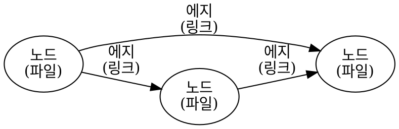
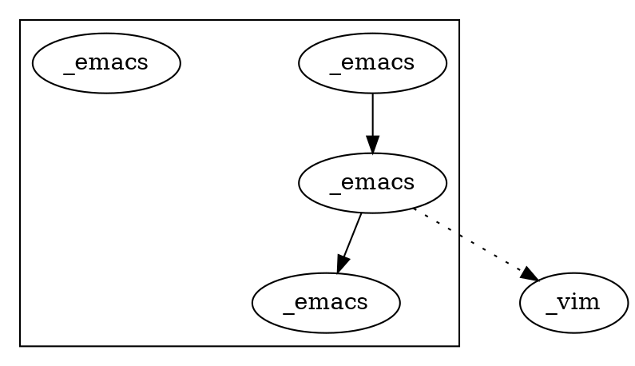
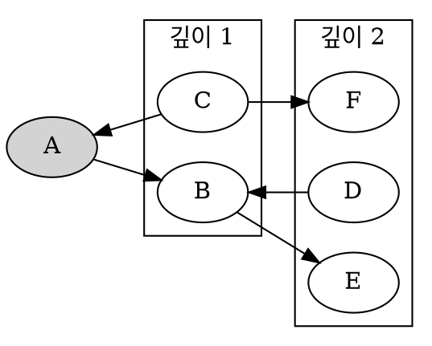
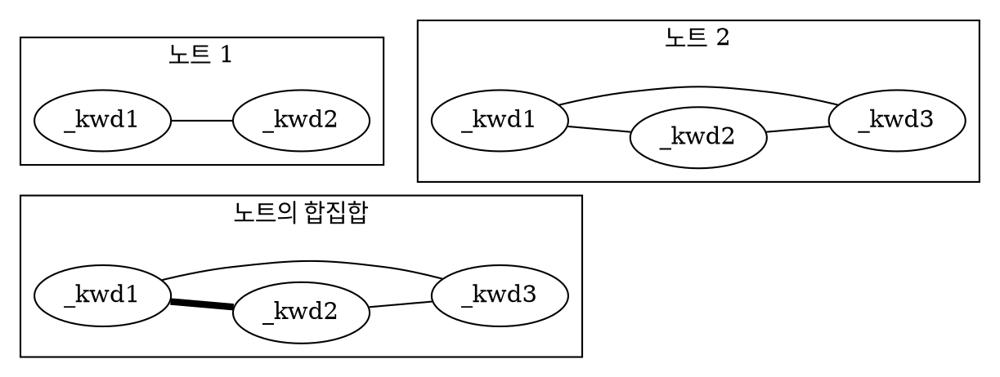

## 변경사항 {#변경사항}

-   [ ] 6장 간단 검토


## 6.1 소개 {#6-dot-1-소개}

문헌, 웹사이트 또는 다른 정보 출처를 읽을 때, 배운 내용을 기록하고 싶을 수 있습니다. 또는 갑작스러운 영감이 떠오를 수도 있습니다. 최근 몇 년 동안 노트 필기는 인기 있는 주제가 되었습니다. 아이디어 시장은 노트를 작성하고 유지하는 방법으로 가득 차 있으며, 모두가 디지털 두뇌나 제텔카스텐(Zettelkasten)을 만들겠다고 약속합니다.

이 장에서는 Org와 Denote 패키지를 사용하여 전자 노트북을 유지하고 디지털 아이디어 정원을 가꾸는 방법을 설명합니다. 이 두 패키지의 조합을 통해 개인 일기, 문헌 검토, 실험실 노트북 또는 기타 용도로 사용할 수 있습니다. 여기서 설명하는 접근 방식은 어떤 방법에도 구애받지 않습니다. Emacs는 원하는 공식 워크플로우를 구현할 수 있을 만큼 유연합니다.

이 장의 첫 번째 부분에서는 Org를 노트 필기 도구로 사용하는 방법을 설명합니다. 단일 파일을 사용하여 생각을 캡처합니다. 나머지 장에서는 Protesilaos (Prot) Stavrou가 만든 Denote 패키지를 설명합니다. 이 패키지는 다양한 텍스트 노트와 기타 파일 유형을 관리하는 데 유연성을 제공하여 개인 워크플로우를 사용하여 상호 연결된 두 번째 뇌를 개발할 수 있습니다.


## <span class="org-todo done REVIEWED">REVIEWED</span> 6.2 노트 필기에 관한 생각들 (Thoughts on taking notes) {#6-dot-2-노트-필기에-관한-생각들--thoughts-on-taking-notes}

글쓰기가 발명되기 전, 우리의 조상들은 암기하여 지식을 공유했습니다. 이러한 선사 시대 문화의 사람들은 노래와 운율을 통해 호메로스의 일리아드, 마하바라타와 같은 대작을 수천 줄이나 암기할 수 있었습니다 (Kelly 2016). 운율을 가진 단어는 평범한 산문보다 기억하기가 훨씬 쉽습니다. 우리는 노래 가사를 몇 시간 동안 완벽하게 기억할 수 있지만, 쇼핑 목록을 외우는 데는 실패합니다. 글쓰기가 보편화되자, 그리스 철학자 소크라테스는 글쓰기가 우리의 기억을 침식시킨다고 한탄했습니다. 소크라테스의 주장은 사실상 맞았을지도 모릅니다 (Kahn 1997).

그러나 글쓰기는 우리의 마음을 사실적 지식의 저장소에서 창조적인 기계로 해방시켰습니다. 글쓰기가 사람들에게 사실에서 벗어나 새로운 아이디어를 창조할 수 있는 뇌력을 사용하게 하면서 인류의 발전이 가속화되었습니다. 생산성 전문가 데이비드 앨런(David Allen)은 "마음은 아이디어를 가지기 위한 것이지, 아이디어를 보유하기 위한 것이 아니다"라고 간결하게 표현했습니다 (Allen 2005). 철학자들은 앨런의 직관을 '확장된 마음 논제'라고 부르며, 이는 마음이 신체에만 국한되지 않고 물리적 세계로 확장된다고 제안합니다 (Clark and Chalmers 1998), 이로 인해 두 번째 뇌의 개념이 생겨났습니다.

인간의 기억의 취약성을 확장하기 위해 노트를 필기하는 것은 글쓰기 자체와 동일하게 오래된 행위입니다. 1970년대 이후로 인류는 종이에 단어를 쓰는 것에서 전기 저장 장치에 보관하는 것으로 전환했습니다. 최근 몇 년 동안 노트를 유지할 필요성은 개인 지식 관리 문제를 해결하기 위해 특정 방법을 따르라고 주장하는 블로그, 책, 유튜브 채널 및 전자 노트 필기 애플리케이션의 작은 산업을 낳았습니다. 루만의 _Zettelkasten_, 캐럴의 _Bullet Journal_, 포르테의 _Second Brain_ 등 모두가 지정된 방법을 따름으로써 개인 지식 관리 문제를 해결하겠다고 주장합니다 (Forte 2022; Kadavy 2021; Ryder 2021).

이러한 엄격한 워크플로우는 필연적으로 실패로 이어집니다. 왜냐하면 모든 사람이 다른 필요를 가지고 있기 때문입니다. 창의적으로 노트를 필기할 때, 공식적인 워크플로우는 그리 중요하지 않습니다. 노트의 컬렉션이 확장됨에 따라 방법론이 유기적으로 나타납니다. 따라서 온라인에서 홍보되는 어떤 방법에 대해 걱정하기보다는 쓰기를 시작하고 자신에게 가장 잘 맞는 프로세스를 만들어야 합니다.

최고의 노트 필기 방법은 스스로 발명하고 점차적으로 복잡해지는 것입니다. 전자 두뇌가 자동으로 성공으로 이어지지 않습니다. 당신의 유기적 뇌가 두 번째 뇌를 지배해야지, 그 반대가 되어서는 안 됩니다 (Stavrou 2024).

종이와 디지털 저널을 30년 동안 사용하면서, 구조는 중요한 한 측면일 뿐이라는 것을 배웠습니다. 진정으로 중요한 것은 기록된 생각의 진정성과 독창성입니다. 제텔카스텐 방법의 창조자인 루만조차도 자신의 시스템을 "아이디어의 정화조(septic tank)"라고 보았습니다 (ZK II Zettel 9/8a2 `niklas-luhmann-archiv.de`).

Emacs를 사용하여 노트를 필기하거나 다른 텍스트 프로세서를 사용하는 것은 제한이 있습니다. 제 개인적인 아이디어 생성 과정은 물리적 노트북에서 시작됩니다. Emacs의 전자적 장점을 찬양하는 사람으로서 이것을 인정하는 것은 이상한 일일 수 있습니다. 물리적 노트북은 창의적 과정에서 몇 가지 이점이 있습니다. 첫째, 배터리가 필요 없고, 태양빛 아래에서도 사용할 수 있습니다. 유일한 예외는 우리가 최고의 아이디어를 얻는 샤워실일 것입니다. 노트북에 손으로 쓰는 것은 키보드를 사용하는 것보다 느린 과정이지만, 펜을 사용하면 더 깊이 생각하게 만듭니다. 종이에 쓰는 것은 전자적으로 쓰는 것보다 더 깊은 신경 경로를 자극하여 창의성을 향상시킵니다 (Mueller and Oppenheimer 2014; Umejima et al. 2021). 종이에 쓰는 것은 또한 텍스트와 그래픽을 결합하기 쉽게 만듭니다. 낙서와 스케치는 지식을 개념화하는 예술적인 방법이며, Emacs와 같은 텍스트 프로세서가 제공할 수 없는 것입니다.

텍스트 노트의 단점을 제쳐두고, 전자 노트는 분명히 사용이 있습니다. 노트북의 아이디어가 발아되면, 일부는 내 Emacs 파일 시스템에 자리를 잡습니다. 내 워크플로우에는 노트북의 스케치 스캔, 사진, 비디오 및 이메일로 받은 전자 파일도 포함됩니다. 모든 파일은 정보를 쉽게 찾고 새로운 아이디어를 발아시킬 수 있도록 체계적으로 저장됩니다. 이 워크플로우는 종이 작업의 유연성을 받아들이고 전자 정보의 힘을 활용합니다.

노트 필기의 실질적인 현실은 두 가지 범주로 구분할 수 있다는 것입니다: 일시적인 노트와 영구적인 노트 (Ahrens 2017). 일시적인 노트는 냅킨이나 손등에 적는 것입니다. 대부분의 일시적인 노트는 짧은 수명을 가지지만, 일부는 영구적인 상태로 승격됩니다. 이름에서 알 수 있듯이, 영구적인 노트는 영원히 유지하고 싶은 정보입니다. 당신의 영구적인 노트는 개인 위키, 두 번째 뇌, 제텔카스텐, 디지털 정원 또는 선호하는 신조어가 됩니다.


## <span class="org-todo todo EDITED">EDITED</span> 6.3 일시적인 노트(Fleeting notes) {#sec-fleeting}

일시적인 노트는 마음을 스쳐 지나가는 예상치 못한 아이디어를 캡처합니다. 갑작스러운 통찰, 영화 속 대사, 해야 할 일 목록의 리마인더 또는 다른 어떤 것일 수 있습니다. 이러한 일시적인 노트는 생각을 잠시 저장하는 장소입니다. 미래의 프로젝트를 위한 아이디어, 완료해야 할 작업, 나중에 다시 볼 만한 흥미로운 것일 수 있습니다. 이러한 아이디어가 사라지지 않도록 하기 위해 간편한 캡처 시스템, 예를 들어 신뢰할 수 있는 종이 노트북, 전화 앱, 또는 심지어 손등을 사용하는 것이 중요합니다.

Emacs를 사용하는 동안에도 일시적인 노트를 필기할 필요가 있습니다. 이를 위해 Org의 캡처 기능을 활용할 수 있습니다. 책을 쓰고 있는데 갑자기 우유를 사야 한다는 생각이 떠오르면, Org의 캡처 기능을 사용하여 몇 번의 키 입력으로 이 일시적인 생각을 캡처하고, 나중에 검토하기 위해 저장할 수 있습니다.

Org의 캡처 기능으로 일시적인 노트를 캡처하는 것은 간단 합니다. `C-c c` (`org-capture`)를 누르면 선택 화면이 나타납니다. '일시적인 노트'를 선택하고 `f`를 누르면, 팝업 버퍼에 생각을 작성하고 `C-c C-c`를 눌러 'Notes' 제목 아래에 목록 항목으로 저장합니다. 캡처 시스템은 연속적인 일시적인 노트를 이전 항목 아래에 추가합니다. 저장할 가치가 없다고 판단되면 `C-c C-k`를 눌러 입력 취소할 수 있습니다. 작업이 끝나면 Emacs는 중단 없이 원래 작업으로 돌아가서 계속 진행할 수 있습니다. 캡처 메뉴에는 또한 할 일 목록에 항목을 추가하는 옵션이 있으며, 이는 동일한 파일의 다른 제목 아래에 저장됩니다. [BROKEN LINK: chap-admin] 장에서는 프로젝트와 작업 목록 관리에 대해 논의합니다.

`org-default-notes-file` 변수는 인박스 파일의 이름과 위치를 정의합니다. 기본적으로 이 변수는 `~/.notes`입니다. 점(.)은 이 파일이 숨김 파일임을 나타냅니다. 이 변수를 사용자 정의하여 선호하는 인박스 파일 이름을 설정할 수 있습니다. 캡처 메커니즘을 처음 사용할 때 이 파일이 자동으로 생성됩니다. 물론 캡처 시스템 외부에서 이 파일에 다른 정보를 직접 추가할 수도 있습니다.

일시적인 노트를 더 많이 만들수록 인박스는 무작위한 생각으로 점점 채워집니다. 인박스를 가능한 한 비워두기 위해 주간 검토를 하는 것이 좋은 습관입니다. 이 검토는 유망한 생각을 영구적인 노트로 전환하거나 만료된 후 폐기하는 것을 포함합니다. 이상적으로는 인박스가 0으로 향해야 하며, [BROKEN LINK: chap-admin] 장에서 논의한 바와 같이 인박스는 0으로 향해야 합니다. `org-capture` 명령에 유니버설 인수를 사용하면 (`C-u C-c c`) 선택한 템플릿의 파일로 점프할 수 있습니다. 더블 유니버설 인수를 사용하면 가장 최근에 캡처된 항목으로 점프합니다 (`C-u C-u C-c c`). 캡처 시스템을 통해 정보를 추가하면 북마크가 생성되어 `bookmark-jump` (`C-x r b`)를 사용하여 최근 노트를 찾을 수 있습니다.

캡처 기능은 다양한 노트에 대한 템플릿을 만들 수 있는 다목적 시스템입니다. EWS는 두 가지 유형의 일시적인 노트만 정의하지만, 이 시스템을 사용자 정의하여 맞춤형 캡처 템플릿을 추가할 수 있습니다. 예를 들어, 별도의 항목으로 쇼핑 목록을 만들고 이를 전화와 동기화할 수 있습니다. `org-capture-templates` 변수의 사용자 정의 화면을 `C-c c C`로 열 수 있으며, 여기에는 다양한 캡처 옵션을 설명하는 상세한 도움말 파일이 포함되어 있습니다. Org 매뉴얼 (`C-h R org <ret> g capture`)에서는 캡처 템플릿 개발에 대해 자세히 논의합니다.


## <span class="org-todo todo EDITED">EDITED</span> 6.4 영구적인 노트 {#sec-permanent-notes}

영구적인 노트는 구조화하고 검색하여 새로운 통찰을 창출할 수 있는 외부 전자 저장소입니다. 전자 노트 컬렉션을 시작할 때 어떤 방법을 사용할지 너무 걱정하지 마세요. 단일 파일을 만들고 그냥 쓰기 시작하세요. 필요에 따라 이상적인 워크플로우가 자연스럽게 나타날 것입니다. 좋은 노트를 쓰는 열쇠는 두 번째 뇌에 대해 너무 걱정하지 않는 것입니다. 왜냐하면 창조적 과정에서 첫 번째 뇌가 훨씬 더 중요하기 때문입니다 (Stavrou 2024). 두 번째 뇌는 당신의 노트 필기 시스템에서 아이디어의 원시 수프에서 자연스럽게 나타날 것입니다.

시작하려면 Org 파일을 만들고 적절한 제목을 지정한 다음 쓰기 시작하세요. 각 노트에 설명적인 제목을 사용하세요. 또한 카테고리로 사용할 수 있는 레벨 1 제목을 사용하여 노트를 그룹화할 수 있습니다.

노트를 작성한 시간을 기록하려면 `org-time-stamp` 함수를 사용하세요. 이 함수를 `C-c .` (컨트롤과 마침표)로 호출하면 날짜가 추가되고, 유니버설 인수와 함께 호출하면 시간도 포함됩니다 (`C-u C-c .`). 철학 카테고리 아래의 노트는 다음과 같이 보일 수 있습니다:

```text
 #+title: Notes

 * Philosophy
 * Socrates against writing
    <2024-04-20 Sat>
    In the Phaedrus, ...
```

Org는 단일 파일에서 대규모 노트 컬렉션을 관리하는 데 도움이 됩니다. 파일을 열 때 목차를 보려면 `#+startup: content`를 앞머리에 추가하세요. 이 키워드를 사용하면 파일을 처음 열 때 Org는 제목만 표시합니다. Org의 `S-<tab>` 키를 사용하여 제목을 접고 펼 수 있으므로 중요한 것에 집중할 수 있습니다. 다른 시작 옵션으로는 `overview`가 있으며, 이는 첫 번째 레벨만 표시하고, `showall`은 전체 문서를 펼칩니다. 기본 옵션은 `showeverything`으로, 문서의 어떤 부분도 숨기지 않습니다.

대형 파일 내에서 집중을 유지하는 또 다른 방법은 현재 작업 중인 섹션만 표시하도록 버퍼를 좁히는 것입니다. `C-x n` 접두사는 좁히기 기능으로 이동합니다. `org-narrow-to-subtree` 함수 (`C-x n s`)는 현재 버퍼를 커서가 있는 서브트리만 표시하도록 좁힙니다. 다른 텍스트는 지워지는 것이 아니라 단지 숨겨집니다. 전체 버퍼로 되돌리려면 `widen` 명령을 사용하세요, `C-x n w`에 바인딩되어 있습니다. 좁히기 기능에는 몇 가지 다른 옵션이 있으며, 접두사 키를 호출하면 팝업 메뉴를 통해 탐색할 수 있습니다.

문서의 관련 부분에 집중하는 또 다른 방법은 `org-occur` 함수로 희소 트리를 구성하는 것입니다. `C-c / /`로 호출됩니다. 희소 트리는 검색 기준에 따라 필터링된 뷰를 제공하며, 관련 텍스트를 강조하고 관련 없는 내용을 숨깁니다. 검색 기준을 입력한 후 Org는 요청된 단어를 강조하고 검색어가 발생하는 섹션만 표시합니다. 두 개의 단축키를 사용하여 일치 항목 간에 이동할 수 있습니다: `M-g n`은 다음 일치 항목으로 이동하고, `M-g p`는 이전 일치 항목으로 이동합니다. 편집 명령 또는 `C-c C-c`를 사용하면 검색을 종료합니다. 희소 트리와 일반 검색 기능(section [BROKEN LINK: sec-search])의 주요 차이점은 희소 트리가 문서를 접어서 검색어가 발생하는 부분만 표시한다는 것입니다.

각 제목에 태그를 추가하여 아이디어를 서로 연결할 수도 있습니다. 태그는 제목을 분류하기 위한 레이블입니다. 태그는 제목 텍스트 뒤에 콜론으로 중첩됩니다. 태그는 상속 속성으로, 레벨 1 제목에 있는 태그는 관련 서브헤딩에도 속합니다. 아래 예에서 철학 제목 아래의 모든 서브헤딩은 `:philosophy:` 태그를 상속합니다. 소크라테스에 대한 노트 아래의 모든 서브헤딩은 `:philosophy:`과 `:writing:` 태그를 모두 상속합니다. 하나의 제목에 여러 태그를 추가할 수 있어 아이디어를 상세하게 분류할 수 있습니다.

```text
#+title: Notes
* Philosophy                         :philosophy:
* Socrates against writing          :writing:socrates:
    <2024-04-20 Sat>
    In the Phaedrus, ...
```

노트에 태그를 추가하려면 `C-c C-q` (`org-set-tags-command`)를 사용하세요. 미니버퍼에 새 태그의 이름을 입력하세요. 문서에서 이미 사용된 태그는 미니버퍼 완성 목록에 표시됩니다. 또한 파일마다 라이브러리를 설정할 수 있으며, Org 파일의 앞머리에 다음과 같은 것을 추가할 수 있습니다: `#+tags: philosophy(p) writing(w)`. 괄호 안의 문자는 미니버퍼 메뉴에서 빠른 선택을 위한 단축키가 됩니다. 새 태그를 만들려면 미니버퍼에 자유 텍스트를 입력하면 됩니다. 태그가 있는 파일이 있으면 희소 트리 기능을 사용하여 카테고리별로 노트를 검색할 수 있습니다. 하나 이상의 태그를 선택하여 희소 트리를 만들려면 `org-match-sparse-tree` (`C-c \`)를 사용하세요. 이 함수는 전체 문서를 접고 선택한 태그가 발생하는 부분을 강조합니다.

대형 Org 파일을 이동하는 것은 번거로울 수 있습니다. `org-goto` 명령이 이를 더 쉽게 만듭니다. `C-c C-j`를 누르면 Org는 미니버퍼 완성 메뉴에 모든 제목을 표시하며, 여기서 목적지를 선택할 수 있습니다. Daniel Mendler의 Consult 패키지에는 대형 Org 파일을 이동하는 데 편리한 함수가 포함되어 있습니다. `consult-org-heading` 함수 (`C-c w h`)는 현재 Org 파일의 모든 제목을 미니버퍼에 나열하여 원하는 위치로 이동할 수 있습니다. Consult 패키지는 Emacs 사용을 개선하기 위해 다양한 검색 및 탐색 명령을 제공합니다.

[#sec-org-structure]

Alt와 화살표 키를 사용하여 제목을 구조화할 수 있습니다. section [BROKEN LINK: sec-org-structure]에서 설명합니다. 대형 파일을 관리하는 더 편리한 도구는 `org-refile` 함수로, `C-c C-w`에 바인딩되어 있습니다. 이 명령은 문서 내에서 섹션을 쉽게 이동할 수 있게 해줍니다. 이 함수를 호출하면 문서의 장 목록이 미니버퍼에 나타나며, 커서가 있는 서브트리가 선택한 장으로 이동합니다. refiling 후 관련 항목으로 점프하려면 `C-u C-u C-c C-w` 단축키를 사용하세요 (명령 전에 두 번의 유니버설 인수).

마지막으로, 파일 내의 노트 간에 링크를 만들고 싶을 수도 있습니다. 우리는 이미 section [BROKEN LINK: sec-images]에서 파일 링크를 보았지만, Org 파일 내의 제목에 링크할 수도 있습니다. 가장 쉬운 방법은 `C-c l`을 사용하여 내부 링크를 만들고, 별표 없이 제목의 이름을 입력한 다음 설명을 추가하는 것입니다. 링크는 다음과 같이 보일 것입니다:

```text
[[Heading name][Description]]
```

이 접근 방식의 문제는 제목의 이름이 변경될 수 있거나 철자가 틀릴 수 있다는 것입니다. 존재하지 않는 대상으로 링크를 따를 때 Org 모드는 오류를 발생시키지 않고 새 제목을 만들지 여부를 묻습니다. 링크를 만드는 더 나은 방법은 제목에 고유한 ID를 부여하는 것입니다.

단일 노트 문서 내에서 노트 간에 링크를 삽입하려면 링크하려는 제목으로 커서를 이동하고 `C-c l` (`org-store-link`)를 누르세요. 이 함수는 제목 아래에 서랍을 만듭니다. 서랍은 제목에 대한 메타데이터를 저장할 수 있는 접을 수 있는 텍스트로 구성됩니다. 서랍은 여러 작업에 유용하며, [BROKEN LINK: chap-production] 장에서 더 자세히 논의됩니다. 서랍은 다음과 같이 보일 수 있습니다:

```text
 :PROPERTIES:
 :ID:       d454979b-2d40-4f95-9f85-f5d9314c28d7
 :END:
```

랜덤 문자와 숫자의 문자열은 Universally Unique Identifier(UUI)로, 무작위 ID를 생성합니다. 중복 ID의 가능성은 천문학적으로 작아서 고유하다고 간주할 수 있습니다. 이제 메모리에 이 ID에 대한 링크가 저장되어 있으며, ~org-store-link~로 필요한 곳에 삽입할 수 있습니다. ID에 대한 링크는 다음과 같이 보입니다:

```text
[[id:d454979b-2d40-4f95-9f85-f5d9314c28d7][Example]]
```

하나의 큰 파일을 사용하여 노트를 작성하는 것은 Emacs로 생각을 옮기는 좋은 방법입니다. 그러나 시간이 지나면서 파일이 다루기 힘들어질 수 있으며, 매우 생산적이면 대형 파일이 시스템을 느리게 할 수 있습니다. 다음 섹션에서는 Denote 패키지를 사용하여 상호 연결된 노트의 컬렉션을 만드는 방법을 보여줍니다.


## 6.5 Denote로 노트 작성 {#sec-denote}

대부분의 노트 필기 시스템은 개별 노트를 연결된 파일로 사용하여 아이디어의 네트워크를 만듭니다. Emacs 사용자는 노트를 작성하고 관리하기 위해 다양한 패키지를 개발했습니다. EWS는 Denote 패키지를 사용합니다. 이 패키지는 어떤 방법론이나 워크플로우를 강제하지 않으며, 일반 텍스트로 작성된 노트와 사진, PDF 파일 또는 보관하고 싶은 다른 파일 등 이진 파일을 모두 처리할 수 있습니다.

Denote 패키지는 키워드를 사용하여 파일을 분류합니다. 또한 서명을 추가하여 노트의 의미적 순서를 지정할 수 있는 옵션도 있습니다. 노트는 서로 링크되어 생각의 네트워크를 형성할 수 있습니다. 이 세 가지 메커니즘을 통해 Denote를 사용하여 유기적인 디지털 정원을 만들거나 Zettelkasten, Johnny Decimal, PARA와 같은 정식 시스템을 구현할 수 있습니다.

Denote 패키지의 핵심 동력은 파일 명명 규칙입니다. 이 접근 방식은 파일 이름에 메타데이터를 포함하여 데이터베이스나 다른 외부 종속성 없이도 노트의 정글을 탐색할 수 있게 합니다. Denote의 파일 명명 규칙은 다섯 부분으로 구성되며, 이 중 ID와 파일 확장자는 필수입니다. Denote 파일 명명 규칙은 파일 이름을 제한하지만, 이러한 제한은 예측 가능성과 일관성을 도입하여 노트를 찾기 쉽게 만듭니다. 완전히 형식화된 Denote 파일의 예는 다음과 같습니다:

```text
20210509T082300==9a12--simultaneous-contrast__colour_illusion.org
```

1.  ISO 8601 시간 형식의 고유 식별자(ID)로, 날짜와 시간을 `T`로 구분합니다 (`20210509T082300`).
2.  서명(소문자 문자와 숫자), 이중 등호로 시작합니다 (`==9a12`).
3.  제목은 대시로 구분되며, 이중 대시로 시작합니다 (`--simultaneous-contrast`).
4.  키워드는 밑줄로 구분되며, 이중 밑줄로 시작합니다 (`__colour_illusions`).
5.  파일 확장자 (`.org`).

타임스탬프는 노트를 링크하는 데 사용되는 고유하고 불변의 식별자입니다. 타임스탬프는 노트를 시간순으로 정렬합니다. 서명은 도서관의 책을 정렬하는 Dewey Decimal System과 같이 노트를 정렬할 수 있게 합니다. 키워드 또는 파일 태그는 노트가 속하는 카테고리를 정의합니다. 이 부분은 공통점이 있는 노트를 그룹화할 수 있게 합니다. 서명, 제목 및 태그는 유연하게 변경될 수 있지만, 타임스탬프는 항상 동일해야 하며, 노트 간의 링크 무결성을 유지하기 위해 변경되지 않아야 합니다.

시스템의 무결성을 유지하기 위해 Denote 서명은 문자, 숫자 및 등호만 포함할 수 있습니다. 제목은 문자, 숫자 및 대시만 포함할 수 있습니다. 키워드는 문자와 숫자만 포함할 수 있습니다. Denote는 규칙을 준수하기 위해 파일 이름을 정리(슬러그화)합니다.

Denote는 새 노트를 `denote-directory` 변수가 가리키는 폴더에 저장합니다. 이 변수는 기본적으로 `~/Documents/notes`로 설정되어 있습니다. 필요에 따라 이 변수를 사용자 정의할 수 있습니다.

Denote는 이 주요 위치 내의 하위 디렉토리에 노트를 저장할 수 있지만, 그럴 필요는 없습니다. 하위 디렉토리를 사용하여 파일을 분류할 때, 파일을 다른 위치로 이동하면 해당 파일의 메타데이터가 변경됩니다. 현대 운영 체제는 하나의 디렉토리에서 수만 개의 파일을 쉽게 관리할 수 있으므로 하위 디렉토리를 사용할 필요가 없습니다. 대신 파일 태그를 사용하여 논리적으로 동일한 그룹에 속하는 파일을 쉽게 볼 수 있습니다. 파일 태그는 하위 디렉토리보다 유연하여 각 파일이 여러 태그를 가질 수 있지만, 하나의 디렉토리에만 존재할 수 있습니다.


### 6.5.1 새 노트 생성 {#6-dot-5-dot-1-새-노트-생성}

Denote 기능은 `C-c w d` EWS 접두사 아래에서 사용할 수 있습니다. `denote` 명령은 `C-c w d n`으로 활성화되며, Org 파일로 새 노트를 만듭니다. 먼저 제목을 묻고, 그 다음 관련 키워드를 묻습니다. 미니버퍼 완성 목록에서 기존 노트의 키워드를 선택하거나, 새로운 키워드를 자유 텍스트로 입력할 수 있습니다. 타임스탬프는 노트를 생성하는 날짜와 시간을 자동으로 생성합니다. 또한 Org 캡처 시스템을 사용하여 이 명령을 활성화하고 '영구 노트'를 선택할 수 있습니다 (`C-c c p`).

새 노트를 생성하면 먼저 저장되지 않은 버퍼로 열립니다. 디스크에 영구적으로 저장하려면 `C-x C-s`로 저장해야 합니다. Org 캡처 메커니즘을 사용하여 영구 노트를 생성하면 캡처 팝업 화면에서 `C-c C-c`로 종료할 때 노트가 저장됩니다. 일부 기능은 노트를 디스크에 저장하지 않으면 작동하지 않을 수 있으므로, "Buffer not visiting a Denote file" 경고가 표시되면 먼저 버퍼를 저장해야 할 수도 있습니다.

기본 EWS 설정에서는 새 노트를 생성할 때 서명이나 하위 디렉토리가 필요하지 않습니다. `denote-prompts` 변수를 사용자 정의하여 새 노트를 생성하거나 이름을 변경할 때 기본적으로 포함할 항목을 선택할 수 있습니다.

날짜와 식별자는 파일의 헤더에도 포함됩니다. 키워드는 파일 태그가 되며, 이는 이전 섹션에서 본 태그와 동일하지만 전체 파일에 적용됩니다. 이제 버퍼에 관련 내용을 채우고 디스크에 저장하기만 하면 됩니다. 위의 예제에서 노트의 앞머리는 다음과 같이 보일 것입니다:

```text
 #+title:      Simultaneous Contrast
 #+date:       [2021-05-09 Sun 08:23]
 #+filetags:   :colour:illusions:
 #+identifier: 20210509T082300
```

이 워크플로우는 일반적인 노트에 적용됩니다. 그러나 모든 영구 노트가 동일하게 생성되는 것은 아닙니다. 노트의 목적에 따라 Denote 내에서 관련 워크플로우가 달라집니다. 넓게 말해서, 우리는 네 가지 유형의 노트를 구분할 수 있습니다:

1.  _일지 항목_: 특정 시간과 관련된 경험.
2.  _문헌 노트_: 출판물에 대한 노트.
3.  _첨부 파일_: 사진이나 PDF 파일과 같은 읽기 전용 노트.
4.  _메타 노트_: 검색 기준에 맞는 모든 노트에 대한 링크를 포함하는 노트.


### 6.5.2 일지 또는 일기 작성 {#6-dot-5-dot-2-일지-또는-일기-작성}

Denote를 사용하여 개인적인 반성, 일기, 실험실 로그북, 회의 노트 또는 특정 이벤트와 관련된 노트를 작성할 수 있습니다. Denote로 일기를 작성하는 것은 쉽습니다. 왜냐하면 각 노트의 식별자가 생성된 날짜와 시간을 나타내기 때문입니다. 예를 들어, `_journal`과 같은 표준 태그를 추가하면 일지 항목을 다른 노트와 쉽게 구분할 수 있습니다.

과거의 항목에 대한 노트를 생성하려면 `denote-date` 함수 (`C-c w d d`)를 사용하세요. Year-Month-Day (ISO 8601) 표기법으로 날짜를 입력하세요, 예를 들어 `2023-09-06`. 선택적으로 24시간 표기법으로 특정 시간을 추가할 수도 있습니다, 예를 들어 `2023-09-6 20:30`. 날짜와/또는 시간을 제공하지 않으면 현재 날짜 또는 시간을 사용합니다.

Denote는 특별한 일지 작성 기능도 포함하고 있으며, 패키지 매뉴얼에서 읽을 수 있습니다 (`C-h R denote <ret> g jour`).


### 6.5.3 문헌 노트 {#sec-citar-denote}

-   [X] 문헌 노트 작성
-   [X] citar-denote
-   [-] [How I Manage My Reading List with Org-Mode · Adha's Notes](https://benadha.com/notes/how-i-manage-my-reading-list-with-org-mode/) (고급 Org 모드)

문헌 노트 또는 서지 노트는 읽은 문헌에 대한 요약이나 해석을 포함합니다. 서지 노트는 당신의 서지에 있는 하나 이상의 출판물에 링크된 특별한 영구 노트 카테고리입니다. Citar-Denote 패키지는 Citar 서지 패키지를 Denote 노트 필기 시스템과 통합합니다. 이 패키지는 문헌 노트를 생성하고 관리하는 확장 기능을 제공합니다. [BROKEN LINK: chap-inspiration] 장을 참조하여 서지와 Citar를 사용하는 방법을 알아보세요.

Citar-Denote는 노트와 서지 항목 간의 다대다 관계를 허용하여 문헌 노트를 문서화하는 완전한 솔루션을 제공합니다. 즉, 하나의 서지 항목에 대해 여러 노트를 작성하거나 여러 문헌에 대한 단일 문헌 리뷰 노트를 작성할 수 있습니다.

Citar-Denote는 서지에 있는 항목을 참조로 사용하여 노트를 서지에 연결합니다. 각 서지 노트는 `_bib` 파일 태그로 표시됩니다. 시스템이 추적해야 할 파일 수를 줄이기 위해, 서지 노트의 앞머리는 다음과 같이 보일 수 있습니다:

```text
  #+title:      Marcuse: An Essay on Liberation
  #+date:       [2022-11-12 Sat 19:23]
  #+filetags:   :bib:culture:marketing:philosophy:
  #+identifier: 20221112T192310
  #+reference:  marcuse_1969_essay
```

새 노트를 만들려면 Citar 인터페이스를 `C-c w b c` (`citar-create-note`)로 열고, 노트를 작성할 항목을 선택하고 Enter를 누른 다음 프롬프트를 따르세요. 해당 항목에 대한 노트가 이미 존재하는 경우 추가 노트를 생성할 수 있습니다.

일단 몇 가지 서지 노트를 수집하면, 이를 접근하고 수정하고 싶어질 것입니다. Citar 메뉴에서 `C-c w b o` (`citar-open`)로 첨부 파일, 링크 및 다른 노트에 접근할 수 있습니다. 이 메뉴에서 추가 노트를 생성할 수도 있습니다.

노트가 있는 항목은 세 번째 열에 `N`으로 표시됩니다. 노트가 있는 항목만 표시하려면 검색을 `:n`으로 시작하거나 `citar-denote-open-note` (`C-c w b n`)를 사용하여 노트가 있는 항목만 포함된 Citar 메뉴를 열 수 있습니다.

서지 노트 내에서 현재 버퍼를 관리하는 여러 함수가 있습니다. `citar-denote-dwim` 함수 (`C-c w b d`)는 이 노트에서 참조된 문헌에 대한 Citar 메뉴에 접근할 수 있게 하며, 여기서 첨부 파일, 다른 노트 및 링크를 열 수 있습니다.

`citar-denote-add-citekey` 함수 (`C-c w b k`)는 인용 키를 추가하거나 기존 Denote 파일을 서지 노트로 변환합니다. 일반적인 Denote 파일을 변환할 때, 이 함수는 앞머리에 `bib` 키워드를 추가하고 파일 이름을 그에 따라 변경합니다. 이 함수는 Citar 선택 메뉴를 열고 선택한 인용 키를 앞머리에 추가합니다. 인용 참조를 제거하려면 `citar-denote-remove-citekey` 명령 (`C-c w b K`)을 사용하세요. 하나 이상의 출판물이 참조된 경우, 먼저 삭제할 항목을 미니버퍼에서 선택하세요. 노트가 하나의 참조만 가지고 있으면 서지 키워드가 제거되고 파일 이름이 변경되어 일반적인 영구 노트로 변환됩니다.

서지 없이 빌드하는 것은 의미가 없습니다. `citar-denote-nocite` (`C-c w b x`) 함수는 인용되거나 참조되지 않은 서지의 모든 항목을 보여주는 Citar 메뉴를 엽니다. 여기서 새 서지 노트를 생성하거나 링크를 따르거나 파일을 읽을 수 있습니다.

Citar-Denote 패키지의 추가 기능에 대해 자세히 알아보려면 `C-h R citar-denote`로 매뉴얼을 읽으세요.


### 6.5.4 첨부 파일 {#sec-attachments}

당신의 디지털 노트 정원은 단순한 텍스트보다 훨씬 더 많은 것을 포함할 수 있습니다. Denote를 첨부 파일과 함께 사용하면 사진을 관리하고 PDF 파일의 아카이브를 저장할 수 있습니다. Denote에 첨부 파일을 추가하면 문서를 쉽게 찾고 노트에 링크할 수 있는 개인 지식 관리 시스템으로 변환됩니다.

첨부 파일을 사용하는 다양한 사용 사례가 있습니다. 개인적으로 사진과 비디오를 Denote 파일 형식으로 저장합니다. 또한 PDF 파일, 예를 들어 스캔된 종이 문서나 받은 파일, 예를 들어 청구서를 이 형식으로 저장합니다. 또한 Denote 파일 내에서 개별 첨부 파일에 링크할 수도 있지만, 첨부 파일에서 노트로의 링크는 불가능합니다. 왜냐하면 이러한 파일은 노트가 아니기 때문입니다.

Denote는 생성할 수 있는 세 가지 일반 텍스트 유형(일반 텍스트, 마크다운 또는 Org) 외에도 파일 이름에 메타데이터를 포함하여 다른 파일을 관리할 수 있습니다. 첨부 파일은 Denote 디렉토리에 저장된 호환 파일 이름을 가진 파일입니다.

첨부 파일을 Denote에 등록하는 첫 번째 단계는 호환되는 이름을 가졌는지 확인하는 것입니다. `denote-rename-file` (`C-c w d r`) 함수로 파일을 열고 수동으로 이름을 변경할 수 있습니다. 이 함수는 파일 이름을 기본 제목으로 사용하며, 필요에 따라 수정하고 관련 키워드를 추가할 수 있습니다. 파일의 마지막 수정 타임스탬프는 식별자로 사용됩니다.

그러나 파일 시스템의 생성 날짜는 항상 실제 생성 날짜와 일치하지 않습니다. 첨부 파일을 작업할 때, 다음 세 가지 옵션이 유효한 타임스탬프입니다:

-   종이 문서가 디지털화된 날짜
-   전자 파일이 처음 생성된 날짜
-   전자 파일이 파일 시스템에 생성된 날짜 (Denote 기본값)

첫 번째 시나리오는 주로 역사적 문서와 관련이 있습니다. 수년에 걸쳐 종이 아카이브를 디지털화해왔습니다. Denote 라이브러리에서 가장 오래된 식별자 타임스탬프는 `13700623T120000`으로, 제 출생지의 모기지를 보유한 중세 문서의 스캔입니다. 이 문서의 원본 생성 날짜(스캔된 날짜)는 2021년이고, 파일 시스템의 날짜는 2023년의 어느 시점입니다. Denote 이름 변경 함수는 파일 시스템 날짜를 사용하므로, 이는 이상적이지 않습니다. 이 문서는 수동으로 타임스탬프를 입력하여 문서를 먼 과거에 배치해야 합니다.

두 번째 시나리오는 주로 사진과 관련이 있습니다. 파일 시스템의 타임스탬프는 사진이 찍힌 시간과 다를 수 있으므로, 사진이 언제 찍혔는지 알아야 합니다. 최근 사진의 경우, 파일의 메타데이터에서 생성 날짜를 추출할 수 있습니다. ExifTool과 같은 여러 도구를 사용하여 사진과 PDF 파일의 메타데이터를 추출할 수 있습니다.

[BROKEN LINK: sec-dired] 섹션에서는 파일 관리에 대한 자세한 설명을 포함하여 특별한 패키지와 Denote를 사용하여 사진 컬렉션을 관리하는 방법을 설명합니다.


### 6.5.5 메타 노트 {#sec-meta}

메타 노트는 유사한 주제에 대한 다른 노트로의 게이트웨이 역할을 합니다. 메타 노트는 관련 노트에 대한 링크를 포함하거나 특정 주제에 대한 다른 노트의 내용을 포함할 수 있습니다. 동적 블록은 Org의 다재다능한 기능으로, Denote 컬렉션이 진화함에 따라 동적으로 업데이트될 수 있는 텍스트 섹션입니다. 메타 노트는 동적 블록을 사용하여 특정 카테고리의 모든 노트를 나열하거나 서명에 맞는 노트의 순서 목록을 포함하거나 심지어 다른 노트의 텍스트를 포함할 수 있습니다.

예를 들어, 고대 그리스 철학자 소크라테스에게 말했던 _Daimonion_ (예언적 감시자)에 대한 논문을 작성하는 프로젝트를 진행 중이라고 가정해보겠습니다. 문헌을 읽고 `_daimonion` 키워드를 사용하는 여러 영구 및 서지 노트를 작성합니다. 생각을 통합된 뷰로 모으기 위해, 관련 노트에 대한 링크를 포함하는 메타 노트를 만들 수 있습니다.

`org-dynamic-block-insert-dblock` 함수 `(C-c C-x x`)를 사용하여 사용 가능한 동적 블록의 선택 목록을 보고 `denote-links`를 선택하세요. 다음으로, 나열하고자 하는 노트와 일치하는 정규 표현식을 제공하세요 (이 경우 `_daimonion`). 정규 표현식은 파일 이름에서 와일드카드를 사용하는 것과 유사하지만 훨씬 더 큰 힘을 가진 고급 검색 용어입니다. Denote는 이 검색 기준에 맞는 노트를 나열하는 블록을 노트에 삽입합니다.

```text
 #+BEGIN: denote-links :regexp "_daimonion"
 - Plato: Apology
 - Socrates and Plato
 - Plato: Crito
 #+END:
```

이 접근 방식은 정규 표현식의 마법을 통해 특정 달의 일지 노트를 집계할 수도 있습니다. 예를 들어, 정규 표현식 `^202309.*_journal`는 2023년 9월의 모든 일지 항목을 나열합니다. 이 정규 표현식은 파일 이름이 `202309`로 시작하고 `_journal` 키워드를 포함하는 파일을 나열합니다. 틸드 (`^`)는 파일 이름의 시작 부분에서 검색을 나타냅니다. 중간에 있는 `.*`는 어떤 문자(`.`)가 여러 번 나타날 수 있음을 나타냅니다 (`*`). 정규 표현식은 검색에 강력한 도구이지만, 이 책의 범위를 벗어나는 상세한 논의입니다.

노트 컬렉션이 변경됨에 따라 동적 블록을 업데이트해야 합니다. `org-dblock-update` 명령 (`C-c C-x C-u`)은 최신 정보를 기반으로 링크 목록을 다시 생성합니다. 유니버설 인수를 추가하면 현재 버퍼의 모든 동적 블록을 업데이트합니다 (`C-u C-c C-x C-u`).

Denote에서 사용할 수 있는 다른 동적 블록 유형은 노트에 대한 백링크를 나열하거나 다른 노트의 텍스트를 포함하는 것입니다. `denote-missing-links` 동적 블록은 정규 표현식과 일치하지만 버퍼의 나머지 부분에 나열되지 않은 파일에 대한 링크 목록을 삽입합니다. 백링크를 포함하는 또 다른 동적 블록은 `denote-backlinks`로, 현재 버퍼에 링크된 모든 노트를 나열합니다.

링크가 있는 동적 블록은 정보를 표시하는 방법을 정의하는 네 가지 매개변수를 포함할 수 있습니다. 첫 번째 매개변수는 필수이며, 나머지는 선택 사항입니다:

-   `regexp`: 찾고자 하는 파일의 정규 표현식.
-   `sort-by-component`: 제목, 키워드 또는 서명에 따라 목록을 정렬합니다. 기본값은 식별자로 정렬하는 것입니다.
-   `reverse-sort`: `t`로 설정하면 목록의 순서를 반대로 합니다.
-   `id-only`: `t`로 설정하면 설명이 아닌 식별자만 표시합니다.

마지막 유형의 Denote 동적 블록은 다른 노트의 내용을 메타 노트에 포함할 수 있는 트랜스클루전을 활성화합니다. 여러 작은 인용문이나 생각이 있는 노트가 많을 때 이를 한 화면에서 볼 수 있도록 하는 데 유용합니다. `denote-files` 동적 블록은 다른 버전과 유사하게 작동하지만 몇 가지 추가 매개변수를 가지고 있습니다.

-   `no-front-matter`: `t`로 설정하면 파일의 앞머리를 제외합니다.
-   `file-separator`: `t`로 설정하면 연속된 파일 사이에 구분자를 추가합니다.
-   `add-links`: `t`로 설정하면 각 파일 링크를 시작 부분에 추가합니다.


### 6.5.6 노트 연결 {#6-dot-5-dot-6-노트-연결}

Denote 서명과 키워드는 아이디어를 정렬하고 분류하는 독특한 방법을 제공합니다. 또한 Org는 노트를 개인 위키로 만들어 아이디어를 상호 연결할 수 있습니다. '개인 위키'라는 용어는 모순처럼 보일 수 있지만, 위키는 협업 작성 도구이기 때문입니다. 그러나 노트를 연결하면 아이디어의 상호 연결된 웹을 만들 수 있습니다.

Org는 다양한 링크 시스템을 갖추고 있습니다. 이전 장에서는 외부 및 내부 소스에 대한 하이퍼링크 추가 방법을 탐구했습니다 (섹션 [BROKEN LINK: sec-links] 및 [BROKEN LINK: sec-rss]). 다른 문서에 링크를 추가하면 노트에 추가적인 구조를 제공하지만, 이 방법에는 문제가 있습니다. 왜냐하면 대상 파일의 이름이나 위치가 변경되면 링크가 끊어질 수 있기 때문입니다.

Denote는 Org의 기능을 향상시켜 노트 간에 안정적인 링크를 만듭니다. Denote 링크는 대상 파일의 식별자만 저장하므로 서명, 이름 및 키워드가 자유롭게 변경될 수 있으며, 링크가 끊어질 위험이 없습니다.

`denote-link-or-create` 함수 (`C-c w d i`)를 사용하여 노트와 첨부 파일을 링크할 수 있습니다. 이 명령은 미니버퍼 완성 시스템을 사용하여 사용 가능한 모든 노트를 나열하며, 여기서 대상을 선택하고 Enter를 누릅니다. 링크의 라벨을 수정하려면 커서가 링크에 있을 때 `C-c C-l` (`org-insert-link`)을 누르고 프롬프트를 따르세요. Denote 링크의 소스는 다음과 같이 보입니다:

```text
[[denote:20210208T150244][Description]]
```

존재하지 않는 노트의 이름을 입력하면 Denote는 새 노트를 생성하고 그에 링크할 수 있게 합니다. Denote 링크는 EWS에서 이탤릭체로 표시되어 다른 자원, 예를 들어 웹사이트에 대한 링크와 구분됩니다.

Denote는 다른 Org 노트 내의 제목에 대한 링크도 생성할 수 있습니다. `denote-org-extras-link-to-heading` 함수 (`C-c w d h`)는 링크할 Org 파일을 묻고, 그 다음 파일 내의 제목 목록을 보여줍니다. 새 링크를 클릭하면 다른 파일 내의 해당 제목으로 직접 이동합니다.

문서를 검색하여 관련 링크를 찾을 필요가 없습니다. `denote-link-find-file` (`C-c w d l`) 함수로 커서를 이동하지 않고도 연결된 노트로 점프할 수 있습니다. 이 함수는 현재 노트에서 링크된 모든 노트를 미니버퍼에 표시하며, 여기서 원하는 노트를 선택할 수 있습니다. 현재 읽고 있는 노트에 링크된 노트를 찾으려면 `denote-find-backlink` 함수 (`C-c w d b`)를 사용하세요.


### 6.5.7 노트 및 첨부 파일 찾기 {#sec-find-notes}

수천 개의 노트와 첨부 파일을 수집할 때, 필요한 정보를 찾거나 아이디어 간의 새로운 연결을 만들기 위한 경로가 필요합니다. 파일을 찾는 가장 간단한 방법은 표준 `find-file` 함수를 사용하는 것입니다. 미니버퍼 완성 시스템이 필요한 파일을 찾는 데 도움을 줍니다.

예를 들어, '경제학'으로 태그된 노트를 필터링하려면 `C-x C-f`를 입력하고, 노트 폴더로 이동한 다음 `_economics`를 입력하세요. 미니버퍼 완성은 사용 가능한 옵션을 좁혀줍니다. 제목에 '경제학'이 포함된 노트를 찾고 싶다면 `-economics`를 사용하세요. 접두사 없이 `economics`를 입력하면 서명, 제목 또는 태그에 검색어가 포함된 모든 게시물을 볼 수 있습니다. 정규 표현식(섹션 [6.5.5 메타 노트](#sec-meta))을 도입하여 검색력을 높일 수도 있습니다. 미니버퍼 완성은 Orderless 패키지를 사용하므로, 공백은 효과적으로 AND 표현으로 작용합니다. 따라서 `^2022 ==9a _art`는 2022로 시작하는 (`^`) 파일 이름과 9a로 시작하는 서명 (`==9a`)을 가지고 `_art` 파일 태그를 가진 모든 노트를 검색합니다.

Colin McLear의 Consult-Notes 패키지는 Denote와 Daniel Mendler의 Consult 패키지의 기능을 병합하여, 노트가 어느 디렉토리에 있는지 기억하지 않고도 노트를 찾을 수 있게 도와줍니다. 이 패키지는 또한 노트의 내용을 검색하는 기능을 제공합니다.

파일 이름의 일부로 노트를 찾으려면 `consult-notes` 함수 (`C-c w d f`)를 사용하세요. Consult 패키지는 검색과 일치하는 파일의 실시간 미리보기를 제공합니다. Denote 디렉토리의 하위 디렉토리에서 검색하려면 검색어를 슬래시로 시작하세요, 예를 들어 `/attachments`. 키워드를 검색하려면 검색어를 해시태그로 시작하세요 (`#keyword`). 일치하는 노트가 없으면 패키지는 새 노트를 생성합니다.

OpenWith 패키지(섹션 [BROKEN LINK: sec-openwith])는 Consult 패키지의 미리보기 기능과 간섭할 수 있습니다. OpenWith에서 구성된 파일 유형은 외부 소프트웨어에서 미리보기되며, 이는 워크플로우를 방해할 수 있습니다. 또한 `consult-preview-excluded-files` 변수를 사용자 정의하여 `openwith-associations` 변수에 언급된 모든 파일 유형을 제외해야 합니다. 파일 확장자만 등록하고 `$` 기호를 추가하면 됩니다. 이는 문자열의 끝을 나타내는 정규 표현식 기호입니다. 예를 들어 "`pdf$`"는 Consult가 PDF 확장자를 가진 파일을 미리보기하지 않도록 지시합니다.

제목, 태그 및 기타 메타데이터를 검색하는 것은 정보에 접근하는 강력한 방법입니다. 그러나 때로는 노트의 내용을 검색해야 할 때도 있습니다. `consult-notes-search-in-all-notes` 함수 (`C-c w d g`)는 깊은 검색을 활성화합니다. 이를 위해 패키지는 시스템에 설치되어야 하는 Grep 소프트웨어를 사용합니다.

검색은 미니버퍼 완성과 마찬가지로 증분적입니다. 검색 기준을 입력하면 결과 목록이 나타납니다. 결과는 파일 이름과 각 파일 내의 일치하는 줄을 보여줍니다. 검색어는 해시태그로 시작하며, 다른 해시태그를 입력하면 결과 내에서 다음 부분을 검색합니다. 예를 들어, `#topology# homotopy`는 "topology"를 포함하는 모든 노트를 찾고, 그 중에서 "homotopy"라는 단어를 포함하는 노트를 좁힙니다.


## 6.6 Denote로 노트 필기 시스템 구현 {#6-dot-6-denote로-노트-필기-시스템-구현}

Denote 패키지는 유연하고 가변적이어서 출간된 어떤 노트 필기 방법론도 구현할 수 있습니다. 이 섹션에서는 인기 있는 몇 가지 방법을 구현하는 방법에 대한 제안을 제공합니다. EWS는 어떤 노트 필기 시스템도 홍보하지 않으며, 이를 구현할 수 있는 방법을 보여줍니다.

'빛나는 물건 증후군'에 주의를 빼앗기지 말고, 최신 아이디어를 쫓기보다는 쓰기에 집중하세요. 이상적인 방법은 당신의 필요에 따라 유기적으로 성장하는 것입니다. Denote 파일 명명 규칙과 정규 표현식은 기본적으로 모든 것을 손쉽게 사용할 수 있게 해줍니다.


### 6.6.1 PARA {#6-dot-6-dot-1-para}

Tiago Forte는 디지털 생활을 조직하기 위해 PARA 방법을 개발했습니다 (Forte 2022). 그의 시스템에서 모든 디지털 자산은 다음 네 가지 폴더 중 하나에 속합니다:

1.  _프로젝트_
2.  _영역_
3.  _자원_
4.  _아카이브_

Forte는 요리 예를 들어 PARA를 설명합니다. /프로젝트/는 요리를 준비하는 데 필요한 냄비와 도구입니다. 이 카테고리의 파일은 현재 작업 중인 결과물에 필요한 자료입니다. /영역/은 냉장고에 저장된 재료와 같습니다. 이는 정기적으로 접근해야 하는 노트입니다. 세 번째 카테고리는 /자원/으로, 이는 냉동실에 저장된 항목과 관련이 있습니다. 이는 관심 있는 주제나 연구 자료입니다. 마지막으로 /아카이브/는 완료된 프로젝트나 보류 중인 프로젝트를 포함하며, 이를 '팬트리'라고 부를 수 있습니다.

이 방법의 핵심은 각 파일이 이 네 가지 카테고리 중 하나에만 속해야 한다는 것입니다. 파일은 자원으로 시작하여 프로젝트가 될 수 있고, 마지막으로 아카이브에서 생을 마칠 수 있습니다. 그의 원래 아이디어에서는 Forte는 각 카테고리의 자료를 저장하기 위해 네 개의 디렉토리를 사용할 것을 제안합니다. Denote에서 이 방법을 구현하려면 각 노트를 네 가지 태그 중 하나와 연관시킬 수 있습니다. 이상적으로는 각 노트가 이 네 가지 카테고리 중 하나에만 속해야 합니다. 예를 들어, _프로젝트_ 카테고리의 모든 노트를 나열하려면 ~consult-notes~를 열고 `#projects`를 검색하세요, 나머지 카테고리도 마찬가지입니다.

EWS는 Denote와 함께 Forte의 PARA 방법을 구현하기 위한 맞춤형 함수를 포함하고 있습니다. `ews-denote-assign-para` 함수는 노트를 네 가지 PARA 카테고리 중 하나로 이동시켜 키워드를 할당합니다. 이미 PARA 키워드가 존재하면 새 버전으로 교체됩니다.

`ews-para-keywords` 변수는 이 방법에서 사용되는 키워드를 포함합니다. 이 변수를 사용자 정의하여 모국어로 번역하거나 다른 독점 카테고리 세트를 사용할 수 있습니다. 예를 들어, Nick Milo의 ACCESS 시스템을 구현하려면 이 변수를 Atlas, Calendar, Cards, Extras, Sources, Spaces 및 Encounters로 변경할 수 있습니다. 이 함수는 폴더에 의존하는 파일 관리 시스템을 Denote 키워드로 대체할 수 있습니다.

폴더 대신 키워드를 사용하는 것을 고집한다면, Denote는 이를 허용합니다. `denote-prompts` 변수를 사용자 정의하여 새 노트를 생성할 때 하위 디렉토리를 묻도록 설정할 수 있습니다.


### 6.6.2 Johnny.Decimal {#6-dot-6-dot-2-johnny-dot-decimal}

_Johnny.Decimal_ 시스템은 파일을 정리하기 위해 번호 매기기 체계를 사용하며, Johnny Noble가 만들었습니다. 기본 아이디어는 디지털 생활을 10개 이하의 넓은 영역으로 나누는 것입니다. 예를 들어, _작업/과 /개인/으로 시작할 수 있습니다. 이러한 주요 카테고리는 디지털 도서관의 가상 서가입니다. 각 서가에는 최대 10개의 상자가 들어갈 수 있습니다. 예를 들어, 우리의 예에서는 /개인_ 서가에 _재정_, _작성_ 및 _여행_ 상자가 있을 수 있습니다.

다음 단계는 각 카테고리에 번호를 지정하는 것입니다. /Johnny.Decimal/은 10--19로 시작합니다. 왜냐하면 낮은 숫자는 시스템 유지 관리에 관련이 있기 때문입니다. 00 폴더는 일반적으로 번호 매기기 시스템을 탐색하는 데 도움이 되는 인덱스를 포함합니다.

우리의 예에서 _개인/은 10--19 서가이고, 상자는 11에서 19까지 번호가 매겨집니다. 예를 들어, /재정_ (11), _작성_ (12), _여행_ (13)이 있습니다. 나머지 7개의 상자에 대한 여유 공간이 있지만, 필요가 생길 때까지 사용하지 마세요. 원래 시스템에서는 번호가 디렉토리 이름의 시작 부분을 형성합니다.

_Johnny.Decimal_ 시스템은 도서관의 Dewey Decimal 시스템과 거의 동일하게 작동하지만, 더 적은 카테고리를 사용합니다. _Johnny.Decimal_ 시스템은 당신의 생활을 설명하고, Dewey Decimal 시스템은 인류의 지식을 설명합니다. 물론, Dewey Decimal 접근 방식을 사용하여 노트를 분류할 수도 있습니다. 선택은 당신에게 달려 있습니다.

Denote 서명을 사용하여 Johnny 또는 Dewey Decimal 또는 다른 순서가 있는 번호 매기기 시스템을 구현할 수 있습니다. Denote는 기본적으로 서명을 사용하지 않으므로 `denote-prompts` 변수를 사용자 정의하고 '서명'을 선택하세요.

예를 들어, EWS에 대한 노트는 `=12=03` 서명을 가질 수 있으며, 이는 _작성_ 상자에 속함을 나타냅니다. 상자 내에서 개별 파일을 번호 매기기 위해 세 번째 수준을 사용할 수도 있습니다. 따라서 _작성_ 상자에 있는 파일은 `12=03=01`, `12=03=02` 등으로 번호가 매겨질 수 있습니다. 이 상자 내의 모든 파일을 나열하기 위해 메타 노트(섹션 [6.5.5 메타 노트](#sec-meta))를 사용할 수 있습니다. `sort-by-component`를 `signature`로 변경하여 목록의 링크를 정렬합니다. 이 정렬 지시가 없으면 노트는 ID로 정렬됩니다.

```text
 +BEGIN: denote-links :regexp "==12=03" :sort-by-component signature
 - 12=03=01 ews purpose
 - 12=03=02 zettelkasten
  - ... etc.
 +END:
```


### 6.6.3 제텔카스텐 {#6-dot-6-dot-3-제텔카스텐}

많은 사람들이 Niklas Luhmann의 제텔카스텐 개념을 들었을 때 노트 필기에 매료됩니다. 제텔카스텐은 독일어로 상자(Kasten)에 담긴 노트(Zettels)를 의미합니다. 루만은 그의 방대한 생산성과 9만 개 이상의 상호 연결된 인덱스 카드로 유명한 영향력 있는 사회학자였습니다 (Kadavy 2021). 그의 제텔카스텐은 그의 광범위한 연구 출력에 도움이 되었습니다. 루만을 문자 그대로 모방하는 것은 좋은 생각이 아닙니다. 그는 워커홀릭이었기 때문에 그의 시스템을 사용한다고 해서 마법처럼 더 생산적이지 않습니다.

제텔카스텐 방법은 상호 연결된 노트의 컬렉션입니다. 노트를 위한 카드를 사용하는 것은 루만에게만 독특한 개념이 아닙니다. 대학 시절에는 연구 방법으로 권장되었습니다. 저녁 시간에 식탁에서 에세이를 구조화하기 위해 인덱스 카드를 재배열하는 것을 기억합니다. 루만을 다른 사람들과 구별하는 것은 그의 노트 필기에 대한 끊임없는 규율로, 이는 계속해서 영감을 줍니다.

루만의 제텔카스텐 방법에는 카드를 순차적으로 연결하는 서명이 포함되어 있습니다. /Johnny.Decimal/과 제텔카스텐의 주요 차이점은 전자의 시스템에서는 숫자가 카테고리를 나타내고, 후자의 시스템에서는 숫자가 노트 간의 논리적 연결을 만든다는 것입니다. 루만의 원래 제텔카스텐은 최소 6단계의 중첩된 카테고리를 가지고 있습니다. 다음은 그의 원래 작업에서 발췌한 작은 예제입니다, `niklas-luhmann-archiv.de`에서 제공:

-   76: 인과성
    -   76,2: 인과성 --- 동기
    -   76,5: 인과성으로서의 규칙적인 순서
        -   76,5a: 인과성: 원인과 결과의 동등성

제텔카스텐 방법에서 노트는 일관된 아이디어를 형성하기 위해 정렬되며, 이는 루만이 글쓰기에 효율적이었던 이유입니다. 그의 논문과 책은 시스템에 노트를 추가하면서 성장했습니다. 제텔카스텐 방법에서 각 노트는 고유한 ID를 가지며, Denote에서는 서명으로 이를 나타낼 수 있습니다. Denote 패키지는 고유한 서명을 강제하지 않습니다.

개별 파일은 '제텔'이고, 당신의 Denote 디렉토리는 '카스텐'입니다. 루만의 구문을 정확히 복사할 수는 없지만, 그는 파일 이름에 사용할 수 없는 문자, 예를 들어 슬래시 기호 (`/`)를 서명에 사용했습니다. 위의 예제에서 마지막 카테고리는 `76=05=a`로 서명이 될 것입니다. 개별 노트는 `76=05=a01`와 같이 될 것입니다. 숫자와 함께 선행 0을 사용하여 동적 블록을 사용하여 노트를 나열하거나 전송할 때 적절하게 정렬되도록 해야 합니다.


## 6.7 디지털 정원 관리 {#sec-denote-explore}

아이디어와 사고 구조가 시간이 지남에 따라 진화함에 따라 노트 컬렉션은 정기적인 유지 보수가 필요합니다. 노트의 이름, 키워드 및 서명은 시간이 지나면서 변경될 수 있으며, 디지털 정원이 성장하고 번성함에 따라 변경됩니다.

Denote의 Org 파일은 파일 이름과 파일의 앞머리에 메타데이터를 포함합니다. 이상적으로는 파일의 이름과 앞머리가 동기화되어야 합니다. 또한 텍스트를 편집하여 제목과 키워드를 변경할 수도 있습니다. 편리함을 위해 `denote-keyword-add` (`C-c w d k`) 및 `denote-keyword-remove` (`C-c w d K`) 함수를 사용하여 미니버퍼 완성을 통해 태그를 변경할 수 있습니다. 이 두 함수는 파일 이름도 변경합니다. `denote-rename-file-using-front-matter` (`C-c w d R`) 함수는 앞머리에 있는 데이터를 사용하여 파일 이름을 변경합니다. 이 함수는 식별자를 변경하지 않으며, 앞머리에서 편집된 경우에도 동일하게 유지합니다.

Denote-Explore 패키지는 Denote 파일 컬렉션을 관리하는 데 편리한 기능을 제공합니다. Denote-Explore 패키지의 단축키는 `C-c w x` 접두사로 찾을 수 있습니다. 개별 명령의 키보드 단축키는 Which-Key 팝업 메뉴에서 찾을 수 있습니다. 이 패키지는 네 가지 유형의 명령을 제공합니다:

1.  _요약 통계_: 노트, 첨부 파일 및 키워드 수를 계산합니다.
2.  _랜덤 워크_: 우연을 통해 새로운 아이디어를 생성합니다.
3.  _청소부_: 당신의 Denote 컬렉션을 관리합니다.
4.  _시각화_: Denote 파일을 네트워크로 시각화합니다.


### 6.7.1 요약 통계 {#6-dot-7-dot-1-요약-통계}

하루 동안 디지털 지식 정원에서 열심히 일한 후, 노트와 첨부 파일의 수를 세고 싶을 수 있습니다. 숫자는 좋지만, 그래프는 천 단어의 가치를 지닙니다. 내장된 `chart.el` 패키지에 의해 제공되는 `chart.el` 패키지는 일반 텍스트 버퍼에서 막대 차트를 만드는 고풍스러운 도구입니다. Denote-Explore에서 기본 통계를 시각화하기 위해 두 가지 명령을 사용할 수 있습니다:

1.  `denote-explore-keywords-barchart`: 상위 _n_ 키워드를 시각화합니다 (그림 [Figure 1](#figure--fig-bars)).
2.  `denote-explore-extensions-barchart`: 사용된 파일 확장자를 시각화합니다. 유니버설 인수와 함께 사용하면 첨부 파일만 시각화합니다.

<a id="figure--fig-bars"></a>




### 6.7.2 랜덤 워크 {#sec-walk}

창의성은 경험, 감정, 무의식적인 생각, 그리고 무작위 아이디어를 연결하는 것에서 비롯됩니다. 창의적 과정에 무작위 요소를 도입하면 그렇지 않으면 여행하지 않았을 사고의 길을 생성할 수 있습니다. 이것은 당신이 막다른 골목에 갇혔거나 단순히 파일을 무작위로 탐색하고 싶을 때 유용할 수 있습니다. 랜덤 워크는 단계 간에 정의된 관계 없이 임의의 순서로 발생하는 이벤트의 시퀀스입니다. 당신의 두 번째 뇌에서 무작위로 배회하여 현재 버퍼와 연결되거나 연결되지 않은 임의의 노트로 점프합니다. Denote-Explore 패키지는 창의적 탐색에 무작위성을 주입하기 위해 네 가지 명령을 제공합니다:

1.  `denote-explore-random-note` (`C-c w x r`): 임의의 노트 또는 첨부 파일로 점프합니다.
2.  `denote-explore-random-link` (`C-c w x l`): 임의의 연결된 노트(정방향 또는 역방향) 또는 첨부 파일(정방향만)로 점프합니다.
3.  `denote-explore-random-keyword` (`C-c w x k`): 동일한 선택된 키워드를 가진 임의의 노트 또는 첨부 파일로 점프합니다.
4.  `denote-explore-random-regex` (`C-c w x x`): 정규 표현식과 일치하는 임의의 노트로 점프합니다.

기본 상태는 이 함수들이 임의의 Denote 텍스트 파일(일반 텍스트, 마크다운 또는 Org)로 점프하는 것입니다. 유니버설 인수 (`C-u`)를 사용하면 첨부 파일도 무작위 점프 후보로 포함됩니다.

동일한 키워드를 가진 임의의 파일로 점프할 때, 현재 버퍼의 하나 이상의 키워드를 선택할 수 있습니다. 현재 버퍼가 Denote 파일이 아닌 경우, Denote 컬렉션에서 사용 가능한 모든 키워드 중 하나 이상을 선택할 수 있습니다. 별표 기호 `*`는 완성 목록의 모든 키워드를 선택합니다.


### 6.7.3 청소부 {#6-dot-7-dot-3-청소부}

모든 건물이 깨끗하게 유지되고 일부 소규모 유지 보수 작업을 수행하기 위해 청소부가 필요하듯이, 당신의 디지털 집도 도움이 필요합니다. Denote를 사용한 후, 컬렉션을 정리하기 위해 청소부가 필요할 수 있습니다.

Denote 패키지는 새 노트를 생성할 때 중복 식별자를 방지하지만, 때로는 수동으로 날짜와 시간을 입력해야 할 때가 있습니다. 예를 들어, 파일 시스템의 생성 날짜가 실제 생성 날짜와 다를 때, 이는 섹션 [6.5.4 첨부 파일](#sec-attachments)에서 설명한 바와 같습니다. 수동으로 Denote 식별자를 추가하면 중복의 위험이 발생합니다. 중복은 또한 Denote Org 파일을 내보낼 때 발생할 수 있습니다. 내보낸 파일은 동일한 파일 이름을 가지지만 다른 확장자를 가집니다.

`denote-explore-identify-duplicate-notes` 명령은 팝업 버퍼에 모든 중복 식별자를 나열합니다. Denote 파일의 식별자를 변경할 때 주의하세요. 왜냐하면 이는 링크의 무결성을 파괴할 수 있기 때문입니다. 파일을 이름을 변경하기 전에 `denote-find-backlink` (`C-c w d b`)를 사용하여 해당 파일에 링크된 파일이 있는지 확인하세요.

Denote-Explore를 사용하면 키워드 관리가 매우 간단해집니다. 키워드는 카테고리를 나타내기 때문에, 이상적으로는 모든 키워드가 적어도 두 번 이상 사용되어야 합니다. `denote-explore-single-keywords` 명령은 한 번만 사용된 파일 태그의 포괄적인 목록을 제공하여 문제를 쉽게 식별하고 해결할 수 있습니다. 단일 키워드 목록은 미니버퍼에 표시되며, 여기서 관련 노트나 첨부 파일을 열 수 있습니다.

키워드가 없는 노트나 첨부 파일을 찾으려면 `denote-explore-zero-keywords` 명령을 사용하세요. 이 명령은 키워드가 없는 모든 노트와 첨부 파일을 미니버퍼에 표시하여, 이를 열고 키워드를 추가하거나 그대로 두는 것을 고려할 수 있습니다.

~denote-explore-rename-keyword~로 키워드를 이름을 변경하거나 제거할 수도 있습니다. 완성 목록에서 하나 이상의 기존 키워드를 선택하고 새 키워드의 이름을 입력하세요. 이 함수는 선택한 모든 키워드를 새 버전으로 이름을 변경합니다. 새 키워드로 빈 문자열을 입력하면 원래 키워드가 모든 기존 노트에서 제거됩니다. 이 함수는 선택한 키워드를 포함하는 모든 노트와 첨부 파일을 순환하며 변경 전에 확인을 요청합니다. 새 키워드 목록은 알파벳 순으로 저장되며, 앞머리는 파일 이름과 동기화됩니다.

Denote는 파일 이름을 사용하여 각 노트의 메타데이터를 저장합니다. 일부 메타데이터는 노트의 앞머리로 복사되며, 이는 두 데이터 소스 간의 차이를 초래할 수 있습니다. `denote-explore-sync-metadata` 함수는 모든 노트를 확인하고, 두 데이터 세트가 일치하지 않는 파일의 이름을 변경하도록 사용자에게 요청합니다. 앞머리 데이터가 진실의 원천입니다. 이 함수는 또한 키워드의 알파벳 순서를 강제하여 노트를 찾는 데 도움을 줍니다.


## 6.8 노트를 네트워크로 시각화 {#6-dot-8-노트를-네트워크로-시각화}

아이디어를 텍스트로 옮기는 것은 한 번에 한 단어씩 처리해야 하는 선형적 사고 방식을 요구합니다. 종이 저널에서는 종종 서사 대신 마인드 맵과 같은 다이어그램을 사용하여 생각을 연결합니다. 시각적 사고는 아이디어에 접근하는 또 다른 방법이며, 상호 연결된 문서를 네트워크 다이어그램으로 시각화하는 것은 가장 일반적인 방법 중 하나입니다.

아이디어를 네트워크로 연결하는 것은 현대의 도구가 아닙니다. 중세 수도승들은 읽은 책의 여백에 다이어그램을 스케치하여 짧은 노트를 연결했습니다. 이러한 다이어그램은 중괄호 `}`의 원천으로, 처음에는 아이디어의 분기를 나타냈습니다 (Even-Ezra 2021).

생각을 네트워크로 시각화하면 이전에 보지 못한 연결을 발견하는 데 도움이 됩니다. Denote 디지털 정원을 네트워크로 시각화하는 것은 또한 창의적 과정을 돕습니다. 네트워크 다이어그램에는 노드(정점)와 에지(간선)가 있습니다. 각 노드는 Denote 시스템의 파일을 나타내고, 각 에지는 노트 간의 링크입니다 (그림 [Figure 2](#figure--fig-network)).



<a id="figure--fig-network"></a>



Denote-Explore 패키지는 외부 소프트웨어의 기능을 사용하여 Denote 네트워크의 구조를 시각화합니다. 네트워크를 시각화하려면 Graphviz 소프트웨어를 설치해야 합니다. 이 도구는 네트워크의 텍스트 설명을 이미지 파일로 변환합니다. 이 책의 네트워크 다이어그램은 모두 GraphViz로 생성되었습니다.

Denote-Explore는 노트의 구조를 분석하기 위한 기능을 제공하지만, 대체 사용자 인터페이스로 작동하지 않습니다. 노트 네트워크의 실시간 미리보기는 도파민 함정입니다. 생각의 네트워크가 눈앞에서 발전하는 것을 보는 것은 만족스럽지만, 이는 또한 산만해질 수 있습니다.

`denote-explore-network` 명령은 세 가지 네트워크 다이어그램 유형을 탐색하여 파일 간의 관계를 탐색할 수 있습니다:

1.  노트 커뮤니티
2.  노트의 이웃
3.  키워드 구조

커뮤니티는 정규 표현식과 일치하는 노트로 구성됩니다. 예를 들어, 모든 노트가 Emacs 키워드 (`_emacs`)를 가지고 있는 경우 그림 [Figure 3](#figure--fig-community)에서와 같이 표시됩니다. 그래프는 정규 표현식과 일치하는 모든 노트와 그들의 연결을 표시합니다. 일치하지 않는 노트에 대한 링크는 잘려나가 표시되지 않습니다 (예제에서 `_vim` 노트로의 점선). 또한 연결되지 않은 고아 노트도 표시됩니다. 빈 정규 표현식을 사용하면 모든 사용 가능한 파일의 네트워크를 생성합니다.



<a id="figure--fig-community"></a>



노트의 이웃은 하나 이상의 단계 깊이로 연결된 모든 파일로 구성됩니다. 알고리즘은 연결된 노트와 백링크된 노트(예: A에서 B로, C에서 A로 그림 [Figure 4](#figure--fig-neighbourhood)에서)를 그래프의 멤버로 선택합니다. 이 네트워크 유형은 `denote-explore-random-link` 함수로 따를 수 있는 가능한 경로를 시각화합니다.



<a id="figure--fig-neighbourhood"></a>



Denote 노트 버퍼에서 이웃 그래프를 생성하려면 ~denote-explore-network~를 사용하고, '이웃'을 선택한 다음 그래프의 깊이를 입력하세요. Denote 노트가 아닌 버퍼에서 이 그래프를 생성할 때는 소스 노트를 선택하라는 메시지가 표시됩니다. 깊이가 3 이상이면 일반적으로 정보가 많아지거나 연결된 노트의 섬의 가장자리에 도달하여 읽기 어려워집니다.

연결되지 않은 파일, 즉 고립된 노트가 있을 것입니다. 노트 필기 전략에 따라 모든 노트가 다른 노트와 연결되기를 원할 수도 있습니다. `denote-explore-isolated-notes` 함수는 링크나 백링크가 없는 모든 노트를 나열합니다. 선택한 고립된 노트에 링크를 추가할 수 있습니다. 이 함수를 유니버설 인수 `C-u`와 함께 호출하면 첨부 파일을 목록에서 제외합니다.

마지막으로 사용할 수 있는 방법은 키워드 네트워크를 개발하는 것입니다. 두 개의 키워드는 동일한 노트에서 사용될 때 연결됩니다. 모든 키워드는 완전한 네트워크를 형성합니다. 완전한 네트워크는 모든 노드가 서로 연결된 네트워크입니다. Denote 컬렉션의 모든 파일에서 모든 완전한 네트워크의 합집합이 키워드 네트워크를 정의합니다. 두 키워드 간의 관계는 여러 노트에서 존재할 수 있으므로, 키워드 간의 링크는 가중치가 있습니다. 두 키워드 간의 관계 빈도(가중치)를 나타내기 위해 선의 두께가 사용됩니다 (그림 [Figure 5](#figure--fig-keywords)).

첫 번째 두 가지 그래프 유형은 방향이 있는 그래프(화살표가 링크의 방향을 나타냄)이지만, 키워드 네트워크는 양방향 연결이므로 비방향 그래프입니다. 아래 다이어그램은 두 개의 노드와 세 가지 가능한 키워드가 어떻게 키워드 네트워크로 결합되는지를 보여줍니다.



<a id="figure--fig-keywords"></a>



각 노드의 크기는 그 노드에서 또는 그 노드로 연결된 노트의 수에 비례합니다. 노드의 차수가 2 이상일 때 노드의 이름이 표시됩니다. 웹 브라우저에서 SVG 파일을 볼 때 마우스를 노드 위에 올리면 노트의 메타데이터가 표시됩니다 (그림 [Figure 6](#figure--fig-graphviz)).

링크를 클릭하면 관련 파일이 열립니다. 브라우저를 Emacs가 Org 파일을 열 수 있도록 구성해야 합니다. 이상적으로는 Emacs를 서버로 구성하여 링크를 클릭할 때마다 새 버전이 열리지 않도록 해야 합니다.

<a id="figure--fig-graphviz"></a>



노트에 변경 사항을 적용한 후 동일한 네트워크를 다시 생성할 수 있습니다. `denote-explore-network-regenerate` 명령은 이전과 동일한 매개변수로 현재 그래프를 다시 생성합니다. 이는 검색 기준을 다시 입력하지 않고 변경 사항의 결과를 보고 싶을 때 유용합니다.

노트 간의 연결을 더 많이 추가하는 것이 두 번째 뇌를 개선하는 것처럼 보일 수 있지만, 반드시 그렇지는 않습니다. 극단적인 경우는 모든 파일이 모든 파일과 연결된 완전한 네트워크이거나 연결이 전혀 없는 네트워크입니다. 이러한 상황에서는 흥미로운 구조가 없으며, 통찰을 제공하지 않습니다. 따라서 노트와 첨부 파일을 연결하는 접근 방식을 신중히 고려하여 네트워크 다이어그램이 아이디어를 연결하는 데 도움이 되도록 해야 합니다.


## 6.9 더 알아보기 {#6-dot-9-더-알아보기}

이 장에서는 Denote 패키지와 관련된 보조 패키지에 대한 간략한 소개를 제공합니다. 이러한 패키지는 다양한 기능을 제공하여 소프트웨어가 사용자의 선호도에 맞게 동작하도록 설정할 수 있습니다.

Denote 매뉴얼은 그 기능을 상세히 설명하며, 소프트웨어가 어떻게 동작하는지에 대한 많은 옵션을 제공합니다. Citar-Denote와 Denote-Explore 패키지도 정보 시스템을 통해 매뉴얼을 제공합니다. 이 세 가지 매뉴얼은 `C-h R denote`로 접근할 수 있으며, 관련 패키지를 선택할 수 있습니다.

이제 많은 노트를 수집했으니, 글쓰기 프로젝트를 시작할 시간입니다. 다음 장에서는 Org를 사용하여 대규모 글쓰기 프로젝트를 작업하는 방법을 보여줍니다.
