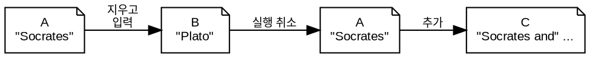

## 3.1 서론 {#3-dot-1-서론}

엔진을 가동하세요; 이제 Emacs를 설치하고 사용할 시간입니다. 이 장에서는 설정 없이 사용하는 Emacs, 즉 바닐라 Emacs에 대한 첫 번째 소개를 제공합니다. 이러한 기본 기술은 책의 나머지 부분에서 소개할 더 고급 기능을 소개할 때 유용할 것입니다.

Emacs의 설치 과정은 사용하는 운영 체제에 따라 다릅니다. GNU Emacs 웹사이트(`=emacs.org=`)에는 가장 일반적인 운영 체제에 Emacs를 설치하는 방법에 대한 지침이 포함되어 있습니다. 참고로, 최신 버전의 Emacs가 필요하며, 작성 시점에서 이는 29입니다. Windows에서는 Linux나 Mac OS보다 설치 과정이 다소 복잡합니다. Emacs Writing Studio 웹사이트에서는 이 운영 체제에서 추가 소프트웨어를 설치하는 방법에 대한 안내를 제공합니다.

소프트웨어를 설치한 후, Emacs를 열고 둘러볼 시간입니다. 처음 나타나는 것은 도움말 파일과 기타 정보로 연결된 링크가 있는 스플래시 화면입니다(그림 [Figure 1](#figure--fig-splash) 참조). 링크를 클릭하여 튜토리얼을 읽거나 `q` 버튼을 눌러 화면을 닫을('kill' in Emacs-speak) 수 있습니다. `q`를 누르는 것은 읽기 전용 화면을 닫는 표준 방법입니다.

스플래시 화면이 닫히면 '스크래치 버퍼'에 들어갑니다. 이 버퍼는 임시 메모를 작성하는 데 사용할 수 있습니다. Emacs 용어로, 버퍼는 파일에 연결될 수 있는 컴퓨터 메모리 영역으로, 내용을 보유합니다. 따라서 버퍼는 파일을 저장할 때까지 변경되지 않는 파일의 동적 버전입니다. Emacs는 프로그램을 종료할 때 스크래치 버퍼의 내용을 저장하지 않으므로, 아직 논문을 작성하지 마세요.

<a id="figure--fig-splash"></a>




## 3.2 Emacs 빠른 시작 가이드 {#sec-quickstart}

Emacs를 사용하기 위해 많은 것을 알 필요는 없습니다. 일부 사람들이 말하는 것보다 더 직관적으로 작동합니다. Org 문서를 작성하고 웹 페이지로 내보내는 작업을 통해 시작해 보겠습니다.

메뉴 바에서 _파일_ &gt; /새 파일 방문/을 선택하고, 디렉토리를 선택한 다음, 예를 들어 `test.org`와 같은 `.org` 확장자를 가진 파일 이름을 입력합니다. 파일을 방문하는 것은 Emacs 용어로 파일을 버퍼에 읽어오는 것을 의미합니다. 이 파일은 Org 모드의 특수한 일반 텍스트 파일이 됩니다. 이제 평소에 사용하는 다른 텍스트 소프트웨어에서처럼 타이핑을 시작하세요.

또한 Org 구문을 사용하여 문서에 구조와 메타데이터를 추가할 수 있습니다. 예를 들어, 첫 번째 줄에 `#+title: Hello World`를 추가하여 문서의 제목을 정의합니다. 제목을 삽입하려면 단일 별표로 시작하는 줄을 사용하세요, 예를 들어 `* Chapter`입니다. 두 개 이상의 별표를 사용하면 하위 제목이 됩니다.

```text
#+title: Hello World

* Chapter
Dolor sit amet, consectetur adipiscing elit. Nulla varius imperdiet malesuada.

* Section
Nullam ut consequat lacus. Praesent porttitor urna eget semper vestibulum.
```

이 두 줄이 일반 텍스트와 다른 색상으로 표시되는 것을 알 수 있습니다. 이 색상은 실제 텍스트의 색상이 아니라, 이 텍스트가 일반 단락이 아님을 나타내는 의미적 힌트입니다. 이러한 색상은 문서를 빠르게 스캔하는 데 도움이 됩니다. 이제 제목 아래에 일반 텍스트를 추가하세요. 마지막으로, _파일_ &gt; /저장/으로 결과를 저장합니다. 이제 Emacs에서 첫 번째 문서를 작성했습니다. 파일은 다음과 같이 보일 수 있습니다:

Emacs가 긴 문장을 화면 경계에서 자동으로 줄바꿈하지 않는 경우 걱정하지 마세요. 기본 설정 문제일 뿐입니다. 이를 변경하려면 메뉴 바로 이동하여 _옵션_ &gt; _이 버퍼에서 줄 바꿈_ &gt; /단어 줄 바꿈(시각적 줄 모드)/을 선택하면 됩니다. 이제 Emacs가 사용하던 글쓰기 소프트웨어처럼 동작합니다.

다음으로, 이 간단한 예제를 웹 페이지로 내보내겠습니다. Org는 _What You See is What You Mean_ 시스템이므로, 화면에 표시되는 텍스트가 최종 출판 결과에서 어떻게 보일지와는 다를 수 있습니다. Org 모드는 문서를 내보낼 때 템플릿을 사용하여 구문을 원하는 타이포그래픽 디자인으로 변환합니다. 웹 페이지의 경우 이 템플릿은 Cascading Style Sheet(CSS)입니다.

따라서 `#+title:` 줄에 있는 텍스트는 문서의 제목이 되며, 하나 이상의 별표로 시작하는 줄은 제목이 됩니다. 내보내기 모듈은 이러한 키워드를 관련 출력으로 변환합니다. 후속 장에서는 이미지, 표, 수식 및 기타 요소를 추가하는 다른 구문을 소개합니다.

마지막 단계는 웹 페이지를 만드는 것입니다. _Org_ 메뉴에서 /내보내기/게시/를 선택하고 `h`와 `o` 키를 입력합니다. Org는 문서를 HTML 파일로 변환하고 기본 브라우저를 열어 결과를 표시합니다.

이제 Emacs Org 모드에서 문서를 작성하고 게시하는 기본 워크플로우를 마스터했습니다. 당연히 더 많은 것이 있으며, Emacs에는 문서를 원하는 대로 만드는 데 사용할 수 있는 수많은 플러그인과 세밀한 조정 옵션이 있습니다.


## 3.3 키보드로 작업하기 {#3-dot-3-키보드로-작업하기}

Emacs는 대체로 키보드 중심의 애플리케이션입니다. 이전 섹션에서 보여준 것처럼, 가끔씩 마우스와 메뉴 바를 사용할 수 있지만, 이 주변 장치를 사용할 필요는 없습니다. 키보드 또는 마우스를 사용하는 것이 더 효율적인지에 대한 공식적인 합의는 없지만 (Tognazzini 1992; Omanson et al. 2010), 대부분의 Emacs 사용자는 손을 키보드에 두는 것을 선호합니다.

아이콘 바에서 아이콘을 클릭하는 것이 키 입력 시퀀스를 기억하는 것보다 뇌 용량을 덜 필요로 할 것 같지만, 아이콘 바의 실질적인 문제는 모든 기능을 커버할 공간이 부족하다는 점입니다. 키보드 단축키는 쉽게 기억되며, 근육 기억으로 빠르게 일부가 됩니다.

마우스 대신 키보드 단축키를 사용하면 두 입력 장치 사이에서 손을 정기적으로 이동시키지 않아도 됩니다. 예를 들어, 일반 워드 프로세서에서 단어를 잘못 입력했을 때, 손을 키보드에서 마우스로 옮기고, 커서를 잘못된 단어로 이동하고, 마우스를 클릭하여 원하는 철자를 선택합니다. Emacs에서는 한 번의 키 입력으로 오타를 가장 가능성이 높은 올바른 버전으로 변경하고 계속 작성할 수 있습니다.

키보드 대 마우스 논쟁에서 가장 중요한 것은 글쓰기가 분당 단어 수를 내리치는 것보다 생각하는 것에 더 관한 것이므로 마우스를 사용하는 것이 죄가 아님을 기억하는 것입니다. Emacs에서는 일부 작업에 마우스를 사용할 수 있습니다, 예를 들어 텍스트 선택이나 커서 이동. 메뉴 시스템의 주요 장점은 Emacs의 기능을 발견하는 데 도움이 된다는 점이지만, 메뉴에 접근하기 위해 마우스가 필요하지 않습니다. `F10`을 눌러 드롭다운 메뉴를 탐색하고 Emacs의 기능을 발견할 수 있습니다.

Emacs는 컴퓨터 인터페이스의 표준화 이전에 개발되었기 때문에 키보드와의 상호작용 방식이 아마도 익숙하지 않을 수 있습니다. 기본 사항부터 시작하겠습니다. 표준 컴퓨터 키보드에는 다섯 가지 유형의 키가 있습니다:

1.  알파벳 및 숫자: 문자, 숫자 및 구두점.
2.  편집: 화살표 키 및 백스페이스 등
3.  기능 및 멀티미디어
4.  이스케이프
5.  수정자 키: Shift, Control, Alt, Windows/Command

알파벳 키를 누르면 문자가 컴퓨터의 메모리에 추가되고 화면에 표시됩니다. 이것은 타이핑에 사용된다는 복잡한 방법입니다. 편집 키, 예를 들어 화살표 키, 페이지 업 및 다운, 삭제, 백스페이스는 라벨에 적힌 대로 작동합니다. 기능 및 멀티미디어 키는 더 복잡한 작업을 수행합니다. 예를 들어, Emacs에서 `F3`을 누르면 매크로를 기록합니다. 멀티미디어 키는 일반적으로 운영 체제에 의해 정의되며 화면 밝기 증가 또는 음악 재생과 같은 작업을 활성화합니다. 이스케이프 키는 키보드의 가장 강력한 멤버입니다. 마치 /오즈의 마법사/에서 도로시의 루비 슬리퍼처럼, 세 번 누르면 곤경에서 벗어날 수 있습니다.

원칙적으로, 이것이 산문 작성을 위해 필요한 유일한 키입니다. 하지만 우리는 단순히 텍스트를 삽입하고 편집하는 것 이상을 하고 싶습니다. 컴퓨터 키보드에는 수정자 키도 있습니다. 이 키들은 동시에 눌러질 때 다른 키의 표준 동작을 일시적으로 수정하는 특수 키입니다.

현대 PC 또는 Apple 키보드의 수정자 키는 Shift, Control, Alt / Option, Windows / Command입니다. Chromebook 컴퓨터에는 동일한 수정자 키가 있지만 Windows / Command 키에 해당하는 것은 없습니다. 일부 작은 키보드에는 사용 가능한 옵션을 확장하기 위해 `Fn`과 같은 추가 수정자 키가 있습니다. 수정자 키는 단독으로 눌러도 효과가 없습니다. 이름에서 알 수 있듯이, 이 키들은 동시에 눌러질 때 다른 키를 수정합니다.

Emacs 용어의 일부는 현재 표준 키보드 레이아웃이 존재하기 전의 시대에서 비롯됩니다. 우리가 지금 Alt 키라고 부르는 것은 예전에는 _Meta_ 키였습니다. Windows 키나 Apple 시스템의 Command 키는 예전의 _Super_ 키에 매핑됩니다. 운영 체제는 Windows 또는 Command 키를 다양한 작업에 사용하므로 Emacs는 기본적으로 이를 사용하지 않습니다. 예전 키보드에는 Hyper 키도 있었지만, 현대 컴퓨터에서는 더 이상 사용할 수 없습니다.

Emacs 문서는 키 시퀀스를 축약하여 표시합니다. 이전 섹션에서 메뉴 바를 사용할 때 일부 기능이 설명에 축약된 키보드 단축키를 추가하는 것을 볼 수 있습니다. 예를 들어, `C-a`는 Control과 `a` 키를 동시에 누르는 것을 의미합니다. 대시는 첫 번째 키가 두 번째 키를 수정함을 나타내며, 키 사이의 공백은 연속적으로 입력됨을 나타냅니다. 스페이스 바와 기타 이름 키는 각도 괄호로 표시됩니다, 예를 들어 `=spc=` 또는 `=tab=`. 각도 괄호 없이 입력하면 'spc' 또는 'tab'을 입력하는 것을 의미합니다.

각 수정자 키는 표 [Table 1](#table--tab-modifier-keys)에 표시된 것처럼 약어를 가지고 있습니다. 수정자 키를 결합할 수 있으며, 때로는 `C-M-S-a` (Control, Alt 및 Shift `a`)와 같은 어색한 조합이 필요할 수 있습니다. Shift 수정자는 일반적으로 표시되지 않습니다. 왜냐하면 `C-M-A`는 `C-M-S-a`와 동일하기 때문입니다. 이스케이프 키도 수정자 키로 작동할 수 있습니다. 한 번 누르는 것은 메타 키를 누르는 것과 같습니다. 따라서 `=esc>-x=`는 `M-x`와 동일합니다.

<a id="table--tab-modifier-keys"></a>
<div class="table-caption">
  <span class="table-number"><a href="#table--tab-modifier-keys">Table 1</a>:</span>
  Emacs 수정자 키.
</div>

| 수정자            | 예시  | 기능               |
|----------------|-----|------------------|
| Shift             | `S-8` | `*` 기호 (미국 키보드 기준) |
| Control           | `C-e` | 줄 끝              |
| Alt / Option      | `M-d` | 단어 삭제 (kill)   |
| Windows / Command | `s`   | 운영 체제에 의해 사용됨 |
| Hyper             | `H`   | 일반 키에 매핑되지 않음 |

알아야 할 가장 중요한 키보드 단축키는 `C-g`로, 부분적으로 입력된 명령을 취소합니다. 세 번의 이스케이프 키와 달리, 이 명령은 실행 중인 기능도 종료할 수 있습니다.

Emacs의 모든 키 입력은 기능을 실행하며, 즉 작업을 수행합니다. 위에서 언급한 `c-g` 키는 `keyboard-quit` 명령을 실행합니다. 사용자에게 보이는 기능은 명령이라고 합니다. 모든 명령은 함수이지만 모든 함수가 명령은 아닙니다. 이 책은 이러한 단어를 상호 교환적으로 사용합니다. 대부분의 기술 서적은 함수 이름을 ~타입라이터 폰트~로 표시하여 일반 텍스트와 구분합니다. Emacs 함수는 항상 단어 사이에 대시를 사용하여 작성되며, 해커들은 이를 케밥 케이스라고 부릅니다. 모든 함수에 단축키가 있는 것은 아니지만, 단축키가 있을 때는 타입라이터 텍스트로도 표시됩니다. 함수 이름과 키보드 단축키를 아는 것은 Emacs가 어떻게 작동하는지 더 잘 이해하는 데 도움이 됩니다. 또한 단축키는 완전히 구성 가능하기 때문에 함수 이름을 알아야 합니다.

하지만 더 있습니다. Emacs는 접두사 키도 사용합니다. 이 키를 누르면 시스템이 추가 입력을 기다립니다. 예를 들어, `C-x C-f`는 먼저 Control과 `x`를 누르고 그 다음 Control과 `f`를 누르는 것으로, 파일을 찾는(열거나 생성하는) 기본 시퀀스인 `find-file` 명령입니다.

접두사 키를 누른 후, Emacs는 화면 하단(에코 영역)에 이를 표시하고 추가 입력을 기다립니다. 이론적으로 키 시퀀스의 길이는 무제한이지만, 실제로는 보통 세 개 또는 네 개의 키를 넘지 않습니다. 표준 접두사 키는 다음과 같습니다:

-   `C-x`: 기본 Emacs 명령에 사용됨
-   `C-c`: Emacs 패키지에 사용됨
-   `C-h`: 도움말 기능
-   `M-x`: 명령 실행

접두사 키 이후에 사용 가능한 단축키를 알고 싶다면 접두사 키 후에 `C-h`를 사용하세요. 예를 들어, `C-c C-h`는 `C-c`로 시작하는 모든 사용 가능한 단축키 목록이 포함된 새 버퍼를 엽니다. 명령 이름은 다소 암호적일 수 있습니다. 함수 이름을 클릭하면 해당 도움말 파일을 볼 수 있습니다. Emacs에서는 도움말이 항상 코너에 있습니다.

Emacs의 고대 뿌리 때문에 Common User Access(CUA) 표준에 따르지 않습니다 (Berry 1988). 이 표준은 복사 또는 클립보드에 무언가를 잘라내기 위해 `C-c`와 `C-x`와 같은 친숙한 키보드 단축키를 정의합니다. Emacs는 이러한 키를 접두사로 사용합니다. Emacs는 다른 표준 키, 예를 들어 `C-z`를 다른 기능에 사용합니다. Emacs를 이러한 일반적인 키보드 단축키를 인식하도록 구성할 수 있지만, EWS는 기본 설정을 고수합니다.

언급해야 할 또 다른 접두사 키가 있습니다. 일부 명령은 대체 상태를 가지고 있으며, 동일한 기능이 다른 결과를 가질 수 있습니다. 대체 상태를 활성화하려면 일반 키 시퀀스 전에 `C-u=(유니버설 인수)를 추가합니다. 유니버설 인수에 대한 대체 상태가 없는 경우, Emacs는 기능을 네 번 반복합니다. 예를 들어, =C-u <up>`은 커서를 네 줄 위로 이동합니다. 이중 유니버설 인수는 이를 열여섯 번으로 만듭니다. `C-u C-u C-u #`를 입력하면 Emacs는 64개의 해시태그 기호를 삽입합니다. 숫자를 Control 또는 Alt 뒤에 추가하면 다음 키 입력이 반복됩니다. 예를 들어, `M-80 *`는 텍스트에 80개의 별표를 추가합니다.

Emacs가 키보드를 어떻게 사용하는지에 대한 이 상세한 설명은 당신을 눈부시게 할 수 있습니다. 1981년 Emacs 매뉴얼의 표지조차도 Emacs가 외계의 민첩한 손가락을 가진 외계인에 의해 가장 잘 사용된다고 제안했습니다(그림 [Figure 2](#figure--fig-emacs1981) 참조). 걱정하지 마세요, 이 책을 완료할 때쯤이면 키보드를 연주하는 것처럼 능숙하게 사용할 수 있을 것입니다.

<a id="figure--fig-emacs1981"></a>




## 3.4 명령 실행 {#sec-commands}

수정자 및 접두사 키는 Emacs에 명령을 내리기 위한 많은 단축키를 제공하지만, 키의 수는 무한하지 않으므로 일부 명령에는 단축키가 없습니다. 단축키가 없는 명령은 이름으로 호출해야 합니다. 명령을 실행하는 표준 방법은 `M-x`를 사용하고 명령 이름을 입력한 다음 Return / Enter 키(`<ret>`)를 누르는 것입니다. `M-x`를 입력하면 화면 하단(미니버퍼)에 `M-x`가 표시되며 추가 지시를 기다립니다. 미니버퍼는 입력과 지시를 입력하는 곳입니다. 예를 들어, `M-x tetris <ret>`를 입력하면 테트리스 게임을 할 수 있습니다. 너무 산만해지지 마세요; 게임을 종료하고 작업으로 돌아가려면 몇 번 `q`를 누르세요. 실험 연구에 따르면, 테트리스를 너무 오래 플레이하면 꿈에 영향을 미칠 수 있습니다 (Stickgold et al. 2000).

매번 전체 함수 이름을 입력하는 것은 궁극적인 효율성을 추구하는 사람들에게는 너무 많은 작업입니다. 미니버퍼 완성 시스템은 찾고자 하는 명령을 찾는 데 도움을 줍니다. 부분적인 함수 또는 파일 이름을 입력한 후 탭(`<tab>`) 키를 누르면 Emacs는 미니버퍼에 완성 후보를 표시합니다. 예를 들어, Emacs가 단락을 어떻게 줄바꿈하는지 변경하는 `visual-line-mode` 함수를 실행하려면 `M-x visu <tab>`를 입력합니다.

이 완성 기능이 어떻게 작동하는지 보려면 미니버퍼에 각 문자를 입력할 때마다 탭을 누르세요. 원하는 선택에 가까워질수록 Emacs가 완성 후보를 좁히는 것을 알 수 있습니다. 이 원칙은 변수 이름과 파일 이름에도 적용됩니다. 탭 키는 함수, 변수, 파일 이름, 버퍼 이름 및 기타 선택 후보를 기억하고 발견하는 데 도움이 되는 비밀 무기입니다. 마우스를 사용하여 메뉴와 도구 바에 접근할 수 있지만, 화면이 모든 기능을 담을 만큼 충분히 크지 않기 때문에 사용 가능한 기능의 일부만 포함하고 있습니다.

이 책의 나머지 부분에서는 명령 이름만 언급하고 `M-x`와 `<ret>` 부분은 생략합니다. 텍스트가 ~example-command~라는 명령을 사용하도록 제안할 때, `M-x example-command <ret>`를 사용하여 실행합니다. 사용 가능한 키보드 단축키도 표시되며, 이 경우 단축키를 사용하여 기능에 접근할 수 있습니다.


## 3.5 주요 모드와 보조 모드 {#3-dot-5-주요-모드와-보조-모드}

Emacs는 다양한 작업을 수행하기 위해 편집 모드를 통해 기본 동작을 변경하는 다재다능한 도구입니다. 편집 모드는 주요 모드 또는 보조 모드일 수 있습니다. 주요 모드는 Emacs 환경 내에서 앱을 여는 것과 같습니다, 마치 전화기에서 앱을 여는 것처럼요. 가장 인기 있는 주요 모드는 Org 모드로, 글쓰기 및 출판 시스템을 제공합니다. 이 책 전체에서 논의되는 주요 모드는 Org입니다.

더 독특한 Emacs 모드로는 아티스트 모드가 있습니다. 이 도구는 마우스와 키보드를 사용하여 일반 텍스트 그림을 만들 수 있게 해줍니다. `artist-mode` 명령을 실행하고 마우스로 그림을 그리기 시작해 보세요. 아티스트 패키지를 어떻게 사용하는지에 대해 더 알고 싶다면 내장된 도움말 시스템을 통해 `C-h P artist`로 자세한 정보를 얻을 수 있습니다.

모든 주요 모드는 복사 및 붙여넣기(삭제 및 붙여넣기), 파일 열기와 같은 기본 Emacs 기능을 공유하지만, 특화된 작업을 추가합니다. 예를 들어, 웹 페이지로 내보내기. 주요 모드는 열린 버퍼의 핵심 기능을 결정합니다. 버퍼는 작업 중인 텍스트나 다른 콘텐츠를 보유하는 메모리 부분입니다. 각 버퍼는 하나의 주요 모드를 가지며, 각 주요 모드는 특정 키 바인딩과 드롭다운 메뉴를 가진 고유한 기능을 가지고 있습니다.

보조 모드는 주요 모드의 기능을 향상시키는 보조 프로그램으로, 예를 들어 철자 검사, 텍스트 완성 또는 줄 번호 표시와 같은 기능을 제공합니다. 보조 모드는 주요 모드의 기능을 보완합니다. 각 버퍼는 하나의 주요 모드만 가질 수 있지만, 여러 활성 보조 모드를 가질 수 있습니다. 보조 모드는 전체 Emacs 세션에도 적용될 수 있습니다.

많은 경우 Emacs는 파일 확장자에 따라 주요 모드를 인식합니다. 모든 Org 모드 파일은 `.org`로 끝나므로, Emacs는 이러한 파일을 열 때 자동으로 Org 모드를 활성화합니다. 주요 모드의 이름은 창 아래 줄에 표시됩니다. 보조 모드는 명시적으로 활성화되어야 하며, 특정 버퍼에 대해, 모든 버퍼에 대해 전역적으로 또는 특정 주요 모드에 연결하여 활성화할 수 있습니다.

이 원칙을 이해하기 위한 연습으로, 이 장의 첫 번째 섹션에서 만든 `test.org` 파일을 `C-x C-f`로 열어보세요. 제목과 제목이 다른 색상으로 표시되고 메뉴 바에 새로운 옵션이 나타나는 것을 알 수 있습니다. 이제 이 파일을 새로운 이름(`test.txt`)으로 `C-x C-w` (`write-file`)로 저장하세요. 버퍼는 더 이상 Org 파일이 아니라 일반 텍스트 파일이 됩니다. 버퍼가 변경되며, 제목과 제목이 더 이상 색상으로 표시되지 않습니다. 또한 Org 옵션이 메뉴 바에서 사용할 수 없게 되고, 열린 버퍼 아래 줄에는 이제 'text' 대신 'Org'가 표시됩니다. Org 모드로 돌아가려면 `org-mode` 명령을 실행하면 됩니다.

활성화된 주요 모드와 보조 모드에 따라 사용 가능한 키보드 단축키(키맵)와 드롭다운 메뉴가 달라집니다. 일부 키맵은 전체 Emacs에 적용되며, 다른 맵은 특정 모드에 특화되어 있습니다. 모드가 이를 재정의하지 않는 한, 일부 단축키는 모든 모드에서 동일하게 유지됩니다. 패키지는 필요한 기능에 따라 단축키를 변경하거나 추가할 수 있습니다. 따라서 `C-c C-c`와 같은 단축키는 사용되는 맥락에 따라 다른 모드에서 다른 작업을 수행합니다.


## 3.6 파일 열기 및 저장 {#3-dot-6-파일-열기-및-저장}

Emacs에서 파일을 여는 것은 '파일 방문'이라고 불리며, `find-file` 함수(`C-x C-f`)를 사용합니다. 따라서 파일 찾기, 열기 및 방문은 동일한 효과를 가집니다. Emacs는 파일을 열고 그 내용을 버퍼에 표시하여 편집 및 작성 준비를 합니다. 존재하지 않는 이름을 입력하면 Emacs는 새 파일을 생성합니다. 디렉토리를 열면 Emacs는 해당 폴더의 내용을 Emacs 파일 관리자(Directory Editor 또는 'Dired', [BROKEN LINK: chap-admin] 장 참조)에 표시합니다. 대안으로, 파일을 도구 모음 아이콘 또는 메뉴 바를 통해 열 수 있습니다.

파일을 찾을 때 Emacs는 현재 활성 버퍼의 폴더에서 시작합니다. 커서 앞의 텍스트를 제거하여 디렉토리 트리의 상위 레벨로 이동할 수 있습니다. 모든 하위 디렉토리를 제거할 필요는 없습니다. 홈 디렉토리에서 파일을 찾으려면 미니버퍼의 현재 텍스트를 무시하고 물결표와 슬래시(`/`)를 입력하고 탭을 누릅니다. 드라이브의 루트 폴더에서 검색을 시작하려면 두 개의 슬래시(`=//=`)를 입력하세요. Windows 컴퓨터에서는 드라이브 문자, 콜론 및 슬래시(`c:/`)를 입력하는 것이 가장 좋은 방법입니다. 탭 버튼을 두 번 누르면 모든 사용 가능한 파일과 폴더가 미니버퍼에 나타납니다.

연습을 위해 새 파일(`C-x C-f`)을 만들고 버퍼에 글을 쓰기 시작하세요. 편집을 완료한 후, `C-x C-s`는 버퍼를 연결된 파일에 저장합니다. 파일에 대한 버퍼의 내용이 변경될 때까지 파일의 내용은 동일하게 유지됩니다. 버퍼를 새 이름으로 저장하려면 `C-x C-w`를 사용할 수 있습니다(표 [Table 2](#table--tab-files) 참조). 버퍼가 파일과 다른지 여부는 모드 라인에서 확인할 수 있습니다. 시작 부분에 두 개의 별표가 있으면 파일을 저장해야 합니다. 두 개의 대시는 버퍼의 내용이 파일과 동일함을 의미합니다.

<a id="table--tab-files"></a>
<div class="table-caption">
  <span class="table-number"><a href="#table--tab-files">Table 2</a>:</span>
  가장 일반적으로 사용되는 파일 함수.
</div>

| 단축키    | 함수          | 설명                       |
|--------|-------------|--------------------------|
| `C-x C-f` | `find-file`   | 파일 찾기(열기)            |
| `C-x C-s` | `save-buffer` | 현재 버퍼를 파일에 저장    |
| `C-x C-w` | `write-file`  | 현재 버퍼를 파일에 쓰기 (다른 이름으로 저장) |


## 3.7 버퍼, 프레임 및 윈도우 {#sec-windows}

Emacs를 열 때, 소프트웨어는 프레임 내에서 실행됩니다(그림 [Figure 3](#figure--fig-frame) 참조). 이는 혼란스러울 수 있으며, 프레임은 대부분의 운영 체제에서 윈도우라고 불립니다. 더 혼란스럽게도, Emacs 프레임을 윈도우로 나눌 수 있습니다. 또한, 여러 프레임을 데스크탑에 열 수 있습니다, 예를 들어 각 모니터에 하나씩.

기본 Emacs 화면에는 상단에 메뉴 바가 있고 그 아래에 아이콘을 포함한 도구 바가 있습니다. 도구 바 아래에서 윈도우가 시작됩니다. 각 윈도우는 버퍼를 포함하며, 버퍼는 텍스트, 사용자 인터페이스 또는 함수의 출력을 포함합니다. 각 윈도우 아래의 모드 라인은 버퍼 또는 연결된 파일의 이름과 기타 메타데이터를 표시합니다. 각 프레임에는 Emacs가 피드백을 표시하는 에코 영역이 하단에 있습니다. 에코는 오류 메시지와 같은 정보를 표시하는 컴퓨터 과학 용어입니다. 페이지 하단에는 Emacs가 파일이나 버퍼를 선택할 때와 같은 입력이 필요할 때 확장 가능한 부분인 미니버퍼도 포함되어 있습니다.

<a id="figure--fig-frame"></a>



오피스 소프트웨어와 마찬가지로, 메모리(버퍼)에 있는 버전에서 작업하고 있으며, 이전 버전은 디스크(파일)에 있습니다. 여러 버퍼를 동시에 열 수 있으므로 쉽게 전환할 수 있습니다. 현재 작업 중인 버퍼가 활성 버퍼입니다. 특수 버퍼의 이름, 예를 들어 `/Messages/`는 별표로 둘러싸여 있습니다. 대부분의 버퍼는 별표로 둘러싸이지 않은 경우 파일에 연결됩니다.

Emacs는 매우 안정적이며, 일부 사용자는 수백 개의 버퍼를 열어두고 거의 재시작할 필요가 없기 때문에 버퍼를 열어둡니다. `C-x b` 단축키(`switch-to-buffer`)는 다른 버퍼를 활성 버퍼로 선택합니다. `C-x left`와 `C-x right` 키 시퀀스(`previous-buffer` 및 `next-buffer`)를 사용하여 버퍼를 시간 순서대로 이동할 수 있습니다.

기본적으로 프레임에는 하나의 윈도우가 있습니다. 현재 윈도우를 수평 또는 수직으로 분할하려면 `C-x 2` 또는 `C-x 3`을 누릅니다(`split-window-below` 및 `split-window-right`). `C-x 0` 단축키(`delete-window`)는 현재 윈도우를 제거하지만, 버퍼는 메모리에 남아 있습니다. `C-x 1`은 모든 다른 윈도우를 제거하여 현재 버퍼가 전체 프레임을 차지하게 합니다(`delete-other-windows`). 윈도우 간 이동은 `C-x o` 단축키(`other-window`)를 사용합니다. 이 함수는 사용 가능한 윈도우를 순환합니다.

수직으로 윈도우를 분할하면 동일한 버퍼가 두 번 나타납니다. 각 윈도우는 고유한 커서 위치를 가질 수 있으므로, 글을 쓰는 동안 다른 부분을 참조할 때 집중력을 잃지 않고 쉽게 이동할 수 있습니다. ~follow-mode~를 활성화하면 버퍼의 텍스트가 흐르도록 하여, 이 버퍼를 포함하는 윈도우가 동일한 문서의 열로 변환됩니다. 커서가 왼쪽 윈도우의 하단을 지나면 오른쪽 윈도우에 다시 나타나며, 모든 윈도우가 하나의 커서를 공유합니다. 팔로우 모드를 비활성화하려면 동일한 함수를 다시 실행합니다.

<a id="table--tab-buffers-windows"></a>
<div class="table-caption">
  <span class="table-number"><a href="#table--tab-buffers-windows">Table 3</a>:</span>
  버퍼 및 윈도우 함수.
</div>

| 단축키        | 함수                   | 설명                  |
|------------|----------------------|---------------------|
| `C-x b`       | `switch-to-buffer`     | 다른 버퍼 선택        |
| `C-x <left>`  | `previous-buffer`      | 이전 활성 버퍼로 이동 |
| `C-x <right>` | `next-buffer`          | 다음 활성 버퍼로 이동 |
| `C-x 0`       | `delete-window`        | 현재 윈도우 삭제      |
| `C-x 1`       | `delete-other-windows` | 활성 윈도우를 제외한 모든 윈도우 삭제 |
| `C-x 2`       | `split-window-below`   | 현재 윈도우를 수평으로 분할 |
| `C-x 3`       | `split-window-right`   | 현재 윈도우를 수직으로 분할 |
| `C-x o`       | `other-window`         | 다음 윈도우로 이동    |
|               | `follow-mode`          | 버퍼를 두 개 이상의 윈도우에 표시 |


## 3.8 도움말 찾기 {#3-dot-8-도움말-찾기}

Emacs는 다양한 방법으로 정보에 접근할 수 있는 광범위한 내장 도움말 시스템을 가지고 있습니다. 도움말 시스템에 접근하려면 `C-h` 접두사 키를 사용합니다. 전체 Emacs 매뉴얼은 `C-h r` (`info-emacs-manual`)로 접근할 수 있습니다. 이 매뉴얼은 Info 모드에서 열리며, 이는 매뉴얼을 위한 특화된 모드입니다. 전체 Emacs 매뉴얼은 잠자리에 들기 전 읽기용이 아니라 필요할 때 참조할 수 있는 지식의 풀입니다. `g` 키를 사용하면 미니버퍼 완성 기능을 사용하여 매뉴얼의 장이나 섹션으로 점프할 수 있습니다. 예를 들어, `C-h r g help <ret>`는 도움말 시스템에 대한 매뉴얼의 부분으로 이동합니다.

매뉴얼을 Info 시스템에서 읽을 때, 스페이스 바는 화면을 위로 스크롤하여 매뉴얼을 페이지 단위로 읽을 수 있게 합니다(`Info-scroll-up`). 백스페이스 버튼 또는 `S-<spc>`은 이전 화면으로 돌아갑니다(`Info-scroll-down`). 매뉴얼에는 목차와 텍스트 전체에 걸쳐 하이퍼링크가 포함되어 있습니다. 마우스로 클릭하거나 커서가 링크 위에 있을 때 Enter 키를 눌러 이러한 링크를 클릭할 수 있습니다. 이전 또는 다음 장으로 점프하려면 `Info-up` 및 `Info-down` 함수(`u` 및 `d`)를 사용할 수 있습니다. 특정 항목을 찾고 있다면, `Info-search` (`s`)를 사용하여 특정 용어를 찾을 수 있습니다. 항상 그렇듯이, `q`는 화면을 종료합니다.

Emacs의 일부 패키지는 자체 매뉴얼을 가지고 있습니다. 사용 가능한 매뉴얼 목록을 보려면 `C-h R <tab>` (`info-display-manual`)를 사용할 수 있습니다. 여기서도 미니버퍼 완성을 사용하여 매뉴얼을 찾을 수 있습니다. 이 매뉴얼은 이전 단락에서 설명한 대로 동일한 방식으로 읽을 수 있습니다.

모든 Emacs 패키지가 광범위한 매뉴얼을 가지고 있는 것은 아닙니다. 패키지에 대한 정보를 찾는 또 다른 방법은 `describe-package` 함수(`C-h P`)를 사용하는 것입니다. 이 함수는 소스 코드에서 패키지를 설명하는 정보를 추출하고 홈페이지로의 링크를 제공합니다.

도움말 시스템에는 특정 설명을 찾기 위한 다른 명령도 있습니다. 특정 단축키에 바인딩된 명령을 찾고 싶다면 `C-h k`를 사용하고 키 시퀀스를 입력하세요. Emacs는 정의되지 않은 키 시퀀스를 입력할 때 화면 하단에 메시지를 표시합니다, 예를 들어 "`C-c k`는 정의되지 않았습니다". 변수에 대해 더 알고 싶다면 `C-h v` (`describe-variable`)를 사용하고 이름을 입력하세요. 그리고 명령에 대해 더 알고 싶다면 `C-h x` (`describe-command`)를 사용하세요. 팝업 창은 관련 변수나 명령을 설명하며, `q`로 닫을 수 있습니다.

이 책의 나머지 부분에서는 Emacs 도움말 시스템의 관련 부분에 대한 정기적인 참조를 제공하여, 시스템이 어떻게 작동하는지에 대한 세부 사항을 알고 싶어하는 독자들을 위해 제공합니다. 이 책을 끝까지 읽을 필요는 없으며, 작가로서 Emacs를 시작하는 데 필요한 모든 것을 포함하고 있습니다. Emacs 문서에 대한 참조는 소프트웨어가 어떻게 작동하는지에 대한 더 많은 세부 사항을 알고자 하는 사람들을 위한 것입니다.


## 3.9 Emacs에서 글쓰기 {#sec-text-mode}

이제 더 복잡한 문서를 작성하기 위해 충분히 알고 있습니다. 기존 일반 텍스트 파일을 방문하거나 새 파일을 만들고 타이핑을 시작하세요. 완전히 생산적이기 위해서는 글쓰기 모드의 기본 원리를 이해해야 합니다. Emacs 문서는 텍스트 모드를 인간이 읽는 텍스트를 작성하기 위한 모드로 설명합니다, 반면에 Prog 모드는 컴퓨터가 읽는 코드를 작성하기 위한 것입니다. 텍스트 모드는 모든 다른 산문 형식의 기초를 형성하며, 이는 모든 작가용 주요 모드가 글쓰기에 동일한 기본 기능을 사용함을 의미합니다. Org를 활성화하면 텍스트 모드도 자동으로 활성화됩니다.

이 섹션에서는 글쓰기에 가장 일반적으로 사용되는 명령을 요약합니다. Emacs 매뉴얼은 인간 언어를 작성하는 데 관련된 모든 기능에 대한 상세한 설명을 제공하며, `C-h r g basic` 및 `C-h r g text`로 읽을 수 있습니다.


### 3.9.1 버퍼 내에서 이동하기 {#3-dot-9-dot-1-버퍼-내에서-이동하기}

화살표 키와 페이지 업/다운 키를 사용하는 것만 알면 된다고 생각할 수 있지만, Emacs는 원고 내에서 이동할 수 있는 더 많은 기능을 제공합니다.

Emacs 문서에서는 때때로 커서를 '포인트'라고 부릅니다. 커서는 화면에 표시되는 문자(선 또는 상자)이며, 포인트는 다음에 입력될 문자가 나타날 위치를 나타냅니다. 포인트는 Emacs 함수를 작성할 때 더 중요한 개념이지만, 이 책은 글쓰기 작업이 이루어지는 커서에 집중합니다.

버퍼 내에서 이동하는 표준 방법 외에도, Emacs는 원고를 탐색하는 데 도움을 주는 추가 기능을 제공합니다. 예를 들어, `C-p` (`previous-line`)는 `<up>` 키와 동일한 작업을 수행합니다(표 [Table 4](#table--tab-moving) 참조). 일부 사람들은 빠른 터치 타이핑을 위해 손을 기본 위치에 두고 이러한 키를 사용하는 것을 선호합니다.

<a id="table--tab-moving"></a>
<div class="table-caption">
  <span class="table-number"><a href="#table--tab-moving">Table 4</a>:</span>
  Emacs에서 버퍼 내에서 이동하기.
</div>

| 단축키             | 함수                     | 방향    |
|-----------------|------------------------|-------|
| `C-b`, `<left>`    | `left-char`              | 왼쪽    |
| `C-f`, `<right>`   | `right-char`             | 오른쪽  |
| `C-p`, `<up>`      | `previous-line`          | 위      |
| `C-n`, `<down>`    | `next-line`              | 아래    |
| `M-b`, `C-<left>`  | `backward-word`          | 이전 단어 |
| `M-f`, `C-<right>` | `forward-word`           | 다음 단어 |
| `C-v`, `<pagedown` | `scroll-down-command`    | 아래로 스크롤 |
| `M-v`, `<pageup>`  | `scroll-up-command`      | 위로 스크롤 |
| `C-a`, `<home>`    | `move-beginning-of-line` | 줄의 시작 |
| `C-e`, `<end>`     | `move-end-of-line`       | 줄의 끝 |
| `M-<`, `C-<home>`  | `beginning-of-buffer`    | 버퍼의 시작 |
| `M->`, `C-<end>`   | `end-of-buffer`          | 버퍼의 끝 |

화면에 있는 많은 단어 속에서 길을 잃기 쉽습니다. 몇 가지 간단한 키 입력으로 눈을 빠르게 집중할 수 있습니다. `C-l` (`recenter-top-bottom`)을 누르면 커서가 있는 줄이 화면 중앙으로 이동합니다. 이 키 입력이 반복되면 커서는 화면 상단으로 이동합니다. 세 번 반복하면 커서가 화면 하단으로 이동합니다.

문서의 한 부분에서 다른 부분으로 이동한 후 다시 돌아가고 싶지만, 위치를 잃어버린 경우가 있습니다. 이를 더 효율적으로 수행할 수 있는 방법은 마크를 설정하는 것입니다.

마크는 텍스트 내의 위치(포인트)에 대한 북마크입니다. 마크를 설정하는 것은 지도에 핀을 떨어뜨리는 것과 같습니다. 기억하고 싶은 위치를 마크로 설정할 수 있으며, 이는 큰 파일을 편집할 때 매우 유용합니다. `C-<spc> C-<spc>` (`set-mark-command`)로 마크를 설정하면 현재 커서 위치가 마크 링에 저장됩니다. 마크 링은 현재 버퍼의 마크 시퀀스입니다. 이제 문서의 다른 부분으로 이동하여 편집하거나 읽고자 하는 내용을 확인할 수 있습니다. 이전 마크로 돌아가려면 `C-u C-<spc>`을 사용합니다. `C-<spc>` (`set-mark`)는 현재 위치를 마크 링에 저장하지만, 유니버설 인수를 추가하면 해당 위치를 추출하고 이동합니다. `C-u C-<spc>`를 반복해서 누르면 저장된 모든 마크를 통해 이동할 수 있습니다. 첫 번째 저장된 값에 도달하면 마지막으로 돌아갑니다, 그래서 이름이 마크 링입니다.


### 3.9.2 검색 및 교체 {#sec-search}

화살표 키와 다른 기능으로 텍스트를 이동하는 것이 좋지만, 때로는 정확히 필요한 것을 알고 있습니다. Emacs의 검색 및 교체 기능은 매우 강력하며, 이 섹션은 그 빙산의 일각만을 보여줍니다.

Emacs의 가장 일반적인 검색 방법은 증분 검색(`isearch-forward`)입니다. 증분 검색(`C-s`)은 첫 번째 문자를 입력하는 즉시 시작됩니다. 검색어를 입력하면 Emacs는 해당 문자 시퀀스를 찾은 위치를 보여줍니다. `C-s`를 반복해서 누르면 버퍼 내의 일치 항목을 순차적으로 이동합니다. 원하는 위치를 찾으면 검색을 `C-g`로 종료하고 커서는 원래 위치로 돌아갑니다. Enter 키나 화살표 키는 현재 위치에서 커서를 멈추게 하여 텍스트를 편집할 수 있게 합니다.

`C-s` 단축키는 커서에서부터 증분적으로 검색합니다. `C-s`를 반복해서 누르면 검색 결과를 순환합니다. `C-r` (`isearch-backward`)은 커서 앞의 텍스트를 검색합니다. Emacs는 검색어를 검색 링에 저장합니다. `C-s C-s`를 입력하면 이전 검색어를 재사용합니다. `M-p`와 `M-n`을 사용하면 검색 링에서 이전 검색어를 스크롤할 수 있습니다.

버퍼 내에서 텍스트를 검색하고 교체하려면 `M-%` (`query-replace`)를 사용하세요. 이 함수는 교체할 텍스트의 모든 인스턴스를 강조 표시하고 각 인스턴스에서 다양한 옵션을 제공합니다. 공백 또는 `y`를 입력하면 표시된 일치를 교체하고, `delete` 또는 `n`을 입력하면 다음 항목으로 건너뜁니다. 느낌표는 추가 확인 없이 모든 인스턴스를 교체합니다. 문제가 발생하면 `u`를 사용하여 가장 최근 변경 사항을 실행 취소하거나, `U`를 사용하여 이 검색에서 수행한 모든 변경 사항을 실행 취소합니다. Enter 키나 `q`는 교체 과정을 종료합니다. 더 많은 옵션이 있으며, 물음표를 누르면 이를 확인할 수 있습니다.


### 3.9.3 텍스트 복사 및 붙여넣기 {#3-dot-9-dot-3-텍스트-복사-및-붙여넣기}

글쓰기는 재미있지만, 이전에 작성한 내용을 복사하거나 다른 사람의 텍스트(물론 참조된)를 복사하거나, 어쩌면 언어 모델로 생성된 텍스트를 복사하는 것이 더 효율적일 때가 있습니다. 텍스트를 복사하고 붙여넣는 시스템은 현대 시스템과 약간 다르게 작동하지만 훨씬 더 많은 기능을 제공합니다.

텍스트를 선택하려면(Emacs 용어로는 'mark'라고 함) 먼저 `C-<spc>`로 마크를 설정한 다음 커서를 이동하여 원하는 섹션을 강조 표시합니다. 전체 단락을 선택하려면 `M-h` 키를 사용하세요. 일반 텍스트 컨텍스트에서 단락은 빈 줄로 구분된 텍스트 줄입니다. `M-h`를 반복해서 누르면 다음 섹션을 선택합니다. `C-x h`는 버퍼의 모든 텍스트를 선택하고, `C-g`는 모든 선택을 무효화합니다. 텍스트가 선택되면 삭제, 복사 또는 이동할 수 있습니다. 일부 모드에서는 Shift와 화살표 키로 선택할 수 있지만, Org에서는 이러한 키가 다른 기능을 활성화하기 때문에 비활성화되어 있습니다.

현대 컴퓨터 용어로, 복사와 붙여넣기는 1974년 Harry Tesler가 만든 'kill'과 'yank'라는 용어로, 텍스트를 한 곳에서 다른 곳으로 이동하는 수공예 유사어입니다 (NO_ITEM_DATA:tesler_2012). Emacs 용어는 더 산문적입니다. 텍스트를 복사하는 것은 'kill-ring'에 저장하는 것과 같으며, yank는 그 위치에서 텍스트를 검색하는 것입니다. 대부분의 시스템에서 클립보드는 마지막 항목만 유지하지만, kill ring은 'kill'한 모든 텍스트의 기록에 접근할 수 있습니다. 기본적으로 이 기록의 길이는 60개 항목입니다. kill ring이 가득 차면 가장 오래된 항목이 사라집니다.

킬 명령은 텍스트를 kill ring으로 복사하거나 이동합니다. yank 명령은 kill ring의 항목을 현재 버퍼로 복사합니다. `yank-pop` (`M-y`) 명령은 kill ring의 내용을 순환하여 기록에 접근할 수 있습니다. 표 [Table 5](#table--tab-kill-yank)는 kill ring에서 텍스트를 복사하고 이동하기 위한 키보드 단축키를 나열합니다.

<a id="table--tab-kill-yank"></a>
<div class="table-caption">
  <span class="table-number"><a href="#table--tab-kill-yank">Table 5</a>:</span>
  Emacs에서 복사 및 붙여넣기.
</div>

| 단축키 | 함수             | 설명                                |
|-----|----------------|-----------------------------------|
| `M-w` | `kill-ring-save` | 선택한 텍스트를 kill ring에 복사    |
| `C-w` | `kill-region`    | 선택한 텍스트를 kill ring으로 이동  |
| `C-y` | `yank`           | 가장 최근 kill ring 항목을 버퍼에 삽입 |
| `M-y` | `yank-pop`       | 이전에 yank한 텍스트를 다음 kill ring 항목으로 교체 |


### 3.9.4 실수 수정하기 {#sec-mistakes}

고대 로마 속담은 인간은 실수를 하지만, 계속해서 실수를 저지르는 것은 악마적이라고 말합니다 (_Errare humanum est_). Emacs는 이러한 감정에 신경 쓰지 않으며, 당신의 잘못을 수정할 수 있는 다양한 옵션을 제공합니다. 전자 글쓰기의 가장 편리한 측면은 수정액이나 다른 고대 방법에 의존하지 않고 마음을 바꾸거나 실수를 쉽게 수정할 수 있다는 점입니다. 일련의 편집 명령이 오타를 수정하고 텍스트를 수정하는 데 사용할 수 있습니다(표 [Table 6](#table--tab-deletion) 참조). `kill-`로 시작하는 명령은 삭제된 텍스트를 kill ring에 저장하므로 필요할 경우 다시 yank할 수 있습니다.

<a id="table--tab-deletion"></a>
<div class="table-caption">
  <span class="table-number"><a href="#table--tab-deletion">Table 6</a>:</span>
  Emacs 삭제 명령.
</div>

| 단축키              | 함수                   | 작업          |
|------------------|----------------------|-------------|
| `C-d`, `<delete>`   | `delete-char`          | 포인트 뒤의 문자 삭제 |
| `<backspace>`       | `delete-backward-char` | 포인트 앞의 문자 삭제 |
| `C-x C-o`           | `delete-blank-lines`   | 커서 아래의 빈 줄 제거 |
| `M-d`, `C-<delete>` | `kill-word`            | 다음 단어 삭제 |
| `C-k`               | `kill-line`            | 줄 끝까지 삭제 |

원하지 않는 문자와 단어를 제거하는 것 외에도, 그들의 위치를 바꿀 수도 있습니다. 단어에서 두 글자를 실수로 반대로 입력했을 때, 두 글자의 순서를 `transpose-char` 명령(`C-t`)으로 바꿀 수 있습니다. 단어를 교환하는 것은 `transpose-words` (`M-t`) 명령으로 빠르게 수행할 수 있습니다.

Emacs는 단어를 대문자로 바꾸는 실수를 했을 때 도와줄 수 있습니다. 아래 명령은 커서가 있는 단어를 변경합니다. 단어의 중간에 있다면, 먼저 단어의 시작으로 이동하세요. 이 명령들 앞에 음수 인수(`M--`, Alt / Option과 마이너스 키)를 추가하면 커서 앞의 글자를 수정합니다. 이 추가 기능은 단어를 막 입력하고 대문자로 시작해야 한다는 것을 깨달았을 때 유용합니다. `M-- M-c`를 입력하면 고칠 수 있습니다.

-   `M-l`: 다음 단어를 소문자로 변환 (`downcase-word`).
-   `M-u`: 다음 단어를 대문자로 변환 (`upcase-word`).
-   `M-c`: 다음 단어를 첫 글자를 대문자로 변환 (`capitalize-word`).

영역을 선택하고 글자 유형을 변경하고 싶다면, `C-x C-l`을 사용하여 선택된 텍스트를 소문자로 변환(`downcase-region`)하고, `C-x C-u`를 사용하여 대문자로 변환(`upcase-region`)할 수 있습니다. 이러한 명령을 처음 사용할 때 Emacs는 사용자에게 경고를 표시합니다, 왜냐하면 이 명령이 새 사용자에게 혼란스러울 수 있기 때문입니다. 확인하고 나면 이후 세션에서 저장됩니다.

Emacs의 `undo` 명령은 `C-/`에 매핑됩니다. 실행 취소를 되돌리려면 `C-?` (`undo-redo`)를 사용하세요. Emacs는 실행 취소 및 재실행에 관한 한 다른 소프트웨어와 다르게 동작하므로, 약간의 설명이 필요합니다. 표준 워드 프로세서에서는 무언가를 실행 취소하고 변경 사항을 만들지만, 마음을 바꾸면 취소한 텍스트가 손실됩니다.

예를 들어, "Socrates"를 입력하고, `M-d`로 지우고, "Plato"로 변경한 다음, 이 편집을 실행 취소하여 다시 "Socrates"로 되돌리고 추가 텍스트를 추가합니다. 표준 워드 프로세서에서는 Plato가 언급된 상태(B 상태, 그림 [Figure 4](#figure--fig-emacs-undo) 참조)로 돌아갈 수 없습니다. Emacs에서는 모든 이전 상태에 접근할 수 있습니다. Emacs에서는 연속적인 실행 취소 명령으로 이전 상태로 돌아갈 수 있습니다. 후속 실행 취소 및 재실행 명령은 그림 [Figure 4](#figure--fig-emacs-undo)의 체인을 따라가며, 입력한 내용을 절대 잃지 않습니다. 이 동작은 처음에는 혼란스러울 수 있지만, 시간이 지나면 사랑하게 될 것입니다.



<a id="figure--fig-emacs-undo"></a>



Emacs 실행 취소 시스템의 또 다른 기능은 선택된 영역에만 적용될 수 있다는 점입니다. 예를 들어, 첫 번째 장을 완성하고 다음 장을 작성하기 시작했습니다. 그런 다음 첫 번째 장에서 일부 편집을 실행 취소해야 한다는 것을 깨닫습니다. 실행 취소 기능을 사용하면 먼저 두 번째 장에서 작업한 모든 내용을 실행 취소한 다음 첫 번째 장을 변경합니다. 이 문제를 해결하기 위해 첫 번째 장의 관련 영역을 선택하고 해당 영역에 대해 `undo` 명령을 실행하면 됩니다.


### 3.9.5 영어 이외의 언어 {#3-dot-9-dot-5-영어-이외의-언어}

세계 대부분의 사람들에게 영어는 첫 번째 언어가 아닙니다. 운영 체제에서 키보드 설정을 다른 언어로 설정하면 Emacs가 수정자 키를 사용할 때 혼란스러워질 수 있습니다. 예를 들어, 우크라이나 컴퓨터에서 `M-x`를 입력하면 키릴 문자 Che가 대신 나타나 Emacs가 이를 계산할 수 없습니다.

Emacs는 세계의 다양한 언어를 입력할 수 있는 다양한 입력 방법을 지원합니다. Emacs가 지원하는 다양한 언어의 개요를 보려면 `view-hello-file` (`C-h h`)을 실행하세요. 입력 방법은 키보드 문자를 직접 변환하거나, 일련의 문자를 하나의 문자로 변환합니다. 예를 들어, 중국어를 입력하는 방법 중 하나를 사용하면, 메뉴가 미니버퍼에 나타나며, 여기서 원하는 문자를 선택할 수 있습니다.

현재 버퍼에 대한 입력 방법을 선택하려면 `C-x <ret> C-\` (`set-input-method`)를 사용하여 미니버퍼에서 원하는 방법을 선택할 수 있습니다. 현재 입력 방법은 모드 라인의 시작 부분에 표시됩니다. 선택한 방법을 일시적으로 비활성화하려면 `C-\`를 사용하세요. 이 키를 다시 누르면 선택한 입력 방법으로 돌아갑니다.

키보드를 사용하여 다른 언어를 작성하는 방법에 대한 더 구체적인 정보를 얻으려면 `C-h I`를 사용하여 `describe-input-method` 함수를 실행하세요. 사용 가능한 모든 입력 방법 목록을 보려면 `list-input-methods` 명령을 실행하고, 새 버퍼가 세계의 언어 목록과 함께 팝업됩니다. Emacs 매뉴얼은 `C-h r g input`으로 다양한 입력 방법에 대한 상세한 정보를 제공합니다.


### 3.9.6 디스플레이 수정하기 {#sec-display}

버퍼가 화면에 어떻게 보이는지는 주요 모드, 테마, 설정 및 활성 패키지에 따라 다릅니다. 텍스트 크기를 일시적으로 변경할 수 있는 일부 대화형 제어가 있습니다. 현재 버퍼의 텍스트 높이를 일시적으로 증가시키려면 `C-x C-+`을 입력하세요. 크기를 줄이려면 `C-x C--` (`text-scale-adjust`)를 입력하세요. 기본(전역) 글꼴 크기를 복원하려면 `C-x C-0`을 입력하세요.

기본 텍스트 모드에서는 Emacs가 일반 워드 프로세서처럼 줄을 자르지 않고, 엔터를 칠 때까지 계속 진행합니다. Emacs에서 논리적 줄은 줄바꿈으로 끝나는 문자 시퀀스입니다. 시각적 줄은 Emacs에서 어떻게 표시되는지와 관련이 있습니다. 기본 설정은 논리적 줄이 화면 경계를 넘어 계속되도록 하는 것입니다. 이것은 코드를 작성할 때 유용할 수 있지만, 산문을 작성할 때는 혼란스러울 수 있습니다.

Emacs에는 여러 줄 바꿈 기능이 있으며, 긴 형식의 텍스트를 작성할 때 가장 유용한 것은 시각적 줄 모드입니다. 이 모드를 활성화하려면 미니버퍼에서 `visual-line-mode` 명령을 실행하세요. 버퍼마다 이 모드를 활성화하는 것은 다소 번거로우며, 여기서 설정이 필요합니다. 모든 텍스트 모드에 대해 기본적으로 줄 바꿈을 활성화하도록 시스템을 설정해야 합니다.


## 3.10 Emacs 설정하기 {#3-dot-10-emacs-설정하기}

-   [X] 설정의 원칙
-   [X] Emacs Writing Studio 기본 사항
    -   [X] 외부 소프트웨어 요구 사항
    -   [X] 사용자 정의
-   [-] 미니버퍼 완성

이전 섹션에서는 설정되지 않은 상태, 일명 바닐라 Emacs를 사용하는 방법을 설명했습니다. 설정 없이도 Emacs는 작가로서 필요한 모든 작업을 수행할 수 있지만, 이것은 이상적인 상태는 아닙니다. Emacs는 거의 무한히 설정할 수 있는 시스템이므로, 원하는 대로 동작하도록 만들 수 있습니다. Emacs 사용자들은 자신들의 설정을 공유하고 기능을 추가하는 수천 개의 패키지를 게시했습니다. 이 장에서는 Emacs 설정의 원칙을 논의합니다.

상업용 소프트웨어를 사용하는 것은 가구가 갖춰진 집을 임대하는 것과 같지만, Emacs를 사용하는 것은 집을 소유하는 것과 더 비슷합니다. 그러나 디지털 집에는 페인트칠, 새로운 카펫, 가구 등이 필요하여 당신의 집으로 만들어야 합니다.

일부 Emacs 사용자들은 Doom Emacs, Spacemacs, SciMax 또는 다른 스타터 키트와 같은 사전 설정된 시스템을 배포합니다. 이러한 설정은 유용하지만, 때로는 부엌 싱크대를 제외한 모든 것을 제공합니다. 반면에, 처음부터 시스템을 설정할 수도 있는데, 이는 수많은 옵션을 탐색하며 생산성을 잃을 수 있습니다. EWS 설정은 작가들을 위한 최소한의 스타터 키트입니다. 기본 아이디어는 이 설정을 사용하여 자신의 선호도에 맞게 수정할 수 있는 빌딩 블록으로 사용하는 것입니다. 하지만 EWS 설정을 설치하기 전에 먼저 Emacs 설정의 원칙을 소개하겠습니다.


### 3.10.1 초기화 파일 {#3-dot-10-dot-1-초기화-파일}

Emacs를 시작할 때 초기화 파일, 또는 간단히 init 파일을 로드합니다. 이 파일에는 Emacs가 시작할 때 추가 패키지와 설정을 로드하는 Lisp 코드가 포함되어 있습니다. init 파일이 없어도 Emacs를 실행할 수 있지만, 기본 설정을 수정하고 싶을 것입니다.

Emacs를 처음 시작하면 설정 폴더를 생성하며, 여기에는 init 파일이 위치합니다. 이 폴더에는 시스템을 개인화하는 데 필요한 패키지도 포함됩니다. Emacs는 `.emacs`, `.emacs.el` 또는 `init.el` 파일을 찾습니다. 파일 이름 앞의 점은 파일을 숨겨서 디렉토리에서 혼란을 방지합니다.


### 3.10.2 Emacs 패키지 {#sec-packages}

Emacs 기본 시스템은 광범위한 기능을 제공하지만, 수천 개의 패키지를 통해 그 기능을 향상시킬 수 있습니다. 많은 사람들이 Emacs Lisp로 소프트웨어를 개발하고 공유하여 시스템이 할 수 있는 일을 개선하거나 확장합니다. 이러한 패키지의 개발자들은 대부분 공개 패키지 저장소를 통해 배포합니다. 가장 중요한 두 곳은 다음과 같습니다:

-   ELPA: GNU Emacs Lisp Package Archive --- 공식 패키지 저장소, 기본적으로 활성화됨 (`elpa.gnu.org`).
-   MELPA: Milkypostman’s Emacs Lisp Package Archive --- 비공식 저장소 (`melpa.org`).

이 두 저장소의 주요 차이점은 저작권을 소유한 사람이 누구인가에 있습니다. ELPA의 모든 패키지에 대해 Free Software Foundation이 저작권을 소유합니다. MELPA 패키지의 경우 저작권은 저작자에게 남아 있습니다. 사용자에게는 결과가 동일하며, 모든 패키지는 자유 소프트웨어로 라이선스됩니다. 패키지 목록을 탐색하려면 `list-packages` 명령을 사용하세요.

패키지는 개발자들에 의해 지속적으로 업데이트됩니다. 최신 버전을 확보하려면 `package-upgrade-all` 함수를 사용하세요. 이 명명 규칙은 다소 역방향으로 보일 수 있으며, ~upgrade-all-packages~가 언어적으로 더 명확할 수 있습니다. 그러나 Emacs Lisp 함수의 명명 규칙은 첫 번째 단어가 패키지 이름이라는 점입니다. 이 경우 패키지 이름은 ~package~입니다. 이 명명 규칙은 패키지별로 함수를 그룹화하기 쉽게 만듭니다.


### 3.10.3 Emacs 사용자 정의 {#sec-custom}

Emacs Lisp로 개인 설정을 작성하거나 스타터 키트를 사용하는 것 외에도, Emacs는 코드를 작성하지 않고 시스템을 설정할 수 있는 사용자 정의 메뉴를 제공합니다.

툴바를 보기에서 제거하고 싶다고 가정해 봅시다. 왜냐하면 키보드만 사용하여 명령을 내리기 때문입니다. `M-x customize-variable <ret> tool-bar-mode`를 입력하면 이 변수에 대한 사용자 정의 옵션을 보여주는 새 창이 팝업됩니다(그림 [Figure 5](#figure--fig- customise-variable) 참조). 마우스를 사용하여 화면을 탐색할 수 있습니다. `<tab>`과 `S-<tab>`을 사용하여 화면 요소 간에 커서를 이동할 수 있습니다.

<a id="figure--fig- customise-variable"></a>



이 경우 변수는 부울 값입니다, 즉 참(`t`) 또는 거짓(`nil`)일 수 있습니다. Lisp에서는 빈 변수가 거짓과 같고, 어떤 내용이든(또는 `t`)이 참으로 해석됩니다. Emacs 문서는 종종 혼란스러운 이중 부정을 사용합니다. 변수를 'non-nil'로 설정하는 것은 참으로 설정하는 것과 동일합니다. 다른 변수는 드롭다운 목록, 체크박스 또는 자유 텍스트와 같은 다양한 입력 유형을 요구할 수 있습니다.

`[Apply]` 버튼은 이 변경 사항을 즉시 적용하지만, Emacs를 다시 시작하면 초기화됩니다. `[Apply and Save]`를 클릭하면 새 설정을 적용하고 `init.el` 파일에 저장하여 다음 번에 Emacs를 다시 시작할 때 활성화됩니다. `q` 키는 사용자 정의 화면을 닫습니다.

패키지가 제공하는 모든 매개변수를 개요로 보려면 `customize-group` 함수를 사용하고 탐색하고자 하는 패키지를 선택하세요. 탭 키를 사용하여 사용 가능한 변수 간에 커서를 이동하고, Enter 키를 눌러 관심 있는 변수를 사용자 정의하세요.

이 책 전체에서 사용자 정의 변수를 설정하는 제안이 있을 것입니다. Emacs Lisp를 작성하는 대신, 코드를 작성하지 않고 Emacs를 설정하는 방법으로 사용자 정의 시스템을 사용할 수 있습니다. 따라서 이 책에서 변수를 사용자 정의하라는 제안이 있을 때, ~customize-variable~을 실행하고 변수 이름을 입력한 다음 설정 화면을 완료하세요.


## 3.11 Emacs 종료하기 {#3-dot-11-emacs-종료하기}

Emacs를 사용하는 것이 너무 재미있어서 절대 종료하고 싶지 않을 수도 있습니다. 하지만 모든 좋은 일은 끝이 있기 때문에, 가끔 Emacs 세션을 종료해야 할 수도 있습니다.

`C-x C-c` 단축키(`save-buffers-kill-terminal`)는 Emacs 세션을 종료하지만, 저장되지 않은 버퍼가 있는지 확인하기 전에 합니다. 저장되지 않은 버퍼가 있을 때 아무것도 잃지 않도록 몇 가지 옵션이 있습니다.

이 함수는 에코 영역에 저장되지 않은 파일을 표시하고 각각 또는 모든 파일에 대해 처리할 옵션을 제공합니다. 에코 영역에 언급된 파일을 저장하려면 `y` 또는 `<spc>`를 입력하거나, `n` / `<del>`를 입력하여 포기할 수 있습니다. `C-r` 키를 누르면 해당 버퍼를 확인한 후 결정할 수 있습니다. 가장 안전한 옵션은 `!`를 입력하여 변경 사항이 있는 모든 버퍼를 추가 질문 없이 저장하는 것입니다. `C-g` 코드를 사용하면 이 기능을 종료하고 Emacs를 종료하거나 텍스트를 잃지 않고 나올 수 있습니다. 모든 것을 기억할 필요는 없습니다. `C-h`를 사용하면 이러한 옵션을 설명하는 도움말 메시지가 표시됩니다.


## 3.12 다음 단계 {#3-dot-12-다음-단계}

Emacs의 기본 원리에 대해 더 알고 싶다면 내장된 튜토리얼이 좋은 시작점입니다. `C-h t`로 찾을 수 있습니다. 다른 사람들이 Emacs를 어떻게 사용하는지 알고 싶다면 YouTube에서 많은 정보성 비디오 콘텐츠를 찾을 수 있습니다.

그러나 Emacs를 배우는 가장 좋은 방법은 그것에 대해 읽거나 온라인 비디오를 보는 것이 아니라 직접 사용해 보는 것입니다. 연습할 재미있는 일반 텍스트 파일을 찾고 싶다면 구텐베르크 프로젝트(`gutenberg.org`)가 좋은 장소입니다.

이 책은 설명하는 설정으로 작성되고 게시되었으므로, 실제 상황에서 완전히 테스트되었습니다. EWS의 GitHub 저장소에는 이 책의 Org 소스 파일이 포함된 `documents` 폴더도 있습니다. 이 파일들을 다운로드하여 Emacs로 연구, 작성 및 게시된 책의 예제로 사용할 수 있습니다.

```text
https://github.com/pprevos/emacs-writing-studio
```

이제 Emacs에서 글을 쓰는 기본 원리를 이해했습니다. 다음 장에서는 EWS 설정을 설치하고 사용하는 방법을 설명하여 작가들을 위한 특화된 패키지 범위를 설치합니다.
