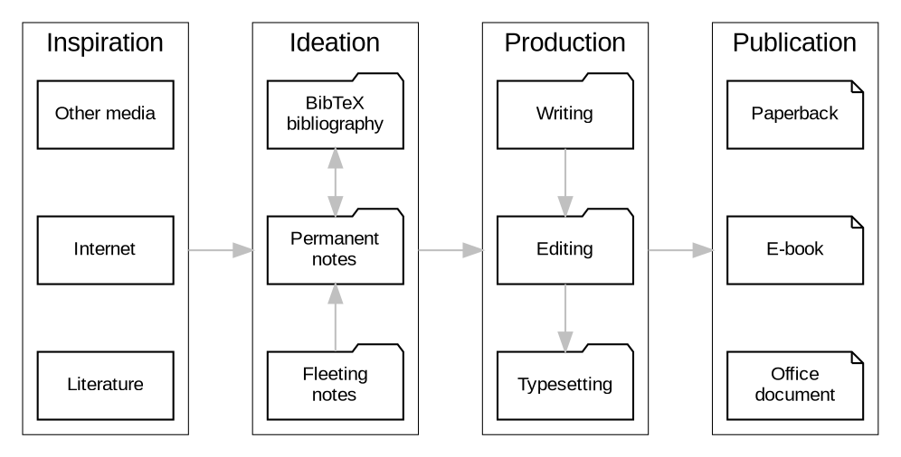

## 2.1 서론 {#2-dot-1-서론}

Emacs의 공식 슬로건은 "확장 가능한 자체 문서화 텍스트 편집기"입니다. 이 말은 Emacs의 본래 목적이 소프트웨어 개발 도구로서의 역할에 초점을 맞추고 있기 때문에, Emacs의 진정한 가치를 제대로 설명하지 못합니다. Emacs는 정보 관리, 프로젝트 추적, 글쓰기 및 출판, 웹사이트 제작 등 텍스트 기반 활동을 도와주는 다목적 컴퓨팅 환경입니다. Emacs는 생산성 해킹 시스템으로서, 단순한 생산성 도구가 아닙니다. Emacs는 생산성 도구의 스위스 군용 칼입니다.

Richard Stallman은 40년 이상 전에 첫 번째 버전의 Emacs를 발표했습니다 (Stallman 1981b). 이렇게 오래된 소프트웨어가 구식으로 보일 수 있지만, 활발한 개발자 커뮤니티가 지속적으로 시스템을 개선하고 있습니다. Emacs가 확장 가능하다는 것은 사용자가 자신의 개인적인 필요에 맞게 설정할 수 있다는 의미입니다. Emacs 설정은 시스템이 사용자가 원하는 방식으로 동작하도록 지시합니다. 예를 들어, 키보드 단축키와 추가 기능을 포함합니다. Emacs는 또한 수천 개의 무료로 제공되는 패키지를 통해 확장 가능합니다. Emacs 패키지는 새로운 기능을 추가하거나 기존 기능을 강화하는 플러그인으로, 스마트폰의 앱과 같습니다.

수십 년 동안 여러 버전의 Emacs가 존재해왔습니다. 현재 가장 널리 사용되는 버전은 1984년 Richard Stallman이 처음 발표한 GNU Emacs입니다 (Johnson 2022). GNU Emacs(이하 Emacs)는 Free Software Foundation에서 배포하는 무료 소프트웨어입니다. 재단은 무료 소프트웨어를 다음과 같이 느슨하게 정의합니다:

> “무료 소프트웨어”는 사용자의 자유와 커뮤니티를 존중하는 소프트웨어를 의미합니다. 대략적으로 말해서, 사용자는 소프트웨어를 실행, 복사, 배포, 연구, 변경 및 개선할 자유를 가집니다. 따라서, "무료 소프트웨어"는 가격이 아닌 자유의 문제입니다. 이 개념을 이해하려면 "무료"를 "무료 음료"가 아닌 "자유로운 연설"로 생각해야 합니다.

무료 소프트웨어는 때때로 'libre 소프트웨어'라고도 불리며, 이는 자유 측면을 강조하기 위함입니다.

Emacs는 텍스트 편집기이지만, 이는 작가들에게는 의미가 없습니다. 작가의 관점에서 보면, Emacs는 글쓰기 과정의 한 단계인 편집만을 위한 도구가 아니라 텍스트 /처리기/입니다. 텍스트 편집기는 소프트웨어 개발자가 코드를 작성하기 위한 도구이고, 텍스트 처리기는 작가가 산문을 작성하기 위한 도구입니다. EWS는 Emacs를 작가의 도구로 변환하여 소프트웨어 편집기를 텍스트 처리기로 바꾸는 맞춤형 설정입니다.


## 2.2 왜 Emacs를 사용해야 하나요? {#2-dot-2-왜-emacs를-사용해야-하나요}

글쓰기 프로젝트를 진행할 때 작가들은 작업을 완료하기 위해 여러 도구가 필요합니다. 그들은 연구 도구에 메모를 적고, 데이터베이스에서 세밀하게 서지 목록을 작성합니다. 그런 다음 친숙한 워드 프로세서에서 글을 씁니다. 마감을 맞추기 위해 프로젝트 관리 도구를 사용하여 여러 작업을 조정합니다. 마지막으로, 집중적인 작업 후에는 Tetris 게임을 통해 잠시 휴식을 취할 수도 있습니다.

이러한 익숙한 장면의 문제는 각 프로그램이 새로운 기술을 배우고, 다른 내부 논리를 탐색하며, 개발자가 정한 워크플로우에 맞춰야 한다는 점입니다. 대부분의 소프트웨어는 유연하지 않아서, 사용자가 개발자의 비전에 맞춰야 하며, 몇 가지 설정 옵션을 제공하는 경우가 많습니다.

Emacs는 혁신적인 접근 방식을 제공합니다. 연구 메모를 작성하고, 서지 목록을 관리하며, 심지어 Tetris 게임도 하나의 통합된 환경 내에서 할 수 있습니다. 여러 프로그램을 익히는 대신 하나의 명령어 세트를 마스터하는 편리함을 상상해보세요. Emacs는 사용자의 선호도에 맞게 설정하고 커스터마이징할 수 있는 능력을 제공하여, 단순한 글쓰기 도구에서 개인 워크플로우의 확장으로 변모시킵니다. 소프트웨어를 조정하는 대신, 글쓰기에 집중할 수 있습니다.

이러한 설명은 약간 오해의 소지가 있을 수 있습니다. 왜냐하면 Emacs는 글쓰기 스튜디오가 되기 위해 다른 소프트웨어의 도움이 필요하기 때문입니다. Emacs는 또한 다른 무료 소프트웨어와의 인터페이스 역할을 합니다. 따라서 Emacs가 PDF, 오디오 또는 비디오 파일과 같은 바이너리 파일 형식으로 읽고 내보낼 수 있도록 추가 소프트웨어를 설치해야 합니다. Emacs는 또한 철자 검사, 고급 검색 및 다이어그램 생성과 같은 외부 소프트웨어에 의존합니다.

Emacs는 현대적인 그래픽 소프트웨어의 눈요기와는 다르게 보일 수 있지만, 그 겉모습은 단순함 속에 숨겨진 방법이 있습니다. 그 겉모습에 속지 마세요. 그 아래에는 견고하고 정교하게 제작된 현대적인 컴퓨팅 환경이 있으며, 이를 통해 방해 없는 글쓰기 도구로 변환할 수 있습니다.

또 다른 장점은 이 도구의 수명입니다. 지금 Emacs를 사용하는 방식은 앞으로 수십 년 동안 사용할 방식과 거의 동일할 것입니다. 1981년 Emacs 매뉴얼을 읽는 것은 최신 버전을 읽는 것과 거의 같습니다. 왜냐하면 기본 기능은 거의 변하지 않았기 때문입니다 (Stallman 1981a).

많은 작가들이 대형 문서를 처리할 때 상업용 워드 프로세서의 제약에 대해 불평합니다. 이러한 소프트웨어를 사용하는 것은 좌절감을 느끼게 할 수 있습니다. 이들 프로그램은 처음 개발될 때 종이 메모와 보고서가 지배하던 시대에 만들어졌으며, 그 이후로 크게 변하지 않았습니다. 그래픽 소프트웨어는 인쇄된 종이를 흉내내며, 대부분의 사람들이 전자 매체를 위해 글을 쓰는 현실을 반영하지 않습니다. Emacs는 이러한 패러다임에서 벗어나 콘텐츠와 디자인을 분리합니다. 이러한 해방적인 접근 방식은 아이디어를 만드는 데 집중할 수 있게 해주며, 최종 결과물의 디자인에 얽매이지 않게 합니다. 추가적인 이점으로, Emacs는 동일한 텍스트 파일을 쉽게 인쇄 가능한 PDF, 웹사이트, 또는 전자책으로 변환할 수 있습니다.


## 2.3 유연한 소프트웨어 {#2-dot-3-유연한-소프트웨어}

Emacs는 '유연한 소프트웨어' 플랫폼으로, 사용자가 원하는 대로 변경하고 개선할 수 있는 자유를 제공합니다. 유연한 소프트웨어의 첫 번째 원칙은 변경하기 쉽다는 것입니다. 고급 Emacs 사용자는 Emacs의 LISP 언어 버전인 Elisp를 사용하여 맞춤형 애플리케이션을 구축할 수 있습니다 (Monnier and Sperber 2020). 이 작업은 다소 어려워 보일 수 있지만, 가능성에 관한 것입니다. 초보 Emacs 사용자는 Elisp 지식이 없어도 시스템의 거의 모든 것을 설정할 수 있습니다.

이 책은 Emacs를 코드 작성 없이 사용하는 방법을 소개합니다. 마지막 장과 부록에서는 Elisp 사용을 시작하는 방법에 대한 안내를 제공하지만, 코드를 작성하지 않고도 Emacs를 작가로서 사용할 수 있습니다.

더 고급 애플리케이션을 사용하려면 Emacs Lisp를 배워야 할 수도 있습니다. 이러한 지식 요구는 장애물처럼 보일 수 있지만, 이를 배우면 컴퓨터를 사용하는 방식에 대해 거의 무한한 권한을 가지게 됩니다. 소프트웨어는 사용자에게 맞춰져야지, 그 반대가 되어서는 안 됩니다. 대부분의 Emacs 사용자는 자신이 개발한 것을 공유하므로, 자유롭게 그들의 작업을 복사할 수 있습니다. 또한, 수천 개의 무료로 제공되는 패키지를 통해 Emacs를 확장하고 설정할 수 있습니다. EWS는 작가의 필요를 충족시키기 위해 이러한 패키지를 큐레이션한 것입니다.

이러한 접근 방식의 장점은 소프트웨어를 사용할 때 완전한 자유를 가진다는 것입니다. 텍스트로 할 수 있는 한 거의 모든 것을 지시하고, 특정 필요에 맞게 설정할 수 있습니다. 단점은 현대 소프트웨어와는 다른 접근 방식을 필요로 한다는 점입니다. Emacs를 사용하면 컴퓨터를 사용하는 원래의 의도와 진정한 사용자 친화성으로 돌아가게 됩니다. 당신은 컴퓨터 사용 방식을 바꿀 준비가 되었나요? The Matrix의 유명한 장면을 인용하면:

> 만약 당신이 파란색 Microsoft 약을 먹으면, 이야기는 끝나고 모든 것이 그대로 남습니다. 만약 당신이 보라색 Emacs 약을 먹으면, 당신은 Wonderland에 남아 있게 되고, 저는 당신에게 토끼굴이 얼마나 깊은지 보여줄 것입니다.


## 2.4 사용자 친화성 재정의 {#2-dot-4-사용자-친화성-재정의}

Emacs의 매끄러운 그래픽 인터페이스가 없다는 점은 새로운 사용자를 단념시킬 수 있습니다. 불행히도, 대부분의 사람들은 사용자 친화성을 매끄러운 디자인과 마우스 사용과 혼동합니다. 그러나 그래픽 접근 방식은 전혀 사용자 친화적이지 않습니다. 왜냐하면 사용자가 자유를 잃기 때문입니다. 그래픽으로 구동되는 소프트웨어는 금박을 입힌 우리입니다. 그 안에서 일하는 것이 즐겁기는 하지만, 여전히 우리입니다.

Emacs는 화면에 표시된 문자의 의미에 집중하는 일반 텍스트 처리기입니다. 일반 텍스트는 일반 영어와 동일하지 않으며, 정보가 저장되는 방식과 관련이 있습니다. 일반 텍스트는 글꼴 크기, 색상 등의 속성을 숨기는 리치 텍스트의 반대입니다.

일반 텍스트는 가장 일반적으로 `.txt` 확장자를 가지며, 볼드 텍스트와 같은 서식이 없습니다. Windows 사용자라면 고전적인 Notepad 소프트웨어에 익숙할 것입니다. 그러나 HTML, Markdown, LaTeX, Org와 같은 다른 일반 텍스트 형식도 있으며, 이를 통해 일반 텍스트를 예술 작품으로 변환할 수 있는 다양한 기능을 포함하고 있습니다.

일반 텍스트는 모든 컴퓨터 시스템에서 읽을 수 있으므로, 특정 소프트웨어 패키지에 갇히거나 독점 형식에 문서를 잠글 걱정할 필요가 없습니다. Emacs에서 작성한 모든 것은 NotePad, TextEdit 또는 다른 유사한 소프트웨어로 읽을 수 있습니다. 유일한 차이점은 다른 프로그램이 Emacs의 다재다능함을 가지고 있지 않다는 것입니다. 일반 텍스트는 틈새 응용 프로그램이 아닙니다. 이 형식은 수십 년 동안 거의 변하지 않았으며, 앞으로도 사라질 가능성은 적습니다.

텍스트 모드는 '그래픽'을 표시할 수 있습니다. 1970년대 초등학교에 다닐 때, 우리 선생님은 컴퓨터 예술을 보여주셨습니다. 예술 작품은 이미지를 닮은 인쇄 문자로 구성되어 있었습니다. 예를 들어, 다음과 같은 고양이 그림입니다 (출처: [asciiart.eu](https://www.asciiart.eu/)). 그러나 이러한 고대 기술에 의존할 필요는 없으며, Emacs는 이미지를 표시할 수도 있습니다.

```text
 /\_/\
( o o )
==_Y_==
  =-'
```

그래픽 인터페이스는 물리적 세계를 시뮬레이션하여 화면에 있는 객체가 종이와 책상 위의 폴더처럼 보이게 합니다. 문서를 폴더로 끌어다 놓고, 문서가 종이에 인쇄된 것처럼 보이며, 작업이 끝나면 쓰레기통에 버립니다. 그래픽 인터페이스는 물리적인 무언가를 하고 있는 것처럼 느끼게 하는 마법의 속임수입니다 (Tognazzini 1993). 이러한 접근 방식은 편리할 수 있지만, 사용자가 컴퓨터가 어떻게 작동하는지 이해하는 것을 방해합니다. 워드 프로세서에서는 화면이 인쇄된 페이지처럼 보입니다. 이것은 미적으로 만족스러울 수 있지만, 작성자가 콘텐츠를 만드는 데 집중하지 못하게 하고 대신 서식을 조정하도록 유도합니다.

그래픽 소프트웨어는 _What You See is What You Get_ (WYSIWYG) 원칙을 따르며, 이는 화면이 인쇄된 문서처럼 보인다는 의미입니다. 이것은 인쇄된 문서를 작성할 때만 관련이 있습니다. 그러나 전자 텍스트의 대부분은 인쇄를 위해 쓰이지 않으므로, 디지털 시대에 WYSIWYG 접근 방식은 큰 의미가 없습니다.

그래픽 접근 방식은 마음을 콘텐츠에서 벗어나게 하고, 사용자가 스타일을 편집하는 데 집중하게 만듭니다. WYSIWYG 소프트웨어의 텍스트는 리치 텍스트로, 콘텐츠와 디자인을 포함합니다. 리치 텍스트 내부의 서식 지시문은 사용자에게 보이지 않으며, 최종 결과물이 원하는 대로 보이도록 하는 데 문제가 발생할 수 있습니다. 전 세계의 사무직 근로자들은 그래픽 환경에서 문서를 서식하고 조판하는 데 엄청난 시간을 낭비합니다.

일반 텍스트는 _What You See is What You Mean_ (WYSIWYM) 접근 방식을 사용합니다. 문서의 디자인에 집중하는 대신, WYSIWYM 편집기는 각 요소의 의도된 의미를 보존합니다. 섹션, 단락, 삽화 등의 문서 요소는 다양한 규칙을 사용하여 라벨링됩니다 (Khalili and Auer 2015). 일반 텍스트에서는 콘텐츠와 의미가 직접적으로 보이고 사용자가 변경할 수 있습니다.

일반 텍스트 파일은 가장 기본적인 형식이며, 어떤 의미도 포함하지 않습니다. HTML, LaTeX, Markdown, Org와 같은 다른 일반 텍스트 형식은 최종 결과를 정의하는 지시어 세트를 포함합니다 (마크업). 표 [Table 1](#table--tab-plaint-text)는 네 가지 인기 있는 일반 텍스트 형식에서 /이탤릭 텍스트/를 표시하는 방법을 보여줍니다.

<a id="table--tab-plaint-text"></a>
<div class="table-caption">
  <span class="table-number"><a href="#table--tab-plaint-text">Table 1</a>:</span>
  일반 텍스트 형식에서의 이탤릭 텍스트 표시.
</div>

| 형식     | 이탤릭 의미          |
|--------|-----------------|
| HTML     | `<i>Italic Text</i>` |
| LaTeX    | `\emph{Italic Text}` |
| Markdown | `_Italic Text_`      |
| Org mode | `/Italic Text/`      |

일반 텍스트를 사용하면 콘텐츠를 완성할 때까지 문서의 디자인에 대해 걱정하지 않고 더 생산적이 될 수 있습니다. 일반 텍스트를 리치 텍스트보다 사용하는 주요 이점은 방해 없는 글쓰기 환경을 제공한다는 것입니다. 이 책을 작성하면서, 저는 현대 워드 프로세서를 사용할 때처럼 인쇄된 형태로 어떻게 보일지 보지 않습니다. Emacs에서 저는 텍스트, 이미지, 그리고 최종 결과물이 어떻게 보여야 하는지에 대한 컴퓨터에 대한 지시만을 봅니다. 이 문서를 웹 페이지 또는 다른 형식으로 내보낼 때, 템플릿이 최종 결과물의 디자인, 레이아웃 및 타이포그래피를 정의합니다. 이러한 접근 방식은 텍스트가 여러 형식으로 쉽게 내보낼 수 있도록 보장합니다.

그림 [Figure 1](#figure--fig-wysiwym)은 Emacs에서 글쓰기를 하는 모습을 보여줍니다. 왼쪽은 이 장의 일부를 보여주는 Emacs 화면이고, 오른쪽은 콘텐츠를 PDF로 컴파일한 결과를 보여줍니다.

<a id="figure--fig-wysiwym"></a>



요약하자면, 그래픽 소프트웨어를 사용하는 것보다 일반 텍스트로 글을 쓰는 이점은 다음과 같습니다:

1.  사용하는 소프트웨어에 독립적입니다.
2.  텍스트, 메타데이터 및 마크업이 보입니다.
3.  화면에 방해 요소가 없습니다.
4.  모든 형식으로 내보낼 수 있는 능력.


## 2.5 학습 곡선 {#2-dot-5-학습-곡선}

-   [-] 학습 곡선 그래픽

Emacs는 가능한 설정의 우주 때문에 가파른 학습 곡선을 가지고 있습니다. Emacs를 사용하려면 기본 원칙과 관련된 추가 패키지를 배워야 합니다. Emacs는 다른 일반 텍스트 처리기보다 복잡하지만, 다른 어떤 도구보다 훨씬 강력합니다. 그러나 이러한 큰 권한에는 큰 책임이 따르므로, 주요 글쓰기 도구로 사용하기 위해 새로운 기술을 배워야 합니다.

EWS의 목적은 학습 곡선을 완화하여 수많은 가능성에 압도되지 않고 필요한 기능만을 마스터하는 것입니다. 설정 없이도 Emacs는 많은 일을 할 수 있습니다.

Emacs의 방법과 어휘는 다른 현대 소프트웨어와 비교하여 낯설게 보일 수 있습니다. 이러한 차이의 주된 이유는 개발이 1970년대에 시작되었으며, 그 당시의 컴퓨팅 경험이 현재와는 상당히 달랐기 때문입니다. Emacs 어휘는 이전 시대의 유물로, 컴퓨팅의 진화 과정에서 남겨진 잔재입니다. 예를 들어, 파일을 여는 것은 '파일 방문'입니다. 텍스트를 붙여넣는 것은 '얀킹'이고, 자르는 것은 '킬링'입니다. Emacs 용어는 절단, 붙여넣기, 파일을 폴더로 옮기는 등의 손재주 용어보다 더 시적입니다. 이러한 차이점은 Emacs의 매력뿐만 아니라 그 힘의 일부입니다. Emacs의 이러한 익숙한 작업의 대체는 현대 소프트웨어에서 흔히 볼 수 있는 것보다 더 강력합니다. 하지만 이러한 가파른 학습 곡선은 그만한 가치가 있습니다. 저의 개인적인 만트라는 다음과 같습니다:

> 학습 곡선이 가파를수록, 보상도 큽니다.


## 2.6 Emacs의 장점과 한계 {#2-dot-6-emacs의-장점과-한계}

Emacs를 사용하여 작성된 콘텐츠를 만드는 주요 장점은 다음과 같습니다:

1.  대부분의 컴퓨팅 활동을 수행하는 단일 소프트웨어는 하나의 시스템만을 마스터하면 되므로 더 생산적입니다.
2.  모든 정보를 일반 텍스트 파일에 저장합니다. 특이한 파일 형식으로 인한 문제가 없습니다.
3.  거의 모든 것을 자신의 워크플로우에 맞게 수정할 수 있습니다.
4.  Emacs는 GNU/Linux, Windows, Chrome, MacOS 등 주요 운영 체제에서 실행됩니다.
5.  Emacs는 대규모 커뮤니티가 지원하는 무료(libre) 소프트웨어입니다.

이 다기능 편집기를 찬양한 후, Emacs가 소프트웨어의 전능한 신인 것처럼 생각될 수도 있습니다. 일부 사람들은 이 놀라울 정도로 유연한 소프트웨어 환경에 대한 찬사를 표현하기 위해 /Emacs 교회/를 설립하기도 했습니다. 이러한 찬사에도 불구하고, Emacs에는 몇 가지 한계가 있습니다.

Emacs는 이미지를 표시하고 텍스트와 통합할 수 있지만, 그래픽 파일을 생성하거나 수정하는 기능은 제한적입니다. 그림을 만들거나 편집해야 한다면 GIMP(GNU Image Manipulation Program)를 고려하세요. 비디오 콘텐츠는 파일이나 웹사이트에 대한 하이퍼링크 외에는 지원되지 않습니다. 그러나 이러한 한계는 Emacs의 핵심 기능이 텍스트 처리라는 점에서 용서받을 수 있습니다.

두 번째 단점은 Emacs에 완전한 웹 브라우저가 포함되어 있지 않다는 것입니다. Emacs 내에서 웹을 탐색할 수 있지만, 일반 텍스트 인터페이스의 제한 내에서만 가능합니다. 그러나 일반 텍스트로 웹사이트를 읽는 것도 몇 가지 장점이 있습니다. 방해 없는 브라우징 경험과 보안을 제공합니다.

마지막으로, Emacs는 생산성의 함정이 될 위험이 있습니다. 모든 것을 설정할 수 있다고 해서 반드시 그렇게 해야 하는 것은 아닙니다. 워크플로우 _에_ 시간을 너무 많이 소비하지 마세요. 그 시간을 워크플로우 /내/에서 보내고 글을 쓰세요. 대부분의 생산성 해킹은 실제로 출력에 큰 영향을 미치지 않습니다. 왜냐하면 당신은 키보드가 아닌 마음으로 글을 쓰기 때문입니다.


## 2.7 _Emacs Writing Studio_ 워크플로우 {#sec-workflow}

이 책은 연구자와 작가가 원고를 준비하고, 작성하고, 출판할 때의 일반적인 워크플로우를 따릅니다. 실제 생활에서 글쓰기 과정은 복잡하고 혼란스러운 경우가 많으며, 연속적인 반복 주기를 포함합니다. 그러나 세부 사항에서 벗어나면 질서 있는 패턴이 나타납니다. 우리는 문헌을 읽고 영감을 얻고, 새로운 아이디어를 개발하며, 새로운 작품을 제작하고, 결과를 출판합니다. 비록 현실은 이 목록이 제안하는 것만큼 선형적이지 않지만, 이 책의 내용을 구성하는 데 도움이 되는 유용한 가이드입니다 (그림 [Figure 2](#figure--fig-workflow)).



<a id="figure--fig-workflow"></a>



이 워크플로우의 기본 원칙은 저자가 문학, 웹, 영화, 기타 출처(_영감_)에서 정보를 수집해 노트 필기 시스템에서 처리하는 것입니다. 이러한 노트는 정보와 영감의 중심 저장소이며 참고 문헌(_아이디어_)으로 연결될 수 있습니다. 이러한 아이디어와 노트는 글쓰기 과정(_프로덕션_)의 기초를 형성합니다. 원고가 완성되면 저자는 원고를 최종 형식으로 출판합니다(_출판_). 하지만 다섯 번째 단계가 있습니다. 긴 하루의 글쓰기와 편집이 끝나면 시스템을 좋은 상태로 유지하기 위해 /관리/도 해야 합니다.


### 2.7.1 영감 {#2-dot-7-dot-1-영감}

아이디어는 허공에서 갑자기 떠오르는 것이 아닙니다. 우리의 생각, 계획, 영감은 우리가 경험한 것과 읽고, 듣고, 보는 것에서 비롯됩니다. Emacs는 상상할 수 있는 모든 일반 텍스트 형식을 읽고 PDF 파일, 전자책, 이미지를 표시할 수 있는 광범위한 기능을 가지고 있습니다. Emacs 내에서 팟캐스트를 듣거나 비디오를 시청하는 것은 불가능하지만, 멀티미디어 애플리케이션과 통합할 수 있는 인터페이스를 제공할 수 있습니다. 또한, 전자 문헌 컬렉션을 정리하고 접근하기 위한 서지 목록을 유지할 수 있습니다. Emacs는 또한 일반 텍스트 인터페이스 내에서 인터넷을 탐색할 수 있습니다. 5장에서는 Emacs를 사용하여 전자책을 읽고, 인터넷을 탐색하며, 멀티미디어 파일을 소비하는 방법을 논의합니다.


### 2.7.2 아이디어화 {#2-dot-7-dot-2-아이디어화}

이러한 새로운 아이디어를 모두 흡수하는 것은 새로운 영감을 기록하지 않는 한 가치가 없습니다. 따라서 아이디어화 과정을 촉진하기 위해 메모를 유지하는 것이 필수적입니다. 메모는 일시적인 아이디어일 수도 있고, 보관할 가치가 있는 영구적인 생각일 수도 있습니다.

Emacs는 일반 텍스트로 메모를 저장하는 데 이상적인 도구입니다. 개인 지식 관리 시스템을 개발하기 위해 여러 패키지를 사용할 수 있습니다. EWS 워크플로우의 이 단계는 Protesilaos (Prot) Stavrou의 Denote 패키지를 중심으로 돌아갑니다.

특정 메모 기록 방법을 따를 필요는 없습니다. 저의 개인 메모 컬렉션은 유기적으로 성장한 태그를 사용하여 분류하고, 기회적으로 파일을 연결하는 아이디어의 원시적 혼합입니다. 디지털 사색 외에도, PDF 또는 사진과 같은 바이너리 파일을 포함하여 보관할 가치가 있는 모든 것을 Denote에 추가할 수 있습니다. 6장에서는 Org와 Denote 패키지를 사용하여 개인 지식 관리 시스템을 개발하는 방법을 논의합니다.


### 2.7.3 생산 {#2-dot-7-dot-3-생산}

생각을 모은 후, 글을 쓰기 시작할 때입니다. Org는 기사와 책을 작성하거나 웹사이트를 개발하는 데 이상적입니다. Emacs 개발자들은 글쓰기 과정을 돕기 위해 완성, 문법 검사, 사전, 시소러스 등 필수적인 도구를 포함한 많은 추가 유틸리티를 발표했습니다. 생산 단계에서는 다른 작가들과 협업할 수도 있으며, 이를 위해 다양한 버전을 관리해야 합니다. 7장에서는 Org를 사용하여 기사, 웹사이트, 책을 작성하고 대형 프로젝트를 관리하는 방법을 설명합니다.


### 2.7.4 출판 {#2-dot-7-dot-4-출판}

당신의 노력의 결실을 출판할 영광스러운 순간이 도래했습니다. Org는 텍스트를 다양한 형식으로 내보낼 수 있는 강력한 기능을 가지고 있습니다. 가장 중요한 것은 공유를 위한 워드 프로세서 문서, 물리적 책을 위한 PDF 파일, 전자책을 위한 ePub, 웹사이트를 위한 HTML, 기업 문서를 위한 ODT입니다. Org는 LaTeX 문서 준비 시스템을 통해 인쇄 준비가 된 PDF 파일로 내보내며, 이는 기술 작가와 출판사에게 인기 있지만, 모든 유형의 물리적 책에 사용할 수 있습니다. 8장에서는 Org를 사용하여 일반 텍스트 문서를 전자 또는 물리적 출판물로 변환하여 세상과 공유하는 방법을 논의합니다.


### 2.7.5 관리 {#2-dot-7-dot-5-관리}

글쓰기 프로젝트를 진행하는 것은 창의적 표현의 멋진 여정이지만, 프로젝트를 관리하는 데도 약간의 오버헤드가 있습니다. Emacs는 다른 GNU 소프트웨어와 인터페이스하여 강력한 디렉토리 편집기(Dired)를 사용하여 파일을 관리할 수 있게 도와줍니다. 또한, Emacs는 내장된 Image-Dired 패키지를 통해 사진과 이미지를 관리할 수 있습니다. 마지막으로, 대형 프로젝트에서 많은 작업을 추적해야 합니다. Org는 프로젝트를 추적하는 데 도움이 되는 완전한 기능의 작업 관리 시스템을 가지고 있습니다. 개인 워크플로우를 구현하거나 Getting Things Done(GTD) 접근 방식을 사용할 수 있습니다. 9장에서는 파일과 프로젝트를 관리하여 글쓰기 프로젝트에서 궤도에 오르는 방법을 논의합니다.


## 2.8 이 책을 읽는 방법 {#2-dot-8-이-책을-읽는-방법}

이 책은 기술적인 Emacs 매뉴얼이 아니라 작가들을 위한 가이드 투어입니다. 연구, 글쓰기, 출판에 대한 일반적인 사용 사례를 설명하고 Emacs를 사용하여 이를 구현하는 방법을 설명합니다. 각 장에는 더 자세히 탐구할 수 있는 포괄적인 내장 도움말 시스템에 대한 참조가 포함되어 있습니다. 이 책에 있는 지식은 글쓰기 프로젝트를 시작하는 데 충분하며, Emacs 자체에는 키보드 닌자가 되기 위해 필요한 모든 문서가 포함되어 있습니다.

다음 장에서는 기본 설정되지 않은 바닐라 GNU Emacs 시스템을 사용하는 원칙을 설명하여 학습 곡선을 시작합니다. 그러나 Emacs 사용자는 설정되지 않은 상태로 소프트웨어를 사용하지 않습니다. EWS 설정은 Emacs의 외관과 느낌을 변경하고, 필요한 정보를 찾는 데 도움이 되는 향상 기능을 추가합니다. EWS는 또한 작가들을 돕기 위한 Emacs 패키지(플러그인) 시리즈를 사용합니다. 예를 들어, Citar는 서지 목록에 접근하는 데 사용되고, Denote는 메모를 작성하는 데 사용됩니다. 4장에서는 EWS 설정의 원칙을 설명합니다.

5장부터 8장까지는 글쓰기 프로젝트의 일반적인 워크플로우를 설명합니다. 연구에서 글쓰기, 출판까지의 과정을 보여줍니다. 이 장에서는 기사, 책, 웹사이트를 읽는 방법(5장)과 Emacs를 개인 지식 관리 시스템으로 변환하는 방법(6장)을 설명합니다. 또한, 출판을 위한 원고 준비 방법(7장)과 다양한 형식으로 내보내는 방법(8장)도 설명합니다.

9장에서는 프로젝트와 파일 관리를 포함한 관리 작업을 다룹니다. Org 모드는 달력과 작업 목록을 관리하는 강력한 기능을 제공하여 생산성을 유지하는 데 도움이 됩니다. 이 장의 마지막 부분에서는 Emacs를 사용하여 파일을 관리하는 방법을 보여줍니다. 대형 프로젝트를 진행할 때 파일을 복사, 붙여넣기, 이름 바꾸기 등의 작업이 필요할 것입니다. Dired(디렉토리 편집기) 패키지는 이러한 작업을 수행하는 데 필요한 모든 것을 제공합니다.

마지막 장인 10장에서는 Emacs 닌자가 되는 방법에 대한 몇 가지 조언을 제공하며, Emacs Lisp에 대한 짧은 소개를 포함하여 지식을 심화하는 방법을 설명합니다. 이 책의 부록에는 EWS 설정을 주석으로 달아 설명하고, 이를 읽고 변경하는 방법에 대한 안내를 제공합니다.

이 책을 읽는 가장 좋은 방법은 컴퓨터 앞에 앉아서 읽는 내용을 실시간으로 시도하는 것입니다. 다양한 옵션을 실험하고, 파일을 만들고, 주변을 탐색해 보세요.
