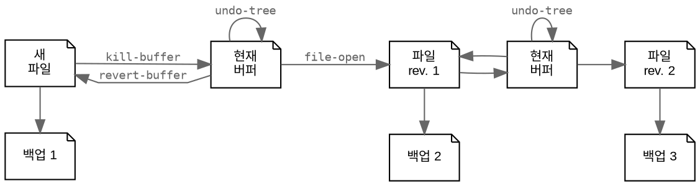
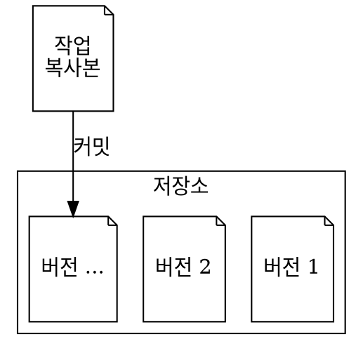

## 7.1 서론 {#7-dot-1-서론}

[BROKEN LINK: chap-vanilla] 장에서는 일반 텍스트 문서 작성의 기초를 다루었고, [BROKEN LINK: chap-ews] 장에서는 Org 문법의 기본을 소개했습니다. 이 장에서는 이러한 기초를 바탕으로 Org 모드의 독특한 기능과 추가 도구를 사용하여 원고를 출판 준비하는 방법을 안내합니다.

이 장에서는 편집 메모, 인용 및 교차 참조를 추가하는 방법을 보여줍니다. 또한, 글쓰기 과정을 가속화하기 위해 텍스트 완성 기능을 사용할 수 있습니다. 사전이나 동의어 사전 없이 글을 작성하는 것은 글의 품질을 관리하는 데 어려움이 있을 수 있으므로, 다양한 산문을 향상시키기 위해 사전과 동의어 사전을 사용하는 방법도 설명합니다. 이 장에서는 대형 글쓰기 프로젝트를 관리하고 버전을 제어하며 다른 저자들과 협업하는 방법도 설명합니다.

이 장의 마지막 섹션에서는 기술 문서용 Markdown과 영화 및 연극 대본용 특화된 Fountain 모드와 같은 다른 텍스트 모드를 소개합니다.


## 7.2 메모, 인용 및 참조 추가 {#7-dot-2-메모-인용-및-참조-추가}

일반적인 글쓰기 프로젝트는 단순히 원고의 단어만으로 이루어지는 것이 아닙니다. Org의 포괄적인 기능 세트는 주석, 인용, 교차 참조를 위한 스마트한 일반 텍스트 구조를 포함하여 원고를 풍부하게 만듭니다. 우리는 이미 Org 파일의 프론트 매터에서 메타데이터를 다루었습니다, 예를 들어 `#+title:` 같은 것들입니다. Org는 이미지, 표, 서랍을 포함하는 구문을 제공합니다, 이는 이전 장에서 설명되었습니다.

이 섹션에서는 원고를 출판 준비하기 위해 Org의 추가 기능을 도구 모음에 추가합니다. Org는 최종 제품에서 무시되는 문서에 메모를 추가할 수 있는 기능을 제공합니다. 이 섹션에서는 또한 귀하의 서지에서 인용을 추가하고 문서의 제목, 표 및 기타 부분에 대한 교차 참조를 만드는 방법을 설명합니다.


### 7.2.1 문서 메모 추가 {#sec-notes}

이전 장에서는 Emacs에서 단일 Org 파일 내에서든, 상호 연결된 파일 네트워크 내에서든 노트 작성의 다양성을 자세히 설명했습니다. 글쓰기 프로젝트 내에서도 정식 노트 작성 시스템 외부에 메모를 작성할 수 있습니다. 이러한 메모는 보류 중인 작업이나 최종 제품에서 숨기고 싶은 다른 정보를 상기시키기 위해 사용됩니다. 예를 들어, 체크리스트, 웹사이트 링크, Denote 디지털 정원의 노트 또는 글쓰기 과정에 대한 중요한 정보를 포함할 수 있습니다. 현재 문서와 관련 없는 메모를 적어야 한다면, Org 캡처 시스템을 사용하여 인박스에 일시적인 메모를 저장하세요 (장 [BROKEN LINK: chap-ideation] 참조).

Org 모드는 편집 메모를 추가하기 위한 세 가지 유연한 메커니즘을 제공합니다. 첫 번째 방법은 간단합니다. 해시태그/파운드 기호(`#`)로 시작하는 모든 줄은 주석으로 처리되며, Emacs는 최종 출력으로 내보낼 때 이를 무시합니다.

```text
* 이는 편집 주석입니다.
```

또한 구조 블록 내에 메모를 추가할 수 있습니다. 이는 다양한 유형의 콘텐츠를 추가하는 데 사용되는 Org 모드 구조입니다. 메모를 위해 `C-c C-,` (`org-insert-structure-template`)를 사용하면, 템플릿을 삽입하는 메뉴가 팝업됩니다. `C`를 눌러 주석 섹션을 추가하면, 원고에 두 줄이 추가됩니다. 이 두 줄 사이에 작성한 내용은 주석이 됩니다. 글쓰기 표면을 깔끔하게 유지하기 위해, 커서가 `#+BEGIN` 또는 `#+END` 줄에 있을 때 Tab 키로 주석 블록을 접을 수 있습니다. 구조 템플릿 메뉴의 다른 옵션들은 다음 장에서 논의됩니다.

이 구조를 사용하여 더 이상 주요 문서의 일부가 아닌 텍스트를 저장할 수도 있습니다. 이 명령을 텍스트 영역을 선택한 후 실행하면, 선택된 텍스트가 주석이 됩니다. 주석 블록 내에 동적 블록을 포함할 수도 있습니다. 이는 원고와 관련된 노트 모음에 대한 링크를 추가하는 데 유용합니다.

```text
 #+BEGIN_COMMENT
 - 이는 주석입니다
 - 또 다른 주석
 #+END_COMMENT
```

세 번째 방법은 현재 제목 아래에 서랍을 사용하는 것입니다. 이는 주석 구조 블록과 유사하게 작동합니다. 주요 차이점은 서랍이 이름을 가지고 있다는 점입니다, 예를 들어 `:NOTES:`. Tab 키로 서랍을 열거나 닫을 수 있습니다. 아래는 서랍이 어떻게 보일 수 있는지에 대한 예시입니다.

```text
:NOTES:
- 이는 서랍 안에 있습니다.
- 이곳에 메모를 채울 수 있습니다.
:END:
```

서랍은 일반적으로 제목 바로 아래에 배치되지만, 원하는 위치에 삽입할 수 있습니다. `org-insert-drawer` 명령을 호출하면(`C-c C-x d`), 현재 위치에 서랍을 삽입합니다. 미니버퍼에서 서랍의 이름을 입력하고(관례적으로 대문자로, 예: `NOTES`) 서랍의 내용을 채웁니다. 텍스트 블록을 선택하고 서랍을 생성하면, 그 텍스트가 서랍 안에 나타납니다. 이 방법을 사용하여 최종 제품에서 숨기고 싶은 텍스트 부분을 유지할 수도 있습니다.

사용자 정의 _Emacs Writing Studio_ (EWS) 함수(`ews-org-insert-notes-drawer`)는 `C-c w n` 키보드 단축키에 바인딩되어 있으며, 이 함수는 작성 중인 섹션의 제목 아래로 커서를 이동시키고 `NOTES`라는 이름의 서랍을 생성합니다. 이 섹션에 이미 메모 서랍이 존재하면, 함수는 기존 항목의 끝에 새 줄을 만듭니다. 메모를 작성한 후, `C-u C-<spc>`는 텍스트의 원래 위치로 커서를 되돌려줍니다.

이러한 메모 서랍은 원고의 장을 완성하기 위해 수행해야 할 작업 목록을 추가하는 데 유용합니다. 섹션 [BROKEN LINK: sec-clarify]는 할 일 목록의 진행 상황을 추적하기 위한 체크리스트를 만드는 방법을 설명합니다.


### 7.2.2 인용 추가 {#sec-citations}

인용은 학술 글쓰기의 본질이며 학문적 경력의 통화로, 귀하의 작업의 영향력과 영향을 나타냅니다. Org 모드는 이 여정에서 당신의 동반자가 되어, BibTeX, BibLaTeX, 또는 CSL 파일을 읽을 수 있는 인용 관리 도구를 제공합니다. 시작하려면, 서지 목록을 만들어야 합니다. 이를 수동으로 할 수도 있고, Zotero와 같은 서지 관리 도구에서 파일을 연결할 수도 있습니다, 이는 장 [BROKEN LINK: chap-inspiration]에서 논의되었습니다.

`org-cite-insert` (`C-c C-x @`) 명령은 인용을 삽입할 때 사용하는 주요 명령입니다. /Emacs Writing Studio/에서는 이 명령이 Citar 메뉴를 열어, 하나 이상의 출판물을 선택할 수 있게 합니다. 여러 참조를 선택하려면 각 선택 후 Tab 키를 사용하세요. Org는 다음과 같은 인용을 삽입합니다:

```text
[cite:@einstein_1905; @newton_1728]
```

Citar 메뉴는 현재 파일에서 인용된 항목에 `C` 표시를 사용하여 표시합니다. `:c` 키를 사용하여 Citar에서 인용된 항목만 볼 수 있습니다.

Citar 패키지는 인용 관리를 위한 몇 가지 편리한 기능을 제공합니다. 인용 블록 내에서 인용의 순서를 변경하려면, 인용 위에 커서가 있을 때 Shift와 좌/우 화살표 키를 사용하세요 (`citar-org-shift-reference-left` / `-right`). 인용을 제거하려면, 인용 위에 커서가 있을 때 `C-c C-x <del>` (`citar-org-remove-citation`)를 사용하세요. 인용은 접두사와 접미사를 가질 수 있습니다, 예를 들어:

```text
[cite:see@darwin1859 p. 123]
```

이 인용은 인용 스타일에 따라 "(Darwin, 1859 p. 123)"으로 렌더링될 수 있습니다. 인용 위에 커서가 있을 때 `M-p` (`citar-org-update-prefix-suffix`)로 접두사와 접미사를 편집할 수 있습니다. 다음 장의 섹션 [BROKEN LINK: sec-basic]에서는 Org의 인용 관리 시스템이 어떻게 내보내고 형식을 지정하는지 논의합니다.

인용과 관련된 자원에 접근하려면, `org-open-at-point` (`C-c C-o`) 명령을 사용하세요. 이는 커서 아래의 인용에 대한 Citar 메뉴를 엽니다. 기존 메모나 첨부 파일이 없을 때 인용 링크를 따르면, 시스템은 새 메모를 생성하라는 메시지를 표시합니다. 서지 목록에 없는 인용은 빨간색으로 표시됩니다.

서지 목록은 전역적이거나 로컬일 수 있습니다. 전역 서지 목록은 Emacs의 어느 곳에서나 접근 가능합니다. 이는 `ews-bibtex-directory` 변수 내의 BibTeX 파일에 의해 정의됩니다. 반면에, 로컬 서지 파일은 현재 Org 버퍼 내에서만 사용 가능합니다. 전역 서지 목록은 설정에서 설정됩니다. 섹션 [BROKEN LINK: sec-bib]에서 설명한 바와 같이, 하나 이상의 파일로 구성될 수 있습니다. 로컬 서지 목록은 현재 버퍼에 프론트 매터의 키워드로 연결됩니다, 예를 들어:

```text
#+bibliography: bibfile.bib
```


### 7.2.3 캡션 및 교차 참조 {#7-dot-2-dot-3-캡션-및-교차-참조}

이 책과 같은 포괄적인 문서를 읽을 때, 내부 링크를 활용하면 텍스트의 가독성을 높일 수 있습니다. Org의 이 기능은 특정 섹션, 그림 또는 원고의 다른 부분으로 독자를 안내할 수 있게 하여, 글쓰기를 더 쉽게 탐색할 수 있게 합니다.

그림과 표를 참조하는 것은 간단합니다. 캡션 아래에 `#+name:` 키워드를 사용하여 항목에 이름을 지정하세요, 예: `#+name: fig-example`. 이 항목을 참조하고자 할 때, 이름을 이중 대괄호로 묶어(`[[fig-example]]`) 참조합니다. Org는 자동으로 이미지나 표의 위치로 링크를 생성합니다, 이는 섹션 [BROKEN LINK: sec-links]에서 설명되었습니다.

섹션 또는 장에 대한 참조는 대상 제목의 이름으로 링크를 구성합니다. 따라서 이 특정 섹션에 대한 링크는 `[[Captions and cross references]]`가 됩니다. 이 방법은 제목 이름을 변경했지만 참조하는 링크를 수정하지 않으면 링크가 깨질 위험이 있습니다. 또한 제목에 속성을 추가하여 사용자 정의 ID를 설정할 수도 있습니다. `org-set-property` (`C-c C-x p`)를 사용하고, `CUSTOM_ID`를 선택한 다음 원하는 ID를 입력합니다. 사용자 정의 ID에 대한 링크는 해시태그가 필요합니다. 그래서 이 책의 섹션에 대한 링크는 `sec-references`라는 사용자 정의 ID를 가질 수 있으며, 링크는 `[[#sec-references]]`로 정의됩니다. 해시태그가 없으면, Org 모드는 동일한 이름의 섹션으로 링크합니다. 혼란스럽게도, 명명된 표와 이미지에 대한 교차 참조는 해시태그가 필요하지 않습니다.

내부 링크의 이름은 원고 내에서 고유해야 하며, 링크를 명확하게 하고 중복을 줄이기 위해 `fig:`, `tab:`, `chap-`, 등의 접두사를 사용하는 것이 좋은 관례입니다. Org는 제목에 고유 식별자를 추가하여 링크 이름이 고유하도록 할 수 있지만, 이를 사용하면 원고를 따르기 어려워집니다(섹션 [BROKEN LINK: sec-permanent-notes] 참조). Org는 최종 문서 내에서 교차 참조 링크를 내보내는 방법을 논의합니다(장 [#chap-publication] 참조).


## 7.3 생산성 도구 {#7-dot-3-생산성-도구}

Emacs는 다양한 도구를 통해 글쓰기 프로세스를 간소화하고 품질을 유지하는 데 도움을 줄 수 있습니다. 예를 들어, 텍스트 완성 기능이 있습니다. 글쓰기는 집중력을 요구하므로, Emacs는 그래픽 소프트웨어의 방해로부터 벗어난 고요한 환경을 제공합니다. 마지막으로, Emacs는 문법 도구와 동의어 사전을 통합하여 글쓰기 품질을 향상시킬 수 있는 기능을 제공합니다.


### 7.3.1 프로젝트의 내용 검색 {#7-dot-3-dot-1-프로젝트의-내용-검색}

`consult-grep` 명령은 현재 폴더의 모든 파일의 내용을 검색합니다(`C-c w g`). 이 명령은 섹션 [BROKEN LINK: sec-find-notes]에서 설명한 바와 같이 Grep 외부 소프트웨어가 필요합니다. 이 명령을 보편적 인수와 함께 사용하면 먼저 검색할 디렉토리를 선택할 수 있습니다.

검색 기능은 유연합니다. 정규 표현식을 사용하여 검색할 수 있습니다. 해시태그 사이의 검색어는 단어가 포함된 파일 목록을 제공합니다. 이후의 검색어는 목록을 좁힙니다.

-   `#alpha omega`: alpha와 omega를 순서에 상관없이 검색합니다.
-   `#alpha./beta`: alpha가 omega 전에 있는 것을 검색합니다.
-   `#alpha#omega`: alpha를 검색하고, omega로 빠르게 필터링합니다.


### 7.3.2 약어 확장 {#7-dot-3-dot-2-약어-확장}

정부와 기업의 공식 문서는 약어와 약어로 가득 차 있습니다. 약어는 현대의 문제가 아니며, 글쓰기의 시작부터 인기 있었습니다. 로마의 석조 비문은 대부분 약어로 이루어져 있어, 라틴어를 이해하더라도 읽기 어렵습니다. 로마 작가들은 단어를 약어로 사용했기 때문에 대리석에 글을 새기는 노력을 줄일 수 있었습니다. 그러나 전자 글쓰기 시대에는 더 이상 약어가 필요하지 않으며, 완전한 단어를 작성하는 노력은 무시할 수 있을 정도입니다. 전자 글쓰기 시스템은 자동으로 약어를 전체 문맥으로 확장할 수 있어, 텍스트를 더 쉽게 읽을 수 있게 합니다.

Emacs 'abbrev'는 미리 정의된 문자 조각이 다른 것으로 확장되는 것입니다. 기술 글쓰기는 종종 공식적이므로, 학자는 "stbl"을 "shown in table"로 자동으로 변환하고 싶을 수 있습니다 (Fox and Tigchelaar 2015).

Emacs Abbrev 모드는 기본적으로 개인 스니펫 라이브러리를 정의하여 더 큰 텍스트 덩어리로 확장할 수 있게 해줍니다. EWS는 기본적으로 모든 텍스트 모드에 대해 Abbrev 모드를 활성화합니다. 기본 기능은 사용자가 약어를 정의하고, 예를 들어 "ouat"을 입력하면 Emacs가 이를 "once upon a time"으로 확장하는 것입니다.

약어(abbrevs)는 모든 모드에 적용될 수도 있고, 특정 모드에만 적용될 수도 있습니다. 이 섹션에서는 전역 약어만 논의하지만, 동일한 원칙이 모드별 약어에도 적용됩니다.

`define-global-abbrev` 함수는 전역 약어를 정의합니다. 미니버퍼에서 약어와 그 확장을 입력하면 설정됩니다. 다음에 약어를 입력하면 공백이나 구두점 마크에 의해 확장됩니다. 약어를 대문자로 시작하면 확장도 대문자로 됩니다, 그래서 예제에서 "Ouat"는 "Once upon a time"으로 확장됩니다.

텍스트 내에서 전역 약어를 정의하려면 `C-x a g` (`add-global-abbrev`)를 입력하세요. 커서 앞의 단어까지의 문자가 확장으로 사용됩니다, 미니버퍼에 표시됩니다. 다음으로 약어를 입력하고 Enter를 눌러 저장합니다. 약어를 정의한 후 확장을 입력하는 역함수는 `C-x a i g` (`inverse-add-global-abbrev`)로 활성화됩니다.

약어는 여러 단어 또는 여러 단락의 표준화된 텍스트 섹션으로 확장될 수 있습니다. 관련 텍스트를 선택하고, `C-x a g`로 약어를 정의한 후, `C-g`를 눌러 선택을 취소합니다.

Emacs 약어는 비밀번호와 비슷합니다. 기억하기 쉬워야 하지만 사전 단어와 동일해서는 안 됩니다. 그러나 비밀번호와 달리 구두점 마크를 포함할 수 없습니다. 사전 단어를 사용하면 원하지 않는 확장으로 인해 좌절할 수 있습니다. 이 문제를 당신의 이점으로 사용하여, 자주 철자가 틀리는 단어를 약어로 정의할 수 있습니다, 예를 들어 "teh"를 "the"로 확장합니다. 텍스트에 약어를 표시해야 한다면, 약어 후에 `C-Q`를 입력하고 계속 입력하세요.

약어 명령 앞에 음수 접두 인수(`C-u -`)를 사용하면 약어를 테이블에서 제거합니다. 그래서 `C-u - C-x a g`를 사용하여 전역 약어를 제거하고, 선택한 약어를 입력한 후 Enter를 누릅니다.

약어 모음을 검토하려면 ~list-abbrevs~를 사용하세요. 이 명령은 각 관련 주요 모드에 대한 모든 약어 목록이 포함된 새 읽기 전용 버퍼를 엽니다, 그래서 "global-abbrev-table"을 검색하세요. 약어 테이블은 다음과 같이 보일 수 있습니다:

```text
(global-abbrev-table)

"stbl"             3    "shown in table"
"ouat"             7    "once upon a time"
"teh"             10    "the"
```

이 목록은 약어, 숫자, 확장을 보여줍니다. 중간의 숫자는 약어가 얼마나 자주 사용되었는지를 나타내며, 광범위한 약어 모음을 정리할 때 유용합니다.

약어 테이블은 편집 가능하므로, 약어 모음을 정의하거나 수정할 수 있습니다. 따옴표로 묶인 새 약어를 입력하고, 0과 따옴표로 묶인 확장을 입력하면, 디스크에 저장한 후 원고에서 사용할 수 있습니다.

파일을 저장할 때, 현재 약어 테이블이 저장된 버전과 동일하지 않으면, Emacs는 약어를 초기 디렉토리에 저장하라는 메시지를 표시합니다. 이 메커니즘은 미래의 Emacs 세션에서도 시간 절약 도구 모음을 사용할 수 있도록 보장합니다.

Emacs 매뉴얼에는 약어 사용 및 구성에 대한 광범위한 문서가 포함되어 있으며, 일부 고급 기능도 포함되어 있습니다(`C-h r g abbrev`).


### 7.3.3 플레이스홀더 텍스트 {#7-dot-3-dot-3-플레이스홀더-텍스트}

_Lorem Ipsum/은 웹 디자인, 타이포그래피 및 인쇄에서 페이지의 최종 결과가 어떻게 보일지 보여주기 위해 사용되는 가상의 라틴어 플레이스홀더 텍스트입니다. 이 텍스트는 기원전 45년에 로마의 정치가이자 철학자인 키케로의 논문 /De Finibus Bonorum et Malorum_ (선과 악의 극단)에서 유래되었습니다. 첫 두 단어(_lorem ipsum_)는 _dolorem ipsum_ ("고통 자체")의 축약입니다.

이 텍스트의 주요 목적은 뷰어의 주의를 레이아웃, 타이포그래피 및 시각적 요소에 집중시키는 것입니다. 이 패키지는 텍스트의 의미에 주의를 빼앗기지 않고 레이아웃을 설계할 수 있게 합니다. 다음 장에서는 문서의 타이포그래피와 레이아웃에 대해 더 자세히 논의합니다.

EWS에는 _Lorem Ipsum_ 단락을 생성하는 패키지가 포함되어 있으며, `C-c w s i` 키로 접근할 수 있습니다. 여러 요소를 삽입하려면 숫자 접두사를 사용하세요, 예를 들어 `M-6 C-c w s`는 여섯 개의 임의 단락을 삽입합니다.


### 7.3.4 텍스트 케이스 변환 {#sec-titlecase}

Emacs에는 단어와 영역을 소문자와 대문자로 변환하는 내장 함수가 있습니다(섹션 [BROKEN LINK: sec-mistakes] 참조). 산문을 쓸 때, 책 제목, 장, 기타 제목을 정의된 규칙에 따라 대문자로 표시해야 할 때가 있습니다.

Case Duckworth의 Titlecase 패키지는 영어 산문에 대한 타이틀 케이스를 제공합니다. `titlecase-dwim` 함수(`C-c w s t`)는 선택된 영역 또는 현재 줄/단락을 변환합니다. `titlecase-style` 변수를 사용자 정의하여 원하는 타이틀 케이스 스타일을 설정할 수 있습니다. 사용자 정의 메뉴는 APA 스타일 가이드에 따른 타이틀 케이스 스타일을 설정할 수 있는 드롭다운 상자를 제공합니다.

EWS에는 현재 Org 버퍼의 모든 제목을 순환하며 대문자로 변환하는 편리한 함수(`ews-org-headings-titlecase`)가 포함되어 있습니다. 이 기능을 사용하려면 `C-c w s c`를 사용하세요. 보편적 인수(`C-u`)를 사용하면 제목이 문장 케이스로 변환되어 첫 번째 단어만 대문자로 됩니다. 기본적으로 이 함수는 모든 제목을 원하는 케이스로 변환합니다. `ews-org-heading-level-capitalise` 변수를 설정하면 특정 레벨까지의 제목만 변환하거나 기본값으로 모든 제목을 변환할 수 있습니다. 예를 들어, 이 변수를 1로 설정하면 최상위 제목만 대문자로 변환되고, 하위 제목은 변경되지 않습니다.

불행히도, 영어의 변덕스러운 특성 때문에 알고리즘을 사용하여 완벽하게 제목을 대문자로 변환하는 것은 불가능합니다. 예를 들어, 알고리즘은 단어와 약어의 차이를 이해하지 못합니다. 따라서 컴퓨터를 절대 신뢰하지 말고, 출판 전에 제목을 교정하세요.


### 7.3.5 깨끗한 글쓰기 인터페이스 {#7-dot-3-dot-5-깨끗한-글쓰기-인터페이스}

창의적인 산문은 완전한 집중력을 요구하며, 방해는 저자의 천적입니다. 컴퓨터는 가장 중요한 글쓰기 도구이지만, 방해가 될 수도 있습니다. 대부분의 글쓰기 소프트웨어는 아이콘과 문서 디자인을 변경하는 옵션으로 가득 차 있습니다. 방해 없는 글쓰기 도구는 이러한 방해 요소를 화면에서 제거하여, 저자가 내용에 집중할 수 있게 합니다.

Olivetti는 방해 없는 글쓰기를 돕는 Emacs의 마이너 모드입니다. 이름은 유명한 이탈리아 타자기 브랜드에서 유래되었습니다. 이 마이너 모드는 텍스트의 너비를 70자로 줄이고 창의 중앙에 텍스트를 배치합니다. 텍스트의 너비는 `olivetti-set-with` 명령(`C-c \`)으로 변경할 수 있습니다.

EWS는 Olivetti 모드의 사용을 사용자 친화적인 함수(`C-c w o`)로 강화합니다. 이 명령은 Olivetti 모드(`ews-olivetti`)를 활성화하고, 현재 창 구성과 커서 위치를 저장합니다. 글쓰기 환경을 향상시키기 위해 텍스트 크기를 키우고, 집중된 화면을 만듭니다. 이 기능을 다시 활성화하면 이전 창 및 커서 설정을 복원하여, 방해 없는 글쓰기 모드와 일반 글쓰기 모드 간에 쉽게 전환할 수 있습니다.

Emacs에는 폴더 내의 모든 파일에 대해 변수를 자동으로 활성화하거나 함수를 평가할 수 있는 고급 기능이 있습니다. 프로젝트 폴더에 `.dir-locals.el` 파일을 만들고 아래 구문을 추가하면, 해당 디렉토리 내의 Org 파일을 열 때마다 Emacs가 `ews-olivetti` 함수를 평가합니다. 고급 사용자는 이 파일을 사용하여 Emacs lisp 코드를 작성하여, 해당 폴더에 대한 init 파일을 재정의할 수 있습니다.

```elisp
((org-mode (eval . (ews-olivetti))))
```


### 7.3.6 품질 보증 {#sec-qa}

자동화된 철자 검사는 문법적으로 올바른 글쓰기를 보장하는 훌륭한 도구이지만, 때로는 더 많은 맥락을 얻기 위해 단어를 사전에서 찾아야 할 때가 있습니다. Emacs에는 온라인 소스에 연결하여 사전 검색 기능이 내장되어 있습니다. EWS의 기본값은 _Collaborative International Dictionary of English_ (CIDE)로, 1913년 웹스터 사전에서 파생되었습니다(`dict.org`). 이 사전의 내용은 전 세계의 자원봉사자들이 관리합니다.

현재 커서가 있는 단어를 찾으려면, `dictionary-lookup-definition` (`C-c w s d`)를 사용하세요. 관련 정의를 제공하는 사전 화면이 팝업됩니다. 다른 버퍼와 마찬가지로 창을 스크롤할 수 있습니다. 사전 버퍼에는 다른 정의된 단어로 연결되는 링크가 포함되어 있으며, Enter 키로 이를 따를 수 있습니다. `n` / `p` 키를 사용하여 하이퍼링크 간을 이동합니다. 새 단어를 찾으려면, `m`을 입력하거나 화면 상단의 `[Search Definition]` 버튼을 클릭하세요.

단어가 부족한 것은 저자들에게 흔한 병이고, 대부분의 경우 다양한 산문을 추가하기 위해 동의어 사전을 사용하는 것이 치료법입니다. Valeriy Savchenko의 Power Thesaurus 패키지는 `powerthesaurus.org` 웹사이트에 연결됩니다. 이 웹사이트는 영어 단어의 포괄적인 온라인 보물 창고를 제공하는 커뮤니티 프로젝트입니다. 이 패키지는 동의어, 반의어, 관련 단어, 정의 및 예시 문장을 제공할 수 있습니다.

동의어 사전을 활성화하려면 `C-c w s p` (`powerthesaurus-transient`)를 사용하여, 세 가지 유형의 유사성과 두 가지 정의에 대한 선택 메뉴를 제공합니다. 기본 단어는 커서가 있는 단어이거나 텍스트에서 선택한 구절입니다. 이 도구는 커서 아래의 단어를 대체할 대안 목록을 제공합니다.

글쓰기의 핵심 기술은 올바른 단어를 선택하는 것입니다. 마찬가지로 중요한 것은 사용하지 말아야 할 단어를 아는 것입니다. WriteGood 모드는 Benjamin Beckwith가 작성한 것으로, 세 가지 기본 문제를 검토합니다: 위스키 워드, 수동태 및 중복. WriteGood 모드는 텍스트에서 문제를 강조 표시하여 색상으로 표시합니다. 마우스를 올리면 강조된 단어에 대한 맥락을 제공합니다.

위스키 워드는 종종 정치인과 마케터가 말하고자 하는 것을 위장하기 위해 사용됩니다. 위스키 워드는 의미를 빨아들이는 단어이기 때문에, 마치 위스키가 달걀을 빨아들이듯이 (Watson 2004). 정의된 위스키 워드 목록은 `C-h v writegood-weasel-words`로 찾을 수 있습니다. 이 변수를 사용자 정의하여 일부를 제거하거나, 자신의 버전을 추가하거나, 모국어에 맞는 목록을 만들 수 있습니다.

글쓰기에서 개선해야 할 또 다른 영역은 수동태입니다. 수동태는 마치 이야기를 거꾸로 말하는 것과 같습니다. "The dog chased the cat" 대신에 "The cat was chased by the dog"라고 말하는 것입니다. 수동태 문장은 종종 주어가 행위를 수행하는 것을 모호하게 만들며, 문장이 더 장황해질 수 있습니다. 특히 기술적이고 공식적인 글쓰기에서 명확성과 정확성이 중요할 때 이러한 형태는 혼란을 초래할 수 있습니다. 또한, 능동태는 일반적으로 산문을 더 역동적이고 흥미롭게 만들어, 주어와 그들의 행동을 강조함으로써 가독성을 향상시킵니다. 수동태는 글쓰기에서 자리 잡고 있지만, 가능하면 피해야 합니다(의도된 말장난).

WriteGood 모드는 수동태를 감지하고 이를 표시합니다. "to be" 형태가 "ed"로 끝나는 단어를 따라오는 것을 감지하여 이를 수행합니다. 이 소프트웨어는 불규칙 동사 목록도 사용하며, 이를 `writegood-passive-voice-irregulars` 변수를 사용자 정의하여 볼 수 있습니다.

중복된 단어는 텍스트를 복사하고 붙여넣는 과정에서 흔히 발생하는 아티팩트입니다. 우리의 마음은 중복된 단어를 잘 감지하지 못하며, 뇌는 종종 단어를 건너뛰고 누락된 부분을 채웁니다 (Rayner et al. 2011). WriteGood 모드는 중복된 단어를 밑줄로 표시합니다.

WriteGood 패키지는 또한 Flesch 읽기 용이성 점수를 계산하여 영어 텍스트가 얼마나 쉽거나 어려운지 평가할 수 있습니다. 점수는 0에서 약 120 사이입니다. `writegood-reading-ease` 함수(`C-c w s r`)로 이 테스트를 수행할 수 있습니다. 수학적으로 관심 있는 사람들을 위해, 다음과 같은 공식으로 가독성 지수를 계산합니다:

\\[206.835 - 1.015 \left( \frac{\text{단어}}{\text{문장}} \right)-84.6\left( \frac{\text{음절}}{\text{단어}} \right)\\]

이 테스트는 우리가 직관적으로 알고 있는 것을 확인합니다. 긴 문장(단어당 문장)과 긴 단어(단어당 음절)가 있는 텍스트는 읽기 어렵습니다. 가독성 점수가 낮을수록 텍스트를 이해하기 쉬워집니다. 참고로, /Reader's Digest/의 가독성 지수는 약 65, /Time Magazine/은 약 52입니다. /Harvard Law Review/의 일반적인 가독성 점수는 30대 초반입니다 (Lipovetsky 2023). `writegood-grade-level` 명령(`C-c w s l`)은 읽기 용이성 점수를 학년 수준 점수로 변환합니다. 이 테스트는 선택한 텍스트를 읽기 위해 필요한 학교 연수를 나타냅니다.

이 장의 Flesch-Kincaid 읽기 용이성 점수는 약 70이고, 학년 수준은 7.5입니다. 이러한 유형의 테스트는 대략적인 과학이므로 복음으로 받아들이지 마세요. 단어와 문장을 세는 것은 단어와 문장의 정의에 대한 가정에 따라 달라집니다(섹션 [7.4.2 단어 수 세기](#sec-count) 참조).


## 7.4 글쓰기 프로젝트 관리 {#7-dot-4-글쓰기-프로젝트-관리}

글쓰기 프로젝트는 단순히 가능한 한 많은 단어를 문서에 넣는 것 이상입니다. Org는 여러 파일로 프로젝트를 분할하고, 단어 수를 관리하며, 원고의 전체 진행 상황을 추적하는 기능을 제공합니다.


### 7.4.1 대형 프로젝트 작성 {#sec-include}

대형 파일을 작업하는 것은 번거로울 수 있으며, 경우에 따라 Emacs의 속도를 늦출 수도 있으므로, 대형 프로젝트를 여러 파일로 나누는 것이 종종 좋은 접근법입니다. Org는 여러 파일을 참조하여 글쓰기 프로젝트를 분할할 수 있습니다.

이 책을 작성할 때, 나는 주 파일과 각 장에 대한 파일을 만들었습니다. 주 파일에는 각 장에 대한 참조가 포함되어 있습니다. 예를 들어, `#+include: "chapter-02.org"`를 추가하면, `chapter-02.org`라는 파일이 주 문서 내에 포함됩니다. 이 줄이 있는 위치에서 내보내기 중에 텍스트가 포함됩니다.

커서가 포함 줄에 있을 때 `C-c '` (`org-edit-special`)로 자식 문서를 방문할 수 있습니다. Org는 포함할 자식 문서의 어느 부분을 결정하는 추가 옵션을 가지고 있습니다. 예를 들어, 포함된 파일의 제목 줄을 제외하려면 `:lines "2-"`를 키워드에 추가하세요. 이 매개변수는 Org 모드에 두 번째 줄부터의 텍스트만 포함하도록 지시합니다:

```text
* 장 1
#+include: "chapter-01.org" :lines "2-

* 장 2
#+include: "chapter-02.org" :lines "2-
```

이 방법으로 문서를 포함하면, 포함된 문서의 제목 레벨은 포함된 하위 트리의 레벨 아래에 위치하게 됩니다. 예를 들어, 소스에서 레벨 1 제목 아래에 문서를 포함하면, 포함된 문서의 레벨 1 제목은 레벨 2가 되고, 레벨 2는 레벨 3가 됩니다. 위의 예제는 다음과 같은 결과를 가져옵니다:

```text
* 장 2
* "chapter-2.org"의 레벨 1 제목
** "chapter-2.org"의 레벨 2 제목
```

이 방법을 사용하면 책이나 논문을 작성하고 각 장을 별도의 파일에 저장할 수 있습니다, 이 책의 경우와 마찬가지로. 주 파일을 최종 출판물로 내보낼 때, 모든 포함된 파일이 하나로 내보내집니다.

여러 파일을 프로젝트에서 사용할 때 두 가지 문제를 주의해야 합니다. 다른 파일에 대한 교차 참조 링크를 추가할 수 있지만, 이러한 링크는 프로젝트를 단일 파일이나 웹사이트로 내보낼 때까지 기능하지 않습니다. 둘째, 로컬 서지 목록에 의존하는 경우, 이를 사용하는 모든 개별 파일에서 참조해야 합니다, 속성은 참조된 파일에 의해 상속되지 않기 때문입니다.


### 7.4.2 단어 수 세기 {#sec-count}

단어 수를 세는 것은 모든 저자에게 표준 활동입니다. 나는 이 책의 각 장에 대해 5,000에서 10,000 단어를 목표로 합니다. 활성 버퍼의 강조된 부분의 단어 수를 세려면, `M-=` (`count-words-region`)을 사용하세요. 이 함수는 에코 영역에 줄, 문장, 단어, 문자의 수를 표시합니다.

보편적 인수를 추가하면 전체 버퍼의 단어를 셉니다(`C-u M-=`). `count-words` 함수는 기본 키보드 단축키가 없으며, 버퍼 또는 선택된 영역의 모든 단어를 계산합니다. 여기서 줄은 논리적 줄을 의미하며, Visual Line 모드를 사용할 때는 단락과 동일합니다.

단어를 세는 것은 정확한 과학이 아니며, 결과는 문자, 단어 또는 문장의 정의에 따라 달라집니다. 문자를 셀 때, Emacs는 공백과 의미론적 구조, 예를 들어 Org 파일의 메타데이터도 포함합니다. 주로 컴퓨터 코드 편집기인 Emacs는 하이픈으로 연결된 단어나 구두점으로 구분된 단어를 두 개의 단어로 계산합니다.

기본적으로 Emacs는 문장을 마침표와 이중 공백으로 끝나는 문자열로 정의합니다. 이 기본 설정은 문장을 셀 때 잘못된 결과를 생성하므로, EWS는 이 동작을 비활성화합니다. 타자기 시절에는 문장 끝에 이중 공백을 추가하는 것이 의미가 있었지만, 대부분의 스타일 매뉴얼, 예를 들어 _The Chicago Manual of Style_,는 단일 공백을 권장합니다 (, 섹션 University of Chicago Press 2017, 2.9). 최종 제품으로 텍스트를 내보낼 때, 조판 소프트웨어는 문장 사이에 적절한 공백을 삽입합니다. 이 방법의 유일한 단점은 "E. W. S."와 같은 약어가 여러 단어와 문장으로 계산된다는 점입니다.

원고의 각 장이나 섹션의 단어 수를 세려면, 문서의 각 부분에 대해 `count-words-region~을 실행해야 합니다. EWS는 이 작업을 자동화하고 각 제목에 대한 단어 수를 표시하는 편리한 함수를 제공합니다. ~ews-org-count-words` (`C-c w c`) 함수는 모든 제목을 순환하며 속성 서랍에 단어 수를 추가합니다. 이는 앞서 설명한 메모 서랍과 유사하게 작동하는 또 다른 종류의 서랍입니다. 상위 레벨 제목의 단어 수는 하위 제목의 내용을 포함합니다. 이 방법을 사용하면 각 섹션에 대한 목표를 추가하여 진행 상황을 모니터링할 수도 있습니다. `C-c C-x p` (`org-set-property`)를 사용하고, `TARGET`을 입력한 다음 원하는 단어 수를 입력하세요. 물론, 서랍을 직접 편집할 수도 있습니다.

```text
 * 제목
   :PROPERTIES:
   :WORDCOUNT: 305
   :TARGET: 300
   :END:
```

속성 서랍은 Org 버퍼를 데이터베이스로 변환할 수 있는 강력한 기능입니다. 이러한 속성을 표 형식으로 볼 수 있습니다. 먼저 표시할 속성을 정의해야 합니다. 이를 위해 Org 버퍼의 프론트 매터에 다음 줄을 추가하세요:

```text
#+columns: %40ITEM(섹션) %10WORDCOUNT(단어 수) %10TARGET(목표)
```

백분율 기호 다음의 숫자는 열의 크기를 나타내며, 숫자 다음의 텍스트는 속성 이름과 일치합니다; 여기서 `ITEM`은 제목 텍스트를 나타냅니다. 괄호 안의 텍스트는 열의 표시 이름입니다. 이제 `C-c C-x C-c` (`org-columns`)로 단어 수와 목표를 표 형식으로 볼 수 있습니다. 이 기능을 평가할 때, 계층 구조의 최상위 레벨(문서의 시작 부분)에 커서가 있어야 합니다. 이 보기는 상단 줄을 표 제목으로 사용하여 오버레이로 생성됩니다.

모든 제목은 회색 배경을 가지며, 정의된 속성의 값을 포함합니다. 문서를 `S-<TAB>`으로 순환하면, 문서의 개요와 내용 레벨에서 표가 나타납니다.

제목은 읽기 전용이 되며, 정의된 속성을 열로 포함합니다. 커서가 제목 중 하나에 있을 때 몇 가지 옵션이 있습니다. `c` 버튼은 제목을 접어, 오버레이만 표시하고, 기본 텍스트는 표시하지 않습니다. 여전히 텍스트를 편집할 수 있지만, 비주얼 라인 모드는 비활성화됩니다.

화살표 키로 표를 탐색할 수 있습니다. 속성을 `e` 키로 편집할 수 있습니다. 미니버퍼에서 내용을 변경하고 Enter를 누릅니다. `g` 키는 열을 재설정합니다. 열 오버레이 위에 커서를 놓고 `q`를 눌러 오버레이를 제거합니다.


### 7.4.3 글쓰기 상태 추적 {#7-dot-4-dot-3-글쓰기-상태-추적}

일반적인 글쓰기 워크플로는 초기 초안에서 편집된 버전, 완료된 텍스트까지 다양한 단계를 거칩니다. 프로젝트의 여러 부분을 작업하면서 각 장의 상태를 파악하는 것이 좋습니다. Org 모드는 프로젝트 관리를 위한 광범위한 시스템을 포함하고 있으며, 이를 원고의 진행 상황을 추적하는 데 배치할 수 있습니다. 이 섹션은 이 기능에 대한 간략한 소개일 뿐입니다. 섹션 [BROKEN LINK: sec-gtd]는 프로젝트 관리에 대해 더 자세히 설명합니다.

Org 모드의 각 제목은 `TODO`, `DRAFT` 또는 `EDITED`와 같은 상태 토큰을 가질 수 있습니다. 커서가 제목에 있을 때 Shift와 좌/우 화살표 키를 사용하여 상태 토큰을 추가할 수 있습니다. `C-c C-t` 단축키(`org-todo`)도 사용할 수 있습니다. 기본적으로 시스템은 `TODO`와 `DONE` 상태만 인식합니다. 그러나 Org 모드는 추가 워크플로 상태를 추가할 수 있도록 해주며, 이를 통해 시스템을 특정 요구에 맞게 유연하게 조정할 수 있습니다. 아래 예제는 Org 모드가 이 파일에서만 이 네 가지 상태 토큰을 순환하도록 지시합니다. 세로 막대(파이프 기호) 앞의 토큰은 진행 중인 상태이며, 보통 빨간색으로 표시됩니다. 세로 막대 뒤의 항목은 완료된 상태이며, 녹색으로 표시됩니다.

```text
  #+todo: TODO 초안 편집 | 최종
```

이전 섹션에서 논의한 요약 테이블에 제목의 상태를 추가하려면, 프론트 매터의 열 정의에 `%20TODO(상태)` 또는 유사한 것을 추가하세요.


## 7.5 버전 제어 및 협업 {#sec-vcs}

글쓰기 과정에서 텍스트의 흐름이나 구조를 수정하는 것은 드문 일이 아닙니다. 중요한 정보를 유지하기 위해 Emacs가 버퍼나 파일의 다양한 버전을 어떻게 관리하는지 이해하는 것이 중요합니다. 글쓰기는 고독한 활동처럼 보일 수 있지만, 종종 다른 저자와 편집자와 협업하게 됩니다. 이러한 상황에서 버전 제어는 협업 정신을 유지하는 데 중요한 역할을 합니다.

Emacs는 화려한 클라우드 협업 시스템을 자랑하지는 않지만, 버전을 제어하는 다양한 방법을 제공합니다. 가장 낮은 수준에서는 현재 버퍼와 디스크에 저장된 버전이 있습니다. 보다 세부적인 수준에서는 현재 버퍼 내의 모든 변경 사항을 추적하는 되돌리기 시스템이 있습니다. 또 다른 방법은 내장 백업 시스템을 사용하여 파일의 이전 버전을 저장하고, 원고의 진화를 보존하는 것입니다. 고급 요구 사항을 위해, Emacs는 버전 제어 소프트웨어와 인터페이스하여, 다른 저자나 편집자와 협업할 때 파일을 정식으로 체크인 및 체크아웃할 수 있습니다.


### 7.5.1 현재 버퍼 되돌리기 {#7-dot-5-dot-1-현재-버퍼-되돌리기}

항상 작업 중인 텍스트의 두 가지 버전이 있습니다. 마지막으로 저장된 버전과 현재 버퍼입니다. `revert-buffer` 명령을 사용하면, 마지막 저장 이후의 모든 변경 사항을 버리고 파일을 디스크에서 다시 로드하여, 버퍼를 초기화합니다. 이는 핵심적인 옵션이므로 주의해서 사용하세요. 버퍼를 되돌리는 것은 엄청난 실수를 했거나, 현재 Emacs 세션 외부에서 파일을 업데이트했을 때만 사용해야 합니다.


### 7.5.2 되돌리기 트리 {#7-dot-5-dot-2-되돌리기-트리}

섹션 [BROKEN LINK: sec-mistakes]에서는 Emacs의 강력한 되돌리기 시스템을 사용 해서 실수를 수정하는 방법을 논의했습니다. 그러나 되돌리기와 다시 실행 명령을 반복적으로 사용하면, 문서의 이전 상태에서 쉽게 길을 잃을 수 있습니다. Toby Cubitt의 Undo Tree 패키지는 파일의 다양한 편집을 트리로 시각화하여, 글쓰기 시간 여행을 제공합니다.

`undo-tree-visualise` (`C-c w u`) 명령은 파일의 다양한 편집을 트리로 시각화합니다. 이 함수는 화살표 키를 사용하여 이전 버전의 텍스트를 탐색할 수 있게 해줍니다. 역사 속에서 이동하면 현재 버퍼가 변경되며, `x`는 선택된 단계를 표시합니다. 선택한 편집을 선택하고 계속 글을 쓰려면 `q`를 사용하세요. `C-q` 키는 되돌리기 트리에서 변경 없이 빠져나갑니다.

대부분의 경우 트리는 단순히 직선입니다. 되돌리기와 다시 실행 명령을 결합할 때 문서에 병렬 버전이 생성되며, 이는 가지로 시각화됩니다. 간단한 예제에서 Socrates에서 Plato로 변경한 후 다시 Socrates로 돌아가고, 일부 텍스트를 추가한 경우의 되돌리기 트리는 다음과 같습니다:

```text
          o       "Socrates"
          |
          |
          o       ""
          |
         / \
"Plato" x   o     "Socrates"
            |
            |
            o     "Socrates and"
```

Undo-Tree 패키지는 문서가 열려 있는 동안 거친 다양한 상태를 관리하는 직관적인 방법을 제공합니다. Undo Tree 패키지에 대한 자세한 매뉴얼은 `describe-package` (`C-h P`)를 입력하고 ~undo-tree~를 선택하여 읽을 수 있습니다.


### 7.5.3 자동 백업 {#7-dot-5-dot-3-자동-백업}

파일을 다시 작성하면 이전 내용이 파괴되어, 몇 시간 동안의 글쓰기를 한 순간에 잃을 수 있습니다. 이러한 재앙을 방지하기 위해 Emacs는 파일의 백업을 유지할 수 있습니다.

Emacs는 파일에 처음으로 내용을 추가할 때 백업을 생성합니다. 따라서 새로운 파일의 첫 번째 백업은 빈 파일입니다. 현재 세션에서 파일을 얼마나 자주 저장하든, 백업은 변경되지 않습니다. 새 글쓰기 세션을 시작할 때까지 백업 파일은 변경되지 않습니다. 버퍼를 닫고 파일을 다시 방문하면, 백업 파일이 생성됩니다. 이 백업은 다음 저장 시까지 현재 파일과 동일합니다. 보편적 인수(`C-u C-x C-s`)로 버퍼를 저장하면, 현재 버전이 백업 파일이 됩니다.

기본적으로 Emacs는 백업 파일을 원본 파일과 동일한 디렉토리에 저장하며, 이는 많은 파일로 인해 혼란을 초래할 수 있습니다. EWS는 백업을 Emacs 설정 디렉토리의 `backups` 폴더에 저장합니다. Emacs는 원본 파일 이름에 물결표(tilde)를 추가하여 백업 파일임을 나타냅니다, 그래서 `origin-of-species.org`의 백업은 `origin-of-species.org~`가 됩니다. EWS는 또한 파일의 마지막 세 버전을 유지하도록 설정되어 있습니다. Emacs는 파일 이름 끝에 버전 번호를 추가합니다: `~1`, `~2`, 등.

디렉토리 편집기(`dired`)를 사용하여 사용 가능한 백업 파일을 볼 수 있습니다. `C-x d` 단축키를 사용하고 백업 폴더의 위치를 입력하세요(Emacs 설정 디렉토리 내). 화살표와 Enter 키를 사용하여 파일을 선택하고 엽니다. 장 [BROKEN LINK: chap-admin]은 디렉토리 편집기를 사용하는 방법을 자세히 설명합니다.

Emacs가 백업을 관리하는 방식은 혼란스러울 수 있으므로, 이를 시각화해 보겠습니다(그림 [Figure 1](#figure--fig-backups)). 새로운 파일을 생성하고 편집을 시작하면, 시스템은 백업을 생성합니다. 이 시점에서는 빈 파일이거나 파일이 처음 열린 상태의 내용입니다. 중간 버전을 편집하고 저장할 때, 새 백업은 보편적 인수로 파일을 저장하지 않는 한 생성되지 않습니다. 버퍼를 닫고 다시 열면, 새 백업이 생성됩니다. Undo-Tree 패키지는 라이브 버퍼 내에서 버전을 관리하며, 버퍼를 닫을 때 압축됩니다.

이러한 메커니즘은 정보를 잃을 위험을 거의 제로로 줄이는 세밀한 버전 제어를 제공합니다. Emacs 백업 시스템에 대한 자세한 내용은 `C-h r g backup`으로 관련 Emacs 매뉴얼 항목을 읽을 수 있습니다.



<a id="figure--fig-backups"></a>




### 7.5.4 파일 버전 비교 {#7-dot-5-dot-4-파일-버전-비교}

글쓰기 프로젝트가 진행됨에 따라, 동일한 파일의 다양한 버전을 가질 수 있습니다. 이는 여러분이 직접 작성하거나, 편집자나 다른 협업자가 작성한 것일 수 있습니다. 이 상황은 최신 버전이 무엇인지 확실하지 않거나, 최신 변경 사항을 모두 포함하는 새 버전을 만들어야 할 때 문제가 될 수 있습니다.

`ediff` 명령은 이러한 문제를 해결하는 데 도움을 줍니다. 두 개 또는 세 개의 파일을 비교하고 변경 사항을 관리할 수 있는 풍부한 인터페이스를 제공합니다. Ediff는 파일 간의 차이점을 시각화하고, 각 파일에서 선택한 부분을 주 버전에 병합할 수 있게 해줍니다.

Ediff를 사용하는 것은 간단합니다. `ediff` 명령을 시작하고 미니버퍼에서 두 파일을 선택하면, Emacs 프레임에 두 개의 창이 나란히 표시됩니다. Ediff는 왼쪽 창을 파일 A, 오른쪽 창을 파일 B로 지칭합니다. Ediff 제어 패널은 두 파일 창 아래에 위치합니다. 제어 패널을 통해 두 개의 열린 버퍼에 명령을 내릴 수 있어, 파일 비교 및 병합 과정을 쉽게 만듭니다.

`n`을 입력하면 Ediff가 다음 차이점으로 이동합니다. 차이점이 발생하는 단락이 강조 표시되며, 실제 차이점은 더 강한 배경색으로 표시됩니다. `n`을 반복적으로 입력하면 다음 차이점으로 이동하고, `p`는 이전 차이점으로 이동합니다. 제어 패널의 모드 라인은 차이점의 수와 진행 상황을 표시합니다. 강조된 섹션은 워드 프로세서 소프트웨어에서 사용하는 추적 변경과 효과적으로 동일합니다.

Ediff는 차이점을 처리하는 유연한 접근 방식을 제공합니다. 파일 A와 B를 동기화하거나 그 반대로 할 수 있으며, 제어 패널에서 `a` 또는 `b`를 입력하여 이를 수행할 수 있습니다. `a`를 사용하면 파일 A의 강조된 섹션을 두 파일 모두에 동기화하고, `b`를 사용하면 파일 B의 강조된 부분을 동기화합니다. Ediff의 적응성은 파일의 버전을 선택하여 필요에 맞게 병합할 수 있게 해줍니다.

또한, 파일 버퍼 중 하나로 커서를 이동하여 평소와 같이 수동으로 편집할 수도 있습니다. 그러나 이는 혼란을 줄 수 있으며, 직접 입력한 내용과 원래 내용을 구분하기 어려울 수 있습니다. Ediff 세션 중에 추가된 텍스트는 새로운 차이점으로 인식되지 않습니다. 세션을 종료하려면, 제어 패널에서 `q`를 입력하고 두 버퍼를 저장하거나 종료할지에 대한 프롬프트를 따르세요.

Ediff는 편집자(사람)와 작업할 때 유용합니다. 편집자에게 편집할 수 있는 일반 텍스트 파일을 보낼 수 있으며, 수정된 파일을 받으면 Ediff를 사용하여 제안된 변경 사항을 관리할 수 있습니다. 편집자가 일반 텍스트 파일을 사용하는 데 불편함을 느낀다면, 다음 장에서는 Org 파일을 일반 워드 프로세서 형식으로 내보내는 방법을 설명합니다.

Ediff는 이 책의 범위를 벗어나는 많은 기능을 가지고 있습니다. 제어 패널에서 물음표를 입력하면 옵션 목록이 표시됩니다. Ediff 매뉴얼은 `ediff-documentation` 또는 `C-h R ediff`로 읽을 수 있습니다.


### 7.5.5 버전 제어 {#7-dot-5-dot-5-버전-제어}

저자들이 전통적으로 버전 제어를 하는 방법은 파일 이름을 변경하여 글쓰기의 다양한 버전을 구분하는 것입니다. 예를 들어, `article-draft.org`와 `article-final-draft.org`와 같은 파일 이름을 가질 수 있습니다. 이 접근 방식은 모든 협업자가 동일한 프로세스를 따를 때 실용적일 수 있지만, 복잡하고 혼란스러울 수 있습니다. Ediff의 힘을 통해 파일 간의 변경 사항을 쉽게 추적할 수 있지만, 이 접근 방식은 번거롭습니다.

파일 이름 버전을 사용하면 프로젝트 디렉토리가 파일의 여러 복사본으로 어지럽혀집니다. Emacs 백업 시스템은 동일한 파일의 여러 버전을 유지할 필요를 방지합니다. 그러나 백업 시스템은 저장된 버전에 대한 활발한 제어를 제한적으로 제공합니다.

소프트웨어 개발자들은 종종 다른 코더들과 협업합니다. 그들은 동일한 코드의 버전 간 문제를 해결하기 위해 버전 제어 시스템(VCS)을 사용합니다. 이러한 도구는 해커뿐만 아니라 인간을 위해 글을 쓰는 저자들에게도 유익합니다.

VCS는 슈퍼차지된 파일 캐비닛과 같습니다. 개인 비서처럼, 문서의 모든 변경 사항을 추적하고, 이전 버전으로 돌아갈 수 있게 하며, 여러 초안을 혼동 없이 작업할 수 있게 합니다. 이 비서는 누가 어떤 변경을 했는지, 언제 했는지도 알려주어 협업을 쉽게 만듭니다.

버전 제어 시스템은 또한 작업의 다른 브랜치를 정의할 수 있습니다. 브랜칭은 병렬 우주를 만드는 것과 같습니다. 다른 스토리라인에 대해 작업할 수 있으며, 이를 혼동 없이 병합할 수 있습니다. 예를 들어, 소설을 작성 중이라면, 현재 초안을 위한 주 브랜치를 만들 수 있습니다. 대체 결말에 대한 아이디어가 떠오르면, "alternate-ending"이라는 새로운 브랜치를 만들어 작업할 수 있으며, 이를 주 초안에 방해하지 않고 수행할 수 있습니다. 편집자와 협업하는 경우, 그들은 자신의 브랜치에서 변경 사항을 제안하고 편집할 수 있습니다. 준비가 되면, 이러한 변경 사항을 주 초안에 병합할 수 있습니다.

VCS는 문서의 버전을 저장하므로, 신뢰할 수 있는 백업으로도 작동합니다. 컴퓨터가 충돌하거나 실수로 무언가를 삭제한 경우에도 작업을 복구할 수 있습니다. 마지막으로, VCS 도구는 특정 변경 사항에 대한 주석을 저장할 수 있습니다. 이는 왜 변경했는지 자신에게 상기시키거나 협업자와 소통하는 데 유용합니다. VCS는 혼란스러운 글쓰기 과정에 질서를 가져오며, 훌륭한 아이디어나 중요한 수정을 절대 잃지 않도록 보장합니다.

Emacs의 내장 VC 패키지는 가장 일반적인 버전 제어 시스템과 인터페이스할 수 있으며, 그 중 Git이 가장 인기 있습니다. 따라서 이 기능을 사용하려면 Git을 설치해야 합니다. Git은 Linus Torvalds가 Linux 개발을 지원하기 위해 개발한 분산 버전 제어 시스템입니다.

프로젝트에 Org 파일과 일러스트레이션을 포함한 디렉토리와 하위 디렉토리가 있다고 가정해 봅시다. 디렉토리가 버전 제어하에 있을 때, 이를 저장소 또는 해커 용어로 repo라고 합니다. 현재 디렉토리를 저장소로 초기화하려면 `vc-next-action` 명령(`C-x v v`)을 사용하세요.

이 명령은 다음 논리적 작업을 감지합니다, 이 경우에는 새로운 저장소를 생성하는 것입니다. 백엔드(Git)를 선택하고 버전 제어할 폴더를 선택해야 합니다. VC는 버전 제어 데이터를 프로젝트 디렉토리 내의 숨김 폴더에 저장합니다. Git의 경우 이는 `.git`입니다. 이 디렉토리에 대한 수동 변경은 버전 제어를 망가뜨릴 수 있으므로, 그대로 두세요. 버전 제어하에 있는 디렉토리의 파일은 중복을 방지하기 위해 Emacs 백업 시스템에서 무시됩니다.

이 프로세스에서 다음 논리적 작업은 파일을 저장소에 커밋하는 것입니다. 파일을 Git 저장소에 커밋한다는 것은 파일의 현재 상태를 저장소의 기록에 스냅샷으로 저장하는 것을 의미합니다(그림 [Figure 2](#figure--fig-vcs)). 파일을 변경하고 커밋하면, Git은 이를 저장소의 기록에 새 커밋으로 기록합니다. 각 커밋은 고유 식별자와 변경 사항에 대한 정보, 변경한 사람, 그리고 언제 변경되었는지를 포함합니다. 파일을 커밋하려면 동일한 명령(`C-x v v`)을 사용하세요.

VC는 현재 버전의 파일을 커밋하고, 변경 사항을 설명하는 최대 50자 이내의 짧은 문구를 요청합니다. 요약 아래(가로선 아래)에 변경 사항에 대한 더 자세한 설명을 작성할 수도 있지만, 이는 필수가 아닙니다. 이 요약은 원고의 진화를 설명하는 주석을 제공합니다. 화면 하단에 VC는 이 커밋에 포함된 파일 목록을 표시합니다. 커밋을 최종적으로 완료하려면 `C-c C-c`를 사용하세요. 변경 사항을 커밋할 준비가 되지 않았다면, `C-c C-k`를 사용하세요.

파일의 모드 바는 이제 버전 제어에 있음을 나타내는 지시기와 속한 브랜치를 보여줍니다, 일반적으로 `Git:master`입니다. 이는 Git을 사용하여 이 파일의 버전을 관리하고 있으며, 마스터 브랜치에서 작업 중임을 의미합니다. `vc-diff` 명령(`C-x v =`)은 현재 버전과 가장 최근 커밋 간의 차이점을 시각화하는 팝업 버퍼를 보여줍니다.



<a id="figure--fig-vcs"></a>



현재 파일의 변경 사항 목록을 `C-x v l` 또는 `vc-print-log~로 생성할 수 있습니다. 이 목록은 고유 커밋 ID, 작성자, 변경 날짜, 변경 사항 요약을 보여주며, 가장 최근 버전이 상단에 표시됩니다. =n= (다음)과 =p= (이전) 키로 다양한 버전 간을 이동할 수 있습니다. 버전 간의 변경 사항을 =d= 키로 볼 수 있습니다. 여러 커밋을 =m=과 화살표 키로 선택한 후 =d=를 누르면, 가장 오래된 버전과 최신 버전 간의 차이점을 보여줍니다. 이 보기를 종료하려면 믿음직한 =q= 키를 사용하세요. 전체 저장소의 변경 사항을 보려면, =C-x v L= (~vc-print-root-log`)를 사용하세요.

선택한 텍스트 영역의 개발 이력을 보여주는 명령도 있습니다. 관심 있는 텍스트 부분을 선택하고 `C-x v h` (`vc-region-history`)를 사용하세요. 이 버퍼는 이전 예제와 동일하게 작동합니다. `vc-annotate` 명령(`C-x v g`)은 텍스트의 각 줄에 대한 관련 커밋을, 기여의 나이에 따라 색상으로 표시합니다.

`vc-dir` 명령(`C-x v d`)은 현재 디렉토리와 그 하위 디렉토리의 모든 파일 상태를 나열합니다. 첫 번째 줄은 이 버전 제어 디렉토리의 백엔드를 보여줍니다, 우리의 경우 Git입니다. 다음 네 줄은 버전 제어 중인 디렉토리와 기타 메타데이터를 보여줍니다. 이 버퍼를 통해 개별 파일에 대해 작업할 수 있습니다. 물음표 키를 눌러 사용 가능한 옵션 목록을 확인하세요.

버전 제어는 훨씬 더 많은 기능을 가지고 있으며, 소프트웨어 개발을 염두에 두고 작성된 Emacs 매뉴얼 장을 `C-h r g version`으로 찾을 수 있습니다. 이를 글쓰기에 어떻게 적용할지 상상력을 발휘하세요.


### 7.5.6 다른 저자 및 편집자와 협업 {#7-dot-5-dot-6-다른-저자-및-편집자와-협업}

불행히도, 일반 텍스트와 고급 버전 제어 시스템을 사용한 글쓰기 협업은 가장 일반적인 방법이 아닙니다. 이는 협업자가 VCS나 일반 텍스트 파일을 사용하지 않는 경우, 어떻게 협업할 것인지에 대한 질문을 제기합니다. 세 가지 옵션이 있습니다, 협업자(들)은:

1.  VCS나 일반 텍스트 파일을 사용하지 않음
2.  VCS는 사용하지 않지만, 일반 텍스트로 작성
3.  둘 다 사용

네 번째 가능한 시나리오, 즉 누군가가 VCS를 사용하지만 일반 텍스트 파일을 사용하지 않는 경우는 의미가 없습니다. 이 세 가지 시나리오를 간략히 논의해 보겠습니다.

협업자가 VCS나 일반 텍스트의 이점을 이해하지 못하더라도, 효과적으로 협업할 수 있습니다. 다음 장에서는 원고를 가장 일반적인 워드 프로세서 파일 형식으로 내보내는 방법을 안내합니다(섹션 [BROKEN LINK: sec-odt] 참조). 이를 통해 편집자나 다른 협업자에게 원고를 보낼 수 있습니다. 결과를 받으면, 모든 추적 변경을 수락하고 텍스트 파일로 저장한 후, Ediff를 사용하여 마지막 버전과의 차이점을 관리할 수 있습니다. 이 프로세스는 협업자가 사용하는 도구에 관계없이 협업 글쓰기 과정의 일부가 될 수 있도록 보장합니다.

협업자가 반드시 Emacs를 사용할 필요는 없으며, 다른 텍스트 편집 프로그램으로도 Org 파일을 읽고 쓸 수 있습니다. 그러나 Emacs를 사용하지 않으면 Org의 고급 기능을 사용할 수 없습니다. 협업자가 새 버전의 파일을 보내면, Ediff는 버전 간의 차이점을 해결하는 이상적인 도구입니다.

모든 협업자가 VCS와 Org 모드를 사용할 수 있다면, GitLab과 같은 온라인 플랫폼에 저장소를 푸시해야 합니다. 온라인 저장소에 저장소를 업로드하는 것을 푸시라고 합니다. 사용자는 온라인 저장소를 '클론'하여 원고에 작업할 수 있습니다. 협업자는 중앙 저장소에 변경 사항을 푸시할 수 있습니다. 저장소 소유자는 변경 사항을 주 브랜치에 병합하고 잠재적 문제를 해결할 수 있습니다.

다른 협업 방법은 NextCloud와 같은 공유 시스템을 사용하여 프로젝트 폴더를 공유하는 것입니다. 이 방법에는 동시에 동일한 파일을 열 를 열 수 있는 위험이 있습니다. Emacs는 파일을 잠가 다른 사용자가 열지 못하게 할 수 있지만, EWS 설정에서는 잠금 파일 기능을 비활성화합니다. 공유 폴더를 사용하려면, `create-lockfiles` 변수를 사용자 정의해야 합니다. 이 변수를 `t`로 설정하면, 파일은 한 번에 한 사용자만 열 수 있게 됩니다. 이를 통해 다른 사용자가 변경할 수 없도록 파일을 잠급니다. 다른 사용자가 잠긴 파일을 열려고 하면, Emacs는 경고를 제공하고 일부 옵션을 무시할 수 있게 합니다.


## 7.6 다른 텍스트 모드 {#sec-text-modes}

이 책은 Org 모드를 사용하여 글쓰기 프로젝트를 수행하는 포괄적인 가이드입니다. Org는 Emacs에서 사용 가능한 많은 텍스트 모드 중 하나일 뿐입니다. 이러한 다른 형식을 이해하는 것은 선택을 잘하고 글쓰기 과정을 향상시키는 데 중요합니다.

가장 기본적인 버전은 `txt` 파일 확장자를 가진 일반 텍스트 파일입니다. 이러한 파일은 서식이 없으며, 일반적으로 알파벳 숫자, 공백 및 구두점만 포함합니다. 웹사이트, 책 또는 기타 형태의 미디어로 작업을 출판하려면, 일반 텍스트 파일만으로는 충분하지 않습니다. 왜냐하면 최종 결과가 어떻게 보일지 정의하는 방법이 없기 때문입니다, 예를 들어 페이지 레이아웃, 글꼴 유형, 하이퍼링크 등 중요한 부분을 정의할 수 없습니다.

다른 텍스트 모드는 스타일이 적용된 텍스트 또는 리치 텍스트입니다. 이러한 파일은 일반 텍스트와 문서 디자인에 대한 추가 정보를 포함합니다, 예를 들어 글꼴 스타일과 링크. Org와 HTML은 스타일이 적용된 일반 텍스트의 예입니다. 스타일 지시는 문서의 마크업입니다. 전통적인 출판 마크업은 인쇄소에 원고를 어떻게 스타일링할지 지시하는 빨간색 또는 파란색 연필로 된 주석 시스템입니다. 문서를 마크업하는 것은 수고스러운 일이었고, 편집자와 조판자는 특수 기호(마크업)를 사용하여 텍스트가 페이지에 어떻게 나타나야 하는지 나타냈습니다. 디지털 출판에서는 문서를 표시하는 방법에 대한 지시를 컴퓨터에 전달하기 위해 문자와 구두점의 시퀀스를 마크업으로 사용합니다.

그래픽 워드 프로세서는 마크업을 숨기고 텍스트를 인쇄된 형태로 보여줍니다. 이 방법은 편리해 보일 수 있지만, 원하는 결과를 얻기 위해 시스템을 조정하려고 할 때 악몽이 될 수도 있습니다. 일반 텍스트는 마크업이 직접 문서에 보이기 때문에, 원고의 디자인에 대한 직접적인 제어를 제공합니다.

모든 목적을 위한 다양한 일반 텍스트 모드가 존재합니다. 이미 Org가 일반 텍스트 조각을 사용하여 지시를 추가하는 방법을 보았습니다. 마크업에는 두 가지 유형이 있습니다. 프레젠테이션 마크업은 텍스트를 어떻게 표시할지에 대한 지시를 추가합니다, 예를 들어 볼드체, 이탤릭체, 목록, 제목 등. 절차적 마크업은 페이지 크기, 텍스트 위치, 인용, 메타데이터 등 문서의 더 복잡한 측면에 대한 지시를 제공하는 기호로 구성됩니다 (Travis and Waldt 1995).

스타일이 적용된 텍스트 모드는 두 가지 유형으로 나뉩니다, 정규 마크업과 가벼운 버전입니다. 정규 마크업 언어, 예를 들어 HTML이나 LaTeX(발음은 _lah-teck_),는 문서의 디자인을 정의하기 위해 컴퓨터 언어처럼 보이는 지시를 포함합니다. 예를 들어, HTML과 LaTeX에서 제목을 작성하려면 다음과 같이 합니다:

-   HTML: `<h2>이것은 제목입니다</h2>`
-   LaTeX: `/section{이것은 제목입니다}`

정규 마크업 언어는 최종 출력의 모든 세부 사항을 정의할 수 있는 강력한 기능을 제공합니다. 단점은 텍스트가 각도 괄호나 중괄호 및 지시로 가득 차게 된다는 점입니다. 가벼운 버전에서는 문서를 정의하는 데 필요한 문자의 수가 크게 줄어들어, 글쓰기 과정을 단순화합니다. Org는 가벼운 마크업 언어의 예입니다. 이것은 제한된 기능 때문에 가벼운 것이 아니라, 단순화된 지시 세트 때문입니다. Org에서 동일한 제목을 만들려면, 줄 앞에 별표만 추가하면 됩니다, 화면에서 일부 혼란을 제거합니다.

다음 두 섹션에서는 저자들이 사용하는 두 가지 일반적인 텍스트 모드의 원리를 설명합니다. 다음 장에서는 Org 원고를 전자책, PDF 파일, 인쇄된 책으로 내보내거나 LaTeX 또는 HTML로 내보내는 방법을 설명합니다.


### 7.6.1 Markdown 소개 {#7-dot-6-dot-1-markdown-소개}

Markdown은 인터넷 선구자인 John Gruber와 Aaron Swartz가 2004년에 소개한 마크업 언어로, 읽기와 이해하기 쉬운 최소한의 의미론적 문자를 사용하도록 설계되었습니다. HTML보다 복잡하지 않은 Markdown의 단순함이 핵심 특징입니다, 그래서 'mark-down'이라는 이름이 붙었습니다. 이는 즉석 메시징, 온라인 포럼, 소프트웨어 문서 작성에 널리 사용됩니다. Markdown의 기본 원리는 Org와 유사합니다, 아래 예시에서 볼 수 있듯이.

```text
* 제목
** 하위 제목
텍스트 속성: _이탤릭체_, *볼드체*, =고정폭=.

번호가 매겨진 목록 내에 중첩된 불릿 목록(4개의 공백으로 들여쓰기):
1. 과일
    * 사과
    * 바나나
2. 채소
    - 당근
    - 브로콜리

[링크](http://example.com).


```

불행히도, 다양한 Markdown 변형이 존재하며, 대부분 추가 기능을 제공합니다. Markdown Mode 패키지는 원래 버전을 구현합니다. EWS 설정은 기본적으로 Markdown을 활성화하지만, 이 형식에 대한 완전한 설명은 이 책의 범위를 벗어납니다. Jason Blevins가 작성한 Markdown Mode Emacs 패키지에는 광범위한 매뉴얼이 포함되어 있습니다 (Blevins 2017).

Denote 패키지는 두 가지 유형의 Markdown으로 노트를 생성할 수 있습니다. Markdown은 문서에 대한 메타데이터를 저장할 수 있는 기능이 없으므로, Denote는 이를 두 가지 방법으로 해결합니다: TOML(Tom's Obvious Minimal Language) 또는 YAML(YAML Ain't Markup Language). `denote-file-type` 변수를 `markdown-toml` 또는 `markdown-yaml`로 설정하여 Markdown 노트를 생성하기 시작할 수 있습니다. 두 가지 프론트 매터 유형의 구문은 직관적입니다. 더 자세한 내용은 Denote 매뉴얼을 읽고, 다양한 변형을 직접 시도해 보세요. 참고로, Denote는 일반 텍스트로 노트를 생성할 수도 있습니다. 이 옵션을 활성화하려면, `denote-file-type` 변수를 `text`로 설정하세요.

<a id="figure--fig-fountain"></a>




### 7.6.2 Fountain으로 스크린플레이 작성 {#7-dot-6-dot-2-fountain으로-스크린플레이-작성}

누구나 다음 할리우드나 볼리우드의 블록버스터 영화 스크립트를 작성하고 싶지 않겠습니까? 영화나 연극 스크립트 작성은 엄격한 원칙과 형식 규칙을 따릅니다. 스크린플레이의 표준 글꼴은 고정 피치 글꼴을 사용하여, 문서에 타자기 느낌을 줍니다. 그림 [Figure 3](#figure--fig-fountain)은 2003년 판타지 드라마 영화 /Big Fish/의 스크립트 일부를 보여줍니다. 이 영화는 Tim Burton이 감독하고, Daniel Wallace의 1998년 소설 /Big Fish: A Novel of Mythic Proportions/를 기반으로 합니다.

하지만 당신의 창의력을 발휘하여 Fountain을 사용하여 스크립트를 작성할 수 있습니다. Fountain은 영화나 연극 스크립트를 작성하기 위한 일반 텍스트 형식으로, 어떤 텍스트 프로세서에서도 사용할 수 있습니다. Fountain 파일 형식은 매우 특별하여 거의 마크업이 없습니다. 스크립트 작성의 엄격한 규칙 덕분에, Fountain은 논리적으로 문서를 어떻게 형식화할지 결정할 수 있습니다.

Fountain Mode는 Emacs에서 이 텍스트 형식을 구현하며, /Emacs Writing Studio/에서 활성화됩니다. 다음 셰익스피어나 스탠리 큐브릭이 되기 위해, `C-h R fountain`으로 광범위한 매뉴얼을 읽어보세요.


## 영한 용어집 {#영한-용어집}

-   Org mode: Org 모드
-   Emacs: Emacs
-   VC: 버전 제어
-   VCS: 버전 제어 시스템
-   Git: Git
-   LaTeX: LaTeX
-   HTML: HTML
-   Markdown: Markdown
-   Fountain: Fountain
-   BibTeX: BibTeX
-   BibLaTeX: BibLaTeX
-   CSL: CSL
-   Citar: Citar
-   Denote: Denote
-   Olivetti: Olivetti
-   Ediff: Ediff
-   Undo Tree: 되돌리기 트리
-   VC package: VC 패키지
-   VC-dir: VC-디렉토리
-   VC-print-log: VC-프린트-로그
-   VC-print-root-log: VC-프린트-루트-로그
-   VC-annotate: VC-어노테이트
-   VC-diff: VC-디프
-   VC-region-history: VC-리전-히스토리
-   VC-next-action: VC-넥스트-액션
-   VC-shift-reference-left: VC-쉬프트-레퍼런스-레프트
-   VC-shift-reference-right: VC-쉬프트-레퍼런스-라이트
-   VC-remove-citation: VC-리무브-시테이션
-   VC-update-prefix-suffix: VC-업데이트-프리픽스-서픽스
-   VC-open-at-point: VC-오픈-앳-포인트
-   VC-revert-buffer: VC-리버트-버퍼
-   VC-set-property: VC-셋-프로퍼티
-   VC-insert-structure-template: VC-인서트-스트럭처-템플릿
-   VC-edit-special: VC-에딧-스페셜
-   VC-columns: VC-컬럼스
-   VC-todo: VC-투두
-   VC-list-abbrevs: VC-리스트-어브브스
-   VC-define-global-abbrev: VC-디파인-글로벌-어브브
-   VC-add-global-abbrev: VC-애드-글로벌-어브브
-   VC-inverse-add-global-abbrev: VC-인버스-애드-글로벌-어브브
-   VC-count-words: VC-카운트-워즈
-   VC-count-words-region: VC-카운트-워즈-리전
-   VC-titlecase-dwim: VC-타이틀케이스-드윔
-   VC-ews-org-headings-titlecase: VC-ews-org-헤딩스-타이틀케이스
-   VC-ews-org-insert-notes-drawer: VC-ews-org-인서트-노츠-드로어
-   VC-ews-olivetti: VC-ews-올리베티
-   VC-ews-org-count-words: VC-ews-org-카운트-워즈
-   VC-consult-grep: VC-컨설트-그렙
-   VC-writegood-reading-ease: VC-라이트굿-리딩-이즈
-   VC-writegood-grade-level: VC-라이트굿-그레이드-레벨

@user
