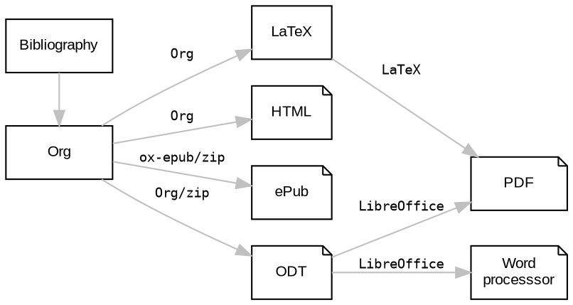

## 히스토리 {#히스토리}

@user 위에 글을 한글로 번역해줘. 멈추면 중단 지점부터 진행해줘.

1.  처음 나오는 전문용어는 스펠링 남길 것
2.  수식은 Latex로 표기 유지 할 것
3.  인용은 기존 양식 유지
4.  조직모드의 Heading Level 유지
5.  영한 용어집 생성


## 8.1 소개 {#8-dot-1-소개}

Emacs Org 모드는 단순히 산만함 없이 글을 쓰기 위한 이상적인 도구가 아닙니다; 출판을 위한 강력한 도구입니다. 일반 텍스트로 작업하면 디자인 대신 콘텐츠에 집중할 수 있습니다. Org의 내보내기 기능은 다양한 형식으로 작업을 넓은 청중에게 전달할 수 있습니다. Org는 PDF로 출력하여 인쇄된 책, 저널 기사, 웹사이트 또는 워드 프로세서 문서로 원고를 내보낼 수 있습니다. 추가 패키지를 사용하면 원고를 다른 형식으로 내보낼 수 있습니다. 예를 들어, ePub 형식의 전자책으로 내보낼 수 있습니다.

이 장에서는 Org 원고를 내보내기 위해 레이아웃과 타이포그래피를 정의하는 방법을 안내합니다. 첫 번째 섹션에서는 내보내기 프로세스의 원칙과 Org가 원하는 출력을 생성하기 위해 다른 소프트웨어와 어떻게 인터페이스하는지 설명합니다. 두 번째 섹션에서는 모든 출력 형식에 적용되는 일반 설정에 대해 설명하여 원고를 출판 준비 상태로 만드는 실용적인 지식을 제공합니다. 이 장의 나머지 부분에서는 가장 일반적인 내보내기 형식의 세부 사항을 탐구합니다. Emacs와 원고를 구성하여 원하는 출력을 얻는 방법을 안내합니다.


## 8.2 Org 파일 내보내기 {#8-dot-2-org-파일-내보내기}

문서를 내보내기 위한 준비 작업은 과거에는 조판사에 의해 수행되었습니다. 조판 과정은 글꼴과 그래픽 요소의 크기 및 페이지 배치를 정의합니다. 전통적인 인쇄에서는 페이지 형성을 위해 물리적인 이동형 타입을 배열하는 것을 포함합니다. 전자 출판에서는 더 이상 물리적인 납 조각을 이동할 필요가 없고, 지시를 내리기만 하면 됩니다. Org에서의 조판은 선택한 내보내기 형식에 따라 원고에 적절한 메타데이터를 추가하는 것으로 시작됩니다.

Org 파일을 원하는 형식으로 내보내기의 기본 원칙은 Emacs가 텍스트를 변환하고 문서 클래스, CSS 스타일 시트 또는 다른 유형의 템플릿에 연결하는 것입니다. 템플릿은 문서의 타이포그래피와 레이아웃을 정의합니다. CSS/HTML이나 LaTeX에 대한 지식이 필요하지는 않지만, 출력물을 세밀하게 조정하는 데 도움이 됩니다. 텍스트 파일은 또한 인용을 관리하기 위해 로컬 또는 글로벌 서지에 링크할 수 있습니다.

PDF나 워드 프로세서 형식으로 내보낼 때, 내보낸 파일은 최종 결과를 생성하기 위해 LaTeX 또는 LibreOffice와 Zip으로 전달됩니다. Zip 프로그램은 ePub 및 오피스 문서가 단일 파일로 패키징된 웹사이트이기 때문에 필요합니다. 그림 [BROKEN LINK: fig-export]는 Org 내보내기 워크플로우와 Org 파일에서 원하는 출력으로 렌더링하는 데 사용되는 도구를 보여줍니다. 동일한 파일을 사용 가능한 모든 형식으로 내보낼 수 있습니다. 예를 들어, 이 책의 소스 파일은 페이퍼백 버전을 위한 인쇄 준비 PDF 파일, ePub 형식의 전자책 및 웹사이트를 생성합니다.



예를 들어, 웹사이트나 전자책을 생성할 때, Org 텍스트에서 `/example/`로 둘러싸인 텍스트는 `~<i>example</i>/~`로 변환되며, LaTeX에서는 `~\emph{example}~`이 됩니다. 이 예제의 기본 설정은 이탤릭 텍스트이지만, 내보내기 설정을 어떻게 구성하느냐에 따라 다를 수 있습니다.

Org와 Emacs 설정에는 문서의 레이아웃과 타이포그래피에 대한 지시가 포함되어 있습니다 (WYSIWYM의 "what you mean"). 각 내보내기 형식은 구문과 타이포그래피를 연결하는 고유한 방법을 가지고 있습니다. HTML로 내보낼 때는 Cascading Style Sheet (CSS)가 디자인을 지정하고, LaTeX에서는 문서 클래스와 프리앰블이 최종 출력에서 이 구문이 어떻게 보이는지를 결정합니다. 워드 프로세서 형식으로 내보낼 때는 OpenDocument Text Template (OTT)가 최종 디자인을 정의합니다.

Org 파일을 내보내는 것은 기본적으로 `C-c C-e` 키보드 단축키로 호출되는 `org-export-dispatch` 함수로 시작합니다. 새로운 버퍼가 팝업되어 많은 옵션이 표시됩니다. 첫 번째로 입력한 문자는 내보내기 형식을 결정하고, 그 이후의 문자는 특정 옵션을 결정합니다. `q`를 사용하면 내보내기 디스패처를 종료합니다.


## 8.3 문서 설정 {#8-dot-3-문서-설정}

원고는 내보내기 프로세스를 안내하기 위해 메타데이터와 설정을 저장할 수 있습니다. Org가 문서를 내보내는 방법을 제어하는 많은 설정이 있습니다. 이 데이터가 어떻게 사용되는지는 내보내기 형식에 따라 다릅니다. 일부 일반 메타데이터는 모든 형식에 적용됩니다. 다음 키워드는 모든 형식에 적용됩니다:

-   `#+title:` 문서 제목.
-   `#+author:` 저자 이름.
-   `#+date:` 출판 날짜.

내보낸 날짜의 형식을 `org-export-date-timestamp-format` 변수로 정의할 수 있습니다. 이 변수는 일반적인 프로그래밍 언어에서 사용되는 인코딩을 사용하여 날짜를 표시합니다. 예를 들어, `%e %B %Y`는 날짜 번호(앞에 0이 없는)로 시작하고, `%B`는 전체 월 이름, `%Y`는 4자리 연도로 표시되며, 공백으로 구분됩니다 (3 June 2024). 미국 날짜 형식을 사용하려면 이 변수를 `"%B %e, %Y"`로 사용자 정의합니다 (June 3, 2024). `format-time-string` 변수의 도움말 페이지를 통해 사용 가능한 형식을 확인할 수 있습니다.

저자 이름은 기본적으로 모든 내보낸 문서에 나타나며, Org 파일에서 정의되지 않은 경우에도 `user-full-name` 변수의 내용으로 기본 설정됩니다. `#+options: author:nil`을 추가하면 이 동작을 무효화할 수 있습니다. 이 옵션은 제목, 저자 및/또는 날짜를 제거할 수도 있습니다.

```example
#+options: author:nil date:nil title:nil
```

Org는 옵션 키워드를 사용하여 내보내기를 세밀하게 제어할 수 있는 메커니즘을 가지고 있습니다. 이러한 설정은 고려 중인 버퍼에만 적용됩니다. 모든 사용 가능한 옵션에는 모든 내보내기에 적용되는 일치하는 변수가 있습니다. 모든 사용 가능한 옵션에 대해 Org 매뉴얼에서 `C-h R org <ret> g export settings`로 읽을 수 있습니다.

제목, 저자 및 날짜는 기본 메타데이터입니다. 각 내보내기 형식은 또한 프론트 매터에서 특정 변수를 사용합니다. 목표 형식으로 내보내기 위한 템플릿을 얻으려면 `org-export-insert-default-template` 함수를 사용하여 열려 있는 버퍼에 키워드를 삽입할 수 있습니다. 이 기능은 내보내기 디스패처에서 `C-c C-e #`를 통해 액세스할 수 있습니다. 한 원고에 대해 여러 내보내기 형식을 사용하는 것은 완전히 괜찮습니다. 그러나 이 기능을 한 번 이상 사용하면 일부 중복 키워드가 발생할 수 있습니다.

Org는 내보내기 프로세스의 결과를 소스 문서와 동일한 디렉토리에 저장합니다. 내보낸 파일은 소스 파일과 동일한 이름을 가지지만 다른 확장자를 가집니다. Denote Org 파일을 내보내면 동일한 식별자를 가진 두 개의 파일이 생성되어 파일 이름 충돌이 발생할 수 있습니다. 내보낸 파일의 이름을 변경하려면 `#+export_file_name: <filename>`을 헤더에 추가할 수 있습니다. 파일 이름은 확장자 없이 임의의 문자열일 수 있습니다. 파일을 다른 폴더로 내보낼 수도 있지만, 이는 오류를 일으킬 수 있습니다.


### 8.3.1 타이포그래피 {#8-dot-3-dot-1-타이포그래피}

출판된 원고에는 단순히 글자와 숫자 이상의 것이 포함됩니다. 생략 부호, 외국 문자 및 다양한 종류의 대시와 같은 특수 타이포그래픽 문자가 있습니다. Org 내보내기 모듈은 `\alpha`와 같은 LaTeX 문자를 각각의 글꼴 값으로 파싱합니다. 특수 기호에 대한 자세한 정보는 섹션 [BROKEN LINK: sec-pretty]를 참조하십시오.

타이포그래퍼에게 단순한 대시는 전혀 간단하지 않습니다. 대부분의 전자 문서는 단순히 대시를 하이픈 또는 단어와 숫자를 구분하는 데 사용하지만, 최적의 타이포그래피는 더 미묘합니다. 대시에는 네 가지 유형이 있으며, 각각 고유한 특성과 사용 사례가 있습니다. 대시는 가장 짧고, En 대시는 약간 더 길고, M 대시는 가장 깁니다. En 및 Em 대시의 너비는 대문자 N 또는 M과 거의 같습니다. 일반 텍스트에서는 단일, 이중 또는 삼중 대시로 이러한 대시를 작성합니다. 이 방법은 텍스트를 작성할 때만 필요합니다. 수학식에서는 디스플레이 엔진이 자동으로 올바른 버전을 사용합니다.

-   `-`: 대시는 복합 단어 (short-term) 또는 정당화된 텍스트 줄 끝에서의 하이픈에 요소를 연결합니다.
-   `--`: En 대시는 숫자 또는 단어를 구분하며, "to"라는 단어를 대신합니다 (1--3, 또는 Marathon--Sparta).
-   `---`: Em 대시는 생각을 구분하고 쉼표, 콜론 또는 괄호처럼 기능합니다: (---).
-   `$-$`: 수학 모드에서 하이픈을 입력하면 마이너스 기호가 됩니다 (\\(a-b\\)).


### 8.3.2 목차 추가 {#8-dot-3-dot-2-목차-추가}

Org는 기본적으로 모든 내보낸 원고에 목차를 추가하지 않습니다. Org는 파일의 첫 번째 제목 바로 위에 목차를 삽입합니다. 이 동작을 `org-export-with-toc` 변수를 `nil`로 사용자 정의하여 토글할 수 있습니다. 목차에 대한 동작은 또한 원고의 프론트 매터에 `#+options:` 키워드를 추가하여 수정할 수 있습니다. 예를 들어:

-   `#+options: toc:t`: 전체 목차를 추가합니다.
-   `#+options: toc:2`: 목차에 두 개의 레벨만 포함합니다.
-   `#+options: toc:nil`: 목차를 내보내지 않습니다.

목차의 출력은 선택한 내보내기 형식과 템플릿에 따라 달라집니다.


### 8.3.3 번호 매기기 섹션 설정 {#8-dot-3-dot-3-번호-매기기-섹션-설정}

비즈니스 및 학술 글쓰기에서 번호 매기기 섹션은 표준입니다. `num`을 시작 키워드에 추가하면 Org 모드가 모든 제목에 번호를 매깁니다 (`#+startup: num`). 번호 매기기는 파일 내용을 변경하지 않고 Org 버퍼에 가상 텍스트로 나타납니다. 이 번호 매기기가 출판된 출력에 나타나는지 여부는 관련 형식의 내보내기 템플릿에 따라 달라집니다.

책의 앞뒤 사항이나 참고 문헌 목록과 같은 원고의 일부는 일반적으로 번호가 매겨지지 않습니다. 내보내기에서 제목을 번호 매기기에서 제외하려면 `C-c C-x p` (`org-set-property`)를 입력하고 `UNNUMBERED` 속성을 `t` (true)로 설정합니다. 이 속성을 `notoc`로 설정하면 제목이 목차에서도 제외됩니다. 이러한 속성은 내보낸 문서에만 적용되며, Org 버퍼 자체에는 적용되지 않습니다.

```example
  :PROPERTIES:
  :UNNUMBERED: t
  :END:
```


### 8.3.4 테이블 향상 {#8-dot-3-dot-4-테이블-향상}

Org는 섹션 [BROKEN LINK: sec-tables]에서 논의된 바와 같이 테이블을 쉽게 삽입할 수 있습니다. 소스 문서 내에서 테이블은 모든 열에 대해 수직선을 가지며, 사용자는 수평선을 추가할 수 있습니다. 그러나 이것이 최종 출력에서 테이블이 어떻게 보이는지는 아닙니다.

소스에서 정의된 수평선은 최종 결과에 나타나지만, 수직선은 생략됩니다 (University of Chicago Press 2017, sec. 3.53). 대부분의 출판물은 데이터가 열로 정렬되기 때문에 눈이 수직선을 필요로 하지 않기 때문에 수평선만 허용합니다.

때때로 수직선은 열 그룹을 구조화하는 데 도움이 될 수 있습니다. 첫 번째 필드에 슬래시 (`/`)가 있는 행은 수직선으로 둘러싸인 열 그룹을 지정합니다. 다른 필드는 열 그룹의 시작을 나타내기 위해 작은 보다 기호 (`<`)를 포함하거나 열의 끝을 나타내기 위해 큰 보다 기호 (`>`)를 포함합니다. 열 내에서 `><`를 사용하면 수직선으로 둘러싸인 별도의 그룹이 됩니다. 효과적으로, 기호는 수직선의 위치를 가리킵니다. 또한, 원하는 수직선마다 열 그룹 시작자 (`<`)만 삽입할 수도 있습니다. 그러나 이 방법은 테이블의 왼쪽과 오른쪽 가장자리에 선을 추가하지 않습니다. 아래 예제는 이러한 원칙을 보여주며, 내보낸 버전은 아래 테이블 [BROKEN LINK: tab-lines]에 있습니다.

```example
#+caption: 수직선과 정렬이 있는 테이블 예제.
#+name: tab-lines
| n | n^2 | n^3 | n^4 |  Animal  |  a |  b |
|---+-----+-----+-----+----------+----+----|
| / |   < |     |  >  |          | <> |    |
|   |     | <r> | <c> |      <r> |    |    |
| 1 |   1 |   1 |  1  | Aardvark |  3 |  4 |
| 2 |   4 |   8 | 16  |     Bird |  5 | 12 |
| 3 |   9 |  27 | 81  |      Cow |  8 | 15 |
|---+-----+-----+-----+----------+----+----|
```

```example
#+caption: 수직선과 정렬이 있는 테이블 예제.
#+name: tab-lines
| n | n^2 | n^3 | n^4 |   Animal |  a |  b |
|---+-----+-----+-----+----------+----+----|
| / |   < |     |  >  |          | <> |    |
|   |     | <r> | <c> |      <r> |    |    |
| 1 |   1 |   1 |  1  | Aardvark |  3 |  4 |
| 2 |   4 |   8 | 16  |     Bird |  5 | 12 |
| 3 |   9 |  27 | 81  |      Cow |  8 | 15 |
|---+-----+-----+-----+----------+----+----|
```

Org 모드는 여러 열이나 행에 걸쳐 정보를 표시하는 복잡한 테이블을 처리할 수 없습니다. 이러한 테이블을 만들기 위해 Org는 Takaaki Ota의 내장된 _Table_ 패키지를 통합합니다. 이러한 테이블은 Org와 약간 다른 구문을 가지고 있습니다. 아래는 독일어 기사 개요를 보여주는 예입니다. 이러한 테이블을 Org에서 편집하려면 `org-edit-special` (`C-c '`)을 사용하십시오. 표준 Org 모드 테이블을 더 복잡한 형식으로 변환하려면 `org-table-create-with-table.el`을 사용하십시오. 이 패키지의 구문에 대해 자세히 알아보려면 매뉴얼을 `C-h P table`로 읽으십시오.

```example
+------------+-----------+----------+----------+-------------+
|            |             Singular            | Plural      |
|            +-----------+----------+----------+-------------+
|            | Masculine | Neuter   | Feminine | All genders |
+------------+-----------+----------+----------+-------------+
| Nominative | der       | das      | die      | die         |
| Accusative | den       | das      | die      | die         |
| Dative     | dem       | dem      | der      | denen       |
| Genitive   | dessen    | dessen   | deren    | deren       |
+------------+-----------+----------+----------+-------------+
```

```example
#+caption: Table 패키지로 내보낸 테이블.
#+name: tab-table
+------------+-----------+----------+----------+-------------+
|            |             Singular            | Plural      |
|            +-----------+----------+----------+-------------+
|            | Masculine | Neuter   | Feminine | All genders |
+------------+-----------+----------+----------+-------------+
| Nominative | der       | das      | die      | die         |
| Accusative | den       | das      | die      | die         |
| Dative     | dem       | dem      | der      | denen       |
| Genitive   | dessen    | dessen   | deren    | deren       |
+------------+-----------+----------+----------+-------------+
```


### 8.3.5 인용 및 기타 구조 {#8-dot-3-dot-5-인용-및-기타-구조}

작가에게 가장 좋은 조언은 자신의 생각을 표현할 때 원래의 단어를 사용하는 것입니다. 그러나 다른 저자의 단어가 너무 강력해서 인용해야 하고, 우리를 영감하고 동기부여하는 경우도 있습니다. 가장 직접적인 방법은 당연히 "인용 부호"를 사용하는 것입니다.

대부분의 내보내기 형식은 인용에 대해 별도의 타이포그래피를 정의합니다. 예를 들어, 단락을 들여쓰거나 이탤릭 글꼴을 사용합니다. 인용 구조 템플릿을 사용하도록 Org에 지시할 수 있습니다. 인용 블록을 `C-c C-, q`로 추가할 수 있습니다.

```example
 #+begin_quote
   Good writing is essentially rewriting (Roald Dahl)
 #+end_quote
```

Org 구조 템플릿은 일반적으로 사용되는 구조를 빠르게 삽입하기 위해 미리 정의된 텍스트 조각입니다. 반복적인 타이핑을 줄여 워크플로우를 간소화합니다. 이전 장에서 노트에 대한 구조 템플릿을 이미 보았습니다. 이 책의 주제와 관련된 가장 중요한 구조 템플릿은 노트, 인용, 시, 그리고 중앙 정렬된 텍스트입니다. 이러한 구조 템플릿은 내보내기 워크플로우가 텍스트의 이러한 부분을 적절히 처리하도록 지시합니다.


### 8.3.6 매크로 {#8-dot-3-dot-6-매크로}

Org는 원고에서 매크로 기능도 사용할 수 있습니다. 매크로는 세 개의 중괄호 사이에 있는 문자열로 구성됩니다. 내보내기 과정에서 Org는 매크로를 전체 텍스트로 확장합니다. 예를 들어, 이 책에서 매크로 `{{{ews}}}`는 다음과 같이 확장됩니다: "_Emacs Writing Studio_". 기본 매크로는 문서의 프론트 매터에서 정의할 수 있습니다:

\`\`\`example ,#+macro: ews _Emacs Writing Studio_ \`\`\`

Org는 문서 속성을 추가하기 위해 내장된 매크로 시리즈를 포함하고 있습니다. 하나의 예는 날짜 필드에 동적 타임스탬프를 제공하는 것입니다. Org의 타임스탬프는 정적이지만, 내보내기 매크로를 사용하여 동적으로 날짜를 삽입할 수 있습니다. `{{{time(format)}}}`을 사용하면 위에서 설명한 형식으로 현재 날짜를 원고에 삽입할 수 있습니다.

Org 매크로는 일반적으로 반복되는 구절을 확장하는 데 도움이 되는 다목적 도구입니다. 매크로는 변수와 Emacs Lisp 함수를 포함하여 동적 확장을 만들 수도 있습니다. 매크로 확장에 대한 더 고급 예제는 Org 매뉴얼에서 `C-h r org <ret> g macro`로 제공됩니다. HTML 및 LaTeX 내보내기에 대한 섹션에서는 매크로에 대한 추가 정보를 포함합니다.


### 8.3.7 내보내기에서 내용 제외 {#8-dot-3-dot-7-내보내기에서-내용-제외}

작성한 모든 것이 세상과 공유되어야 하는 것은 아닙니다. Org는 섹션 [BROKEN LINK: sec-notes]에서 논의된 바와 같이 모든 주석을 최종 형식에서 제외합니다. EWS 설정은 또한 서랍을 내보내지 않으므로, 노트는 개인적으로 유지됩니다.

또한, `C-c C-q` (`org-set-tags-command`)로 제목에 `:noexport:` 태그를 추가하여 섹션과 관련 서브섹션(하위 트리)을 내보내기에서 제외할 수 있습니다. 태그 이름을 미니버퍼에 입력하고, 현재 버퍼에서 이미 사용된 태그를 찾기 위해 완성 기능을 사용할 수 있습니다. 태그는 제목 이름의 오른쪽에 두 개의 콜론 사이에 나타납니다.

Org 모드는 태그와 함께 제목을 내보냅니다. 이 동작

@user 진행해줘

@assistant 을 무효화하려면 옵션 키워드에 `tags:nil`을 추가하면 됩니다.

```example
#+options: tags:nil
```


### 8.3.8 인용 내보내기 {#8-dot-3-dot-8-인용-내보내기}

Org는 BibTeX / BibLaTeX 또는 CSL 서지 파일을 사용하여 기사 및 책과 같은 서지 항목을 참조할 수 있는 내장 인용 관리자를 가지고 있습니다. 기본적인 사용법은 간단하며, 구성이나 외부 소프트웨어 없이도 작동합니다.

이미 글로벌 및 로컬 서지 생성과 인용 삽입 방법을 알고 있습니다 (섹션 [BROKEN LINK: sec-bib] 및 [BROKEN LINK: sec-citations] 참조). 이 섹션에서는 Org가 `[@cite:wittgenstein_1922]`와 같은 구조를 "(Wittgenstein, 1922)."와 같은 형식의 인용으로 변환하는 방법을 설명합니다.

인용을 내보내기 위해 필요한 것은 글로벌 또는 로컬 서지, 하나 이상의 인용 및 참조 문헌 목록(서지)입니다. 다음은 예제입니다:

```example
#+bibliography: references.bib
"The world is everything that is the case" [cite:@wittgenstein_1922].
* References
#+print_bibliography:
```

인용을 형식화된 인용으로 변환하려면 인용 프로세서가 필요합니다. Org는 기본적으로 기본 내보내기 프로세서를 사용하며, 이는 간단한 프로젝트에 적합하고 모든 내보내기 형식에 적용됩니다. 다른 프로세서는 보다 유연한 인용 관리를 제공하며, 섹션 [BROKEN LINK: sec-csl] 및 [BROKEN LINK: sec-bibtex]에서 논의됩니다.

기본 인용 프로세서는 문서의 메타데이터에 키워드를 사용하여 구성할 수 있습니다. 이 키워드는 프로세서(basic)를 지정한 다음 서지 스타일과 인용 스타일을 지정합니다:

```example
#+cite_export: basic [bibliography style] [citation style]
```

Org는 내보내기 과정에서 인용을 형식화된 텍스트로 변환하고 참조 문헌 목록을 추가합니다. 참조 문헌 목록을 포함하려면 `#+print_bibliography:`를 추가하여 나타나야 할 위치를 지정합니다. 기본 엔진을 사용할 때 참조 문헌 목록에는 제목이 포함되지 않습니다. `#+cite_export:` 키워드의 두 번째 부분은 서지 스타일을 정의하며, 다음 세 가지 옵션 중 하나일 수 있습니다:

-   `author-year`: 기본 모드.
-   `numeric`: 번호가 매겨진 항목을 사용하는 Vancouver 시스템.
-   `plain`: 기본과 동일하지만, 저자 성만 표시.

기본 내보내기 프로세서는 다양한 인용 스타일을 내보낼 수 있습니다. 인용 스타일이 제공되지 않으면 기본적으로 저자(들)와 연도(들)를 괄호 안에 표시합니다. 예를 들어, "(Toulmin, Stephen, 2003)". 인용 스타일을 정의하는 두 가지 방법이 있습니다. `#+cite_export:` 키워드의 세 번째 부분이 기본값을 제공하며, 개별 인용에서 이를 재정의할 수 있습니다. 다음과 같은 인용 스타일을 사용할 수 있습니다:

-   `author` (`/a`): 저자(들)만 "Toulmin, Stephen"
-   `noauthor` (`/na`): 저자 없음 "(2003)"
-   `text` (`/t`): 인라인 텍스트 인용 "Toulmin, Stephen (2003)"
-   `nocite` (`/n`): 인용 없음, 그러나 참조 문헌 목록에 항목 추가.
-   `note` (`/ft`): 각주로 인용.
-   `numeric` (`/nb`): 번호가 매겨진 참조를 괄호 안에 표시 (Vancouver 시스템).

기본값을 재정의하려면 인용 전에 스타일 마커를 추가합니다 (위에 괄호 안에 나열된 것). 예를 들어, `[cite:/t@rorty_1979]`는 "Rorty (1979)"로 결과됩니다.

또 다른 구성 옵션은 인용 변형을 추가하는 것입니다. 이 지시자는 괄호를 제거할지 (`/b`) 또는 첫 글자를 대문자로 만들지 (`/c`)를 결정합니다. 변형을 스타일 뒤에 추가합니다. 예를 들어, `[cite/ft/b:@rorty_1979]`는 괄호 없는 각주로 "Rorty, 1979."로 결과됩니다.

스타일과 변형의 불가능한 조합을 지정하면 Org는 이를 무시합니다. 일부 서지와 인용 스타일 조합은 의미가 없습니다. 예를 들어, 숫자 서지와 각주 인용 스타일은 호환되지 않습니다.

Org는 또한 인용에 접두사와 접미사를 포함할 수 있습니다. 예를 들어, `[cite: See @rorty_1979 p.12]`는 "(See Rorty 1979 p.12)."로 결과됩니다. 여러 인용 키를 사용할 때 글로벌 접두사와 접미사를 추가할 수도 있습니다. 모든 트리밍을 포함한 인용은 다음과 같이 보일 수 있습니다:

```example
[@cite/s/v: global-prefix; prefix @key1 suffix; prefix @key2 suffix; global-suffix]
```


## 8.4 오피스 문서 생성 {#8-dot-4-오피스-문서-생성}

우리가 작업을 워드 프로세서를 선호하는 사람들과 공유해야 하는 경우가 많습니다. 개인적인 워크플로우에서는 Emacs에서 메모와 기술 보고서를 작성하고, 동료들과 협업하거나 공유하기 위해 워드 프로세서 형식으로 내보냅니다.

Org의 내보내기 기능은 LibreOffice Writer, Apple Pages 또는 MS Word와 같은 워드 프로세서에서 읽을 수 있는 문서를 생성할 수 있습니다. 워드 프로세서 형식으로 내보내는 것은 기업 고객을 위해 작성하거나 공동 저자나 편집자와 협업할 때 유용합니다. Org 내보내기 프로세스는 OpenDocument Text 형식(ODT)으로 결과를 생성합니다.

ODT 파일은 압축된 XML 파일과 포함된 이미지의 컬렉션이며, Zip 프로그램이 필요합니다. Extensible Markup Language (XML)는 텍스트 문서를 포함한 데이터를 공유 가능한 방식으로 정의하고 저장합니다. ODT 파일을 아카이브 프로그램으로 열 경우 다음 파일을 찾을 수 있습니다:

-   `meta.xml`은 이 파일의 메타데이터를 포함합니다.
-   `styles.xml`은 레이아웃과 타이포그래피를 정의하는 스타일시트입니다.
-   `content.xml`은 실제 문서를 포함합니다.

Org가 ODT 형식으로 버퍼를 내보낼 때 `meta.xml`과 `content.xml` 파일을 생성하고 스타일시트를 추가합니다. 스타일시트는 기본 설정에서 복사되거나 사용자가 제공한 파일에서 복사됩니다.

ODT 내보내기 도구는 출력을 사용자 정의하기 위해 몇 가지 추가 프론트 매터 키워드를 가지고 있습니다. 서브타이틀은 콘텐츠에 추가되고, 설명과 키워드는 파일의 메타데이터에서 사용할 수 있습니다.

-   `#+subtitle:` 문서 서브타이틀.
-   `#+description:` 파일 설명.
-   `#+keywords`: 내보낸 파일의 키워드.

LibreOffice가 설치되어 있으면 MS Word 사용자가 읽기 쉽게 DOCx 파일도 생성할 수 있습니다. 이 옵션을 설정하면 내보내기 프로세스는 ODT와 DOCx 파일을 생성합니다. 출력 형식을 변경하려면 `org-odt-preferred-output-format` 변수를 사용자 정의할 수 있습니다. 이 변수를 사용자 정의하여 LibreOffice가 PDF 파일을 생성하도록 지시할 수도 있습니다.


### 8.4.1 이미지와 테이블 {#8-dot-4-dot-1-이미지와-테이블}

이미지와 테이블을 ODT 파일로 내보내는 방법을 제어하려면 항목 바로 위에 `#+attr_odt:` 줄을 사용하십시오. 이미지 크기와 배치를 제어하는 다양한 속성이 있습니다:

-   `:width`와 `:height`는 이미지 크기를 센티미터 단위로 제어합니다. 둘 중 하나만 사용하거나 둘 다 사용할 수 있습니다. 이 매개변수는 숫자 값만 허용하며, 퍼센트는 허용되지 않습니다.
-   `:scale`은 소스 이미지의 상대적 너비를 정의합니다.
-   `:anchor`는 이미지를 문자(`as-char`), 단락(`paragraph`) 또는 페이지(`page`)에 고정합니다.

예를 들어, 다음과 같은 속성을 가진 이미지는 10센티미터 너비로 문자로 고정됩니다:

```example
#+attr_odt: :width 10 :anchor as-char
```

이미지를 문자로 고정(`as-char`)하면 문서의 다른 문자처럼 배치됩니다. 이미지는 텍스트를 추가하거나 삭제할 때 텍스트와 함께 이동합니다. 단락에 고정된 이미지는 단락과 함께 이동합니다. 페이지를 고정하면 이미지가 페이지 여백에 상대적으로 동일한 위치를 유지하며 이동하지 않습니다. 이 방법은 뉴스레터와 같은 레이아웃 집중적인 문서를 출판할 때 유용합니다.

위에서 언급한 속성에 따라 ODT 내보내기 엔진은 이미지 크기를 센티미터 단위로 결정합니다. 소스 이미지는 96 도트 퍼 인치(DPI) 해상도로 ODT 문서에 포함됩니다. 다른 해상도를 사용하려면 `org-odt-pixels-per-inch` 변수를 사용자 정의할 수 있습니다. 이미지 크기는 센티미터 단위로, 해상도는 제국 단위로 측정되는 이유는 궁금할 수 있습니다. 하지만 이것이 작동하는 방식입니다.

Org는 ODT 형식으로 테이블을 내보낼 수 있습니다. 기본적으로 테이블은 상단과 하단 프레임과 소스에서 정의된 수평 및 수직선을 가집니다. `:rel-width` 속성은 텍스트 너비의 퍼센트로 테이블의 너비를 제어합니다. 테이블에 지정된 열 크기는 전체 너비에 상대적입니다 (섹션 [BROKEN LINK: sec-tables] 참조). 다음 속성 줄은 테이블을 텍스트 너비의 75%로 내보냅니다:

```example
#+attr_odt: :rel-width 75
```


### 8.4.2 수학 {#8-dot-4-dot-2-수학}

Org의 ODT 내보내기는 LaTeX 수식을 무시하지만, 우회 방법이 있습니다. 가장 쉬운 방법은 수학을 이미지 파일로 변환하는 것으로, 프론트 매터에 다음 키워드를 추가합니다: `#+options: tex:dvipng` PNG 내보내기용입니다. 이 방법은 dvipng 프로그램이 필요합니다. 또는 Image Magic을 사용하여 `tex:imagemagick`을 추가할 수 있습니다.

ODT 문서에는 기본 수식 형식(MathML)이 있으며, Org는 이를 내보낼 수 있습니다. MathML은 XML 기반 표기법으로 수학식을 표현합니다. 그러나 이 옵션은 고급 설정과 MathML 변환기가 필요합니다. Org 매뉴얼은 MathML 사용에 대한 자세한 지침을 제공합니다.


### 8.4.3 스타일 템플릿 {#8-dot-4-dot-3-스타일-템플릿}

오피스 문서의 타이포그래피와 레이아웃을 제어하려면 OpenDocument Text Template(OTT) 파일이 필요합니다. 이러한 파일은 새로운 문서를 생성하기 위한 설정을 포함하며, 타이포그래피 레이아웃 및 기타 아티팩트를 포함합니다. 현재 버퍼의 프론트 매터에 `#+odt_styles_file:` 키워드를 추가하여 관련 템플릿을 지정할 수 있습니다. 모든 ODT 내보내기에 동일한 템플릿을 사용하려면 `org-odt-styles-file` 변수를 사용자 정의하십시오.

스타일 파일 템플릿을 만드는 것은 간단합니다. 빈 Org 문서를 만들고 `#+options: H:4 num:t author:nil`을 추가한 다음 `C-c C-e o o`로 ODT로 내보냅니다. 옵션 키워드는 네 개의 번호 매겨진 제목 레벨을 만듭니다. 당연히 이러한 설정을 자신의 취향에 맞게 수정할 수 있습니다. 내보낸 문서를 LibreOffice로 열고 스타일을 편집합니다 (`F11`).

Org 모드는 "Org"로 시작하는 특정 스타일을 사용하므로, 이러한 스타일을 구성해야 합니다. 문서가 마음에 들면 OTT 파일로 저장하고 원고에 첨부하십시오. 다음에 Org 문서를 내보내면 템플릿에 정의된 스타일로 출력됩니다. Org는 템플릿 파일에 포함된 `styles.xml` 파일을 추출하여 내보낸 파일에 복사합니다.

스타일에 이미지가 포함된 경우, 예를 들어 페이지 배경 이미지, 스타일 파일 키워드에 이를 지정해야 합니다. 아래 예제에서 `styles.xml`은 지정되어야 하며, `background.png` 파일은 템플릿 문서에서 배경 이미지로 지정됩니다. LibreOffice는 파일 이름을 변경하므로 템플릿을 Emacs로 열고 `C-C C-c`를 눌러 파일 구조를 보고 이미지 파일 이름을 복사해야 합니다. 이 설정은 기업 문서 작성에 이상적입니다.

```example
#+odt_styles_file: ("template.ott" ("styles.xml" "background.png"))
```

ODT 내보내기 프로세스는 특정 템플릿과 스타일 이름에 의존합니다. 타사 템플릿은 다른 스타일 이름을 사용할 경우 불일치를 초래할 수 있습니다. 안타깝게도 상업용 워드 프로세서는 오픈 소스 소프트웨어에서 사용되는 ODT 형식과 호환되지 않습니다.

Org는 OpenOffice로의 내보내기를 세부적으로 조정할 수 있습니다. Open Document 내보내기에 대한 철저한 논의는 Org 매뉴얼의 _OpenDocument Text Export_ 섹션을 읽으십시오: `C-h R org <ret> g open`.


### 8.4.4 인용 스타일 언어 {#8-dot-4-dot-4-인용-스타일-언어}

기본 인용 프로세서는 ODT 형식으로 내보낼 때 완벽하게 작동하지만, 인용을 세밀하게 조정하거나 대학이나 출판사의 기대에 부응하는 능력은 제한적입니다. 인용 스타일 언어(CSL)를 사용하면 인용을 스타일링하는 광범위한 옵션을 제공합니다. CSL은 Bruce D'Arcus가 개발했으며, 섹션 [BROKEN LINK: sec-citar]에서 설명된 Citar 패키지도 개발했습니다. CSL 인용 프로세서는 모든 내보내기 형식에 사용할 수 있습니다. 이 책은 CSL 인용 프로세서를 사용하여 다양한 출판 형식을 만듭니다.

CSL 엔진은 출력을 정의하는 파일에 의존합니다. `citationstyles.org` 웹사이트를 통해 이러한 파일을 찾을 수 있습니다. 특정 저널이나 대학을 위한 수천 가지 변형이 CSL로 제공됩니다. 관련 스타일 파일을 다운로드하여 미래 참조를 위해 저장하십시오.

기본적으로 CSL 프로세서는 시카고 저자-날짜 형식으로 인용을 렌더링합니다. 다른 스타일 파일을 사용하려면 문서 내에서 `#+cite_export:` 키워드에 파일 이름을 추가하십시오. 예를 들어:

```example
#+cite_export: csl /path/to/style-file.csl
```

CSL 파일을 동일한 폴더에 보관하면 `org-cite-csl-styles-dir` 변수를 사용자 정의하여 Org가 이를 찾도록 할 수 있습니다. 이 경우 프론트 매터에서 파일 이름만 지정하면 됩니다.

CSL 프로세서는 다음과 같은 인용 스타일을 지원하며, 일부는 위에서 논의한 기본 프로세서와 동일합니다:

-   `author` (`/a`): 저자만.
-   `noauthor` (`/na`): 저자 없음.
-   `text` (`/t`): 인라인 인용.
-   `nocite` (`/n`): 인용되지 않았지만 참조 문헌에 나열됨.
-   `year` (`/y`): 연도만.
-   `title` (`/ti`): 항목의 제목.
-   `bibentry` (`/b`): 서지에 나열된 전체 인용.

CSL은 키워드나 출판 유형으로 필터링된 참조 목록을 추가할 수 있는 기능을 제공합니다. 이를 `nocite` 옵션과 결합하여 테마별 서지 목록을 만들 수 있습니다. `*`를 키로 사용하면 글로벌 및 로컬 서지에 있는 모든 항목을 포함합니다. 아래 예제는 "Emacs" 키워드가 있는 모든 책을 글로벌 및 로컬 서지에서 내보냅니다. 참고로 키워드는 대소문자를 구분합니다.

```example
#+title: Emacs books
#+bibliography: ../library/emacs-writing-studio.bib
#+cite_export: csl

Show a list of books tagged with the "Emacs" keyword.

* Bibliography
[cite/n:@*]
#+print_bibliography: :type book :keyword Emacs
```

@user 계속해줘

@assistant


## 8.5 웹 페이지 생성 {#8-dot-5-웹-페이지-생성}

Emacs에는 HTML 파일을 편집하기 위한 내장된 주 모드가 포함되어 있습니다. 그러나 Org는 이 형식에 대한 완벽한 내보내기 기능을 가지고 있으므로, 기술적 구문에 대해 걱정하지 않고도 가벼운 마크업을 사용할 수 있습니다. Org를 HTML로 내보내어 웹사이트를 게시하고, 섹션 [BROKEN LINK: sec-ox-epub]에서 설명한 대로 ePub 형식의 전자책을 생성할 수 있습니다.

HyperText Markup Language(HTML)는 월드 와이드 웹을 구동하는 엔진입니다. Org는 직접 HTML로 내보낼 수 있으며, 다음과 같은 작은 Org 문서를 내보낼 수 있습니다.

```example
#+title: HTML Example

Hello world!
```

이 예제는 HTML 마크업이 있는 간단한 파일로 변환됩니다. 들여쓰기는 선택 사항이지만, 문서의 구조를 이해하는 데 도움이 됩니다.

```example
<!DOCTYPE html>
<html>
  <head>
    <title>HTML Example</title>
  </head>
  <body>
    <div>
        <p>Hello world!</p>
    </div>
  </body>
</html>
```

Org의 HTML 내보내기 엔진은 이미 논의된 것 외에도 다양한 문서 속성을 설정할 수 있게 해줍니다. 이러한 설정은 HTML 코드의 출력을 세밀하게 조정할 수 있으며, 이는 웹 코딩에 대한 심도 있는 지식이 필요하므로 이 책의 범위를 벗어납니다. Org 모드 매뉴얼은 세부 사항을 설명합니다 (`C-c R org <ret> g html`). 모든 사용 가능한 HTML 설정을 `C-c C-e #`로 미리 볼 수 있으며, `html`을 선택하면 됩니다.

기본 내보내기는 페이지 하단에 메타데이터가 포함된 후기(Postamble)를 추가합니다. 이 동작을 무효화하려면 프론트 매터의 옵션 키워드에 `html-postamble:nil`을 추가하십시오.


### 8.5.1 이미지와 테이블 {#8-dot-5-dot-1-이미지와-테이블}

Org는 이미지와 테이블이 어떻게 내보내지는지 정의하기 위해 일련의 속성을 제공합니다. 이러한 설정은 직접 HTML 속성으로 변환됩니다. `#+attr_html:` 키워드는 이미지와 테이블 모두에 대한 속성을 정의합니다.

-   `:alt`는 사용자가 이미지를 볼 수 없는 경우 대체 정보를 제공합니다 (예: 느린 연결, 기술적 오류 또는 스크린 리더 사용).
-   `:title`은 이미지 제목을 추가합니다. 이 정보는 마우스가 이미지 위로 이동할 때 툴팁 텍스트가 됩니다.
-   `:align`은 왼쪽, 중앙 또는 오른쪽 정렬을 지정합니다.
-   `:width`와 `:height`는 이미지 크기를 픽셀 또는 퍼센트로 설정합니다.

Org의 이미지는 또한 링크일 수 있습니다. 예를 들어, 썸네일이 고해상도 버전에 하이퍼링크가 되도록 하려면 다음과 같이 사용할 수 있습니다:

```example
[[file:high-resolution.jpg][file:thumbnail.jpg]]
```

테이블도 `#+attr_html:` 키워드로 수정되며, 다음과 같은 세 가지 속성을 제공합니다:

-   `:border`는 테이블 주위의 테두리 너비를 나타냅니다.
-   `:rules`는 `all`로 설정하면 모든 테이블 선을 그립니다.
-   `:frame`는 외부 테두리의 가시성을 지정합니다. 기본 동작은 외부 테두리 선이 없음입니다. `border`를 사용하여 모든 테두리 선을 표시합니다.
-   `:cellspacing`과 `:cellpadding`은 셀 내부의 패딩과 셀 사이의 간격을 조정합니다.


### 8.5.2 수학 {#8-dot-5-dot-2-수학}

Org 파일을 HTML로 내보내면 MathJax에 대한 참조가 포함됩니다. 이 JavaScript 라이브러리는 웹 브라우저에서 수학 표기법을 표시합니다. 이 동작을 무효화하려면 `#+options: tex:dvisvgm`을 추가하여 수식을 SVG 파일로 변환하면 JavaScript에 의존하지 않게 됩니다.


### 8.5.3 스타일 시트 {#8-dot-5-dot-3-스타일-시트}

HTML 파일은 콘텐츠와 구조를 포함하지만, Cascading Style Sheets(CSS)는 레이아웃과 타이포그래피를 결정합니다. 기본 내보내기 엔진은 프론트 매터에 기본 스타일 시트를 포함하며, 이를 자신의 스타일 시트로 대체할 수 있습니다. `#+html_head:` 키워드는 문서 프리앰블에 줄을 추가할 수 있습니다.

```example
#+html_head: <link rel="stylesheet" type="text/css" href="style1.css" />
#+html_head_extra: <link rel="alternate stylesheet" type="text/css" href="style2.css" />
```


### 8.5.4 인용 {#8-dot-5-dot-4-인용}

HTML 내보내기 모듈은 섹션 [BROKEN LINK: sec-basic]과 [BROKEN LINK: sec-csl]에서 설명한 기본 및 CSL 프로세서를 사용하여 인용을 처리할 수 있습니다.


### 8.5.5 맞춤형 HTML 삽입 {#8-dot-5-dot-5-맞춤형-html-삽입}

HTML을 작성하는 방법을 알고 있다면, Org 파일에 직접 삽입할 수 있습니다. 이 기술은 온라인 양식 추가, 멀티미디어 임베드 또는 표준 타이포그래피를 추가하는 데 사용할 수 있습니다. HTML 구조 템플릿을 `C-c C-, h`로 삽입하고 맞춤형 코드를 추가하십시오. 웹 페이지에는 시작 및 종료 마커 사이의 모든 줄이 그대로 포함됩니다.

```example
#+begin_export html
<some html code/>
#+end_export
```

이러한 HTML 블록은 출력 형식이 일치할 때만 내보내집니다. 여러 형식으로 문서를 준비하는 경우, 대체 LaTeX 또는 ODT 변형을 포함해야 합니다.

일부 HTML 스니펫은 문서에 여러 번 나타날 수 있습니다. 대부분의 웹 페이지 개발 도구는 HTML을 삽입하기 위해 사용되는 텍스트 스니펫인 숏코드를 제공합니다. Org 매크로는 HTML 숏코드로 이상적입니다. 복잡한 HTML을 임베드하거나, 단순한 애플리케이션(예: 선택한 단어의 배경색 변경)에 사용할 수 있습니다.

다음 예제는 YouTube 클립을 임베드하는 매크로를 만듭니다. 매크로의 `$1` 부분은 첫 번째 매개변수를 나타내며, 이후 매개변수는 `$2` 등으로 표시됩니다.

```example
#+macro: youtube <iframe src="https://www.youtube.com/embed/$1"></iframe>
```

이 예제는 첫 번째 YouTube 비디오인 /Me at the Zoo/를 임베드합니다:

```example
{{{youtube(jNQXAC9IVRw)}}}
```

이 숏코드는 다음과 같이 내보내집니다:

```example
<iframe src="https://www.youtube.com/embed/jNQXAC9IVRw"></iframe>
```


### 8.5.6 웹사이트 게시 {#8-dot-5-dot-6-웹사이트-게시}

표준 내보내기 프로세스는 내보내는 각 파일에 대해 단일 HTML 파일을 생성하며, 제외된 파일도 포함합니다. 웹사이트를 구축하려면 디렉토리의 각 파일을 별도의 파일로 내보내야 합니다.

Org의 게시 기능은 이를 수행합니다. 소스 파일이 있는 폴더와 웹사이트를 저장할 폴더를 지정하고, 파일 모음을 웹사이트로 변환하는 방법을 결정하는 다양한 설정을 사용자 정의할 수 있습니다.

이 기능을 사용하려면 웹사이트 개발에 대한 기술적 지식과 Emacs Lisp에 대한 약간의 지식이 필요하므로, 이 책에서 자세히 설명하지 않습니다. Org 매뉴얼의 문서 게시에 대한 섹션을 `C-h R org <ret> g publish`로 찾을 수 있습니다.


## 8.6 전자책 생성 {#8-dot-6-전자책-생성}

대부분의 전자책 출판사는 배포를 위해 ePub 형식을 사용합니다. ePub 형식은 웹사이트가 최적화된 전자책 리더용으로 압축된 파일입니다. Mark Meyer의 ox-ePub 패키지는 Org 내보내기 디스패처에 이 기능을 추가합니다. 이 패키지는 내장된 Org에서 HTML로의 내보내기를 사용하여 전자책을 생성하므로, 위에서 설명한 HTML 기능을 사용하여 출력물을 세밀하게 조정할 수 있습니다. 이 패키지는 EPub 버전 2.0.1을 따르는 파일을 생성합니다.

이 형식에 대한 몇 가지 특정 내보내기 옵션이 있으며, `C-c e # epub`로 추가할 수 있습니다:

-   `#+uid:` 문서의 고유 ID, URI로도 알려져 있으며, 웹사이트 주소 또는 ISBN일 수 있습니다. 이 속성은 필수입니다.
-   `#+publisher:` 책 출판사의 이름.
-   `#+license:` 저작권 또는 복사권 라이선스.
-   `#+epubstyle:` 내보내기에 사용되는 CSS 파일.
-   `#+epubcover:` 책 표지 이미지.

기본 설정은 마지막 페이지 하단에 타임스탬프, 저자 및 HTML 유효성 검사 서비스가 포함된 후기(Postamble)를 추가합니다. `#+options: html-postamble:nil`을 Org 파일 헤더에 추가하여 전자책에서 이를 제거할 수 있습니다.

ox-ePub 패키지는 `[2024-07-08 Mon]`과 같은 Org 타임스탬프를 ePub 표준에 맞는 날짜 형식으로 변환하지 않습니다. 이를 수정하려면 타임스탬프에서 대괄호와 요일 및 시간 이름을 제거하거나, 날짜 형식을 ISO 8601 형식으로 설정하는 시간 매크로를 사용할 수 있습니다:

```example
{{{time(%Y-%m-%e)}}}
```

이미지를 포함할 때 PNG와 같은 개방형 이미지 형식을 사용하는 것이 좋습니다. 일부 전자책 리더는 JPG 파일 및 기타 전용 형식을 표시할 수 없습니다. 컴퓨터에서는 전자책이 잘 보일 수 있지만, 출판사의 검사를 통과하지 못할 수 있습니다. ePub 내보내기 과정은 연결된 이미지가 누락된 경우 중단됩니다. HTML과 PDF로 내보낼 때는 오류 없이 내보낼 수 있지만, 연결된 이미지가 누락되면 ePub은 렌더링되지 않습니다.

책은 표지로 판단해서는 안 되지만, 출판에 필수적입니다. `#+epubcover:` 키워드는 표지 파일의 경로를 포함합니다. 전자책 표지의 이상적인 크기는 2,560 x 1,600 픽셀 또는 1:1.6의 비율을 가진 다른 크기입니다.

이 패키지의 출력은 ePub 리더에서 완벽하게 읽을 수 있습니다. 그러나 두 가지 문제가 ePub 유효성 검사를 실패하게 만듭니다. 섹션 [BROKEN LINK: sec-include]에서 설명한 대로 다른 파일을 참조할 때 목차가 올바르게 생성되지 않습니다. 둘째, Org는 W3C의 e-Pub 파일 표준에 맞지 않는 방식으로 각주를 내보냅니다. 두 가지 문제 모두 고급 ePub 편집기인 Calibre로 수동으로 수정하거나 피할 수 있습니다.


## 8.7 LaTeX 및 PDF로 내보내기 {#8-dot-7-latex-및-pdf로-내보내기}

컴퓨터 과학의 선구자 Donald Knuth가 그의 _The Art of Computer Programming/의 두 번째 판의 교정을 받았을 때 결과에 만족하지 못했습니다. 1970년대에 출판사들은 고정형 인쇄에서 전자 버전으로 전환했습니다. 그는 실망을 긍정적인 것으로 바꾸어 전통적인 책의 미학을 재현하는 전자 조판 시스템인 TeX(/tekh_)를 개발하기로 결정했습니다 (Knuth 1984). 원래 TeX 언어는 복잡했기 때문에 Leslie Lamport는 LaTeX라는 TeX 매크로 라이브러리를 개발했습니다 (Lamport 1994).

LaTeX는 아름다운 인쇄 준비 문서를 생성합니다. 이 도구는 학계와 기술 분야에서 널리 사용됩니다. LaTeX는 인쇄 작업에 최적화되어 있으므로, 기술적이지 않은 종이책을 작성하는 데도 좋습니다. 이 책의 페이퍼백 버전은 Org와 LaTeX로 내보내어 PDF로 생성되었습니다.

LaTeX에 대한 지식이 반드시 필요한 것은 아니지만, 출판물의 디자인을 세밀하게 조정하는 데 도움이 됩니다. LaTeX의 기본 구문은 쉽게 설명할 수 있습니다. 모든 LaTeX 지시는 백슬래시로 시작하고 중괄호 사이에 매개변수를 포함합니다 (`\command{}`). 아래는 LaTeX 파일의 최소 작업 예제입니다.

```example
  \documentclass{article}
  \usepackage{ebgaramond}
  \begin{document}
  \title{Lorem Ipsum}
  \author{Peter Prevos}
  \date{July 2024}
  \maketitle
  \section{Nunc eleifend}
  Nunc aliquet, augue nec adipiscing interdum.
  \end{document}
```

`\documentclass{...}`와 `\begin{document}` 사이의 영역은 /프리앰블/로, 전체 문서에 영향을 미치는 명령을 포함합니다. 콘텐츠는 `\begin{document}`와 `\end{document}` 명령 사이에 포함됩니다.

첫 번째 줄은 문서 클래스를 정의합니다. Org에서 기본적으로 사용되는 클래스는 기사입니다. 문서 클래스는 최종 출력의 레이아웃과 타이포그래피를 정의합니다. LaTeX 개발자와 출판사는 다양한 출판물을 위한 문서 클래스를 설계했습니다. 가장 일반적인 문서 클래스는 다음과 같습니다:

-   `article`: 저널 기사
-   `report`: 작은 책 또는 논문
-   `book`: 장편 책

각 문서 클래스는 대괄호 사이에 구성 가능한 옵션을 가지고 있으며, 예를 들어 표준 글꼴과 종이 크기를 포함합니다. 예를 들어 `\documentclass[11pt, b5paper]{book}`는 11포인트 글꼴과 B5 종이 크기(176 &times; 250mm)를 가진 책 클래스를 정의합니다.

다음 부분은 패키지를 초기화합니다. LaTeX는 Emacs와 같은 패키지로 확장 가능합니다. 이러한 패키지는 문서의 디자인을 향상시킵니다. 위의 예제에서 `\usepackage{ebgaramond}` 명령은 Garamond 글꼴을 사용하도록 지시하며, 이 책의 페이퍼백 버전에 사용되었습니다.

다음 줄은 제목, 저자 및 날짜를 정의하는 상단 사항입니다. 상단 사항은 `\maketitle` 명령으로 종료되며, LaTeX가 제목 블록을 조판하도록 지시합니다.

실제 원고는 `\maketitle` 명령 이후에 시작됩니다. 예제는 `\section{}` 명령으로 섹션 헤더를 정의합니다. 표준 단락은 LaTeX 구문이 필요하지 않습니다.

LaTeX로 직접 문서를 작성하는 것은 혼란스러울 수 있습니다. 텍스트가 백슬래시, 중괄호 및 기타 구문적 방해로 어지럽혀지기 때문입니다. AUCTeX Emacs 패키지는 LaTeX 작성에 도움을 주지만, 이 패키지는 /Emacs Writing Studio/의 일부가 아닙니다. Org는 완벽한 LaTeX 내보내기 기능을 가지고 있으므로, 가벼운 Org 마크업의 이점을 누릴 수 있습니다. 문서를 내보낼 때, LaTeX 파일로 내보내거나 PDF로 내보낼 수 있습니다.

Org 파일을 LaTeX로 내보내기 위해 외부 소프트웨어가 필요하지 않습니다. Org 파일을 PDF로 내보내려면 시스템에 LaTeX가 설치되어 있어야 합니다. LaTeX를 설치하는 방법은 운영 체제에 따라 다릅니다. 좋아하는 검색 엔진이 올바른 방향으로 안내할 것입니다.

`C-c C-e l p`를 입력하면 현재 Org 버퍼와 포함된 파일의 PDF 버전을 생성하고 엽니다. Org는 버퍼를 `tex` 파일로 변환한 후, LaTeX 소프트웨어가 이를 PDF로 변환합니다 (그림 [BROKEN LINK: fig-export] 참조).

EWS는 `ews-latex-pdf-process~를 사용자 정의하여 모든 현대 LaTeX 설치의 일부인 ~pdflatex` 프로그램을 사용하도록 설정합니다. 이 설정은 PDF 파일과 서지를 생성하는 데 최적화되어 있습니다. 이 변수는 LaTeX 파일을 PDF 파일로 처리하기 위한 명령을 포함합니다.


### 8.7.1 프리앰블 사용자 정의 {#8-dot-7-dot-1-프리앰블-사용자-정의}

Org 내보내기 기능은 문서 콘텐츠에 표준 프리앰블을 추가하여 타이포그래피와 레이아웃을 정의합니다. 프리앰블을 생성하는 방법을 세밀하게 제어할 수 있습니다.

Org 내보내기의 기본 문서 클래스는 `article`입니다. 이 문서 클래스는 넓은 여백을 가지고 있어 초보 LaTeX 사용자에게 이상하게 보일 수 있습니다. 여백이 너무 넓은 것이 아니라 종이가 너무 큽니다. 텍스트의 최적 줄 길이는 60에서 75자 사이입니다. LaTeX는 이 표준을 구현하여 넓은 여백을 만듭니다. 그러나 이러한 LaTeX 기본값에 갇혀 있지 않습니다.

Org 파일의 프론트 매터에서 문서 클래스를 변경할 수 있습니다. 다음 예제는 A4 종이를 사용하는 `book` 클래스를 호출합니다. 이러한 줄은 LaTeX로 `\documentclass[a4paper]{book}`로 내보내집니다.

```example
#+latex_class: book
#+latex_class_options: [a4paper]
```

Org에서 문서 클래스를 사용하려면 먼저 초기화 파일에서 이를 정의해야 합니다. 기본적으로 제공되는 문서 클래스인 `article`, `report` 및 `book`은 기본적으로 사용 가능합니다.

Org 파일의 프론트 매터에 추가 패키지를 추가하여 LaTeX 프리앰블을 수정할 수 있습니다. 아래 예제는 두 개의 열을 가진 `article` 클래스를 사용합니다. 이 설정은 또한 geometry 패키지를 호출하고 A4 종이 크기와 25mm 여백을 설정합니다. 마지막 줄은 추가 프리앰블 항목을 추가하며, 이 경우 Times New Roman 글꼴로 설정합니다.

```example
#+latex_class: article
#+latex_class_options: [twocolumn]
#+latex_header: \usepackage[a4paper, margin=25mm]{geometry}
#+latex_header_extra: \usepackage{times}
```

연결된 문서(섹션 [BROKEN LINK: sec-include] 참조)를 사용할 때는 소스 문서에서 관련 패키지를 정의하기만 하면 됩니다. 그러나 포함된 파일에서 LaTeX 설정을 재정의할 수 있으므로, 포함 파일의 설정을 무시하려면 `skip` 옵션을 사용하십시오.

매번 동일한 줄을 반복해야 하는 프론트 매터를 사용하여 LaTeX 프리앰블을 정의하는 것은 번거로울 수 있습니다. Emacs라면 사용자 정의하여 문서 프리앰블의 라이브러리를 만들 수 있습니다. `org-latex-classes` 변수에는 가장 일반적으로 사용되는 문서 유형의 프리앰블이 포함되어 있습니다. Org에서의 LaTeX 클래스는 내보낸 파일에 추가되는 전체 프리앰블입니다. `dissertation`, `apa-paper`, `kluwer-book` 또는 출판 요구 사항에 따라 다양한 클래스를 정의할 수 있습니다. EWS 설정에는 이 책의 페이퍼백 버전에 사용된 문서 클래스(`ews`)가 포함되어 있습니다. 이 변수에 대한 심도 있는 논의는 이 책의 범위를 벗어납니다. 부록에서는 EWS 설정에 대해 자세히 설명합니다. 이 변수의 문서를 `C-h v org-latex-classes`로 읽어보십시오.


### 8.7.2 이미지와 테이블 {#8-dot-7-dot-2-이미지와-테이블}

Org는 이미지와 테이블을 LaTeX 플로트로 변환합니다. `#+attr_latex:` 키워드를 사용하여 이러한 플로트에 특정 속성을 추가할 수 있습니다. 다음은 이미지 예제입니다:

```example
#+caption: 이는 예제 이미지 캡션입니다.
#+attr_latex: :width 5cm :options angle=90 :placement h
[[directory/filename.png]]
```

다른 크기 매개변수로는 `:height`와 `:scale`이 있습니다. 크기 매개변수는 센티미터(`cm`) 또는 인치(`in`) 단위로 지정할 수 있으며, LaTeX에서 허용하는 다른 크기 형식도 사용할 수 있습니다. 이 매개변수는 또한 상대적 차원으로 표현할 수 있습니다. 예를 들어, `0.5\textwidth`는 텍스트 열 너비의 절반을 지정합니다.

`:float` 매개변수는 이미지나 테이블의 배치를 위한 여러 옵션을 제공합니다:

-   `multicolumn`: 이미지를 여러 열에 걸쳐 표시합니다.
-   `wrap`: 텍스트가 이미지 오른쪽으로 흐르도록 합니다.
-   `sideways`: 이미지가 90도 회전된 새 페이지로 표시됩니다.

테이블도 동일한 방식으로 조작할 수 있으며, 다양한 옵션이 있습니다. Org 매뉴얼의 관련 섹션을 `C-h g org <ret> g table latex`로 읽어보십시오.


### 8.7.3 인용 {#8-dot-7-dot-3-인용}

Org는 LaTeX에 직접 연결되는 세 가지 인용 프로세서를 제공합니다:

-   BibTeX는 LaTeX의 `\cite`와 `\nocite` 명령만 지원합니다.
-   NatBib는 LaTeX의 표준 인용 명령보다 더 많은 스타일 변형을 허용합니다.
-   BibLaTeX는 대체 서지 프로세서입니다.

다음 예제는 NatBib 프로세서를 호출하여 Wolkers-Kluwer 출판사가 지정한 Harvard 인용 스타일을 사용하는 방법을 보여줍니다. 첫 번째 부분은 NatBib 프로세서와 Kluwer 서지 및 인용 스타일을 지정합니다.

```example
#+cite_export: natbib kluwer
```

기본 및 CSL 인용 프로세서는 완전히 형식화된 텍스트 문자열을 내보내지만, 이 세 가지 프로세서는 LaTeX 명령을 내보냅니다. 예를 들어, `\cite{nietzsche_1883}`와 같은 형식입니다. 이는 다른 형식으로 내보낼 때 LaTeX 코드로 나타나므로, 여러 형식으로 구성된 원고가 필요한 경우 CSL 프로세서가 이상적인 선택입니다.


### 8.7.4 LaTeX 스니펫 {#8-dot-7-dot-4-latex-스니펫}

Org 파일에 직접 간단한 LaTeX 명령을 작성할 수 있습니다. 이러한 명령은 TeX 파일로 그대로 내보내집니다. 예를 들어, 책의 앞뒤 사항을 만들기 위해 `\frontmatter~와 ~\backmatter` LaTeX 명령을 Org 파일의 적절한 위치에 사용할 수 있습니다.

이 방법은 완벽하게 작동하지만, 여러 형식으로 파일을 내보낼 때 이러한 LaTeX 명령이 다른 출력물을 어지럽히는 것을 원하지 않을 것입니다. 이상적으로는 이러한 명령이 구조 템플릿에 포함되어야 합니다. 소스 블록을 삽입하려면 `C-c C-, l`을 누르십시오. 이 방법을 사용하면 각 출력 형식에 대해 소스 블록을 삽입할 수 있습니다.

```latex
  #+begin_export latex
  \frontmatter
  #+end_export
```

반복적으로 삽입해야 하는 복잡한 스니펫이 있다면, 섹션 [BROKEN LINK: sec-macros]에서 설명한 대로 LaTeX 스니펫에 대한 매크로를 사용하는 것을 고려하십시오.


### 8.7.5 여러 형식에 대한 매크로 {#8-dot-7-dot-5-여러-형식에-대한-매크로}

원고를 여러 형식으로 내보낼 경우, 다른 내보내기 형식에 적용되는 단일 매크로를 정의할 수 있습니다. 여러 매크로 확장은 이중 앰퍼샌드 기호(`@@`)로 둘러싸여 있으며, 내보내기 형식과 콜론으로 이어집니다. 다음 예제는 HTML, LaTeX 및 ODT 내보내기에 대해 텍스트 색상을 변경하는 매크로를 만듭니다.

```example
#+macro: hl @@html:<span style="color: $1;">$2</span>@@
            @@latex:\textcolor{$1}{$2}@@
            @@odt:<text:span text:style-name="$1">$2</text:span>@@
```

이 매크로를 다음과 같이 배포합니다: `{{{hl(red, This text is red.)}}}`.

HTML로 내보낼 때, 텍스트는 첫 번째 매개변수가 지정한 색상으로 표시됩니다. LaTeX로 내보낼 때는 `xcolor` 패키지를 사용하여 빨간색으로 인쇄됩니다. 동일한 매크로는 ODT 내보내기에도 적용될 수 있지만, 템플릿 파일에서 `$1`과 동일한 이름의 문자 스타일을 정의해야 합니다. 이 경우 "red"입니다.


## 8.8 추가 학습 {#8-dot-8-추가-학습}

이 장은 Org의 내보내기 가능성에 대한 개요만 제공합니다. 각 형식에 대해 추가 설정 옵션이 존재합니다. 원고의 내보내기 프로세스를 두 가지 수준에서 구성할 수 있습니다:

1.  변수 (모든 Org 파일에 적용)
2.  프론트 매터 (내보낸 파일에 적용)

예를 들어, `org-export-with-tables` 변수는 내보내기에서 테이블을 포함할지 여부를 지정합니다 (기본적으로 true입니다). 글로벌 설정을 내보낸 파일에 대해 재정의하려면 `#+options |:nil`을 사용할 수 있습니다.

Org는 이 장에서 설명하지 않은 다른 내보내기 형식도 제공합니다. Markdown 또는 일반 텍스트 파일로 내보낼 수 있습니다. 심지어 Org 모드로 파일을 내보낼 수도 있습니다. 이 옵션은 모든 인용을 파싱하고 포함된 모든 파일을 하나로 병합합니다. 다른 내보내기 형식에 대한 추가 패키지도 있습니다. 이러한 패키지는 일반적으로 `ox`로 시작하며, 예를 들어 섹션 [BROKEN LINK: sec-ox-epub]에서 논의한 ox-ePub가 있습니다.

모든 내보내기 기능에 대한 논의는 Org 매뉴얼에서 `C-h R org <ret> g exporting`로 찾을 수 있습니다.
