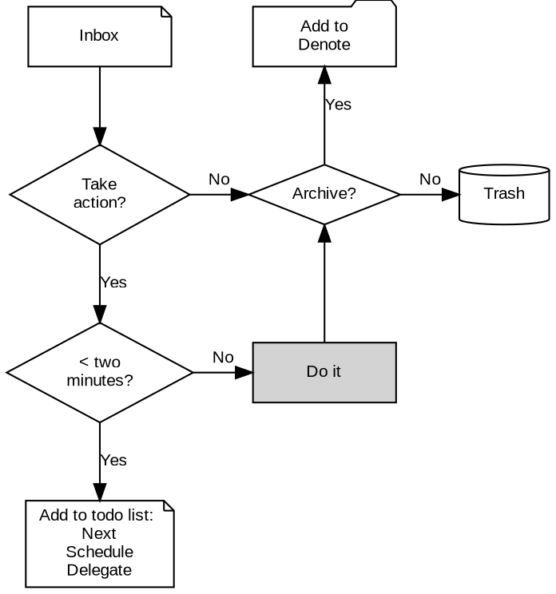

## 히스토리 {#히스토리}

@user 위에 글을 한글로 번역해줘. 멈추면 중단 지점부터 진행해줘.

1.  처음 나오는 전문용어는 스펠링 남길 것
2.  수식은 Latex로 표기 유지 할 것
3.  인용은 기존 양식 유지
4.  조직모드의 Heading Level 유지
5.  영한 용어집 생성


## 9.1 서론 {#9-dot-1-서론}

작가의 핵심 활동은 연구, 글쓰기, 편집 및 출판입니다. 그러나 해야 할 일은 그 외에도 많습니다. 글쓰기는 마감을 지키고, 프로젝트를 관리하며, 파일 시스템을 정리하는 등의 행정적 업무도 포함합니다.

이 장에서는 Org mode를 사용하여 프로젝트와 작업 목록을 관리하는 방법을 설명합니다. 이는 Getting Things Done (GTD) 방법을 느슨하게 구현한 것입니다. GTD는 바쁜 삶을 관리하는 여러 방법 중 하나입니다. Emacs의 장점은 원하는 방법을 구현할 자유를 제공한다는 점입니다. 다음 두 섹션에서는 디렉토리 편집기를 사용하여 파일과 이미지를 관리하는 방법을 보여줍니다. 이 장에서는 작업 목록을 생성하고 관리하며, 일정을 생성하는 방법을 배우게 됩니다. 또한 Emacs 내에서 파일을 관리하는 방법, 특히 이미지와 사진 앨범을 포함하여 논의합니다.


## 9.2 Getting Things Done {#sec-gtd}

시간이 부족한 세상에서 우리는 하루에 더 많은 일을 쑤셔 넣고 싶어합니다. 풍부한 문헌에 따르면, "일을 처리하는" 데는 "4시간 일주일"만 필요하다고 합니다 (Allen 2005; Ferriss 2011). 우리는 이러한 거의 마법 같은 능력을 "성공하는 사람들의 습관"에서 배우고, 아침 식사로 "개구리"를 먹는 사람들처럼 보입니다 (Covey 1990; Tracy 2016).

개인 생산성을 높이는 방법은 인터넷에 넘쳐나며, 좋은 의도로 가득 찬 책들도 쉽게 구할 수 있습니다. 시장에는 이러한 시스템을 구현할 수 있는 소프트웨어 옵션도 가득합니다. Microsoft의 OneNote부터 Todoist 같은 민첩한 모바일 앱까지.

모든 방법은 세 가지 주요 단계로 요약됩니다: 목표 설정, 목표를 달성하기 위한 행동 정의, 그리고 이러한 행동을 수행하는 것. 이 원칙들은 단순해 보일 수 있지만, 이것이 기본 진실입니다. 많은 출판된 방법들은 이 세 단계를 효과적이고 효율적으로 관리하는 다양한 방법을 논의합니다.

Org 패키지는 산문 쓰기와 출판을 가능하게 할 뿐만 아니라, 작업과 프로젝트를 관리하는 데도 도움이 됩니다. 다른 Emacs 패키지와 마찬가지로, 원하는 생산성 방법을 구현할 수 있는 무한한 자유를 제공합니다. 이 자유는 자신의 작업과 프로젝트를 통제하고, 자신의 상황에 가장 잘 맞는 방법을 구현할 수 있는 힘을 줍니다.

이 섹션에서는 David Allen의 _Getting Things Done_ (GTD) 방법을 기반으로 Org를 사용하여 프로젝트와 작업을 관리하는 방법을 보여줍니다. David Allen은 생산성을 높이기 위한 반복적인 다섯 단계를 설명합니다 (Allen 2005):

1.  _Capture_: 마음을 비우고 모든 것을 적어라.
2.  _Clarify_: 작업에 대해 무엇을 해야 할지 결정하라.
3.  _Organise_ 작업을 적절한 위치에 배치하라.
4.  _Reflect_: 진척 상황을 반성하라.
5.  _Engage_: 행동을 취하라.


### 9.2.1 _Capture_: 마음을 비우기 {#9-dot-2-dot-1-capture-마음을-비우기}

생산성이 떨어지는 이유 중 하나는 우리의 마음이 쓸데없는 것들로 가득 차 있기 때문입니다. 창의적이고 생산적인 생각은 머릿속이 해야 할 일로 가득 차 있으면 억제됩니다. 또한, 아이디어를 머릿속에만 간직하면 결국 안개 속으로 사라질 위험이 있습니다. 아마도 모두가 아침 샤워를 하면서 가장 멋진 아이디어를 떠올렸다가, 30분 후에 그 보석을 기억하지 못하는 경험을 해봤을 것입니다.

일을 처리하는 첫 번째 단계는 놀랍게도 간단합니다: 마음을 비우세요. 이것은 불교의 깨달음을 위한 탐구가 아니라, 집중력을 돕기 위한 간단한 기술입니다. 새로운 Org 파일을 열고 `todo.org` 또는 원하는 이름으로 지정하세요. 또한 섹션 [BROKEN LINK: sec-fleeting]에서 설명한 Inbox를 사용할 수도 있습니다.

다음 15분 동안 머릿속에 떠오르는 모든 것을 적어보세요. 당신의 뇌 내용을 이 새 Org 파일에 덤프하세요. 새로운 아이디어는 별표로 시작하여 제목이 되도록 하세요. 당신의 목록에는 다양한 무작위적인 것들이 포함될 것입니다. 가정에서 해야 할 작은 일부터 언젠가 하고 싶은 큰 프로젝트까지. 생각을 걸러내지 말고 그냥 적으세요.

멀티태스킹을 하지 마세요! 대신 이 활동에 전념하세요. 기억하세요, 멀티태스킹은 생산성의 적입니다. 왜냐하면 우리의 뇌는 한 번에 하나의 지적 활동에만 집중할 수 있기 때문입니다. 마술사가 사람들을 쉽게 속이는 사실은 멀티태스킹이 어리석은 일임을 보여줍니다 (Prevos 2013). Emacs의 EMMS 패키지로 음악을 들으며 집중력을 유지하는 것도 좋습니다.

언제 해야 할지, 어떤 순서로 해야 할지 걱정하지 마세요. 그것은 나중에 고민할 문제입니다. 목록을 완성할 때까지 마음이 비어 있도록 하세요. 대부분의 사람들에게는 50개의 실행 가능한 항목, 프로젝트, 그리고 모호한 목표가 일반적입니다. 압도당한다면, 메신저를 쏘지 마세요. 목록은 당신의 삶을 반영합니다. 이제 완료해야 할 모든 것을 포함하는 긴 목록이 있습니다.

```text
 * 잔디 깎기
 * 뒷마당 정리
 * 직무 능력 향상
 * Emacs 사용법 배우기
 * ... (당신의 전문 분야에 대한 전자책 쓰기)
 * 이메일 수신함 비우기
 * 다음 주 분기 회의 준비
 * 그리고 계속해서 ...
```


### 9.2.2 _Clarify_: 의미를 설명하기 {#sec-clarify}

위의 목록에서 대부분의 항목이 단일 행동으로 완료되기에는 더 많은 작업이 필요하다는 것을 눈치채셨나요? GTD 용어로 이것들은 프로젝트입니다. 프로젝트는 정의된 결과가 있고 완료하는 데 여러 행동이 필요합니다. 목록의 다른 항목들은 목표일 수 있습니다. 새로운 언어를 배우는 것과 같은 목표는 프로젝트보다 덜 정의되고 더 이상적입니다. 당신의 목록에는 작업, 프로젝트, 목표 및 모호한 아이디어가 포함될 것입니다.

다음 작업은 캡처한 내용을 명확히 하는 것입니다. 먼저, 적절한 계층 구조로 목록을 정리합니다. Alt와 화살표 키를 사용하여 `M-<up>` 및 `M-<down>`은 제목을 위아래로 이동시키고, `M-<right>` 및 `M-<left>`은 항목을 승격 또는 강등시킵니다. 이 네 가지 키 스트로크로 당신의 마음에서 나온 혼란을 정리할 수 있습니다. 예를 들어, 정원은 프로젝트가 되고 두 가지 작업이 포함됩니다. 제목 아래에 메모를 추가하거나 이미지나 다른 문서를 링크하여 작업에 대한 맥락을 제공할 수 있습니다.

```text
* 정원 가꾸기
* 뒷마당 정리
    - 헛간 비우기
    - 쓰레기 처리장
* 잔디 깎기
```

목록의 일부 항목은 필요한 단계를 상기시키기 위해 체크리스트가 될 수 있습니다. Org는 리스트 표시기 뒤에 `[ ]`을 추가하여 문서 내 어디에서나 체크박스 항목을 만들 수 있습니다. 체크박스 항목 뒤에 `M-S <ret>`을 사용하면 새로운 체크박스와 함께 새 리스트 항목이 생성됩니다. 체크박스 항목을 체크하거나 체크 해제하는 것은 `C-c C-c` (`org-toggle-checkbox`)를 누르는 것만큼 간단합니다.

체크박스 항목을 일반 리스트 항목으로, 또는 그 반대로 변환하려면 `C-u C-c C-c`을 사용하세요. 두 개의 유니버설 인수는 항목이 더 이상 관련이 없음을 나타내기 위해 상자를 가로지르는 수평선을 추가합니다 (`C-u C-u C-c C-c`).

긴 목록을 가지고 있다면, 진척 상황이나 부족함을 나타내는 지표가 필요합니다. 쿠키를 추가할 수 있습니다. 체크박스 위의 줄에 `[/]` 또는 `[0%]`를 추가하면, Org는 항목이 변경될 때마다 진척 상황을 기록합니다. 아래 예시를 참조하세요.

```text
* 정원 가꾸기
* 뒷마당 정리 [50%]
     - [X] 헛간 비우기
     - [ ] 쓰레기 처리장
* 잔디 깎기
```

Org는 리스트 항목을 제목으로 쉽게 변환하고 다시 변환할 수 있습니다. `org-ctrl-c-star` 함수 (`C-c C-*`)는 단락을 제목으로 변환합니다. 줄에 체크박스가 포함되어 있으면 할 일 항목이 됩니다. `C-c C--` (`org-ctrl-c-minus`)는 단락이나 제목을 리스트 항목으로 변환합니다.

대부분의 할 일 목록의 문제는 쉽게 압도적이 될 수 있다는 것입니다. 대부분의 행동은 즉시 진행할 필요가 없거나 할 수 없습니다. GTD 접근 방식의 기본 원칙은 관리 가능한 행동 목록을 갖는 것입니다. 이 방법론에서 행동은 일정에 예약되거나, 가능한 한 빨리 수행해야 할 다음 행동으로 표시되거나, 위임됩니다. 다음 행동 목록은 해야 할 일의 백로그를 형성합니다. 이 방법은 의식 속에 있는 활동의 하위 집합만을 유지하여 활동 부족으로 인한 압도감을 피할 수 있게 해줍니다. 할 일 목록은 미래의 우리 자신에게 약속이기 때문에 그렇습니다. 다음 두 가지 옵션, 다음 행동과 위임을 살펴보겠습니다.

Org는 각 제목에 워크플로 상태를 연관시킬 수 있으며, 일반적으로 제목 앞에 대문자로 표시됩니다. 아래 예시를 참조하세요.

```text
* TODO 잔디 깎기
```

기본적으로 두 가지 상태만 있습니다, `TODO` 또는 `DONE`. 그러나 집중력을 높이기 위해 두 가지 이상이 필요합니다. 왜냐하면 작업의 중요성을 구분할 방법이 없기 때문입니다. 어떤 작업은 다른 작업을 완료해야 하거나 미래에 수행될 수 있습니다. 각 Org 파일의 프론트 매터에서 다른 키워드를 설정할 수 있습니다. 아래 줄은 다섯 가지 별도의 단계를 포함하는 워크플로를 정의합니다.

```text
#+todo: TODO(t) NEXT(n) WAIT(w) | DONE(d) CANCELLED(c)
```

첫 번째 상태는 미래에 어떤 행동이 필요함을 의미합니다 (TODO). 제목이 NEXT 행동일 때, 가능한 한 빨리 수행해야 합니다. 때로는 다른 사람을 기다리거나 작업이 위임되어 행동을 수행할 수 없는 경우가 있습니다 (WAIT). 세로 막대 뒤의 상태는 완료된 상태를 나타내며, 이 예시에서는 DONE 또는 CANCELLED입니다. 물론, 자신의 필요에 맞게 작업 워크플로를 변경할 수 있습니다. 키워드는 일반적으로 대문자로 작성되지만, 선택 사항입니다.

Org는 왼쪽 또는 오른쪽 화살표 키와 함께 shift를 사용하여 사용 가능한 상태 간에 순환합니다. `org-todo` (`C-c C-t`)를 사용하여 상태를 변경할 수도 있습니다. 두 개 이상의 옵션이 있을 때 이 명령은 팝업 창을 표시합니다. 괄호 안의 문자는 팝업 메뉴의 키보드 단축키입니다.

모든 할 일 항목이 가능한 한 빨리 수행되어야 하는 것은 아닙니다. Emacs에는 달력이 있으며, Org는 작업을 예약하고 마감일을 설정할 수 있습니다. 특정 날짜에 행동을 예약하면 미래의 자신에게 그 날짜에 행동을 약속하게 됩니다. 마감일은 외부 기대에 따라 완료해야 할 작업을 나타냅니다.

예약된 날짜를 추가하려면 제목에 커서가 있을 때 `C-c C-s`를 사용하세요 (`org-schedule`). Emacs는 날짜를 선택할 수 있는 달력을 팝업합니다. 화살표 버튼을 사용하여 하루 또는 일주일씩 이동할 수 있습니다. `<` 및 `>` 키는 한 달씩 시간을 이동합니다. 완료되면 Enter를 눌러 날짜가 제목 아래에 나타나게 합니다. 같은 방법으로 `C-c C-d` 키 스트로크 (`org-deadline`)를 사용하여 마감일을 추가할 수 있습니다. 예약된 작업은 특정 날짜에 수행해야 하는 작업이고, 마감일은 그 날짜까지 완료해야 하는 작업입니다.

타임스탬프는 ISO 8601 형식을 사용합니다: 년, 월, 일. 이 형식은 미국 형식과 나머지 세계의 형식 간의 혼란을 피하고 날짜를 정렬하기 쉽게 합니다. 타임스탬프를 편집하는 것은 쉽습니다. 년, 월 또는 날짜에 커서를 놓고 화살표 키를 사용하여 위아래로 이동하여 타임스탬프를 수정합니다.

```text
* TODO Org-Mode 기사 완료
SCHEDULED: <2021-05-08 Sat>
```

작업은 반복적인 일정이나 마감일도 가질 수 있습니다. 예를 들어, 주간 검토. 날짜 끝에 `+7d`를 추가하면, Org는 작업이 완료될 때마다 날짜를 다시 계산하고 상태를 `TODO`로 재설정합니다. `w`, `m`, `y` 문자를 사용하여 주간, 월간 또는 연간 작업을 예약할 수도 있습니다.

아래 예시에서, 7일은 작업이 완료될 때마다 다시 계산됩니다. 예를 들어, 7월 7일 이후에 작업을 완료하면 새로운 목표일은 원래 예약된 날짜에서 7일 후인 7월 7일이 됩니다.

```text
* TODO 주간 검토
SCHEDULED: <2024-06-30 Sun +7d>
```

위의 방법은 작업을 예약된 날짜 근처에서 완료하는 경우에 적합합니다. 예를 들어, 7월 7일 이후에 작업을 완료하면 새로운 목표일은 과거가 됩니다. 또한, 작업이 완료된 후 정의된 기간 후에 작업을 다시 예약할 수도 있습니다. 이중 플러스 기호를 사용하여 예시는 다음과 같습니다. 아래 예시는 작업 상태가 DONE으로 변경될 때 예약된 날짜에 7일을 추가합니다. 예를 들어, 7월 20일에 이 작업을 완료하면 새로운 예약일은 7월 21일 일요일이 됩니다. 이 경우 새로운 예약일은 항상 일요일이 됩니다.

```text
* TODO 주간 검토
SCHEDULED: <2024-06-30 Sun ++7d>
```

마침표와 플러스 기호 (`.+`)를 반복 빈도 앞에 추가하면, 가장 최근 완료 후 7일 후에 새로운 예약일이 됩니다. 이러한 유형의 반복은 매일, 매월 또는 매년 일정한 간격으로 무언가를 하고 싶을 때 이상적입니다.

```text
* TODO 주간 검토
SCHEDULED: <2024-06-30 Sun .+7d>
```

이 행동을 취할 계획이 있는 경우에만 예약된 날짜를 추가하세요. 자체적으로 예약된 작업으로 일정을 과도하게 채우지 마세요. 정기적인 검토에서 언제 할지 결정하고 다음 행동으로 설정하는 것이 더 낫습니다. 마감일은 외부 기대에 따라 특정 날짜까지 무언가를 완료해야 할 때만 유용합니다. 예를 들어, 비행기 출발 전에 여행 보험을 가입해야 하는 경우입니다.

마감일을 지키지 못하면 결과가 있을 수 있으므로, 사전에 경고를 받는 것이 도움이 될 수 있습니다. 아래 예시는 오스트레일리아의 다음 총일식에 대한 마감일을 설정합니다. 이 이벤트에 참석하고 싶기 때문에 `-12m` 쿠키는 이벤트가 발생하기 1년 전에 일정을 추가하여 여행을 준비할 수 있도록 합니다. 일기장에 대한 자세한 내용은 섹션 [9.2.4 _Reflect_: 진척 상황 모니터링](#sec-reflect)에서 다룹니다.

```text
* Solar Eclipse Central Australia
SCHEDULED: <2028-07-22 Sat -12m>
```

모든 생산성 방법의 성공적인 구현의 열쇠는 자신의 부모가 되지 않는 것입니다. 외부 마감일이 없는 한, 내 행동 목록의 모든 것은 선택 사항입니다. 쓰레기통을 올바르게 길가에 놓는 것은 선택 사항이 아니기 때문에 트럭이 그것을 가져가기를 기대합니다. 그러나 이 책의 새로운 장을 쓰는 것은 선택 사항입니다. 왜냐하면 외부 마감일이 없기 때문입니다. Org를 사용하여 생활을 관리하는 능력을 현명하게 사용하세요. 목록의 노예가 되어 자신의 기대를 따라가지 못해 자존감을 잃지 마세요.


### 9.2.3 _Organise_: 적절한 위치에 배치하기 {#sec-organise}

이전 두 섹션에서는 행동 목록의 시작점을 설정하는 방법에 대해 논의했습니다. 관련 행동에 집중하기 위해 시스템을 정기적으로 검토해야 합니다. 환경의 동적 특성에 따라 주간 검토가 좋은 습관입니다.

그림 [Figure 1](#figure--fig-gtd)의 다이어그램은 디지털 생활을 관리하기 위한 일반적인 워크플로를 보여줍니다. 당신의 관심을 끄는 모든 것은 일시적인 메모나 새로운 행동으로 받은 편지함에 갑니다. 받은 편지함은 Org 캡처 파일뿐만 아니라 이메일 받은 편지함, 물리적 받은 편지함 또는 기타 무엇이든 될 수 있습니다. 각 항목을 검토하면서, 그것이 빠르게 할 수 있는지 물어보고, 그렇다면 그냥 하세요. 조금 더 시간이 걸리는 행동이라면, 이전 섹션에서 설명한 대로 할 일 목록에 추가하세요 (다음 행동, 예약 또는 위임).

행동을 취할 필요가 없거나 완료된 행동은 장 [BROKEN LINK: chap-ideation]에서 논의한 Denote 시스템에 보관하거나 직접 디지털 쓰레기통에 버릴 수 있습니다.



<a id="figure--fig-gtd"></a>




### 9.2.4 _Reflect_: 진척 상황 모니터링 {#sec-reflect}

모든 생산성 워크플로의 핵심은 정기적으로 행동, 우선순위, 목표를 검토하고 실제로 그것들을 수행하는 것입니다. 할 일 목록이나 여러 목록은 논리적으로 구조화되어 있지만, 이상적으로는 날짜, 유형 또는 태그별로 다양한 행동을 정렬하고 싶을 것입니다. Org의 일정은 등록된 행동 목록을 정리하는 중심 도구입니다.

일정은 할 일 파일(들)의 시간 기반 요약입니다. 먼저 관련 파일을 일정 목록에 추가해야 합니다. 현재 버퍼에 연결된 파일을 일정에 추가하려면 `org-agenda-file-to-front` (`C-c [`)를 사용하세요. 예를 들어, 받은 편지함, 개인 생활을 위한 할 일 파일, 그리고 직장용 할 일 파일을 일정 목록에 추가할 수 있습니다. 일정 목록에서 파일을 제거하려면 `org-remove-file` (`C-c ]`)을 사용하세요. 일정 파일이 목록에 있으면 `C-'` (`org-cycle-agenda-files`)를 사용하여 빠르게 접근할 수 있습니다. 이 명령은 등록된 일정 파일을 순환하여 빠른 접근을 제공합니다.

Org의 일정 기능은 매우 다재다능하고 구성 가능합니다. `org-agenda` 함수를 평가할 때 (`C-c a`), Org는 다양한 항목 목록에 대한 메뉴를 제공합니다.

현재 주의 일정 (`C-c a a`)은 이 기간 동안 예약된 모든 행동과 마감일을 보여줍니다. 이 목록에는 기한이 경과된 행동과 경고 기간 내의 마감일도 포함됩니다. 화살표 키로 일정을 탐색할 수 있

@user 진행해줘

@assistant . Tab 또는 Return 키를 누르면 행동을 편집할 수 있습니다. `v` 버튼을 사용하면 현재 일, 주, 2주, 월, 년에 대한 일기를 생성할 수 있습니다.

메뉴는 또한 모든 할 일 항목 목록에 대한 접근을 제공합니다. 상태별로 이 목록을 필터링하여 예를 들어 다음 항목만 볼 수 있습니다. 창 상단에 표시된 숫자를 입력하고 `r`을 입력하세요.

Org 일정은 정보를 요약하는 방법을 세밀하게 조정할 수 있는 광범위한 기능을 가지고 있습니다. 예를 들어, 개인 작업과 직장 작업에 대한 별도의 일정을 정의할 수 있습니다. EWS 설정에는 다음 3일 동안의 일정, 다음 행동 목록, 그리고 기다리고 있는 항목 목록을 보여주는 예제가 포함되어 있습니다. 이 구성을 `C-c a e`로 접근할 수 있으며, 다음과 같이 보일 수 있습니다:

```text
3일 일정 (W32):
수요일   2024년 8월 7일
  TODO:       159일 전:  TODO 백악 검사
  TODO:       예약됨:  TODO 받은 편지함 정리
  TODO:       예약됨 17번:  TODO 도서관 정리
목요일   2024년 8월 8일
금요일   2024년 8월 9일
  TODO:       예약됨:  TODO 쓰레기통

=================================================================
다음 행동:
  TODO:       NEXT Denote 링크 검사 기능
  TODO:       NEXT Emacs Writing Studio 책
  TODO:       NEXT EWS 피드백 처리

=================================================================
대기 중:
  TODO:       WAIT EWS 표지 디자인
```

그러나 일정을 구성하려면 약간의 Emacs Lisp 코딩 기술이 필요하므로, 이 책의 범위를 벗어납니다. 부록에서는 EWS 일정이 어떻게 구성되는지 설명합니다. Org 매뉴얼에는 광범위한 문서가 있으며, `C-h R org <ret> g agenda views`로 접근할 수 있습니다.


### 9.2.5 _Engage_: 행동 취하기 {#9-dot-2-dot-5-engage-행동-취하기}

Emacs는 강력한 다기능 도구이지만, 잔디를 깎거나 쇼핑을 하거나 목록에 있는 다른 작업을 완료하는 데 도움이 되지 않습니다. 그러나 어떤 생산성 시스템도 당신의 작업을 대신 해줄 수 없다는 것을 기억하세요, 아무리 구루들이 약속하더라도. 그러나 삶에 질서를 가져오는 것은 목표에 집중할 수 있게 하는 중요한 일입니다.

체크박스를 체크하거나 행동을 완료로 표시하는 것은 만족스러운 도파민 히트를 제공합니다. 일정 기간 동안 열심히 일한 후, 당신의 할 일 목록은 완료된 행동과 프로젝트로 가득 차게 됩니다. Org는 이러한 정보를 보관하고 오래된 정보를 정리하는 몇 가지 기능을 제공합니다.

`org-archive-subtree` 명령 (`C-c C-x C-s`)은 커서가 있는 하위 트리의 내용을 다른 파일로 이동합니다. 기본 아카이브 파일 이름은 현재 파일에 `_archive`를 추가한 것입니다. `org-archive-location` 변수를 사용하여 아카이브 파일의 이름을 사용자 정의할 수 있으며, 이에 대한 자세한 문서가 있습니다. 아카이브 명령은 전체 하위 트리를 이동하고, 아카이브된 날짜와 원래 파일 이름 및 제목과 같은 속성을 추가합니다.


### 9.2.6 더 배우기 {#9-dot-2-dot-6-더-배우기}

Org 매뉴얼 (`C-h R org`)은 이 메이저 모드의 프로젝트 관리 기능에 대한 추가 정보를 제공합니다. 예를 들어, 우선순위 설정 및 시간 추적과 같은 기능이 이 책에서 다루지 않습니다.

바이에른의 Org 전문가 Rainer König은 Org mode를 사용하여 행동과 프로젝트를 관리하는 방법을 자세히 설명하는 포괄적인 YouTube 비디오 시리즈를 개발했습니다. Ranier는 또한 Udemy에서 더 자세한 정보를 제공하는 포괄적인 강좌를 출간했습니다 (König 2020).


## 9.3 파일 관리 {#sec-dired}

Emacs를 사용하는 것은 드라이브에서 파일을 접근, 생성, 관리해야 함을 의미합니다. Emacs는 강력한 파일 관리자인 Dired(디렉토리 편집기)를 기본으로 제공합니다. Dired는 화려한 역사를 가지고 있습니다. Dired의 첫 번째 버전은 1974년경에 독립된 프로그램으로 작성되었으며, 그 기원은 Emacs보다 더 오래되었습니다.

이 섹션에서는 Dired의 기본 원칙을 설명하고, 하드 드라이브를 정리하기 위해 파일을 관리하는 방법을 보여줍니다. 또한, 이미지와 사진 컬렉션을 탐색하는 데 도움이 되는 Image-Dired 패키지를 소개합니다.


### 9.3.1 디렉토리 및 파일 열기 {#9-dot-3-dot-1-디렉토리-및-파일-열기}

파일 관리자를 활성화하려면 `dired` 함수 또는 `C-x d` 단축키를 사용하세요. 미니버퍼에서 관련 디렉토리를 선택하면, Emacs는 지정된 디렉토리의 내용을 포함하는 새 버퍼를 생성합니다. 또 다른 유용한 함수는 `dired-jump` (`C-x C-j`)로, Dired를 열고 현재 버퍼에 연결된 파일로 직접 커서를 이동합니다.

Dired 버퍼의 첫 번째 줄에는 현재 디렉토리의 경로와 사용 가능한 디스크 공간이 표시됩니다. 그 아래 줄에는 모든 파일과 폴더의 목록이 있습니다. EWS는 모든 하위 디렉토리를 맨 위에 배치하고, 파일은 알파벳 순으로 정렬합니다.

Dired 버퍼의 첫 번째 열은 파일 유형과 권한을 보여줍니다. 다음 두 열은 파일의 크기와 마지막으로 저장된 시간을 표시합니다. 마지막 열은 파일 이름을 보여줍니다. 아래 예시는 이 책의 Dired 버퍼의 첫 번째 줄들을 보여줍니다. 왼쪽 괄호 키 `(`를 사용하면 기술 정보를 제거하고 디렉토리와 파일 이름만 표시할 수 있습니다.

```text
  /home/peter/documents/projects/ews/documents/book:
  drwxrwxrwx 6 4.0K 2024-07-21 14:05 .
  drwxrwxrwx 7 4.0K 2024-07-19 08:23 ..
  drwxrwxrwx 2 4.0K 2024-07-17 06:33 images
  -rw-r--r-- 1 5.3K 2024-07-20 19:51 00-emacs-writing-studio.org
  -rw-r--r-- 1 3.7K 2024-07-20 08:51 00-i-foreword.org
  -rw-r--r-- 1 2.5K 2024-05-04 16:47 00-ii-preface.org
  -rw-r--r-- 1  24K 2024-07-20 20:04 01-why-emacs.org
```

화살표 키로 내용을 탐색하거나, `j`를 눌러 특정 파일로 점프하여 미니버퍼에 이름의 일부를 입력하고 선택할 수 있습니다. 파일이나 하위 디렉토리를 Enter 키로 엽니다. 다른 창에서 파일이나 디렉토리를 열려면 `o`를 누릅니다. `C-o`를 사용하면 다른 창에서 파일을 열지만, 커서는 Dired 창에 남아 있습니다. `q` 버튼은 Dired 창을 닫지만, 버퍼를 제거하지는 않습니다.

디렉토리를 열 때마다 Emacs는 새 Dired 버퍼를 엽니다. 시간이 지나면 사용하지 않는 Dired 버퍼로 Emacs 세션을 어지럽힐 수 있습니다. Enter 대신 `a` 키를 누르면 동일한 버퍼에서 디렉토리를 엽니다.

기본 설정에서는 Emacs가 숨김 파일을 표시하지만, 숨김 파일은 이유가 있어서 숨겨져 있습니다. EWS는 숨김 파일을 보이지 않게 하는 편리함을 제공합니다. `.`를 사용하여 이 동작을 전환하고 숨김 파일을 보거나 숨길 수 있습니다.

외부 소프트웨어로 파일을 열기 위해 `&`를 누르면, Dired는 적절한 프로그램 이름을 묻습니다. 사용하고자 하는 소프트웨어의 실행 파일 이름을 입력해야 합니다. 예를 들어, `gimp`.


### 9.3.2 디렉토리 및 파일 수정 {#9-dot-3-dot-2-디렉토리-및-파일-수정}

파일을 복사하려면 `C` 버튼을 누릅니다. Dired는 미니버퍼에서 새 디렉토리와 이름을 묻습니다. 파일을 이동하려면 `R`을 누릅니다. 왜냐하면 파일을 이동하는 것은 새 디렉토리와 함께 이름을 변경하는 것과 같기 때문입니다. 파일을 열기 전에 버퍼를 닫을 필요가 없습니다. Emacs는 열린 버퍼를 새 파일 이름에 연결합니다. 두 개의 Dired 버퍼가 프레임에 열려 있으면, EWS는 활성 창의 폴더에서 다른 Dired 버퍼로 복사 및 이동합니다.

파일 이름을 복사하여 나중에 이름을 변경하는 데 사용할 수 있도록 `w` 키를 사용하면 유용할 때가 있습니다. 따라서 파일 이름을 변경하려면 `w`로 이름을 복사하고, `R`로 파일을 이름을 변경하고, `C-y`로 기존 이름을 붙여넣은 다음 새 버전으로 이름을 편집합니다.

삭제할 파일을 선택하고 해제하려면 `d`와 `u` 버튼을 사용하세요. 삭제할 파일을 선택한 후 `x`를 눌러 삭제를 실행합니다. 단일 파일을 삭제하려면 대문자 `D`를 누릅니다. Emacs는 현재 열려 있는 파일을 삭제하거나 휴지통에 버릴 때 적절한 버퍼를 닫으라는 메시지를 표시합니다.

동시에 작업할 여러 파일을 선택할 수 있습니다. `m` 버튼으로 파일을 표시하고, `u`로 표시를 제거합니다. 대문자 `U`는 버퍼의 모든 표시를 제거합니다. `t` 키는 표시를 반전시키며, 하나 또는 두 개의 파일을 제외하고 모든 파일을 선택할 때 유용합니다.

이 방법은 각 파일을 수동으로 선택해야 합니다. 정규 표현식을 사용하여 파일을 선택할 수도 있습니다. `% m`를 눌러 정규 표현식 선택 프롬프트를 엽니다. 예를 들어, `^2023.*_journal/`는 `2023`으로 시작하고 `journal` 파일 태그를 가진 모든 Denote 파일을 선택합니다. 이제 `t`를 눌러 선택을 반전시키고 `k`를 눌러 선택된 파일을 보기에서 제거합니다. 이 시퀀스는 관련 파일을 찾는 데 유용한 방법입니다.

Matúš Goljer의 동명 패키지인 `dired-narrow-regexp` 함수는 파일 목록을 좁히는 더 편리한 방법을 제공합니다. 이 함수는 정규 표현식을 요청하고, 일치하는 파일만 표시합니다. `g`를 누르면 필터가 해제됩니다.

Dired의 또 다른 매우 유용한 기능은 여러 파일에 걸쳐 정규 표현식을 검색하고 대체할 수 있는 기능입니다. 첫 번째 단계는 작업할 파일을 개별적으로 `m`으로 표시하거나 `%m`으로 정규 표현식을 검색하여 표시하는 것입니다. `Q`를 사용하여 표시된 파일에 대한 `query-replace-regexp` 세션을 시작합니다. 이제 정규 표현식을 검색하고 새 문자열로 대체할 수 있습니다. 버퍼는 이제 세 부분으로 나뉩니다. 물음표를 사용하여 모든 옵션을 볼 수 있습니다.


### 9.3.3 Dired 키보드 단축키 {#9-dot-3-dot-3-dired-키보드-단축키}

머리가 모든 키 바인딩으로 혼란스러워지면, 이 장에서 설명된 기능을 표 [Table 1](#table--tab-dired)에 나열했습니다. Dired 버퍼에서 `h` 키를 누르면 모든 기능과 관련된 키 바인딩을 볼 수 있습니다.

<a id="table--tab-dired"></a>
<div class="table-caption">
  <span class="table-number"><a href="#table--tab-dired">Table 1</a>:</span>
  Dired 키 바인딩.
</div>

| 키      | 함수                           | 동작              |
|--------|------------------------------|-----------------|
| `a`     | `dired-find-alternate-file`    | 동일한 버퍼에서 폴더 열기 |
| `C`     | `dired-do-copy`                | 파일 복사         |
| `j`     | `dired-goto-file`              | 활성 버퍼에 연결된 파일로 점프 |
| `g`     | `revert-buffer`                | Dired 버퍼 새로 고침 |
| `m`     | `dired-mark`                   | 커서 아래 파일 표시 |
| `% m`   | `dired-mark-files-regexp`      | 정규 표현식으로 표시 |
| `o`     | `dired-find-file-other-window` | 다른 창에서 파일 열기 |
| `C-o`   | `dired-display-file`           | 다른 창에서 파일 표시 |
| `q`     | `quit-window`                  | 버퍼 닫기         |
| `R`     | `dired-do-rename`              | 파일 이름 변경 (이동) |
| `t`     | `dired-toggle-marks`           | 표시된 파일 반전  |
| `u`     | `dired-unmark`                 | 커서 아래 파일 표시 해제 |
| `U`     | `dired-unmark-all-marks`       | 모든 파일 표시 해제 |
| `&`     | `dired-do-async-shell-command` | 다른 프로그램으로 파일 열기 |
| `enter` | `dired-find-file`              | 파일 열기         |


### 9.3.4 파일 이름 규칙 {#sec-filenames}

-   [X] <https://xkcd.com/1459/>
-   [X] <https://datamanagement.hms.harvard.edu/plan-design/file-naming-conventions>

과거에 사무실에서 종이 아카이브를 관리할 때, 문서를 보관하는 엄격한 규칙을 따랐습니다. 몇 미터에 걸친 아카이브에서 종이를 잘못 배치하면 그 문서를 다시는 찾을 수 없었습니다. 1980년대 사무실 근로자들이 컴퓨터를 사용하기 시작했을 때, 이러한 엄격함과 프로세스는 창밖으로 버려졌습니다. 컴퓨터의 무한한 자유는 혼란을 초래했습니다. 파일을 저장하는 방법에 대한 지침이 없었기 때문입니다. 전형적인 디렉토리는 다음과 같이 보일 수 있습니다:

```text
-rw-r--r-- 1 5.3K 2024-07-20 19:51 First draft EWS.org
-rw-r--r-- 1 3.7K 2024-07-20 08:51 EWS notes Jan 17 2023.org
-rw-r--r-- 1 2.5K 2024-05-04 16:47 Action list.org
-rw-r--r-- 1  24K 2024-07-20 20:04 FINAL paperback version.pdf
```

이러한 이름 규칙은 파일을 만든 사람에게 유용할 수 있지만, 기억은 흐려지고 이러한 무작위 이름은 모호해질 수 있습니다. 이러한 폴더를 다른 사람에게 넘기면 많은 고통을 초래할 수 있습니다. 좋은 프로젝트는 파일 이름 규칙이 필요합니다. 좋은 파일 이름 규칙의 몇 가지 지침은 다음과 같습니다:

-   파일 이름에 메타데이터를 추가하세요. 예를 들어, 장 번호, 실험 식별자 또는 날짜.
-   메타데이터 요소를 허용된 구두점으로 구분하세요.
-   폴더를 정렬하고자 하는 요소로 파일 이름을 시작하세요.

일부 파일 이름 규칙에는 초안, 편집, 최종과 같은 버전 식별자가 포함됩니다. 그러나 버전 관리 시스템을 사용할 때(섹션 [BROKEN LINK: sec-vcs]) 이러한 관행은 필요하지 않습니다. Denote 파일 이름 규칙은 장 [BROKEN LINK: chap-ideation]에서 설명된 최적의 예시입니다.

Denote는 디렉토리 편집기에서 규격에 맞는 파일 이름을 형식화하는 마이너 모드를 포함합니다. 따라서 노트의 메타데이터 개별 항목을 쉽게 인식할 수 있습니다. 파일 이름은 노트 자체에 대한 메타데이터를 제공할 뿐만 아니라, 날짜, 서명, 제목 또는 키워드를 기반으로 노트를 쉽게 찾을 수 있도록 하는 휴리스틱입니다 (그림 [Figure 2](#figure--fig-denote-dired)).

<a id="figure--fig-denote-dired"></a>



Denote는 다양한 형식의 파일을 보관하는 데 이상적인 도구입니다 (섹션 [BROKEN LINK: sec-attachments]). Dired 버퍼는 단순한 일반 텍스트 버퍼이므로, `dired-toggle-read-only`, `C-x C-q`에 바인딩된 기능을 사용하여 파일 이름을 직접 편집할 수 있습니다. 이 기능은 많은 경우에 더 편리합니다. 새로운 파일 이름을 확정하려면 `C-c C-c`를 입력하세요.


## 9.4 이미지 보기 및 조작 {#9-dot-4-이미지-보기-및-조작}

일반 텍스트로 쓰는 것은 훌륭하지만, 잘 알려진 클리셰처럼 "한 장의 이미지는 천 마디의 말보다 가치가 있다"고 합니다. 이미지를 Org 파일에 포함하고 원하는 형식으로 내보낼 수 있다는 것을 이미 보았습니다. Emacs는 또한 이미지 컬렉션을 보기와 관리하는 데 도움이 되는 몇 가지 내장 기능을 가지고 있습니다.

Image mode는 Emacs와 함께 번들로 제공되지만, 추가 기능을 위해 외부 소프트웨어가 필요할 수도 있습니다. Emacs는 외부 소프트웨어 없이 이미지를 표시할 수 있지만, 조작할 수는 없습니다. ImageMagick 소프트웨어 제품군은 이미지를 편집하고 조작하는 기능을 제공합니다.

Image mode는 기본적으로 표준 이미지 형식을 표시할 수 있습니다. `find-file` (`C-x C-f`)로 직접 이미지 파일을 열거나 Dired를 통해 열 수 있습니다. 또한 Org 파일 내에서 이미지에 커서가 있을 때 `C-c C-o` (`org-open-at-point`)로 연결된 이미지를 열 수도 있습니다.

Emacs는 이미지를 자동으로 창에 맞게 조정하여 표시합니다. 이미지를 보기 위한 다양한 키보드 단축키가 있습니다. `n`과 `p` 키(다음과 이전) 또는 왼쪽과 오른쪽 화살표 키를 사용하여 현재 디렉토리의 사진을 슬라이드쇼처럼 이동할 수 있습니다. Image-mode는 또한 이미지의 표시 크기를 변경하는 명령을 제공합니다. 몇 가지 예시는 다음과 같습니다:

-   `s o`: 원래 크기로 이미지 표시. 창에 맞지 않으면 화살표 키로 이미지를 스크롤할 수 있습니다.
-   `s w`: 현재 이미지를 창의 높이와 너비에 맞춥니다.
-   `i +`: 이미지 크기를 20% 증가시킵니다.
-   `i -`: 이미지 크기를 20% 감소시킵니다.

또한, ImageMagick의 도움으로 이미지를 조작할 수도 있습니다:

-   `i r`: 이미지를 시계 방향으로 90도 회전합니다.
-   `i h`: 이미지를 수평으로 뒤집습니다.
-   `i v`: 이미지를 수직으로 뒤집습니다.
-   `i c`: 이미지를 자릅니다.
-   `i x`: CIA 스타일로 이미지에서 사각형을 검열합니다.

자르기와 검열 명령은 이미지 위에 사각형 프레임을 겹쳐서 표시합니다. 마우스를 사용하여 프레임을 이동하고 크기를 조정할 수 있습니다. 프레임을 이동하려면 `m`을 입력하고, 정사각형으로 변환하려면 `s`를 입력하세요. 결과에 만족하면 Return 키를 눌러 이미지를 자르거나 검열합니다. 자르기와 자르기 메뉴를 종료하려면 `q`를 입력하여 소스 파일을 변경하지 않고 나갈 수 있습니다. 이러한 명령은 ImageMagick이 설치되어 있을 때만 사용할 수 있습니다.

이미지 보기를 마쳤을 때, `q`를 사용하여 이미지 버퍼를 종료하거나 `k`를 사용하여 완전히 제거할 수 있습니다.


### 9.4.1 Image-Dired 패키지 {#9-dot-4-dot-1-image-dired-패키지}

개별적으로 이미지를 보는 것은 유용하지만, 썸네일을 보고 싶지 않으신가요? Image-Dired 패키지는 Dired 버퍼 내에서 썸네일을 사용하여 이미지를 보고 관리할 수 있는 썸네일 버퍼를 제공합니다. `image-dired` 명령을 실행하고 사용하고자 하는 디렉토리를 선택하세요 (`C-c w I`). Emacs는 화면을 분할하고 최대 1,000개의 썸네일을 탐색할 수 있는 창을 제공합니다 (그림 [Figure 3](#figure--fig-image-dired)). Emacs는 썸네일을 구성 디렉토리에 저장하여 나중에 참조하고 더 빠르게 로드할 수 있습니다.

<a id="figure--fig-image-dired"></a>



활성 이미지는 썸네일 주위에 깜빡이는 테두리로 표시되며, 파일 이름은 썸네일 창 상단에 표시됩니다. 화살표 키로 썸네일을 탐색할 수 있습니다. `<` 및 `>` 키는 컬렉션의 시작 또는 끝으로 이동합니다. `C-d`를 사용하여 썸네일을 제거할 수 있지만, 파일 자체는 삭제되지 않습니다.

선택한 썸네일에 Return 키를 누르면 다른 창에서 이미지를 볼 수 있습니다. 공백과 백스페이스(또는 왼쪽 및 오른쪽 화살표 버튼)를 사용하여 표시된 이미지를 순환할 수 있습니다.

하지만 수동으로 앨범을 넘기는 것보다 Emacs가 이 작업을 수행하게 하는 것이 더 좋지 않을까요? `S` 키를 누르면 5초 동안 각 이미지를 보여주는 슬라이드쇼가 시작됩니다. `image-dired-slideshow-delay` 변수를 사용하여 지연 시간을 사용자 정의하거나 수동으로 슬라이드쇼를 제어할 수도 있습니다.

주 이미지 표시는 이미지 모드이므로 이전 섹션에서 설명한 모든 작업이 적용됩니다. 일반적으로 `q`는 이미지 또는 썸네일 창을 종료하고 `k`는 완전히 제거합니다.

`C-<ret>`을 누르면 GIMP와 같은 외부 뷰어나 편집기로 파일을 엽니다. `image-dired-external-viewer` 변수를 사용자 정의하여 사용하고자 하는 이미지 편집기의 이름을 지정할 수 있습니다. Image-Dired 뷰어 내에서 외부 편집기를 `C-<ret>`으로 열 수 있습니다. 혼란스럽게도, 표준 Dired 버퍼에서는 이 기능이 `C-t x`에 바인딩되어 있습니다. EWS는 Dired와 Image-Dired 모두에서 `C-<ret>`을 사용하여 이미지를 즐겨찾는 외부 편집기로 엽니다.

이미지가 포함된 Dired 버퍼 내에서 `m`으로 파일을 표시하고 `C-t C-t` (`image-dired-display-thumbs`)로 썸네일을 생성할 수 있습니다. 파일을 표시하지 않으면 커서 아래의 이미지에 대한 썸네일이 표시됩니다. 동일한 단축키는 썸네일도 제거합니다.


## 9.5 더 배우기 {#9-dot-5-더-배우기}

Dired 패키지, Image-Dired를 포함한 전체 설명은 Emacs 매뉴얼에 있습니다. `C-h r g dired`를 입력하세요. Emacs 매뉴얼에는 이미지 보기에 관한 장도 있으며, `C-h r g image`로 접근할 수 있습니다.


## 영한 용어집 {#영한-용어집}

Org mode
: 조직 모드

Getting Things Done (GTD)
: 일 처리하기 (GTD)

Emacs
: 에맥스

Dired
: 디렉토리 편집기

Image-Dired
: 이미지 디렉토리 편집기

Image mode
: 이미지 모드

ImageMagick
: 이미지 매직

Agenda
: 일정

Capture
: 캡처

Clarify
: 명확히 하기

Organise
: 정리

Reflect
: 반성

Engage
: 행동 취하기

Archive
: 보관

TODO
: 할 일

NEXT
: 다음 행동

WAIT
: 대기

DONE
: 완료

CANCELLED
: 취소

Emacs Lisp
: 에맥스 리스프

File-naming conventions
: 파일 이름 규칙

Thumbnails
: 썸네일

Slideshow
: 슬라이드쇼

Regular expression
: 정규 표현식

Checkbox
: 체크박스

Timestamp
: 타임스탬프

Metadata
: 메타데이터

Version control system
: 버전 관리 시스템

External software
: 외부 소프트웨어

Keyboard shortcuts
: 키보드 단축키
